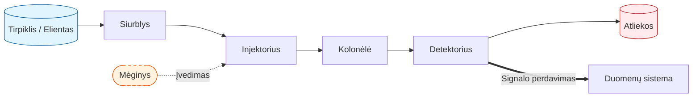
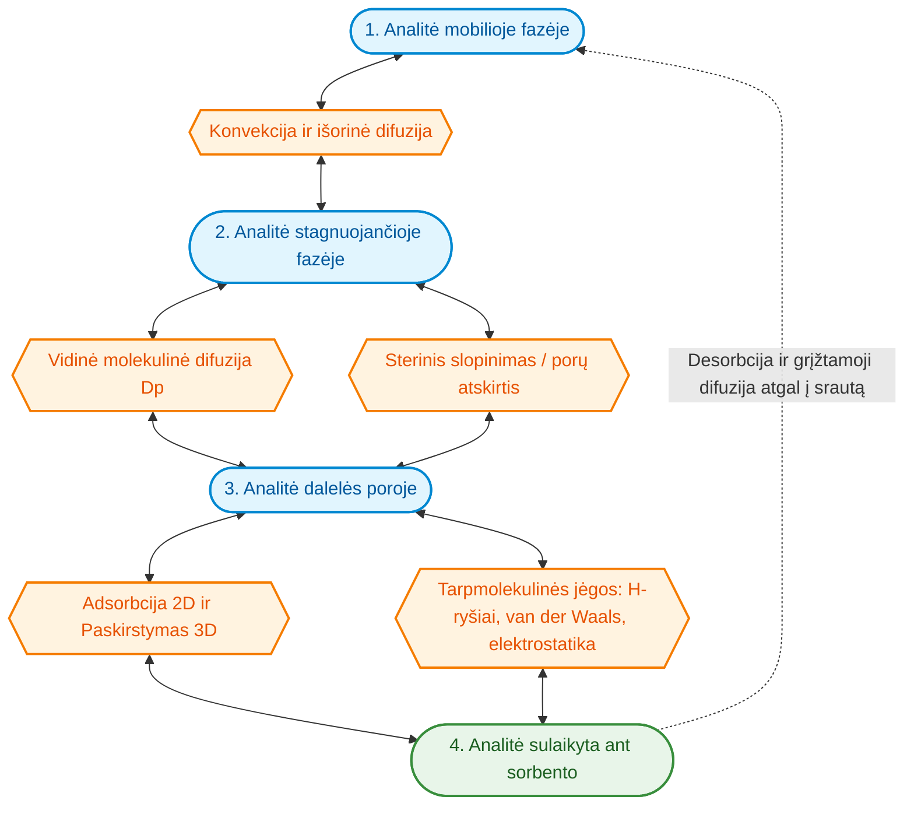
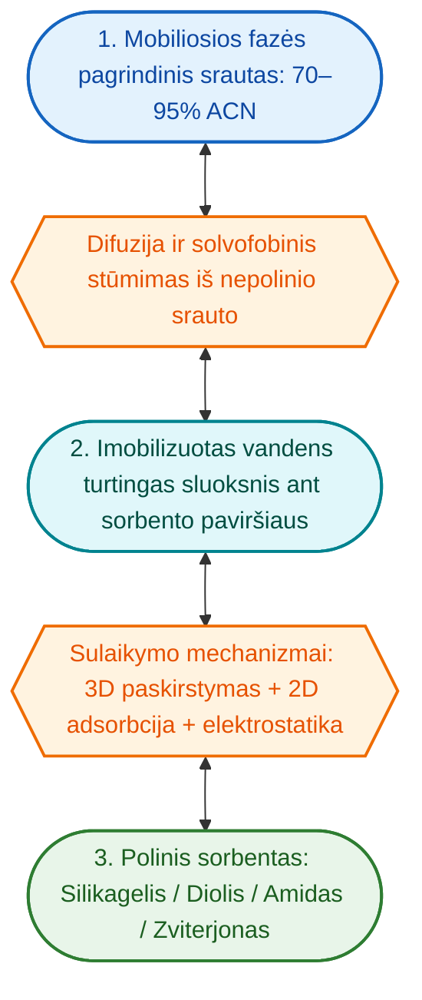
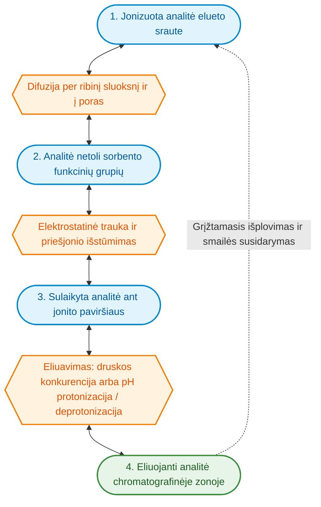
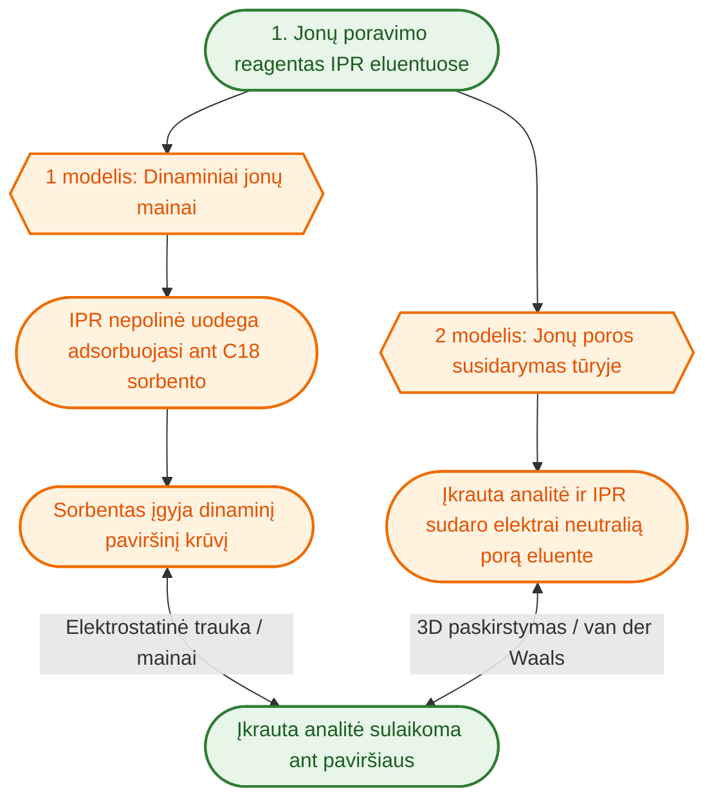
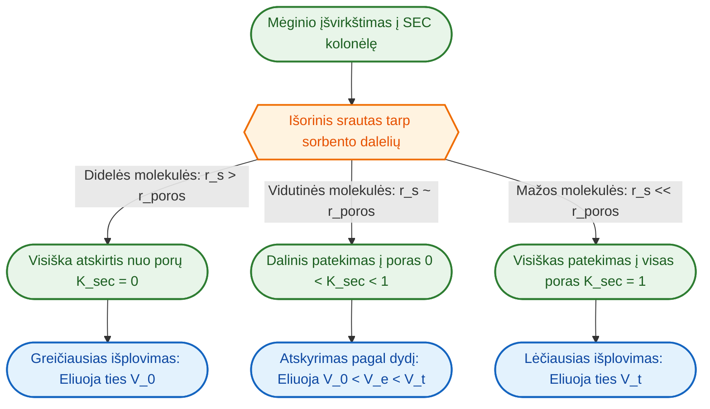

# Įvadas
Masių spektrometrija (MS) yra vienas jautriausių ir selektyviausių šiuolaikinės analizinės chemijos detektavimo metodų. Tačiau tiesioginis mėginio įvedimas į masių spektrometrą (be prieš tai atlikto chromatografinio atskyrimo) susiduria su esminiais apribojimais, tokiais kaip chimerinių MS/MS spektrų susidarymas dėl izobarų bei izomerų bendro fragmentavimo, junginių konkurencija dėl krūvio jonizacijos metu bei aparatūros tarša dėl destrukcinio detektoriaus pobūdžio.

#### Mėginio kompleksija ir sistemos tarša (Destrukcinis detektorius)

Realiuose biologiniuose, maisto, aplinkos ar farmaciniuose mėginiuose (pvz., kraujo plazmoje, ląstelių ekstraktuose) vienu metu būna tūkstančiai skirtingų cheminių junginių. Tiesioginis tokio mėginio įpurškimas sukelia greitą aparatūros nusidėvėjimą ir užteršimą:

Masių spektrometras yra destrukcinis detektorius — jame analitės ir mėginio komponentai yra jonizuojami, garinami bei skaidomi. Dėl to analizės eigoje neišvengiamai teršiasi visi masės spektrometro komponentai: jonizacijos kamera, jonų optika bei patys masių analizatoriai. Didelės matricos komponentų (baltymų, lipidų, druskų) koncentracijos drastiškai pagreitina šį užteršimą, sukelia signalo dreifą ir reikalauja dažno prietaiso stabdymo bei valymo.

#### Izobarinių junginių bei izomerų atskyrimas ir Chimeriniai MS/MS spektrai

Masių spektrometrija matuoja jonų masės ir krūvio santykį ($m/z$). Tačiau analizinėje chemijoje, ypač analizuojant biologinius mėginius, itin dažnai susiduriama su junginiais, pasižyminčiais tokia pačia mase:

* **Izobarai:** Skirtingos elementinės sudėties junginiai, turintys tą pačią nominaliąją arba itin artimą tiksliąją masę.
* **Izomerai:** Struktūriniai, poziciniai ar stereoisomerai, turintys visiškai identišką cheminę formulę ir tiksliąją masę

Kadangi izobarai ir izomerai sugeneruoja prekursorinius jonus su identišku ar praktiškai nesiskiriančiu $m/z$, atliekant tokių jonų MS/MS analizę, jie nėra atskiriami.

Kai šie junginiai vienu metu ir patenka į MS/MS fragmentavimo kamerą kartu:
1. **Bendras fragmentavimas:** tipiškai atliekant MS/MS prekursorius izoliuojamas kaip m/z intervalas $ m/z - p < m/z < m/z + p $ kur tipiškai $ p \in (0.35, 1)$, tai vadinama izoliavimo langu. Jei prekursorių m/z bus pakankammai panašus, šie m/z bus fragmentuojami kartu.
2. **Spektrų susimaišymas:** Fragmentavimo metu gaunamas jungtinis, vadinamasis **chimerinis MS/MS spektras**, kuriame susimaišo kelių skirtingų medžiagų fragmentai.
3. **Identifikavimo klaidos:** Tokie chimeriniai spektrai iškraipo spektrų bibliotekų paiešką, apsunkina arba daro neįmanomu vienareikšmį peptidų, metabolitų ar kitų analičių identifikavimą bei kiekybinį įvertinimą.

#### Jonizacijos slopinimo (*Ion Suppression*) efektas

Masių spektrometrijoje (ypač naudojant ESI) jonų susidarymas vyksta riboto tūrio ir krūvio mikrolašeliuose. Kai keli junginiai patenka į ESI šaltinį vienu metu, jie pradeda konkuruoti dėl riboto krūvio nešiklio kiekio ir vietos lašelio paviršiuje.

Jonizacijos slopinimas pasireiškia tuo, kad tikslinei analitei gali tekti mažesnis krūvio nešiklio kiekis arba sutrikdomas jos patekimas į dujinę fazę, todėl analitės signalas MS detektoriuje drastiškai sumažėja arba tampa netiesinis.

##### Pagrindinės jonizacijos slopinimo priežastys
1. **Mėginio matricos komponentai:** Kartu patenkantys endogeniniai mėginio komponentai (pvz., fosfolipidai, baltymai, druskos) slopina analičių jonizaciją ESI šaltinyje.
2. **Kartu esančios kitos analitės:** Kai keli junginiai jonizuojami vienu metu, didesnio protonų afiniškumo arba didesnio paviršinio aktyvumo junginiai perima krūvio nešikliuis taip nuslopindami kitų analičių signalus.
3. **Mobiliosios fazės priedai ir nelakios druskos:** Nelakūs buferiai ar jonų porų reagentai (pvz., trifluoracto rūgštis, natrio dodecilsulfatas) padidina tirpalo laidumą ir/arba paviršiaus įtempimą, sutrikdo mikrolašelių garavimą ir sukelia stiprų signalo slopinimą.

#### Chromatografijos taikymas

Chromatografinis atskyrimas (skysčių chromatografija ESCh arba dujų chromatografija DCh) išsprendžia šias problemas išskirstydamas mėginio komponentus laiko ašyje (atsižvelgiant į jų sulaikymo trukmę). Analitėms į jonizacijos šaltinį patenkant nuosekliai, atskiromis frakcijomis, išvengiama izobarų ir izomerų bendro izoliavimo bei fragmentavimo (išvengiama chimerinių MS/MS spektrų), matricos ir kitų analičių interferencijos. Be to, chromatografinė sistema, papildyta eluentų perjungimo vožtuvais (*divert valves*), leidžia nepageidaujamas mėginio frakcijas (pvz., nesulaikomas druskas ar vėliau eliuuojančius baltymus) nukreipti tiesiai į atliekas, o į masių spektrometrą įleisti tik tikslines analites.

## Chromatografijos principai

Chromatografija yra fizikinis-cheminis atskyrimo metodas, pagrįstas **kontroliuojama konkurencija** ir diferenciniu analičių pasiskirstymu tarp dviejų nesimaišančių fazių — **mobiliosios fazės** ir **stacionariosios fazės**.

* **Mobili fazė (angl. *Mobile Phase*):** Judanti skystos arba dujinės būsenos terpė (pvz., vandeninis-organinis tirpiklis, dujos-nešiklis), kuri transportuoja analičių mišinį per chromatografinę sistemą.
* **Stacionari fazė (angl. *Stationary Phase*):** Nejudanti chromatografinės sistemos fazė (pvz., ant silikagelio ar polimero pagrindo imobilizuoti cheminiai ligandai, akytas sorbentas arba imobilizuotas skysčio sluoksnis), su kuria pratekanti analitė ieško fizikinių-cheminių sąveikų.

Atskyrimas įvyksta todėl, kad skirtingos mėginio molekulės pasižymi nevienodu afiniškumu šiam dviejų fazių kontaktui: kiekviena analitė tam tikrą laiko dalį praleidžia tirpi mobiliojoje fazėje ir judėdama kartu su mobilia faze, o kitą laiko dalį — sąveikaudama (sulaikyta) su stacionariaja faze. Šių laiko dalių skirtumai sąlygoja skirtingą judėjimo greitį chromatografinėje sistemoje bei fizikinį analičių atskyrimą.

Toliau tekste, bus kalbama apie kolonėlinę chromatografiją, kai stacionari fazė, tipiškai kietos smulkiadispersinės dalelės (sorbentas) supakuojamos į vamzdelį. Mobili fazė siurbliu pumpuojama per kolonėlę. 

### Atskyrimo mechanizmas ir pasiskirstymo pusiausvyra

Chromatografinis sulaikymas tiesiogiai atspindi termodinaminę **pasiskirstymo pusiausvyrą** tarp mobiliosios ir stacionariosios fazių. Laisvosios Gibso energijos pokytis ($\Delta G^\circ$), susijęs su analitės perėjimu iš mobiliosios į stacionariąją fazę, apibrėžia pasiskirstymo konstantą $K$:

$$\Delta G^\circ = -RT \ln K = \Delta H^\circ - T\Delta S^\circ$$

Čia $K$ nusako analitės koncentracijų santykį stacionarioje ir mobiliojoje fazėse pusiausvyros būsenoje. Didesnė $K$ reikšmė reiškia stipresnį sulaikymą ir ilgesnį analitės buvimo laiką kolonėlėje.

Analitės pasiskirstymas ir atskyrimo efektyvumas priklauso nuo dviejų konkuruojančių jėgų pusiausvyros:
1. **Sąveikos su stacionariąja faze jėgų** (skatinančių sulaikymą).
2. **Tirpumo ir sąveikos mobiliojoje fazėje jėgų** (skatinančių eliuavimą ir judėjimą su srautu).

---

Supratau, ko tiksliai reikia. Štai atnaujinta, detalizuota masių mainų diagrama bei nuoseklus kiekvieno etapo paaiškinimas, kuriame išvardinti konkretūs fizikiniai-cheminiai reiškiniai (difuzija, steriniai efektai, adsorbcija, paskirstymas ir tarpmolekulinės jėgos).

Štai atnaujinta **Mermaid** diagrama, kurioje aiškiai išskirtos analitės **būsenos** ir **procesai** naudojant skirtingas geometrines formas, spalvas bei dvipusius ryšius grįžtamumui demonstruoti.

#### Sąveika su stacionariąja faze ir sorbciniai reiškiniai

Sąveika tarp analitės ir stacionariosios fazės vyksta per įvairius sorbcinius ir molekulinius mechanizmus:

##### Adsorbcija vs. Paskirstymas (*Partitioning*)
* **Adsorbcija:** Paviršinis reiškinys, kai analitės molekulės jungiasi prie stacionariosios fazės ribinio paviršiaus arba specifinių aktyviųjų centrų (pvz., silanolių ar poliškų ligandų), išstumdamas prieš tai adsorbuotas tirpiklio molekules.
* **Paskirstymas (*Partitioning*):** Tūrinis reiškinys, kai analitė įsiterpia/įsiskverbia giliai į imobilizuotų ligandų sluoksnį arba imobilizuotą skysčio sluoksnį ant sorbento paviršiaus. T.y. chromatografinėje kolonėlėje kietas sorbentas (pvz., silikagelis) dažnai būna padengtas skysčio sluoksniu, kuris elgiasi kaip skystis arba skysčiui gimininga terpė (*quasi-liquid environment*).
* Realiose chromatografinėse sistemose sulaikymas retai būna grynai adsorpcinis ar grynai paskirstomasis — dažniausiai veikia **mišrus mechanizmas** (*mixed-mode*), kurio indėlis priklauso nuo analitės struktūros, ligandų tankio ir mobiliosios fazės sudėties.

#####  Molekulinės sąveikos jėgos

Stacionariojoje fazėje veikia įvairios tarpmolekulinės jėgos:
* **Hidrofobinės (van der Waals) sąveikos:** Nepolinių grupių siekis išvengti vandens aplinkos ir asocijuotis su alifatinėmis ligandų grandinėmis (pvz., $C_{18}$) sorbento paviršiuje.
* **Elektrostatinės (jonų mainų) sąveikos:** Krūvį turinčių analičių ir priešingo krūvio funkcinių grupių (pvz., jonizuotų silanolių ar jonų mainų grupių) trauka arba stūmimas.
* **Vandeniliniai ryšiai ir dipolių sąveikos:** Polinių grupių sąveika su stacionariosios fazės silanoliais ar kitais poliniais ligandais.
* **Steriniai efektai:** Didelių ar tam tikros erdvines konfigūracijos molekulių sterinis slopinimas, ribojantis jų patekimą tarp ligandų grandinių. T.y. dėl savo dydžio ar trimačio pavidalo ji fiziškai netelpa tarp sorbento ligandų. 

Kai kalbame apie hidrofobinę sąveiką:

* **Plokšti ir trimačiai iškraipyti junginiai:** Pavyzdžiui, plokšti aromatiniai angliavandeniliai (PAH) lengvai įsiterpia tarp tvarkingų ligandų grandinių ir yra stipriai sulaikomi. Tuo tarpu jų neplokšti (iškraipyti) izomerai dėl sterinio slopinimo išeliuoja žymiai greičiau.
* **Cis-** **ir** **trans-** **izomerai:** *Trans-* izomerai dažniausiai yra tiesesnės formos, todėl giliau įsiskverbia tarp ligandų nei sulenkti *cis-* izomerai.
* **Linijiniai ir šakoti alkanai:** Linijinis izomeras patirs mažesnį sterinį slopinimą ir bus sulaikytas ilgiau nei stipriai išsišakojęs jo izomeras.

##### Sorbento akytumas, difuzija į poras ir masės pernaša

Dauguma chromatografinių sorbentų sudaryti iš labai porėtų dalelių, pasižyminčių dideliu vidiniu paviršiaus plotu. 

* **Stagnuojanti mobilioji fazė porose:** Mobilioji fazė kolonėlėje pasiskirsto į tekančią tarpdalelinę fazę ir rimtyje esančią (stagnuojančią) fazę dalelių porų viduje.
* **Difuzija į poras (*Pore Diffusion*):** Kad analitė galėtų sąveikauti su stacionariąja faze, ji turi difunduoti iš judančio mobilios fazės srauto į dalelių poras. Šis molekulinės difuzijos procesas daro esminę įtaką masės pernašos greičiui ir smailės (chroamtografinės) zonos išplitimui. 
* **Sterinis prieinamumas ir porų dydis:** Jei analitės molekulė yra per didelė, lyginant su porų skersmeniu, ji iš dalies arba visiškai pašalinama iš vidinio porų tūrio (sterinė atskirtis) ir išeliuoja greičiau.

#### Analitės tirpumas ir afiniškumas stacionariajai fazei

Analitės sulaikymo laikas ir eliuavimo eiga vienodai stipriai priklauso ir nuo jos elgesio mobiliojoje fazėje. Tarkime, kad pagrindinė sąveika tarp analitės ir stacionariosios fazės yra hidrofobinė, tada:

* **Solvofobinis efektas ir sanglauda (*Cohesion*):** Vandeninėse-organinėse mobiliesiose fazėse didelė vandens sanglaudos energija (stiprus vandenilinių ryšių tinklas) stumia hidrofobines analites iš mobiliosios fazės į mažesnės sanglaudos stacionariąją fazę.
* **Tirpiklio eliuavimo stiprumas:** Didinant organinio modifikatoriaus (pvz., acetonitrilo ar methanolio) dalį mobiliojoje fazėje, padidėja nepoliarinių analičių tirpumas mobiliojoje fazėje, susilpnėja solvofobinis stūmimas ir analitės išeliuoja greičiau.
* **pH ir jonizacija:** Mobiliosios fazės pH keičia jonizuojamų analičių krūvio būseną ir solvataciją. Jonizuotos formos pasižymi didesniu tirpumu vandeninėje mobiliojoje fazėje ir silpnesniu hidrofobiniu sulaikymu.

# Chromatografijos tipai

## Normalių fazių chromatografija

Normalių fazių chromatografija (angl. *Normal-Phase Liquid Chromatography*, NPLC) yra vienas iš klasikinių skysčių chromatografijos metodų, skirtas nepolinių, vidutiniškai polinių bei struktūriškai artimų organinių junginių atskyrimui. 

Šio metodo esmė — diferencinis analičių pasiskirstymas tarp polinės stacionariosios fazės ir nepolinės arba mažai polinės mobiliosios fazės:
* **Stacionarioji fazė:** Pasirinktas polinis sorbentas, turintis aktyvius polinius centrus.
* **Mobiliosios fazė:** Nepolinis arba mažai polinis organinis tirpiklis (arba jų mišinys).

#### Sulaikymo ir eliuavimo eiga
NPLC sistemoje analitės sulaikymas kolonėlėje tiesiogiai priklauso nuo jos poliškumo ir gebėjimo sąveikauti su stacionariosios fazės paviršiumi:
1. **Nepolinės molekulės:** Turi silpną afiniškumą poliškam sorbentui ir labai gerai tirpsta nepolinėje mobiliojoje fazėje, todėl per kolonėlę juda greitai ir išeliuoja pirmos.
2. **Poliarinės molekulės:** Turi stiprų afinitetą stacionariosios fazės aktyviesiems centrams, todėl yra stipriai sulaikomos ir eliuuoja vėliau.
3. **Eliuavimo stiprumo valdymas:** Mobiliosios fazės eliuavimo galia didinama į nepolinį tirpiklį įmaišant poli6kesnio organinio modifikatoriaus. Poliaresnis tirpiklis efektyviau konkuruoja dėl sorbento centrų ir padidina analičių tirpumą judančiojoje terpėje, taip sutrumpindamas jų sulaikymo laiką.

### Stacionariosios ir mobiliosios fazių chemija

#### Stacionariosios fazės
NPLC sistemoje naudojami sorbentai, pasižymintys dideliu paviršiniu poliarumu:
* **Grynas silikagelis ($\text{SiO}_2$):** Klasikinis ir plačiausiai naudojamas sorbentas. Jo paviršiuje esančios silanolio grupės ($\text{Si-OH}$) veikia kaip stiprūs vandenilinių ryšių donorai ir akceptoriai bei poliariniai adsorpcijos centrai.
* **Aliuminio oksidas ($\text{Al}_2\text{O}_3$):** Pasižymi stipriomis bazinėmis arba rūgštinėmis paviršiaus savybėmis ir naudojamas specifinėms poliarinių junginių grupėms atskirti.
* **Chemiškai modifikuoti silikageliai:** Silikagelio paviršius padengiamas kovalentiškai susietomis poliarinėmis funkcinių grupių grandinėmis:
  * *Cianogrupės ($-\text{CN}$):* Suteikia vidutinio stiprumo poliarumą, tinka greitam atskyrimui.
  * *Diolio grupės ($-\text{CH(OH)-CH}_2\text{OH}$):* Pasižymi puikiomis vandenilinių ryšių susidarymo savybėmis.
  * *Aminogrupės ($-\text{NH}_2$):* Suteikia stiprų poliarinį ir silpną bazinį charakterį.

#### Mobiliosios fazės
Mobiliąją fazę sudaro organiniai tirpikliai, kuriuose vandeniniai tirpalai nenaudojami arba naudojami tik mikro-pėdsakų pavidalu:
* **Silpnieji (nepoliariniai) tirpikliai:** Alkanai (heksanas, heptanas, izooktanas). Šie tirpikliai užtikrina stipriausią analičių sulaikymą ant poliarinio sorbento.
* **Stiprieji (poliariniai) modifikatoriai:** Chloroformas, dichlormetanas, etilacetatas, izopropanolis arba etanolio pėdsakai. Šių modifikatorių koncentracija keičiama norint tiksliai sureguliuoti eliuavimo greitį.

### Atskyrimo mechanizmas ir molekulinės sąveikos

NPLC atskyrimo mechanizmas yra grįstas **paviršine adsorpcija ir molekuliniu atpažinimu**:
1. **Adsorpcinė konkurencija:** Analitės molekulės ir mobiliojo fazės tirpiklio molekulės konkuruoja dėl tų pačių aktyviųjų centrų (silanolių ar kitų polinių funkcinių grupių) stacionariosios fazės paviršiuje.
2. **Tarpmolekulinės jėgos:**
   * **Vandeniliniai ryšiai:** Esminė jėga, lemianti poliarinių funkcinių grupių (hidroksil-, amino-, karbonil-) sulaikymą.
   * **Dipolio-dipolio ir indukuoto dipolio sąveikos:** Svarbios molekulėms, turinčioms polinius heteroatomus ar poliarizuojamas elektronų sistemas.
3. **Izomerų atskyrimo geba:** Kadangi adsorbcija vyksta tiesiogiai ant kietojo sorbento paviršiaus, sulaikymas yra itin jautrus analitės **erdvinei geometrijai (stereochemijai)**, funkcinių grupių išsidėstymui bei steriniams efektams. Dėl šios priežasties NPLC pasižymi unikaliu gebėjimu atskirti struktūrinius, pozicinius ir geometrinius izomerus.

### Suderinamumas su masių spektrometrija (NPLC-MS)

Masių spektrometrija (MS) reikalauja, kad iš chromatografinės kolonėlės eliuuojančios analitės būtų paverstos dujinės fazės jonais. NPLC jungimas su MS turi specifinių iššūkių ir reikalauja atitinkamų techninių sprendimų:

##### Elektropurškimo jonizacijos (ESI) iššūkiai
* **Žemas tirpiklių laidumas ir poliarumas:** NPLC naudojami nepoliariniai tirpikliai (heksanas, heptanas) pasižymi labai maža dielektrine konstantos reikšme. Juose sunkiai tirpsta jonai, todėl tirpalas neturi būtino elektros laidumo, reikalingo stabiliam elektropurškimo procesui (*ESI spray*).
* **Purškimo nestabilumas:** Mažas nepoliarinių tirpiklių paviršiaus įtempimas ir didelis lakumas gali sukelti netolygų mikrolašelių garavimą ir ESI signalo pulsavimą bei triukšmą.

##### Techniniai sprendimai ir jonizacijos metodai NPLC-MS sistemose
1. **Atmosferos slėgio cheminė jonizacija (APCI) ir fotojonizacija (APPI):**
   * APCI ir APPI šaltiniai yra žymiai tinkamesni NPLC eluentams nei ESI. Šiuose šaltiniuose eluentas visiškai išgarinamas kaitinamame purkštuve, o analičių jonizacija vyksta dujinėje fazėje per koroninę iškrovą (APCI) arba UV šviesos fotonus (APPI). Nepoliariniai organiniai tirpikliai lengvai garuoja ir efektyviai perduoda krūvį dujų fazėje.
2. **Post-kolonėlinis makiažo tirpalas (*Sheath Liquid / Make-up Flow*):**
   * Jei naudojama ESI jonizacija, tarp chromatografinės kolonėlės išvado ir MS jonų šaltinio įrengiamas T-formos maišiklis. Per jį į eluentą nuolat tiekiamas poliarinis makiažo tirpalas (pvz., izopropanolis arba metanolis su mažu kiekiu skruzdžių rūgšties ar amonio acetato). Tai suteikia elektrinį laidumą, užtikrina protonų donorystę ir stabilizuoja ESI purškimą.
3. **Lakių priedų naudojimas:**
   * NPLC-MS sistemose naudojami tik lakūs organiniai modifikatoriai ir priedai, išvengiant nelakių druskų, kurios nusėstų masių spektrometro įvado optikoje.

#### Junginių klasės ir taikymo sritys

NPLC-MS metodai yra nepakeičiami analizės srityse, kur analitės yra nepoliarinės, vandenyje netirpios arba reikalaujama atskirti sudėtingus izomerinius mišinius:

#####  Lipidomika ir Metabolomika
* **Lipidų klasių atskyrimas:** NPLC leidžia suskirstyti kompleksinius biologinius lipidus į atskiras klases pagal jų poliarines galvutes (pvz., trigliceridus, digliceridus, ceramidus bei skirtingus fosfolipidus).
* **Riebaluose tirpūs metabolitai ir vitaminai:** Riebaluose tirpstančių vitaminų (A, D, E, K), provitaminų bei steroidinių hormonų ir jų lipofilinių metabolitų analizė biologiniuose skysčiuose ir audiniuose.

##### Kriminalistika ir Toksikologija
* **Sintetiniai ir lipofiliniai toksinai:** Nepoliarinių narkotinių medžiagų, sintetinių kanabinoidų, lipofilinių vaistų metabolitų bei sprogstamųjų medžiagų (pvz., nitrojunginių) analizė.
* **Teismo ekspertizės dažai ir rašalai:** Gelinių tušinukų, dažų, pigmentų ir kitų nepoliarinių organinių medžiagų atskyrimas ir identifikavimas teismo ekspertizėje.

#####  Farmacija ir Gamtiniai Junginiai
* **Struktūrinių ir pozicinių izomerų atskyrimas:** Vaistinių medžiagų sintezės šalutinių produktų, geometrinių izomerų ir stereoisomerų išskyrimas, kurių neįmanoma atskirti vien tik pagal masę.
* **Augaliniai ekstraktai:** Augalinių aliejų, eterinių aliejų komponentų, nepoliarinių flavonoidų, terpenų ir karotenoidų analizė.

## Atvirkščių fazių chromatografija

Atvirkščių fazių skysčių chromatografija (angl. *Reversed-Phase Liquid Chromatography*, RPLC) yra plačiausiai taikomas skysčių chromatografijos režimas analizinėje chemijoje. RPLC pavadinimas kilo iš istoriškai susiklosčiusios sistemų inversijos, palyginus ją su normalių fazių chromatografija (NPLC).

###Ę Fazių inversija ir veikimo logika

* **Stacionarioji fazė:** NPLC naudojama polinė stacionarioji fazė (pvz., grynas silikagelis su silanolio grupėmis $\text{Si-OH}$), o RPLC sistemoje naudojama **nepolinė (hidrofobinė) stacionarioji fazė**. Daugiausiai tai kovalentiškai ant silikagelio pagrindo imobilizuotos nepolinės alkilinės grandinės: oktadecilsilanas ($C_{18}$ arba ODS), oktilsilanas ($C_8$), butilsilanas ($C_4$) arba aromatinės fenilinės grupės.
* **Mobiliosios fazė:** NPLC naudojami nepoliniai organiniai tirpikliai (heksanas, heptanas), o RPLC naudojama **polinė mobilioji fazė** — vandens (arba vandeninio buferio) ir su vandeniu besimaišančio polinio organinio modifikatoriaus (acetonitrilo, metanolio arba tetrahidrofurano) mišiniai.

| Parametras / Režimas | Normalių fazių chromatografija (NPLC) | Atvirkščių fazių chromatografija (RPLC) |
| :--- | :--- | :--- |
| **Stacionarioji fazė** | Polinė (Silikagelis, $-\text{NH}_2$, $-\text{CN}$, Diolis) | Nepolinė ($C_{18}$, $C_8$, $C_4$, Fenil-, PFP) |
| **Mobiliosios fazė** | Nepolinė (Heksanas + polinis modifikatorius) | Polinė (Vanduo/buferis + ACN / MeOH) |
| **Stiprusis eluentas** | Polinis organinis tirpiklis (izopropanolis ir kt.) | Nepoliesnis organinis modifikatorius (ACN, MeOH) |
| **Eliuavimo eiga** | Nepoliniai junginiai eliuuoja pirmieji, poliniai — paskutiniai | Poliniai junginiai eliuuoja pirmieji, nepoliniai — paskutiniai |
| **Pagrindinės sąveikos** | Paviršinė adsorbcija, vandeniliniai ryšiai, dipoliai | van der Waals sąveikos, solvofobinis stūmimas, $\pi-\pi$ sąveikos |

RPLC sistemoje eliuavimo galia didinama **didinant organinio modifikatoriaus dalį** mobiliojoje fazėje, o tai sumažina eluento poliškumą ir susilpnina nepolinių analičių sulaikymą.

### Atskyrimo mechanizmas: van der Waals ir specialiosios $\pi-\pi$ sąveikos

RPLC atskyrimas remiasi analitės pasiskirstymu tarp polinės mobiliosios fazės ir nepolinės stacionariosios fazės.

#### Solvofobinis efektas ir van der Waals sąveikos
1. **Vandens sanglauda (*cohesion*):** Vandeninėje mobiliojoje fazėje vandens molekulės sudaro itin stiprų, dinamišką vandenilinių ryšių tinklą. Nepolinės analitės įsiterpimas į vandenį reikalauja sukurti dvimatę arba trimatę ertmę (*cavity formation*), o tai yra energiškai nepalanku.
2. **Solvofobinis stūmimas:** Vandens sanglaudos energija verčia nepolines analitės molekules trauktis iš polinio eluento ir asocijuotis su mažesnės sanglaudos energijos nepoliniu sorbentu ($C_{18}$ uodegomis).
3. **van der Waals kontaktai:** Patekusios prie stacionariosios fazės, nepolinės analitės dalys sudaro tankius van der Waals kontaktus su alkilinėmis grandinėmis. Sulaikymo stiprumas yra tiesiogiai proporcingas **kontaktinio paviršiaus plotui** tarp analitės ir $C_{18}$ ligandų.
4. **Paskirstymo (3D) ir adsorbcijos (2D) pusiausvyra:** Lanksčios $C_{18}$ grandinės elgiasi kaip hidrofobinis skystasis sluoksnis. Mažos nepolinės analitės įsiskverbia giliai į šį sluoksnį (trimatis paskirstymas / *partitioning*), tuo tarpu didesnės ar poliškesnės molekulės sąveikauja daugiausia su išoriniu ligandų paviršiumi (dvisluoksnė adsorbcija).

#### Specialiosios $\pi-\pi$ ir aromatinės sąveikos
Tradicinės alkilinės fazės ($C_{18}$, $C_8$) pasižymi tik van der Waals dispersinėmis sąveikomis. Tačiau kai kurių junginių, ypač aromatinių izomerų ar konjuguotų sistemų, atskyrimui taikomos **aromatinės stacionariosios fazės**:

* **Fenilinės ir Fenil-Heksilinės fazės:** Šiuose sorbentuose ant silikagelio imobilizuoti benzolo žiedai. Šalia van der Waals sąveikų jie suteikia **$\pi-\pi$ elektronų donorų-akceptorių sąveikas** su analitėmis, turinčiomis konjuguotas dvigubąsias jungtis ar aromatines sistemas.
* **Pentafluorfenilinės (PFP) fazės:** PFP sorbentuose benzolo žiedas yra visiškai fluorintas. Fluoratoms stipriai traukiant elektronus, PFP aromatinis žiedas tampa elektronų akceptoriumi (stipriai elektrofiliniu). PFP stacionarioji fazė suteikia išskirtinį $\pi-\pi$ elektroninį ir sterinį (formos) selektyvumą, todėl idealiai tinka:
  * Aromatinių, halogenintų ir nitro-junginių atskyrimui;
  * Vaistinių medžiagų struktūrinių bei regioizomerų išskirimui, kurių neįmanoma atskirti standartine $C_{18}$ kolonėle.

###  Lipofiliškumas ir logP / logD rodikliai

Kadangi RPLC sulaikymas grindžiamas nepolinėmis sąveikomis, analitės sulaikymo laikas tiesiogiai koreliuoja su jos hidrofobiškumu (lipofiliškumu).

### $\log P$ sąvoka
$\log P$ (oktanolio-vandens pasiskirstymo koeficiento logaritmas) apibrėžia neutralios molekulės pasiskirstymo pusiausvyrą tarp dviejų nesimaišančių fazių — nepolinio 1-oktanolio ir vandens:

$$P = \frac{[\text{Analitė}]_{\text{oktanolis}}}{[\text{Analitė}]_{\text{vanduo}}}$$

$$\log P = \log_{10} P$$

* **Teigiamas $\log P$ ($\log P > 0$):** Molekulė yra lipofiliška (nepolinė), geriau tirpsta oktanolio fazėje.
* **Neigiamas $\log P$ ($\log P < 0$):** Molekulė yra hidrofilinė (polinė), geriau tirpsta vandeninėje fazėje.

#### RPLC taikomumas pagal analitės $\log P$

RPLC sulaikymo faktoriaus logaritmas ($\log k$) neutraliems junginiams rodo tiesinę priklausomybę nuo $\log P$:

$$\log k = a \cdot \log P + b$$

**RPLC taikymo ribos pagal $\log P$:**
* **$\log P > 0.5$ (nepoliniai ir vidutiniškai poliniai junginiai):** Puikus RPLC taikomumas. Junginiai yra efektyviai sulaikomi $C_{18}$ kolonėlėje, o jų eliuavimą galima tiksliai valdyti organinio modifikatoriaus koncentracija.
* **$-0.5 < \log P < 0.5$ (vidutiniškai poliniai junginiai):** Gerai sulaikomi naudojant didelę vandens dalį mobiliojoje fazėje (pvz., 90–98% vandens).
* **$\log P < -1.5$ (stipriai poliniai junginiai):** RPLC ribotumas. Tokios molekulės (pvz., trumpi peptidai, cukrūs, laisvosios aminorūgštys, nukleozidai) beveik nesąveikauja su $C_{18}$ sorbentu ir išeliuoja kartu su laisvuoju kolonėlės tūriu ($t_0$). Šiems junginiams sulaikyti RPLC netaikoma — pasirenkami HILIC arba jonų porų chromatografijos metodai.

#### $\log D$ rodiklis jonizuojamiems junginiams
Atsižvelgiant į tai, kad daugelis vaistinių ir biologinių medžiagų vandeninėje terpėje jonizuojasi, tikrąjį lipofiliškumą esant konkrečiam pH aprašo **pasiskirstymo rodiklis $\log D$** (*distribution coefficient*). $\log D$ įvertina tiek neutralios, tiek jonizuotos analitės formų koncentracijas.

### Mobiliosios fazės pH ir analitės disocijacijos įtaka sulaikymui

Skirtingai nei NPLC, kur vandeninė terpė nenaudojama, RPLC mobiliojoje fazėje vandens buvimas leidžia vykti rūgščių ir bazių elektrolitinei disocijacijai.

#### Rūgščių ir bazių disocijacijos pusiausvyra
* **Silpnosios rūgštys ($\text{HA}$):** $\text{HA} \rightleftharpoons \text{A}^- + \text{H}^+$
* **Silpnosios bazės ($\text{B}$):** $\text{BH}^+ \rightleftharpoons \text{B} + \text{H}^+$

Žinoma, kad **neutrali molekulės forma (protonizuota rūgštis $\text{HA}$ arba deprotonizuota bazė $\text{B}$) yra žymiai nepoliškesnė** nei jonizuota forma (anijonas $\text{A}^-$ arba protonizuotas kationas $\text{BH}^+$). Jonai pasižymi stipria hidratacijos apvalkalo sąveika su vandeniu, todėl jų van der Waals sąveika su $C_{18}$ stacionariąja faze yra drastiškai silpnesnė.

#### Sulaikymo priklausomybė nuo pH

Analitės sulaikymo faktorius $k$ RPLC sistemoje priklauso nuo neutralios ir jonizuotos formų sulaikymo faktorių ($k_{\text{neutral}}$ ir $k_{\text{ion}}$) bei disocijacijos laipsnio:

1. **Silpnosios rūgštys:**
   * Esant **žemam pH** ($\text{pH} < \text{p}K_a - 2$), rūgštis yra visiškai **protonizuota** (neutralioje $\text{HA}$ formoje). Sulaikymas yra **maksimalus** ($k = k_{\text{neutral}}$).
   * Esant **aukštam pH** ($\text{pH} > \text{p}K_a + 2$), rūgštis visiškai **deprotonizuota** (jonizuotoje $\text{A}^-$ formoje). Sulaikymas drastiškai **sumažėja** ($k = k_{\text{ion}}$).
2. **Silpnosios bazės:**
   * Esant **žemam pH** ($\text{pH} < \text{p}K_a - 2$), bazė yra visiškai **protonizuota** (jonizuotoje $\text{BH}^+$ formoje). Sulaikymas yra **minimalus** ($k = k_{\text{ion}}$).
   * Esant **aukštam pH** ($\text{pH} > \text{p}K_a + 2$), bazė yra **deprotonizuota** (neutralioje $\text{B}$ formoje). Sulaikymas **padidėja iki maksimalaus** ($k = k_{\text{neutral}}$).

####  Buferinių tirpalų ir pH valdymo svarba RPLC
* **2 pH vienetų taisyklė:** Norint gauti stabilius sulaikymo laikus, mobilioios fazės pH turi būti bent per 1 idealiu atveju  2 pH vienetus nutolęs nuo analitės $\text{p}K_a$. Jei dirbama zonoje $\text{pH} \approx \text{p}K_a$, net ir minimalus pH nuokrypis (pvz., $\pm 0.1$ pH vieneto) sukelia didelius sulaikymo laiko svyravimus ir zonos išplitimą.

### Suderinamumas su masių spektrometrija (RPLC-MS)

Atvirkščių fazių chromatografija yra pats tinkamiausias ir plačiausiai naudojamas skysčių chromatografijos metodas jungiamas su masių spektrometrija (RPLC-MS). Šį nepriekaištingą suderinamumą lemia šios cheminės ir techninės priežastys:

1. **Tirpiklių lakumas ir ESI purškimas:**
   * RPLC naudojami organiniai modifikatoriai (acetonitrilas, metanolio) pasižymi dideliu lakumu ir mažu paviršiaus įtempimu. Elektropurškimo (ESI) arba APCI jonizacijos kamerose šie tirpikliai lengvai išgaruoja, sudarydami smulkius mikrolašelius, o tai užtikrina aukštą jonizacijos efektyvumą ir stabilų signalą.
2. **Lakiųjų buferių naudojimas:**
   * RPLC-MS sistemoje vandeninei fazei parūgštinti ar pH palaikyti naudojami tik **lakūs priedai ir buferiai**: skruzdžių rūgštis, acto rūgštis, amonio formiatas, amonio acetatas bei mikro-kiekiai trifluoracto rūgšties (TFA). Šie buferiniai komponentai jonizacijos kameroje visiškai išgaruoja ir nesudaro nelakių druskų nuosėdų ant MS įvado kapiliarų ar jonų optikos.
3. **Efektyvus jonų susidarymas (Protonizacija / Deprotonizacija):**
   * RPLC-MS mobiliojoje fazėje esančios lakios rūgštys (pvz., skruzdžių rūgštis) skatina bazių protonizaciją, paversdamos jas teigiamais jonais $[M+\text{H}]^+$ teigiamos elektropurškimo jonizacijos režime (ESI+).
   * Amonio buferiai ar praskiestas amoniakas skatina rūgščių deprotonizaciją, paversdami jas neigiamais jonais $[M-\text{H}]^-$ neigiamos elektropurškimo jonizacijos režime (ESI-).
4. **Gradiento įtaka jautrumui:**
   * RPLC eliuavimo metu didėjanti organinio tirpiklio koncentracija eluentų gradiente palaipsniui mažina tirpalo paviršiaus įtempimą ir skatina sparvesnį lašelių desolvatavimą. Dėl šios priežasties vėliau eliuuojančios lipofiliškesnės analitės MS detektoriuje dažnai sugeneruoja dar intensyvesnį atsaką.

###  RPLC taikymas 

RPLC universalumas, aukštas atskyrimo efektyvumas ir idealus suderinamumas su MS lėmė jos dominavimą įvairiose mokslo ir pramonės šakose:

##### Farmacinė analizė ir vaistų kokybės kontrolė
* **Vaistinių medžiagų ir vaistų formų grynumas:** Sintetinių vaistų aktyviųjų ingredientų (API), grynumo, degradacijos produktų bei šalutinių sintezės junginių analizė.
* **Izomerų ir priemaišų atskyrimas:** Naudojant specializuotas Fenil- ar PFP kolonėles, RPLC sėkmingai atskiria vaistinių medžiagų regioizomerus ir struktūrinius analogus.

##### Klinikinė chemija, Toksikologija ir Kriminalistika
* **Terapinis vaistų monitoringas (TDM):** Vaistų koncentracijos kraujo plazmoje ir serume matavimas, siekiant pritaikyti individualias dozes.
* **Toksikologija ir narkotinių medžiagų patikra:** Piktnaudžiavimo medžiagų, dopingo preparatų, toksinų ir jų metabolitų analizė kraujuje, šlapime ar plaukuose.
* **Endogeniniai steroidai ir hormonai:** Steroidinių hormonų (kortizolio, testosterono, progesterono) profiliavimas.

##### Proteomika ir Peptidų analizė
* **Peptidų žemėlapiai (*Peptide Mapping*):** Baltymų triptinių hidrolizatų atskyrimas ir identifikavimas.
* **Biofarmaciniai preparatai:** Monokloninių antikūnų fragmentų, peptidinių vaistų ir rekombinantinių baltymų grynumo vertinimas (naudojant plataus porų skersmens $C_4$ arba $C_8$ sorbentus).

##### Metabolomika ir Lipidomika
* **Metabolitų profiliavimas:** Vidutiniškai nepolinių ir nepolinių biologinių skysčių bei audinių metabolitų (riebalų rūgščių, eikozanoidų, žievelės rūgščių) kokybinė ir kiekybinė analizė.

##### Aplinkos ir Maisto tyrimai
* **Pesticidai ir veterinariniai vaistai:** Pesticidų likučių, antibiotikų ir hormonų analizė maisto produktuose, dirvožemyje bei geriamajame vandenyje.
* **Aplinkos teršalai:** Policiklinių aromatinių angliavandenilių (PAH), perfluorintų junginių (PFAS) ir kitų organinių teršalų monitoringas.

## Hidrofilinės sąveikos skysčių chromatografija (HILIC)

Hidrofilinių sąveikų skysčių chromatografija (angl. *Hydrophilic Interaction Liquid Chromatography*, HILIC) yra skysčių chromatografijos režimas, skirtas stipriai polinių, vandenyje tirpių ir jonizuojamų junginių atskyrimui. HILIC metodas užpildo esminę analizinę spragą tarp atvirkščių fazių chromatografijos (RPLC) ir tradicinės normalių fazių chromatografijos (NPLC).

* **Santykis su RPLC:** Atvirkščių fazių chromatografijoje ($C_{18}$ sorbentuose) stipriai poliniai junginiai ($\log P < -1.5$) beveik nesąveikauja su nepoline stacionariąja faze ir išeliuoja kartu su laisvuoju kolonėlės tūriu ($t_0$). HILIC naudojama polinė stacionarioji fazė bei organiniais tirpikliais pažengusi mobilioji fazė, todėl polinių analičių sulaikymas yra stiprus.
* **Santykis su NPLC:** Nors HILIC naudoja polinį sorbentą (kaip ir NPLC), joje naudojama su vandeniu besimaišanti mobilioji fazė (dažniausiai 70–95% acetonitrilas su vandeniniu buferiu). Tuo tarpu NPLC naudoja visiškai nepolinius, nevandeninius organinius tirpiklius (heksaną, heptaną), kuriuose poliniai biologiniai metabolitai ir druskos yra netirpūs.

| Parametras / Režimas | Normalių fazių chromatografija (NPLC) | Atvirkščių fazių chromatografija (RPLC) | Hidrofilinių sąveikų chromatografija (HILIC) |
| :--- | :--- | :--- | :--- |
| **Stacionarioji fazė** | Polinė (Grynas silikagelis, Alumina) | Nepolinė ($C_{18}$, $C_8$, $C_4$, Fenil-) | Stipriai polinė (Grynas silikagelis, Diolis, Amidas, Zviterjonai) |
| **Mobiliosios fazė** | Nepolinė nevandeninė (Heksanas / Heptanas + modifikatorius) | Polinė vandeninė (Vanduo/buferis + ACN / MeOH) | Organinė-vandeninė (70–95% ACN + vandeninis buferis) |
| **Stiprusis eluentas** | Polinis organinis tirpiklis (Izopropanolis) | Nepoliesnis organinis modifikatorius (ACN, MeOH) | Vanduo (arba vandeninis buferinis tirpalas) |
| **Eliuavimo eiga** | Nepoliniai junginiai išeliuoja pirmi, poliniai — paskutiniai | Poliniai junginiai išeliuoja pirmi, nepoliniai — paskutiniai | Nepoliniai junginiai išeliuoja pirmi, poliniai — paskutiniai |
| **Optimalus analitės $\log P$** | Netirpus vandenyje, nepolinis / vidutinis | $\log P > 0.5$ (nepolinis / vidutiniškai polinis) | $\log P < -0.5$ (stipriai polinis / jonizuojamas) |

### Atskyrimo mechanizmai ir sulaikymo fizika

#### Imobilizuoto vandens sluoksnio susidarymas ir 3D paskirstymas (*Partitioning*)
Garinant ir subalansuojant polinį sorbentą su acetonitrilo turtinga mobiliaja faze, polinis stacionariosios fazės paviršius selektyviai adsorbuoja vandens molekules iš eluento.
1. **Ribinis vandens sluoksnis:** Ant sorbento paviršiaus susidaro keliasdešimties nanometrų storio imobilizuotas, vandens turtingas skysčio sluoksnis (*water-enriched layer*).
2. **Trimatis paskirstymas:** Pagrindinė neutralių polinių analičių sulaikymo jėga yra jų pasiskirstymas tarp nepoliškesnės tekančios mobilioios fazės (ACN turtingo srauto) ir imobilizuoto vandeninio sluoksnio. Polinė analitė ištirpsta šio vandeninio sluoksnio tūryje.
3. **Eliuavimo valdymas:** Didinant vandens dalį mobiliojoje fazėje, nyksta poliškumo gradientas tarp tekančio srauto ir stacionariojo vandens sluoksnio, todėl analitės sulaikymas sumažėja ir smailės išeliuoja greičiau.

#### Dvisluoksnė adsorbcija ir mišrusis režimas (*Mixed-Mode*)
Be tūrinio paskirstymo, HILIC sistemoje veikia ir tiesioginiai sorbciniai reiškiniai:
* **Vandeniliniai ryšiai ir dipolių sąveikos:** Analitės polinės funkcinės grupės (hidroksil-, amino-, karboksil-) sudaro vandenilinius ryšius su sorbento paviršiaus ligandais (amidinėmis, diolio ar silanolio grupėmis).
* **Elektrostatinė (jonų mainų ar stūmimo) sąveika:** Kadangi daugelis HILIC sorbentų turi krūvį (pvz., deprotonizuoti silanoliai ar aminogrupės), jonizuotos analitės patiria stiprią elektrostatinę trauką arba stūmimą. Pavyzdžiui, neigiamai įkrauti silanoliai pritraukia kationus ir stumia anijonus.

### Sorbentų chemija (Stacionariosios fazės)

HILIC naudojamos stacionariosios fazės skirstomos į keturias pagrindines grupes pagal jų cheminį paviršiaus charakterį:

##### Grynas silikagelis (*Bare Silica*)
* **Savybės:** Nepadengtas silikagelis turi paviršines silanolio grupes ($\text{Si-OH}$), kurių $\text{p}K_a \approx 3.5–4.5$.
* **Sulaikymas:** Veikia stiprūs vandeniliniai ryšiai ir kationų mainų sąveika. Esant $\text{pH} > 4$, deprotonizuotos silanolio grupės ($\text{Si-O}^-$) stipriai sulaiko bazines, teigiamai įkrautas analites.

##### Poliniai neutralūs sorbentai (Diolio ir Amido fazės)
* **Diolio fazės (*Diol*):** Silikagelis padengtas dihidroksipropilo ligandais. Pasižymi puikiu vandenilinių ryšių donorų ir akceptorių charakteriu, užtikrina stabilias chromatografines smailes ir mažą jonų mainų foną.
* **Amido fazės (*Amide / Carbamoyl*):** Imobilizuotos karbamoilo arba poliamidinės grandinės (pvz., TSKgel Amide-80, BEH Amide). Tai vienas populiariausių sorbentų cukrums, oligosacharidams bei peptidams atskirti.

##### Zviterjoniniai sorbentai (ZIC-HILIC ir ZIC-cHILIC)
* **ZIC-HILIC (Sulfobetainas):** Ligandai turi neigiamą sulfogrupę ($\text{-SO}_3^-$) išorinėje dalyje ir teigiamą ketvirtinę amonio grupę ($\text{-N}^+(CH_3)_3$) vidinėje dalyje.
* **ZIC-cHILIC (Fosforilcholinas):** Ligandai turi teigiamą amonio grupę išorėje ir neigiamą fosfato grupę viduje.

Zviterjoniniai sorbentai pasižymi itin dideliu gebėjimu imobilizuoti storą vandens sluoksnį (susidaro hidrogelio tipo struktūra). Bendrasis fazės krūvis yra neutralus, todėl išvengiama negrįžtamos joninės adsorbcijos, o sulaikymas yra itin reprodukuojamas.

####  Jonų mainų ir aminofazės (*Amino-silica*)
* **Aminopropilo fazės ($\text{-NH}_2$):** Pasižymi stipriu baziniu ir anijonų mainų charakteriu. Esant rūgštiniam ar neutraliam pH, aminogrupės būna protonizuotos ($\text{-NH}_3^+$) ir efektyviai sulaiko organines rūgštis bei cukrus.

###  Analičių specifika ir $\log P$ / $\log D$ rodikliai

#### HILIC taikomumas pagal analitės lipofiliškumą
RPLC ir HILIC sulaikymo dėsningumai yra priešingi. HILIC sulaikymo faktorius ($k$) didėja, kai analitės lipofiliškumas ($\log P$) mažėja:

* **$\log P < -1.5$ (stipriai poliniai junginiai):** Idealus HILIC taikomumas. Šiai grupei priklauso maži peptidai, laisvosios aminorūgštys, nukleozidai, nukleotidai, oligosacharidai, cukraus fosfatai ir organinės rūgštys, kurios RPLC kolonėlėje nesulaikomos.
* **$-1.5 < \log P < 0.5$ (vidutiniškai poliniai junginiai):** Galima analizuoti tiek HILIC, tiek RPLC režimais.
* **$\log P > 0.5$ (nepoliniai junginiai):** HILIC režime nesulaikomi ir išeliuoja su laisvuoju tūriu.

#### Mobiliosios fazės pH, buferiai ir analitės disocijacija
* **pH įtaka disocijacijai:** Rūgščių ir bazių protonizacija arba deprotonizacija drastiškai padidina jų poliškumą (sumažina $\log D$). Bazių protonizuota forma (kationas $\text{BH}^+$) ir rūgščių deprotonizuota forma (anijonas $\text{A}^-$) HILIC sistemoje sulaikoma žymiai stipriau nei neutralios formos.
* **Jono stiprumo vaidmuo:** Vandeninio buferio druskos (pvz., amonio formiato ar amonio acetato) koncentracija (5–20 mM) yra būtina. Buferio jonai susilpnina nepageidaujamas elektrostatinės traukos jėgas ir užtikrina simetriškas chromatografines smailes.

###  Suderinamumas su masių spektrometrija (HILIC-MS)

HILIC jungimas su masių spektrometrija (HILIC-MS) pasižymi išskirtiniais techniniais ir jautrumo pranašumais:

1. **Drastiškas jautrumo padidėjimas (10–100 kartų):**
   * HILIC mobiliojoje fazėje dominuoja acetonitrilas (70–95%). Organinis tirpiklis pasižymi mažu paviršiaus įtempimu, maža garavimo šiluma ir mažu klampumu.
   * Elektropurškimo (ESI) šaltinyje organinis eluentas suformuoja smulkesnius mikrolašelius, kurie garuoja žymiai greičiau ir efektyviau nei vandens turtingos RPLC fazės. Tai užtikrina aukštą analičių jonizacijos efektyvumą ir zymiai didesnį signalo ir triukšmo santykį.
2. **Lakiųjų buferių suderinamumas:**
   * HILIC-MS naudojami tik lakūs priedai: skruzdžių rūgštis, amonio formiatas, amonio acetatas arba amonio hidroksidas. Šie priedai visiškai išgaruoja ESI šaltinyje ir nesukelia masių spektrometro įvado optikos taršos.
3. **Žemas darbinis slėgis:**
   * Dėl mažo acetonitrilo klampumo chromatografinės sistemos darbinis slėgis išlieka žemas, o tai leidžia naudoti didesnius elueto srauto greičius arba itin ilgas kolonėles su sub-2 µm dalelėmis (UHPLC).

### Taikymo sritys ir junginių klasės

HILIC-MS tapo nepakeičiamu metodu šiose analizinės chemijos srityse:

* **Glikomika ir Proteomika:**
  * Laisvųjų oligosacharidų, N-glikanų, O-glikanų ir glikopeptidų izomerų atskyrimas.
  * Stipriai polinių, hidrofilinių triptinių peptidų žemėlapiai (*peptide mapping*).
* **Metabolomika ir Klinikinė Chemija:**
  * Centrinio angliavandenių metabolizmo tarpininkai (gliukozės fosfatai, ATP/ADP/AMP).
  * Laisvosios aminorūgštys, karnitinai, kreatininas, karbamidas, cholinas ir neuromediatoriai biologiniuose skysčiuose (kraujo plazmoje, šlapime).
* **Farmacija ir Vaistų Metabolizmas:**
  * Vandenyje tirpių vaistinių medžiagų (pvz., metforminino, ribavirino) ir jų polinių gliukuronidinių metabolitų tyrimai.
  * Vaistinių preparatų priešjonų (*counter-ions*) ir polinių priemaišų analizė.
* **Maisto ir Aplinkos Tyrimai:**
  * Vandenyje tirpūs B grupės vitaminai, askorbo rūgštis.
  * Glifosato, ampi, nepolinių/polinių pesticidų likučiai ir trumpos grandinės ketvirtiniai amonio junginiai.

## Jonų mainų chromatografija

Jonų chromatografija (angl. *Ion Chromatography*, IC / *Ion Exchange Chromatography*, IEC) yra skysčių chromatografijos režimas, skirtas jonizuotų bei krūvį turinčių junginių — nuo neorganinių anijonų ir kationų iki sudėtingų makromolekulių (peptidų, baltymų, nukleorūgščių) — atskyrimui.

Skirtingai nei atvirkščių fazių chromatografijoje (RPLC), kur sulaikymą lemia van der Waals nepolinės sąveikos, arba hidrofilinių sąveikų chromatografijoje (HILIC), kur dominuoja tūrinis paskirstymas vandeniniame sluoksnyje, jonų chromatografijoje sulaikymas grindžiamas **grįžtamąja elektrostatine trauka** tarp analitės jonų ir priešingo krūvio stacionariosios fazės funkcinių grupių.

### Sulaikymo ir eliuavimo principai
1. **Mėginio įkrovimas ir sulaikymas:** Krūvį turinti analitė eluentiniame sraute patenka į kolonėlę ir išstumia ten buvusius silpniau rištus elueto priešjonius (*counter-ions*), elektrostatiškai prisitvirtindama prie stacionariosios fazės paviršiaus.
2. **Eliuavimas:** Sulaikytos analitės išplaunamos iš kolonėlės dviem pagrindiniais būdais:
   * **Didinant elueto joninę jėgą:** Į mobiliojoje fazėje esančią terpę įvedama didesnė konkuruojančių jonų (pvz., $\text{Cl}^-$, $\text{Na}^+$, amonio ar acetato jonų) koncentracija, kurie išstumia analitę iš sorbento.
   * **Keičiant elueto pH:** Pakeičiamas elueto pH taip, kad deprotonizuotųsi arba protonizuotųsi analitės arba pačios stacionariosios fazės funkcinės grupės, panaikinant elektrostatinę trauką.

### Jonitų klasifikacija: Stiprūs ir silpni jonų mainininkai

Stacionariosios fazės (jonitai) skirstomi į anijonitus (sulaikančius anijonus) ir kationitus (sulaikančius kationus). Priklausomai nuo funkcinių grupių pKa reikšmės ir gebėjimo išlaikyti krūvį kintant pH, išskiriamos keturios pagrindinės stacionarių fazių klasės:

| Klasė | Sutrumpinimas | Funkcinė grupė | Krūvio būsena ir pH įtaka |
| :--- | :--- | :--- | :--- |
| **Stiprūs anijonų mainai** | **SAX** (*Strong Anion Exchange*) | Ketvirtinio amonio grupės ($-\text{NR}_3^+$) | Nuolatinis teigiamas krūvis visame pH diapazone (pH 1–14). |
| **Silpni anijonų mainai** | **WAX** (*Weak Anion Exchange*) | Pirminės, antrinės, tretinės amino grupės ($-\text{NH}R_{2}^{+}$ / $-\text{NH}_3^+$) | Protonizuotos ir teigiamai įkrautos esant nemasam pH; deprotonizuotos ir neutralios esant aukštam pH. |
| **Stiprūs kationų mainai** | **SCX** (*Strong Cation Exchange*) | Sulforūgšties grupės ($-\text{SO}_3^-$) | Nuolatinis neigiamas krūvis visame pH diapazone (pH 1–14). |
| **Silpni kationų mainai** | **WCX** (*Weak Cation Exchange*) | Karboksirūgšties grupės ($-\text{COOH}$ / $-\text{COO}^-$) | Deprotonizuotos ir neigiamai įkrautos esant aukštam pH; protonizuotos ir neutralios esant žemam pH. |

#### SAX ir SCX (Stiprieji jonų mainininkai)
* **SAX ($ -\text{NR}_{3}^{+}$) ir SCX ($-\text{SO}_3^{-}$):** Šių sorbentų funkcinės grupės yra visiškai disocijavusios visame darbinio pH rėžyje. Kadangi pačios stacionariosios fazės krūvis nekinta, analičių sulaikymas ir eliuavimo selektyvumas valdomas keičiant **konkuruojančių druskos jonų koncentraciją** mobiliojoje fazėje arba keičiant **pačios analitės jonizacijos būseną** per pH.

#### WAX ir WCX (Silpnieji jonų mainininkai)
* **WAX ($ -\text{NH}R_{2}^{+}$) ir WCX ($ -\text{COOH}$):** Šių sorbentų functionalumas priklauso nuo elueto pH:
  * **WAX:** Esant rėžiui $\text{pH} < 8$, amino grupės būna protonizuotos ($ -\text{NH}R_{2} H^{+}$) ir efektyviai sulaiko anijonus. Pakėlus pH virš 9–10, grupės deprotonizuojamos iki neutralių ($-\text{NH}R_{2}$), todėl anijoninė analitė išeliuoja.
  * **WCX:** Esant rėžiui $\text{pH} > 5$, karboksigrupės būna deprotonizuotos ($ -\text{COO}^-$) ir sulaiko kationus. Nuleidus pH žemiau 3, grupės protonizuojamos iki neutralių ($-\text{COOH}$), todėl kationai lengvai eliuuoja.
* **Privalumas:** Silpnieji jonų mainininkai suteikia papildomą eliuavimo valdymo dimensiją per **pH gradientus**, o tai ypač svarbu labai stipriai įkrautoms analitėms, kurių neįmanoma išplauti iš SAX/SCX sorbentų.

###  Suderinamumas su masių spektrometrija (IC-MS / IEC-MS)

Jungti jonų chromatografiją su elektropurškimo masių spektrometrija (ESI-MS) ilgą laiką buvo sudėtinga dėl eluentuose naudojamų didelių nelakių druskų, rūgščių ar šarmų (pvz., $\text{NaCl}$, $\text{Na}_2\text{CO}_3$, $\text{KOH}$, $\text{NaOH}$) koncentracijų. Nelakios druskos užkemša masių spektrometro ESI kapiliarą bei įvado optiką ir drastiškai slopina analičių jonizaciją (*ionization suppression*).

Šiuolaikinėje analizėje ši problema išspręsta trimis pagrindiniais techniniais sprendimais:

#### Membraniniai elektriniai slopintuvai (*Suppressors*)
* **Veikimo principas:** Tarp kolonėlės išvado ir MS įvado įrengiamas elektrocheminis membraninis slopintuvas.
* **Anijonų analizėje (KOH eluentas):** Elektrolizės būdu iš elueto pašalinami $\text{K}^+$ jonai ir pakeičiami $\text{H}^+$ jonais. Taip eluentas $\text{KOH}$ paverčiamas grynu, nejingu vandeniu ($\text{H}_2\text{O}$), o analičių anijonai paverčiami atitinkamomis rūgštimis, kurios nukreipiamos tiesiai į MS.

#### Lakiųjų buferių naudojimas (Volatile Eluents)
* Bio-LC-MS ir peptidų/baltymų atskyrimo sistemose (ypač naudojant WAX/WCX bei SAX/SCX sorbentus) nelakios druskos pakeičiamos **lakiaisiais amonio buferiais**:
  * **Amonio acetatas** ($\text{NH}_4	\text{CH}_3	\text{COO}$)
  * **Amonio formiatas** ($\text{NH}_4	\text{HCOO}$)
  * **Amonio bikarbonatas** ($\text{NH}_4	\text{HCO}_3$)
  * **Skruzdžių rūgštis / amoniako tirpalas** (pH valdymui)
* Šios druskos ESI šaltinio garinimo kameroje visiškai suskyla į dujines fazes ($\text{NH}_3$, $\text{CO}_2$, skruzdžių ar acto rūgšties garus), todėl nepalieka nuosėdų ir leidžia gauti stabilias chromatografines smailes.

#### Po-kolonėlinis organinio tirpiklio padavimas (*Sheath Liquid*)
* Kadangi IC eluentai dažnai būna 100% vandeniniai, jų paviršiaus įtempimas yra didelis. T-jungtimi po kolonėlės įvedamas polinis organinis tirpiklių srautas (izopropanolis arba acetonitrilas su 0.1% skruzdžių rūgšties). Tai palengvina mikrolašelių garavimą ESI šaltinyje ir padidina masės spektro signalo intensyvumą.

### Taikymo sritys ir analizės objektai

Jonų chromatografija apima itin platų analičių spektrą — nuo smulkių neorganinių jonų iki kompleksinių biopolimerų:

#### Biofarmacija ir Proteomika
* **Monokloninių antikūnų (mAb) įkrovos variantai:** Antikūnų izoelektrinio taško (pI) ir paviršiaus krūvio mikro-heterogeniškumo analizė naudojant WCX arba SCX kolonėles su pH gradientais.
* **Intact baltymai ir peptidai:** Baltymų ir peptidų mišinių frakcionavimas pagal jų suminį krūvį.
* **Oligonukleotidai ir RNR preparatai:** Terapinių oligonukleotidų, vaistinių sintetinės RNR ir DNR fragmentų grynumo ir ilgio analizė naudojant SAX ir WAX sorbentus.

#### Metabolomika ir Nukleotidai
* **Fosforilinti metabolitai:** Nukleozidų trifosfatų (ATP, ADP, AMP), cukrų fosfatų ir organinių rūgščių, pasižyminčių stipriu neigiamu krūviu, atskyrimas, kurio neįmanoma atlikti RPLC režime.

#### Aplinkotyra ir Maisto Saugos Tyrimai
* **Neorganiniai anijonai ir kationai:** Vandens kokybės kontrolė (anijonai: $\text{F}^-$, $\text{Cl}^-$, $	\text{NO}_2^-$, $\text{NO}_3^-$, $\text{SO}_4^{2-}$; kationai: $\text{Na}^+$, $\text{K}^+$, $\text{Ca}^{2+}$, $	\text{Mg}^{2+}$).
* **Toksiški oksianijonai:** Bromato ($	\text{BrO}_3^-$), chlorato, perchlorato bei organinių rūgščių likučiai maisto produktuose bei geriamajame vandenyje.

## Jonų porų chromatografija

Jonų porų atvirkščių fazių chromatografija (angl. *Ion-Pair Reversed-Phase Chromatography*, IP-RPLC arba IPC) yra specializuotas skysčių chromatografijos būdas, skirtas stipriai poliniams, vandenyje tirpiems ir jonizuotiems junginiams sulaikyti bei atskirti naudojant standartines nepolines stacionariąsias fazes (pvz., $C_{18}$ arba $C_8$).

Tradicinėje atvirkščių fazių chromatografijoje (RPLC) stipriai jonizuotos analitės (pvz., karboksilatai, sulfonatai, fosfatai, nukleorūgštys, protonizuoti aminai) pasižymi itin mažu afiniškumu nepolinėms alkilinėms uodegoms, todėl eliuojasi kartu su laisvuoju kolonėlės tūriu ($t_0$). Jonų porų chromatografija išsprendžia šią problemą į eluentą įmaišant **jonų poravimo reagentą** (*ion-pairing reagent*, IPR) — amfifilinį junginį, turintį joninį galvutės krūvį (priešingo ženklo nei analitė) ir nepolinę lipofilišką uodegą.

---

### Atskyrimo mechanizmas

Jonų porų chromatografijoje sulaikymas grindžiamas dviejų konkuruojančių fizikinių-cheminių modelių pusiausvyra:

#### Dinaminių jonų mainų modelis (*Dynamic Ion-Exchange Model*)
Šis modelis geriausiai paaiškina daugumą praktinių IP-RPLC reiškinio stebėjimų:
1. Amfifilinio jonų poravimo reagento nepolinė hidrofobinė uodega (pvz., alkilo grandinė) stipriai adsorbuojasi ant stacionariosios fazės ($C_{18}$) paviršiaus dėl van der Waals sąveikų.
2. IPR joninė galvutė lieka atsukta į vandeninį eluentą, sudarydama įkrautą dvigubąjį sluoksnį ant sorbento paviršiaus.
3. Stacionarioji fazė *dinamiškai paverčiama* jonitininku. Priešingo krūvio analitė sulaikoma per **elektrostatinius jonų mainus** su imobilizuotomis IPR galvutėmis.

#### Jonų poros susidarymo eluentų tūryje modelis (*Partitioning Model*)
1. Įkrauta analitė ir priešingo krūvio IPR jonas reaguoja eluentų tūryje, sudarydami elektrai neutralų, lipofilišką **jonų porų kompleksą**:
   $$\text{Analitė}^\pm + \text{IPR}^\mp \rightleftharpoons [\text{Analitė}\cdot\text{IPR}]^0$$
2. Susidaręs neutralus kompleksas pasižymi žymiai didesniu lipofiliškumu ($\log P$) ir lengvai įsiskverbia (pasiskirsto) į nepolinę $C_{18}$ stacionariąją fazę van der Waals jėgomis.

### Suderinamumas su masių spektrometrija

Tradiciniai IP-RPLC reagentai (pvz., natrio dodecilsulfatas SDS, alkilsulfonatai, tetrabutilamonio bromidas TBABr) yra nelakūs ir sukelia itin stiprų elektropurškimo (ESI) signalo slopinimą bei užteršia MS įvado optiką. Todėl LC-MS sistemoms taikomi tik **lakūs jonų poravimo reagentai**:

####  Anijoninėms analitėms (rūgštims, oligonukleotidams, poliniams dažams)
* **Trietilamonio acetatas (TEAA):** Klasikinis lakus reagentas, plačiai taikomas trumpų peptidų ir polinių rūgščių IP-RPLC-MS analizėje.
* **Trietilaminas su heksafluorizopropanoliu (TEA / HFIP):** Auksinis terapeutinių **oligonukleotidų (ARN, DNR, siRNA, sgRNA)** IP-RP-MS analizės standartas. HFIP veikia kaip buferinis pH agentas ir skatina reagento garavimą ESI mikrolašeliuose, sumažindamas jonų slopinimą.
* **Alkilaminai (DIPA, DBA, TPA):** Diizopropilaminas, dibutilaminas ir tripropilaminas naudojami optimizuojant oligonukleotidų ir polinių metabolitų sulaikymo laikus bei smailių simetriją.

#### Kationinėms analitėms (bazinėms medžiagoms, aminams, peptidams)
* **Perfluorintos karboksilato rūgštys:**
  * *Trifluoracto rūgštis (TFA, $\text{CF}_3\text{COOH}$):* Labai populiarus proteomikoje. Suteikia puikią smailių formą, tačiau pasižymi tam tikru ESI signalo slopinimu.
  * *Heptafluorsviesto rūgštis (HFBA, $\text{C}_3\text{F}_7\text{COOH}$):* Ilgesnės perfluorintos grandinės reagentas, užtikrinantis stipresnį kationų sulaikymą esant mažesnei koncentracijai.
* **Dalinai fluorintos karboksilato rūgštys (TFTFPA, DFA):** Naujos kartos reagentai, suteikiantys stiprų jonų poravimo efektą ir mažesnį ESI signalo slopinimą nei TFA.

### Taikymo sritys

1. **Oligonukleotidų ir genų terapijos vaistų analizė (IP-RP LC-MS):**
   * Terapeutinių oligonukleotidų (antisense, siRNA, mRNA), jų sintezės priemaišų ($n-1$, $n+1$), deaminintų ir oksiduotų degradacijos produktų profiliavimas.
2. **Klinikinė chemija ir neurochemija:**
   * Biogeninių monoamininių neuromediatorių (dopamino, serotonino, noradrenalino, L-DOPA) bei jų metabolitų tyrimai kraujuje bei audiniuose.
3. **Polinių metabolitų ir vaistinių medžiagų analizė:**
   * Nukleotidų (ATP, ADP, AMP), trumpos grandinės organinių rūgščių, melamino, aminorūgščių bei polinių dažų skyrimas.

### IP-RPLC lyginant su kitomis chromatografijos technikomis

| Parametras / Režimas | RPLC | NPLC | HILIC | IC / IEC | **IP-RPLC (Jonų porų)** |
| :--- | :--- | :--- | :--- | :--- | :--- |
| **Sulaikymo mechanizmas** | van der Waals (3D/2D) | Adsorbcija ant polinio paviršiaus | 3D Paskirstymas vandeniniame sluoksnyje | Elektrostatitiniai jonų mainai | **Dinaminiai jonų mainai / Jonų poros pasiskirstymas** |
| **Stacionarioji fazė** | Nepolinė ($C_{18}$) | Polinė (Silikagelis) | Polinė (Diolis, Zviterjonas) | Įkrauta (SAX, WAX, SCX, WCX) | **Nepolinė ($C_{18}$, $C_8$)** |
| **Mobiliosios fazė** | $\text{H}_2\text{O}$ + ACN/MeOH | Heksanas + organinis modifikatorius | 70–95% ACN + buferis | Vandeniniai druskų/pH gradientai | **$\text{H}_2\text{O}$ + ACN/MeOH + IPR reagentas** |
| **Polinių jonų sulaikymas** | Labai silpnas ($t_0$) | Stiprus (bet netirpsta biologiniuose skysčiuose) | Puikus ($\log P < -1.5$) | Puikus (stipriai įkrautiems jonams) | **Puikus ir tiksliai valdomas IPR koncentracija** |
| **MS suderinamumas** | Puikus | Prastas (nepoliniai tirpikliai) | Labai aukštas (aukštas ACN kiekis) | Reikalauja slopintuvų (*Suppressors*) | **Vidutinis (reikalauja lakučių IPR, galimas ESI slopinimas)** |

#### Privalumai
* **Suderinamumas su standartinėmis $C_{18}$ kolonėlėmis:** Nereikia pirkti brangių specializuotų jonitininkų ar HILIC kolonėlių.
* **Mobiliosios fazės gradientų naudojimas:** Skirtingai nei NPLC, naudojami RPLC įprasti vandeniniai-organiniai eluentų gradientai.
* **Didelis selektyvumo valdymas:** Sulaikymą galima tiksliai reguliuoti keičiant IPR tipą, grandinės ilgį, pH ir IPR koncentraciją.
* **Didelė skirtiamoji geba oligonukleotidams:** Žymiai pranašesnis atskyrimas polimeriniams nukleorūgščių homologams nei RPLC ar HILIC.

#### Trūkumai
* **ESI signalo slopinimas (*Ion Suppression*):** Laisvi IPR jonai lašelių garavimo metu konkuruoja su analite dėl krūvio ESI šaltinyje.
* **Ilgas kolonėlės pusiausvyros nusistovėjimas ir „atminties“ efektas:** IPR stipriai adsorbuojasi ant $C_{18}$ sorbento. Nuplauti IPR iš kolonėlės yra itin sunku, todėl IP-RPLC metodikoms dažniausiai skiriama atskira, dedikuota kolonėlė.
* **Optimizavimo sudėtingumas:** Reikia tiksliai suderinti elueto pH, IPR koncentraciją, organinio modifikatoriaus dalį ir temperatūrą.

## Dydžių išskyrimo chromatografija

Dydžių išskyrimo chromatografija (angl. *Size-Exclusion Chromatography*, SEC), vandeninėje terpėje dar vadinama gelio filtracine chromatografija (GFC), o organiniuose tirpikliuose — gelio skvarbos chromatografija (GPC), yra skysčių chromatografijos režimas, grindžiamas grynai **fizikiniu makromolekulių atskyrimu pagal jų hidrodinaminį tūrį ir erdvinius matmenis**.

Skirtingai nei prieš tai nagrinėti chromatografiniai režimai (RPLC, NPLC, HILIC, IC, IP-RPLC), kuriuose sulaikymo varomoji jėga yra cheminės arba elektrostatinės analitės ir stacionariosios fazės sąveikos (adsorbcija, paskirstymas, joniniai mainai):
* **Idealioje SEC sistemoje cheminės sąveikos netaikomos ir yra nepageidaujamos.**
* Sulaikymas vyksta dėl **sterinio slopinimo (erdvinės atskirties)**, kai analitės molekulės, judėdamos pro porėto sorbento karkasą, priklausomai nuo savo dydžio gali arba negali patekti į stacionariosios fazės porų vidų.

Šis metodas yra esminis įrankis **biologinių makromolekulių** — baltymų, nukleorūgščių (DNR, mRNA), monokloninių antikūnų (mAbs), baltymų-baltymų ir baltymų-ligandų kompleksų bei virusinių vektorių (AAV) tyrimuose.

---

### Atskyrimo mechanizmas ir porėtumo fizika

SEC atskyrimas grindžiamas analitės hidrodinaminio tūrio ($V_h$) arba Stokso spindulio ($r_s$) ir stacionariosios fazės porų skersmens santykiu.

####  Kolonėlės tūrių balansas ir pasiskirstymo koeficientas ($K_{sec}$)
Bendrasis SEC kolonėlės tūris ($V_t$) susideda iš trijų dalių:

$$V_t = V_0 + V_p + V_{	\text{karkasas}}$$

* **Laisvasis tarpdalelinis tūris ($V_0$, *void volume*):** Mobiliosios fazės tūris tarp porėtų sorbento dalelių.
* **Vidinis porų tūris ($V_p$, *pore volume*):** Porėtų dalelių viduje esančio skysčio tūris.
* **Sorbento karkaso tūris ($V_{\text{karkasas}}$):** Kietosios sorbento medžiagos užimamas tūris.

Analitės eliuavimo tūris ($V_e$) aprašomas SEC pasiskirstymo koeficientu $K_{sec}$ (arba $K_d$):

$$V_e = V_0 + K_{sec} \cdot V_p \quad \Rightarrow \quad K_{sec} = \frac{V_e - V_0}{V_p}$$

1. **Visiška atskirtis ($K_{sec} = 0$, $V_e = V_0$):** Molekulės yra didesnės už didžiausias sorbento poras. Jos juda tik tarpdaleliniu tūriu ir išeliuoja pačios pirmosios chromatogramoje (ties laisvuoju tūriu $V_0$).
2. **SEC atskyrimo langas ($0 < K_{sec} < 1$, $V_0 < V_e < V_t$):** Molekulių matmenys leidžia joms iš dalies patekti į poras. Kuo molekulė mažesnė, tuo giliau ir į didesnę porų dalį ji gali įdifunduoti, todėl jos kelias kolonėlėje prailgėja ir ji išeliuoja vėliau.
3. **Visiškas skvarbumas ($K_{sec} = 1$, $V_e = V_0 + V_p = V_t$):** Labai mažos molekulės (pvz., druskos, tirpikliai) laisvai patenka į visas poras ir išeliuoja paskutinės ties bendruoju skysčio tūriu $V_t$.
4. **Šalutinės cheminės sąveikos ($K_{sec} > 1$):** Jei analitė eliuuoja po $V_t$, tai rodo neidealų SEC elgesį — analitė adsorbuojasi ant sorbento paviršiaus dėl nepolinių (hidrofobinių) arba elektrostatinių sąveikų.

#### Kalibravimo kreivė ir hidrodinaminis tūris
SEC sulaikymas priklauso nuo molekulės erdvinių matmenų tirpale ($V_h$), o ne tiesiogiai nuo jos molekulinės masės ($MW$). Linijiniame atskyrimo diapazone galioja santykis:

$$\log(MW) \quad 	ext{arba} \quad \log(r_s) = A - B \cdot V_e$$

Jei baltymai pasižymi skirtinga forma (pvz., kompaktiškas globulinis baltymas vs. ištemptas / atlenktas baltymas arba nukleorūgštis), vienodos molekulinės masės molekulės turės skirtingą $r_s$ ir išeliuos skirtingu laiku.

#### Neidealių antrinių sąveikų slopinimas
Silikagelio pagrindo SEC sorbentai turi silanolio grupių ($	\text{SiO}^-$), kurios esant neutraliam pH gali elektrostatiškai traukti teigiamai įkrautus kationinius baltymus arba stumti anijonines nukleorūgštis. Be to, polimeriniai ar hidrofobiniai karkasai gali sukelti van der Waals sąveikas.
* **Sprendimas:** Į vandeninę mobiliają fazę pridedama mažiausiai 100–300 mM druskos (pvz., $\text{NaCl}$ arba amonio acetato), kuri ekranuoja krūvius ir slopina elektrostatines bei hidrofobines sąveikas.

### Suderinamumas su masių spektrometrija (SEC-MS) ir gimtoji (Native) SEC-MS

Tradicinėje biologinių baltymų SEC analizėje naudojami vandeniniai buferiniai tirpalai su dideliu neorganinių druskų kiekiu (pvz., 150 mM $	ext{NaCl}$ ar PBS buferis priklausomai nuo biologinio pH). Tačiau neorganinės druskos yra nesuderinamos su elektropurškimo masių spektrometrija (ESI-MS), nes jos užkemša MS įvado kapiliarus ir sukelia drastišką jautrumo slopinimą.

#### Natyvios formos masių spektrometrija (Native SEC-MS)
Native ESI-MS sąlygomis baltymas išlaiko savo sulankstytą būseną ir nekovalentinius ryšius. Kadangi Native būsenos baltymas turi mažesnį prieinamą paviršiaus plotą nei išlankstytas baltymas, jis perima žymiai mažesnį krūvį (mažesnis $z$, didesnis $m/z$ santykis, pvz., $m/z > 4000-8000$). Dėl to native SEC-MS yra bene pagrindinis įrankia struktūrinėje biologijoje.  Šiam tikslui neorganinės druskos pakeičiamos **lakiaisiais vandeniniais buferiais**:
* **Amonio acetatas ($ \text{NH}_4	\text{OAc}$, 20–150 mM):** Užtikrina reikiamą joninį stiprumą elektrostatiniam ekranavimui, palaiko fiziologinį pH (6.8–7.4) ir išlaiko trimatę baltymo bei jo kompleksų terpių struktūrą (*native conformation*).
* **Amonio formiatas / Amonio bikarbonatas:** Naudojami tam tikruose pH rėžiuose.

#### Greitas druskų šalinimas (*SEC Desalting*)
Trumpos, didelio porų tūrio SEC kolonėlės (*desalting columns*) naudojamos kaip itin greitas on-line arba off-line mėginio paruošimo būdas. Didelės baltymų molekulės eliuuoja ties $V_0$ visiškai išvalytos nuo mažamolekulių neorganinių druskų, kurios sulaikomos ir eliuuoja ties $V_t$.

### Taikomumas struktūrinėje biologijoje ir biofarmacijoje

Dydžių išskyrimo chromatografija užima išskirtinę vietą biologinių makromolekulių charakterizavime, nes ji leidžia tirti mėginius **švelniomis, nedenatūruojančiomis sąlygomis**.

#### Oligomerinių būsenų ir agregatų analizė
* **Monokloniniai antikūnai (mAbs):** SEC yra pagrindinis farmacinės kokybės kontrolės metodas terapeutinių antikūnų monomerų, dimerų, multimerynių agregatų bei degradacijos fragmentų kiekybiniam įvertinimui.
* **SEC-MALS (Multi-Angle Light Scattering):** SEC jungimas su daugiakampės šviesos sklaidos detektoriumi leidžia tiksliai išmatuoti kiekvienos išeliuojančios chromatografinės zonos absoliučią molinę masę nepriklausomai nuo kalibracinių standartų.

#### Nekovalentiniai biologiniai kompleksai
* **Baltymo-baltymo ir baltymo-nukleorūgšties sąveikos:** Švelnios SEC sąlygos leidžia išskirti ir analizuoti stabilius supramolekulinius kompleksus (pvz., ribosomas, proteasomas, transkripcijos kompleksus), nustatant jų stechiometriją.
* **AAV virusiniai vektoriai:** Adeno-asocijuotų virusų (AAV) tuščių (*empty*) ir pakuotų (*full*) kapsidžių bei agregatų diferencijavimas.
* **Lipidinės nanodalelės (LNP) ir mRNA:** Vykdomas mRNA preparatų dydžio pasiskirstymo ir enkapsuliacijos efektyvumo vertinimas.

#### Mėginio paruošimas krio-EM ir Rentgeno kristalografijai
Prieš atliekant brangius krio-elektroninės mikroskopijos (Cryo-EM) arba X-ray struktūrinius tyrimus, SEC kolonėle patikrinamas mėginio **monodispersiškumas**. Išskiriama gryna, vienalytė baltymo forma, pašalinant nenumatytus agregatus ar išlankstytas molekules.

## Skysčių chromatografijos režimų lyginamoji analizė

| Parametras / Režimas | NPLC | RPLC | HILIC | IC / IEC | IP-RPLC | SEC / GFC |
| :--- | :--- | :--- | :--- | :--- | :--- | :--- |
| **Sulaikymo mechanizmas** | Polinė 2D adsorbcija | Nepolinė 3D van der Waals | Vandeninio sluoksnio paskirstymas (3D) | Elektrostatiniai jonų mainai | Dinaminiai jonų mainai / jonų poros | Sterinis slopinimas (dydžio atskirtis) |
| **Stacionarioji fazė** | Polinė (Silikagelis) | Nepolinė ($C_{18}$) | Polinė (Silikagelis, Diolis, ZIC) | Jonitininkas (SAX, SCX, WAX, WCX) | Nepolinė ($C_{18}$) | Porėtas inertinis karkasas (Dextran, Silica) |
| **Mobiliosios fazė** | Nepolinis organinis tirpiklis | Vanduo + ACN / MeOH | 70–95% ACN + buferis | Vandeninis druskos / pH eluentas | Vanduo + ACN + IPR | Vandeninis buferis (fiziologinis pH) |
| **Atskyrimo parametras** | Poliškesni eliuuoja vėliau | Lipofiliškesni eliuuoja vėliau | Poliškesni eliuuoja vėliau | Pagal krūvio ženklą ir tankį | Pagal įkrautų grupių skaičių | Pagal hidrodinaminį tūrį ($r_s$) |
| **Eliuavimo eiga** | Nepoliniai $\rightarrow$ Poliniai | Poliniai $\rightarrow$ Nepoliniai | Nepoliniai $\rightarrow$ Poliniai | Mažo krūvio $\rightarrow$ Didelio krūvio | Mažo krūvio $\rightarrow$ Didelio krūvio | Dideli ($V_0$) $\rightarrow$ Maži ($V_t$) |
| **Suderinamumas su MS** | Reikalauja APCI/APPI arba Sheath liquid | Aukštas (aukštasis ESI standartas) | Ypatingai aukštas (10-100x ESI jautrumas) | Reikalauja slopintuvo arba lakių buferių | Reikalauja amfindinių lakių IPR (TEA/HFIP) | Reikalauja amonio acetato (Native MS) |

## Pratimai ir užduotys

::::exercise

### 1 Užduotis: NPLC – Aromatinio angliavandenilio, alkoholio ir rūgšties skskyrimas
NPLC sistemoje (polinė stacionarioji fazė – grynas silikagelis su silanolio grupėmis $\text{Si-OH}$, nepolinė mobilioji fazė – heksanas su izopropanolio priedu) skiriamas trijų junginių mišinys:
1. **Toluenas** (nepolinis aromatinis angliavandenilis)
2. **Benzilo alkoholis** (turintis polinę $-\text{OH}$ grupę)
3. **Benzoatų rūgštis** (turinti stipriai polinę $-\text{COOH}$ grupę)

Nustatykite šių junginių eliuavimo tvarką ir paaiškinkite priežastį.

:::solution
#### Sprendimas:
1. **Eliuavimo seka:** Toluenas $\rightarrow$ Benzilo alkoholis $\rightarrow$ Benzoatų rūgštis.
2. **Mechanizmo paaiškinimas:**
   * **Toluenas** yra nepolinis junginys, todėl beveik nesąveikauja su poliniu silikageliu ir labai gerai tirpsta nepolinėje mobiliojoje fazėje (išeliuoja pirmasis).
   * **Benzilo alkoholis** turi polininį hidroksilą ($-\text{OH}$), kuris sudaro vandenilinius ryšius su silanolio grupėmis, todėl yra sulaikomas ilgiau.
   * **Benzoatų rūgštis** turi karboksilo grupę ($-\text{COOH}$), kuri pasižymi dideliu poliškumu ir stipriai adsorbuojasi ant sorbento paviršiaus, todėl ši chromatografinė zona išeliuoja paskutinė.
:::
::::

::::exercise

### 2 Užduotis: NPLC – Alkano ir alifatinių bei aromatinių alkoholių sulaikymas
Normalių fazių chromatografinėje kolonėlėje analizuojamos trys molekulės:
1. **Heksanas** (nepolinis alifatinis alkanas)
2. **1-Heksanolis** (polinis alifatinis alkoholis)
3. **Fenolis** (aromatinis alkoholis)

Kokia tvarka išeliuoja šie junginiai NPLC sistemoje?

:::solution
#### Sprendimas:
1. **Eliuavimo seka:** Heksanas $\rightarrow$ 1-Heksanolis $\rightarrow$ Fenolis.
2. **Mechanizmo paaiškinimas:**
   * **Heksanas** neturi polinių funkcinių grupių, juda kartu su eluentu ir išeliuoja ties laisvuoju kolonėlės tūriu.
   * **1-Heksanolis** yra sulaikomas dėl alifatinės $-\text{OH}$ grupės vandenilinio ryšio su silanoliais.
   * **Fenolis** yra poliškesnis už alifatinį alkoholį, nes jo $-\text{OH}$ grupė yra rūgštingesnė (stipresnis vandenilinių ryšių donoras), o aromatinis žiedas papildomai sąveikauja su silikagelio paviršiumi, todėl sulaikomas stipriausiai.
:::
::::

::::exercise

### 3 Užduotis: RPLC – Neutralių junginių eliuavimo tvarka pagal $\log P$
Atvirkščių fazių chromatografinėje sistemoje ($C_{18}$ stacionarioji fazė, vandens ir acetonitrilo eluentas, $\text{pH} = 7.0$) analizuojami trys neutralūs junginiai:
1. **Uracilas** ($\log P \approx -1.1$, stipriai polinis)
2. **Toluenas** ($\log P \approx 2.7$, nepolinis)
3. **Naftalenas** ($\log P \approx 3.3$, stipriai nepolinis)

Nustatykite eliuavimo tvarką $C_{18}$ kolonėlėje ir pagrįskite remdamiesi analičių lipofiliškumu ($\log P$).

:::solution
#### Sprendimas:
1. **Eliuavimo seka:** Uracilas $\rightarrow$ Toluenas $\rightarrow$ Naftalenas.
2. **Mechanizmo paaiškinimas:**
   * **Uracilas** pasižymi neigiamu $\log P$, yra stipriai polinis, nesudaro van der Waals kontaktų su $C_{18}$ uodegomis ir išeliuoja pirmasis.
   * **Toluenas** ir **Naftalenas** yra nepoliniai junginiai. Naftalenas pasižymi didesniu $\log P$ ir didesniu hidrofobinio kontakto plotu nei toluenas, todėl van der Waals sąveika su $C_{18}$ sorbentu yra stipresnė — naftalenas išeliuoja paskutinis.
:::
::::

::::exercise

### 4 Užduotis: RPLC – Mobiliosios fazės pH įtaka jonizuojamai rūgščiai
$C_{18}$ kolonėlėje analizuojamas mišinys, kurį sudaro:
1. **Benzoinė rūgštis** ($\text{p}K_a \approx 4.2$)
2. **Benzenas** (nejonizuojamas nepolinis junginys)

Kaip pasikeis benzoinės rūgšties ir benzeno eliuavimo tvarka bei sulaikymas, kai mobilioios fazės pH pakeičiamas nuo $\text{pH} = 2.0$ iki $\text{pH} = 7.0$?

:::solution
#### Sprendimas:
1. **Esant $\text{pH} = 2.0$ ($\text{pH} < \text{p}K_a - 2$):** Benzoinė rūgštis yra visiškai protonizuota ir neutrali ($\text{HA}$ forma). Ji pasižymi pakankamu lipofiliškumu, todėl yra sulaikoma. Eliuavimo seka: **Benzoinė rūgštis $\rightarrow$ Benzenas**.
2. **Esant $\text{pH} = 7.0$ ($\text{pH} > \text{p}K_a + 2$):** Benzoinė rūgštis yra visiškai deprotonizuota iki anijono ($\text{A}^-$). Jonizuota forma pasižymi stipria hidratacija ir drastiškai mažesniu lipofiliškumu ($\log D \ll \log P$), todėl išeliuoja labai greitai (arti $t_0$). Benzeno sulaikymas nekinta. Eliuavimo seka išlieka **Benzoinė rūgštis $\rightarrow$ Benzenas**, tačiau atstumas tarp jų chromatografinių smailių stipriai padidėja.
:::
::::

::::exercise

### 5 Užduotis: HILIC – Polinių metabolitų sulaikymas Amidinėje fazėje
HILIC Amidinėje kolonėlėje (85% acetonitrilas, 15% vandeninis buferis) skiriami trys metabolitai:
1. **Tolueno rūgštis** ($\log P \approx 2.3$, nepoliškesnė)
2. **Adenozinas** ($\log P \approx -1.1$, vidutiniškai polinis)
3. **Gliukozė** ($\log P \approx -3.2$, stipriai polinė)

Kokia bus šių junginių eliuavimo seka HILIC sistemoje?

:::solution
#### Sprendimas:
1. **Eliuavimo seka:** Tolueno rūgštis $\rightarrow$ Adenozinas $\rightarrow$ Gliukozė.
2. **Mechanizmo paaiškinimas:**
   * HILIC sistemoje sulaikymą lemia analitės tūrinis paskirstymas į imobilizuotą vandenį turtingą sluoksnį ant sorbento paviršiaus.
   * **Tolueno rūgštis** pasižymi teigiamu $\log P$, neįsiterpia į vandeninį sluoksnį ir išeliuoja pirma.
   * **Gliukozė** turi daug poliškų $-\text{OH}$ grupių ir mažiausią neigiamą $\log P$, todėl stipriausiai ištirpsta stacionariame vandeniniame sluoksnyje ir išeliuoja paskutinė.
:::
::::

::::exercise

### 6 Užduotis: HILIC – Aminorūgščių sulaikymas Zviterjoninėje fazėje
Skiriamos trys aminorūgštys ZIC-HILIC kolonėlėje (80% ACN, $\text{pH} = 3.5$):
1. **L-Fenilalaninas** (turi nepolinį aromatinį žiedą)
2. **L-Alaninas** (turi mažą alifatinę metilo grupę)
3. **L-Glutamo rūgštis** (turi papildomą karboksilo grupę, stipriai polinė)

Nustatykite aminorūgščių eliuavimo tvarką.

:::solution
#### Sprendimas:
1. **Eliuavimo seka:** L-Fenilalaninas $\rightarrow$ L-Alaninas $\rightarrow$ L-Glutamo rūgštis.
2. **Mechanizmo paaiškinimas:**
   * **L-Fenilalaninas** yra mažiausiai polinis iš šių trijų aminorūgščių (dėl hidrofobinio fenilo žiedo), todėl eliuuoja greičiausiai.
   * **L-Glutamo rūgštis** turi dvi karboksilo grupes, yra poliškesnė už alaniną, sudaro stipresnes vandenilines bei elektrostatines sąveikas vandeniniame sluoksnyje ir yra sulaikoma ilgiausiai.
:::
::::

::::exercise

### 7 Užduotis: IC – Neorganinių anijonų skskyrimas SAX sorbente
Stipriajame anijonų mainininke (SAX, kvartetinis amonis $-\text{NR}_3^+$, turintis teigiamą krūvį visame pH diapazone) skiriami trys anijonai:
1. **Fluoridas ($\text{F}^-$)** (vienakrūvis, stipriai hidratuotas)
2. **Chloridas ($\text{Cl}^-$)** (vienakrūvis, mažiau hidratuotas)
3. **Sulfatas ($\text{SO}_4^{2-}$)** (dvikrūvis anijonas)

Kokia bus anijonų eliuavimo tvarka taikant KOH gradientą?

:::solution
#### Sprendimas:
1. **Eliuavimo seka:** $\text{F}^- \rightarrow \text{Cl}^- \rightarrow \text{SO}_4^{2-}$.
2. **Mechanizmo paaiškinimas:**
   * **Fluoridas** turi didelį hidratacijos apvalkalą, todėl jo elektrostatinė trauka teigiamam sorbentui yra mažiausia (išeliuoja pirmasis).
   * **Chloridas** yra mažiau hidratuotas ir sulaikomas stipriau.
   * **Sulfatas** yra dvikrūvis anijonas ($\text{SO}_4^{2-}$), sudaro dvigubai stipresnį elektrostatinį ryšį su sorbento kvartetinio amonio grupėmis, todėl išeliuoja paskutinis.
:::
::::

::::exercise

### 8 Užduotis: IEC – Peptidų ir neutralios molekulės sulaikymas WCX sorbente
Silpnajame kationų mainininke (WCX, karboksilinis sorbentas $-\text{COO}^-$, esant $\text{pH} = 6.0$) skiriami trys objektai:
1. **Peptidas A** (izoelektrinis taškas $\text{pI} = 9.5$; esant $\text{pH} = 6.0$ yra protonizuotas ir turi $+2$ krūvį)
2. **Peptidas B** (izoelektrinis taškas $\text{pI} = 4.0$; esant $\text{pH} = 6.0$ yra deprotonizuotas ir turi $-2$ krūvį)
3. **Gliukozė** (neutrali molekulė)

Paaiškinkite, kaip šie junginiai išeliuos WCX kolonėlėje esant $\text{pH} = 6.0$.

:::solution
#### Sprendimas:
1. **Eliuavimo seka:** Peptidas B / Gliukozė $\rightarrow$ Peptidas A.
2. **Mechanizmo paaiškinimas:**
   * **Gliukozė** yra neutrali ir patiria nulinius elektrostatinius mainus (išeliuoja ties $t_0$).
   * **Peptidas B** esant $\text{pH} = 6.0$ turi neigiamą krūvį (dėl $\text{pH} > \text{pI}$), todėl patiria elektrostatinį stūmimą nuo neigiamo WCX sorbento ir taip pat išeliuoja nesulaikytas.
   * **Peptidas A** esant $\text{pH} = 6.0$ yra protonizuotas (dėl $\text{pH} < \text{pI}$) ir turi teigiamą krūvį ($+2$), todėl stipriai traukiamas neigiamų sorbento grupių ir išeliuoja paskutinis.
:::
::::

::::exercise

### 9 Užduotis: IP-RPLC – Oligonukleotidų grandinės ilgio įtaka sulaikymui
Terapeutinių oligonukleotidų analizei naudojama $C_{18}$ kolonėlė su trietilamino ir heksafluorizopropanolio (TEA / HFIP) eluentų sistema. Mėginyje yra trys RNR grandinės:
1. **5-mer** (5 nukleotidų grandinė, turinti 4 fosfatinius anijonus)
2. **10-mer** (10 nukleotidų grandinė, turinti 9 fosfatinius anijonus)
3. **20-mer** (20 nukleotidų grandinė, turinti 19 fosfatinių anijonų)

Kokia tvarka išeliuos šie oligonukleotidai didėjant acetonitrilo gradientui?

:::solution
#### Sprendimas:
1. **Eliuavimo seka:** 5-mer $\rightarrow$ 10-mer $\rightarrow$ 20-mer.
2. **Mechanizmo paaiškinimas:**
   * Kationinis jonų poravimo reagentas (protonizuotas trietilaminas $\text{TEA}^+$) jungiasi prie neigiamų fosfatų grupių.
   * Ilgesnė grandinė (**20-mer**) turi daugiau fosfatinių grupių, todėl prijungia daugiau $\text{TEA}^+$ molekulių. Susidaręs kompleksas pasižymi žymiai didesniu bendru lipofiliškumu ir yra stipriausiai sulaikomas ant $C_{18}$ sorbento van der Waals jėgomis.
:::
::::

::::exercise

### 10 Užduotis: IP-RPLC – Organinių rūgščių sulaikymas naudojant TEAA
Naudojant $C_{18}$ kolonėlę ir eluentą su trietilamonio acetatu (TEAA, $\text{pH} = 7.0$), skiriamos trys medžiagos:
1. **Metanolis** (neutralus nejoninis junginys)
2. **Acto rūgštis** (vienakrūvis anijonas $\text{CH}_3\text{COO}^-$)
3. **Gintaro rūgštis** (dvikrūvis anijonas, turintis dvi $-\text{COO}^-$ grupes)

Nustatykite eliuavimo tvarką ir paaiškinkite poravimo reagento įtaką.

:::solution
#### Sprendimas:
1. **Eliuavimo seka:** Metanolis $\rightarrow$ Acto rūgštis $\rightarrow$ Gintaro rūgštis.
2. **Mechanizmo paaiškinimas:**
   * **Metanolis** nesudaro jonų porų su TEAA ir išeliuoja greičiausiai.
   * **Acto rūgštis** sudaro vieną jonų porą su $\text{TEA}^+$, todėl jos lipofiliškumas padidėja ir sulaikymas sustiprėja.
   * **Gintaro rūgštis** turi du anijoninius centrus, sudaro jonų porų kompleksą su dviejomis $\text{TEA}^+$ molekulėmis, todėl jos lipofilinis kontaktinis plotas tampa didžiausias ir ji išeliuoja paskutinė.
:::
::::

::::exercise

### 11 Užduotis: SEC – Baltymų monomerų, dimerų ir mažaetapių baltymų išskyrimas
Baltymų mėginys analizuojamas SEC kolonėlėje (porų dydis pritaikytas 10–300 kDa masių rėžiui):
1. **IgG antikūno agregatas (Dimeras)** (masė $\approx 300\text{ kDa}$)
2. **IgG Monomeras** (masė $\approx 150\text{ kDa}$)
3. **Mioglobinas** (mažas baltymas, masė $\approx 17\text{ kDa}$)

Nustatykite eliuavimo seką ir paaiškinkite fizikinį mechanizmą.

:::solution
#### Sprendimas:
1. **Eliuavimo seka:** IgG Dimeras $\rightarrow$ IgG Monomeras $\rightarrow$ Mioglobinas.
2. **Mechanizmo paaiškinimas:**
   * SEC sistemoje atskyrimas vyksta pagal molekulių hidrodinaminį tūrį (dydį).
   * **IgG Dimeras** turi didžiausią tūrį, negali patekti į sorbento poras ($K_{sec} = 0$) ir išeliuoja pirmas ties laisvuoju kolonėlės tūriu ($V_0$).
   * **IgG Monomeras** yra mažesnis, gali patekti į dalį didesnių porų, todėl užtrunka ilgiau.
   * **Mioglobinas** yra mažiausia molekulė, laisvai difunduoja į daugumą porų, praleidžia ilgiausią laiką stacionariajame tūryje ir išeliuoja paskutinis.
:::
::::

::::exercise

### 12 Užduotis: SEC – Molekulinės masės atskyrimo ribos ($K_{sec}$)
SEC kolonėlės atskyrimo ribos yra nuo 5 kDa iki 100 kDa. Mėginyje yra trys molekulės:
1. **Mėlynasis dekstranas** (masė $2000\text{ kDa}$)
2. **Ovalbuminas** (masė $44\text{ kDa}$)
3. **Vitamino B12 molekulė** (masė $1.35\text{ kDa}$)

Aprašykite kiekvienos molekulės eliuavimo elgseną ($K_{sec}$ reikšmes) ir nustatykite eliuavimo tvarką.

:::solution
#### Sprendimas:
1. **Eliuavimo seka:** Mėlynasis dekstranas $\rightarrow$ Ovalbuminas $\rightarrow$ Vitamino B12 molekulė.
2. **Mechanizmo paaiškinimas:**
   * **Mėlynasis dekstranas** ($2000\text{ kDa} > 100\text{ kDa}$) yra visiškai atskiriamas nuo porų ($K_{sec} = 0$), išeliuoja ties laisvuoju tūriu $V_0$.
   * **Ovalbuminas** ($44\text{ kDa}$) patenka į kolonėlės atskyrimo langą ($0 < K_{sec} < 1$), dalinai įsiskverbia į poras ir išeliuoja viduryje.
   * **Vitamino B12 molekulė** ($1.35\text{ kDa} < 5\text{ kDa}$) yra mažesnė už apatinę porų ribą ($K_{sec} = 1$), laisvai patenka į visas poras ir išeliuoja paskutinė ties bendruoju kolonėlės tūriu $V_t$.
:::
::::
