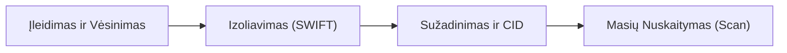
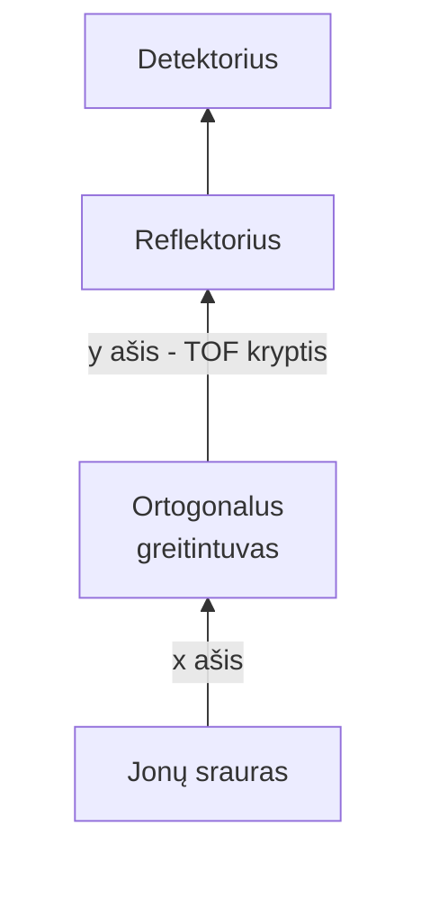

# Įvadas

# Jonų gavimas (Jonizacija)


# Analizatoriai

## Analizatorių charakteristkos

### Skiriamoji geba ir atskyrimas

*   **Skiriamoji geba (Resolving Power, $R$):** Tai yra **prietaiso (analizatoriaus) charakteristika**, nusakanti teorinį gebėjimą atskirti labai artimas mases. Ji parodo, kokio siaurumo smailes gali sugeneruoti analizatorius esant tam tikram masės krūvio santykiui.
*   **Atskyrimas (Resolution, $\Delta m$):** Tai yra **faktiškai gautas rezultatas spektre** – realus masės skirtumas tarp dviejų gretimų smailių, kuriuos prietaisas dar sugeba vizualiai išskirti kaip atskirus signalus.

Matematiškai skiriamoji geba išreiškiama santykiu:

$$R = \frac{m}{\Delta m}$$

Čia $m$ yra jono masė ($m/z$), o $\Delta m$ – mažiausias masės skirtumas, reikalingas tam, kad du pikai būtų atskirti. Šiam parametrui ($\Delta m$) apskaičiuoti spektre naudojami du pagrindiniai matematiniai algoritmai.


##### FWHM (Full Width at Half Maximum) algoritmas
Tai yra šiuolaikinėje masių spektrometrijoje dažniausiai taikomas metodas, ypač aukštos skiriamosios gebos prietaisams (TOF, Orbitrap). 

*   **Principas:** Vertinama **viena individuali smailė** masių spektre. Išmatuojamas šios smailės plotis ($\Delta m$) pusėje jo maksimalaus intensyvumo (aukščio) – t. y. ties 50% intensyvumo riba.
*   **Formulė:**
    $$R_{\text{FWHM}} = \frac{m}{\Delta m_{\text{FWHM}}}$$

*Pavyzdžiui:* Jeigu matuojame joną $m/z = 500.000$, o jo smailės plotis ties puse aukščio ($\Delta m$) yra $0.010\text{ Da}$, tai skiriamoji geba bus:
$$R_{\text{FWHM}} = \frac{500.000}{0.010} = 50\,000$$

##### 10% Valley (10% įdubos/slėnio) algoritmas
Šis metodas istoriškai buvo naudojamas magnetinio sektoriaus prietaisams, tačiau išlieka svarbus suprantant ribines pikų persidengimo sąlygas.

*   **Principas:** Vertinamos **dvi vienodo intensyvumo gretimos smailės** (pavyzdžiui, esant masių vertėms $m_1$ ir $m_2$). Jie laikomi patikimai atskirtais, kai persidengiančių smailių slėnis (įduba tarp jų) nusileidžia iki tiksliai 10% jų maksimalaus intensyvumo (aukščio).
*   **Formulė:**
    $$R_{10\%} = \frac{m}{\Delta m_{10\%}}$$
    
    Čia:
    *   $\Delta m_{10\%} = |m_2 - m_1|$ yra fizinis atstumas (masių skirtumas) tarp dviejų smailių viršūnių.
    *   $m$ yra vidutinė šių dviejų jonų masė: $m = \frac{m_1 + m_2}{2}$ (arba tiesiog $m_1$).

##### FWHM ir 10% Valley palyginimas
Svarbu suprasti, kad **10% Valley reikalavimas yra kur kas griežtesnis** nei FWHM. Neretai, teisės aktai numatantys reikalavimus analizės metodams panaudojant masių spektrometriją nurodo būtent šiuo algoritmu pademonstruotą atskyrimą/skiriamąją gebą. Matematiškai dažnai siejame:

$R_{10\%} \approx 1.8 \times R_{\text{FWHM}}$

### Masių matavimo tikslumas (Mass Accuracy)

**Masių matavimo tikslumas** nusako, kaip stipriai prietaisu **išmatuota jono masė ($m_{\text{išmatuota}}$) nukrypsta nuo teorinės (tikrosios) masės ($m_{\text{teorinė}}$)**

Kadangi masių skirtumai yra labai maži, masių spektrometrijoje matavimo tikslumas (arba paklaida) išreiškiamas **milijoninėmis dalimis (angl. ppm – *parts per million*)**:

$$\text{Paklaida (ppm)} = \left( \frac{m_{\text{išmatuota}} - m_{\text{teorinė}}}{m_{\text{teorinė}}} \right) \times 10^6$$

Kuo geresnė masių spektrometro skiriamoji geba, tuo geresnį jis gali pasiekti masių matavimo tikslumą. 


### Analizatoriaus jautris ir Analizės (Metodo) jautris

*   **Analizatoriaus jautris (angl. *Analyzer Sensitivity / Ion Transmission*):**
    Tai yra **fizinė prietaiso savybė**, nusakanti, kokia dalis jonų, sugeneruotų šaltinyje, sugeba sėkmingai perskrieti analizatorių, pasiekti detektorių ir sukurti signalą.
    *   *Pavyzdys:* **Jonų gaudyklė** pasižymi ypatingai aukštu analizatoriaus jautriu, nes ji sugeba sukaupti ir sulaikyti (užrakinti) beveik visus jonus mažame tūryje. Tuo tarpu skenuojantis **Kvadrupolis** didžiąją dalį jonų atmeta (filtruoja), todėl jo analizatoriaus jautris bendrame skenavimo (SCAN) režime yra žemas.
*   **Analizės (metodo) jautris (angl. *Analytical/Method Sensitivity*):**
    Tai yra bendras **eksperimentinis jautris**, nusakantis mažiausią analitės koncentraciją realioje matavimo matricoje, kurią dar galima patikimai atskirti nuo triukšmo (aptikimo riba).
    *   *Pavyzdys:* Nors **Kvadrupolis** praranda jonus skenuodamas, jį užrakinus pasirinktų jonų stebėjimo (**SIM**) režimu, prietaisas matuoja tik vieną tikslinį joną ir visiškai eliminuoja fono triukšmą. Tai užtikrina išskirtinį metodo jautrį, todėl jis yra kiekybinės analizės standartas.


### Analizatoriaus dinaminis diapazonas (Dynamic Range)

**Dinaminis diapazonas** – tai santykis tarp **didžiausios analitės koncentracijos**, kurią prietaisas dar sugeba išmatuoti išlaikant sąlygą, kad analitės signalas yra tiosiog proporcingas koncentracijai, ir **mažiausios patikimai aptinkamos koncentracijos** 

$$\text{Dinaminis diapazonas} = \frac{C_{\text{maksimali koncentracija}}}{C_{\text{aptikimo riba}}}$$

Kai išlaikoma sąlyga:

$$I \propto c_{\text{(analitės)}}$$


* **Pavyzdys** SCIEX 7500 spektrometras, kaip teigia gamintojas, gali matuoti chloramfenikolį koncentracijų diapazone 0.04 - 40000 ng /ml diapazone 
    * $\implies$ $\text{Dinaminis diapazonas} = 40000/0.04 = 1 \times 10^7 $ $\implies$ 7 koncentracijos eilės.


Jei analitės koncentracija viršija viršutinę dinaminio diapazono ribą, analizatorius arba detektorius **persisotina** (smailės tampa plokščios , prarandama kiekybinė priklausomybė). Jei koncentracija per žema – signalas paskęsta triukšme. Kiekybiniams tyrimams idealiai tinka kuo platesnis dinaminis diapazonas ($10^5 - 10^8$).

## Žemos skiriamosios gebos analizatoriai

### Kvadrupolis
Kvadrupolinis masių analizatorius (angl. *Quadrupole Mass Filter*, QMF), kurį 1953 m. pirmieji pasiūlė Wolfgang Paul ir Helmut Steinwedel, yra vienas plačiausiai naudojamų masių analizatorių šiuolaikinėje masių spektrometrijoje. Jo populiarumą lemia mechaninis patikimumas, kompaktiškumas, greitis bei geras suderinamumas su skysčių (ESCh) bei dujų (DCh) chromatografijos metodais.

##### Mechaninė ir Fizikinė Konstrukcija

###### Geometrija ir Strypų Konfigūracija
Kvadrupolį sudaro **keturi simetriškai lygiagretūs elektrodai (strypai)**, išdėstyti aplink centrinę išilginę judėjimo ašį ($z$ ašis). 
* **Ideali geometrija:** Elektrodo skerspjūvis turėtų būti hiperbolinis, kad būtų sukurtas idealus dvidisciplininis kvadrupolinis elektrinis laukas.
* **Praktinė geometrija:** Komerciniuose prietaisuose gamybos paprastumui užtikrinti dažniausiai naudojami labai tiksliai apdirbti **cilindriniai strypai**. Norint, kad cilindrinis laukas geriausiai aproksimuotų idealų hiperbolinį lauką, nustatomas specifinis strypo spindulio $r$ ir lauko spindulio (pusės atstumo tarp priešingų strypų) $r_0$ santykis:
  $$r \approx 1.1468 \times r_0$$
Bet kokie mechaninio surinkimo nukrypimai ar tolerancijos viršijimai (pvz., netikslus strypų išlygiavimas daugiau nei $\pm 10\ \mu\text{m}$) sukelia stiprų lauko iškraipymą, kas lemia dramatišką transmisijos ir skiriamosios gebos praradimą.


###### Laplaso Potencialo Sąlygos
Išilginė ašis ($z$) yra field-free kryptis (be lauko), o skersinėje plokštumoje ($x, y$) sukuriamas dinaminis elektrostatinis laukas, kurio potencialas $\Phi(x,y,z)$ tenkina Laplaso lygtį nesant laisvųjų krūvių:
$$\nabla^2 \Phi(x,y,z) = 0$$

Bendroji kvadratinė potencialo išraiška yra:
$$\Phi(x,y,z) = A(\lambda x^2 + \sigma y^2 + \gamma z^2) + C$$

Įstačius šią potencialo išraišką į Laplaso lygtį, gaunama geometrinių koeficientų sąlyga:
$$\lambda + \sigma + \gamma = 0$$

Linijiniame kvadrupolyje pasirenkamas sprendinys $\lambda = 1$, $\sigma = -1$ ir $\gamma = 0$. Tai sukuria grynai dvimatį potencialo profilį skersinėje plokštumoje, o judėjimo ašyje $z$ potencialas išlieka nepakitęs ($C=0$):
$$\Phi(x,y) = A(x^2 - y^2)$$


##### Elektros Srovės Pajungimas ir Mathieu Lygtys

###### Įtampų taikymas
Kad kvadrupolis veiktų kaip masių filtras, prie jo strypų prijungiama nuolatinė (DC) įtampa $U$ ir kintamoji radijo dažnio (RF) įtampa $V \cos \Omega t$:
* **$x$-elektrodų pora:** prie jos taikomas potencialas $+(U + V \cos \Omega t)$.
* **$y$-elektrodų pora:** prie jos taikomas potencialas $-(U + V \cos \Omega t)$.

Šis įtampų išdėstymas sukelia laiko ir erdvės atžvilgiu kintantį potencialo lauką analizatoriaus viduje:
$$\Phi(x,y,t) = \frac{(U + V \cos \Omega t)(x^2 - y^2)}{r_0^2}$$

###### Mathieu judėjimo lygtys
Teigiamo krūvio jono ($e$) judėjimo diferencialinės lygtys skersinėse ašyse yra gaunamos iš Niutono dėsnio [4]:
$$m\frac{d^2x}{dt^2} = -\frac{2e(U + V\cos\Omega t)x}{r_0^2}$$
$$m\frac{d^2y}{dt^2} = \frac{2e(U + V\cos\Omega t)y}{r_0^2}$$

Šios lygtys gali būti tiesiškai transformuotos į standartinę Mathieu (Matjė) diferencialinę lygtį su periodiniais koeficientais:
$$\frac{d^2u}{d\xi^2} + (a_u - 2q_u \cos 2\xi)u = 0$$
čia $u$ žymi koordinatę ($x$ arba $y$), o $\xi = \frac{\Omega t}{2}$ yra bematis laiko parametras [4]. Bemažiai Mathieu stabilumo parametrai $a$ ir $q$ išreiškiami taip [4, 158]:
$$a_x = -a_y = \frac{8eU}{m r_0^2 \Omega^2}$$
$$q_x = -q_y = \frac{4eV}{m r_0^2 \Omega^2}$$

---

##### Trajektorijų Stabilumas ir Stabilumo Diagrama

Mathieu lygties sprendiniai skirstomi į dvi klases: **apribotus (stabilius)** ir **neapribotus (nestabilius)** .
1. **Stabilus judėjimas:** Jono svyravimų amplitudė $x$ ir $y$ ašyse išlieka mažesnė už fizinį kvadrupolio spindulį ($x(t), y(t) < r_0$) per visą skriejimo trukmę [5]. Tokie jonai sėkmingai praeina masių filtrą ir pasiekia detektorių.
2. **Nestabilus judėjimas:** Jonų svyravimų amplitudė eksponentiškai auga, kol jie atsitrenkia į metalinius strypus, neutralizuojasi ir pasišalina iš vakuumo sistemos.

Sankirta tarp stabilių sprendinių $x$ ir $y$ kryptims Mathieu parametruose $(a, q)$ suformuoja **stabilumo diagramą** [5]. Komerciniai masių spektrometrai standartiniu režimu dirba prie pirmosios stabilumo zonos viršūnės (angl. *apex*), kur:
$$q \approx 0.908, \quad a \approx 0.237$$

##### Duomenų Surinkimo Režimai

Kvadrupolį galima valdyti dviem pagrindiniais duomenų surinkimo režimais, kurie iš esmės skiriasi savo įtampų valdymu ir paskirtimi:

```text
        SCAN (Skenavimas)                   SIM (Stebėjimas)
     a (U) ^                             a (U) ^
           |       / Skenavimo                 |     * Fiksuotas taškas
           |      /  tiesė                     |       (vienas m/z)
           |     /                             |
           +------------------> q (V)          +------------------> q (V)
```

###### SCAN (Viso spektro nuskaitymas)
SCAN režime prietaisas nuosekliai nuskaito nustatytą masių intervalą (pvz., nuo $m/z\ 50$ iki $500$), kad sugeneruotų pilną analizuojamo mėginio masių spektrą [153].

* **Valdymo principas:** Nuolatinė įtampa $U$ ir kintamoji įtampa $V$ yra **rampuojamos (tolygiai didinamos) kartu**, išlaikant griežtai pastovų jų santykį $U/V$ [6, 162]. Tai Mathieu diagramoje apibrėžia skenavimo tiesę (darbo liniją) [162, 165]:
  $$\frac{a}{q} = \frac{2U}{V} = \text{const}$$
  Ši tiesė kerta stabilumo zonos viršūnę [162]. Didėjant įtampoms, vis sunkesni jonai paeiliui atsiduria stabiliame taške, praeina pro strypus ir yra detektuojami [152].
* **Jautrumo charakteristika (Dwell Time nuostoliai):** 
  SCAN režimo jautrumas yra palyginti žemas [153]. Kiekvienam masių žingsniui skiriamas trumpas užlaikymo laikas (*dwell time*) – laikas, per kurį kaupiamas konkrečios masės signalas [154]. Kadangi likusį nuskaitymo laiką kitų masių jonai yra atmetami ir neutralizuojami ant strypų, didžioji dalis jonų srauto prarandama (esant rezoliucijai $R=1000$, detektorių pasiekia tik apie $0.1\%$ visų sugeneruotų jonų) [199].
* **Taikymas:** Naudojamas kokybinei analizei, nepažįstamų cheminių junginių struktūros identifikavimui bei mišinių profiliavimui (gaunamas unikalus spektro „pirštų atspaudas“).

###### SIM (Pasirinktų jonų stebėjimas)
SIM režime prietaisas nustato įtampas taip, kad pro masių filtrą būtų praleidžiami tik vienos ar kelių pasirinktų masių jonai, o visos kitos masės yra visiškai blokuojamos [153].

* **Valdymo principas:** Įtampos $U$ ir $V$ nėra skenuojamos – jos **išlaikomos fiksuotos** ties konkrečiomis vertėmis, kurios tiksliai atitinka pasirinkto jono stabilumo tašką arti Mathieu zonos viršūnės [6].
* **Jautrumo charakteristika:**
  SIM režimas pasižymi **maksimaliu jautrumu** [153]. Kadangi prietaisas neatlieka viso spektro skenavimo, visas eksperimento laikas (*dwell time*) skiriamas pasirinktos masės jonų registravimui [6, 154]. Tai leidžia detektoriui sukaupti kur kas daugiau naudingų jonų, dramatiškai pagerinti signalo ir triukšmo santykį ($S/N$) ir sumažinti aptikimo ribą iki femtomolinių koncentracijų.
* **Taikymas:** Labai jautriai tikslinių, iš anksto žinomų junginių kiekybinei analizei sudėtinguose biologiniuose ir aplinkos mėginiuose, kur svarbu eliminuoti foninį triukšmą bei pašalines priemaišas.

---

##### Apibendrinimas

Kvadrupolinis masių analizatorius veikia kaip dinaminis masių filtras, kurio selektyvumas priklauso nuo jono judėjimo stabilumo Mathieu lauko erdvėje. Nors abu duomenų surinkimo režimai turi tą patį fizikinį pagrindą, **SCAN** suteikia išsamią kokybinę informaciją apie visą mėginio sudėtį, o **SIM** užtikrina neprilygstamą jautrumą tiksliniam kiekybiniam medžiagų pėdsakų nustatymui.


### Jonų gaudyklė


##### Trimatės (3D) Jonų Gaudyklės Konstrukcija

Trimatė jonų gaudyklė (dažnai vadinama **Paulio gaudykle**, jos išradėjo Wolfgang Paul garbei) pasižymi elegantiška simetrija. Ją sudaro trys pagrindiniai metaliniai elektrodai su preciziškai apdirbtais hiperboliniais vidiniais paviršiais:

1.  **Žiedinis elektrodas** (angl. *ring electrode*): Išdėstytas centre aplink $xy$ plokštumą. Prie jo prijungiama pagrindinė aukštos įtampos radijo dažnio (RF) kintamoji srovė ($V \cos \omega t$). Šis laukas sukuria pagrindinį tridatį kvadrupolinį elektrinį lauką, sulaikantį jonus.
2.  **Du galiniai elektrodai-dangteliai** (angl. *endcap electrodes*): Išdėstyti abipus žiedinio elektrodo išilgai $z$ ašies. Paprastai jie yra elektriškai įžeminti ($0\text{ V}$) arba prie jų prijungiamos papildomos nedidelės kintamosios įtampos (angl. *auxiliary AC*), naudojamos jonų sužadinimui ar ežekcijai.
3.  **Įėjimo ir išėjimo apertūros**: Dangtelių centruose išgręžiamos mažos skylutės. Pro pirmojo dangtelio apertūrą jonai iš išorinio jonų šaltinio įleidžiami į gaudyklės tūrį, o pro antrojo dangtelio apertūrą stabilumą praradę jonai yra išmetami link detektoriaus.

######  Helio buferinių dujų vaidmuo (*Collisional Cooling*)
Gaudyklės vidus nėra visiškas vakuumas; į ją nuolat tiekiama labai lengvų **helio dujų** (palaikant maždaug $10^{-3}\text{ Torr}$ slėgį). Įskrieję didelės kinetinės energijos jonai nuolat susiduria su helio atomais. Šių elastinių susidūrimų metu jonai praranda kinetinę energiją, jų orbitos susiaurėja, ir jie **„atvėsta“ bei susikoncentruoja į tankų, mažą debesėlį** pačiame gaudyklės centre. Tai yra kritiškai svarbu, kad vėlesnis jonų išmetimas būtų sinchroniškas, o spektras turėtų siaurus, ryškius pikus (gerą skiriamąją gebą).


##### Dvimatės (2D) Tiesinės Jonų Gaudyklės (Linear Ion Trap, LIT) Konstrukcija

Nors 3D gaudyklė yra labai kompaktiška, ji turi esminį trūkumą – mažą fizinį tūrį, kuriame galima laikyti jonus. Kai jonų tankis centre tampa per didelis, teigiami jonai pradeda stumti vienas kitą (tai vadinama **erdvinio krūvio reiškiniu**, angl. *space charge effect*), o tai stipriai iškraipo masių spektrus.

Šią problemą išsprendė **dvimatė tiesinė jonų gaudyklė (LIT)**:

*   **Struktūra**: Ji labai panaši į standartinį keturių strypų kvadrupolį, tačiau strypai yra padalinti į **tris ašinius segmentus** (priekinį, centrinį ir galinį), arba jų galuose įrengtos metalinės užtvarinės plokštelės.
*   **Radialinis apribojimas ($xy$ plokštuma)**: Vykdomas taikant RF įtampą prie strypų porų, visiškai analogiškai kaip ir kvadrupolyje. Tai neleidžia jonams išsprūsti į šonus.
*   **Ašinis apribojimas ($z$ ašis)**: Ant galinių strypų segmentų (arba užtvarinių plokštelių) paduodama nuolatinė teigiama DC įtampa (teigiamiems jonams), o centriniame segmente išlaikomas žemesnis potencialas. Taip sukuriamas **elektrostatinis barjeras** (potencialo duobė), neleidžiantis jonams išlėkti išilgai strypų.
*   **Pranašumas prieš 3D**: Jonai LIT viduje susitelkia ne į tašką, o į **ilgą linijinį debesį** išilgai centrinės ašies. Kadangi jonų tūris yra daug didesnis, erdvinio krūvio neigiamas poveikis pasireiškia tik esant **10–100 kartų didesniam jonų skaičiui**. Tai užtikrina platesnį dinaminį diapazoną ir geresnį signalo tikslumą.


##### Veikimo principas ir Mathieu Stabilumo Teorija

Jonų judėjimas gaudyklės viduje yra aprašomas antros eilės diferencialine **Mathieu (Matjė) lygtimi**. Svarbiausia yra jonų judėjimo trajektorija ašine ($z$) kryptimi, kurią aprašo du bemažiai parametrai:

$$a_z = -\frac{16eU}{m(r_0^2 + 2z_0^2)\omega^2}$$

$$q_z = \frac{8eV}{m(r_0^2 + 2z_0^2)\omega^2}$$

*Čia $e$ – jono krūvis, $m$ – jono masė, $U$ – nuolatinė DC įtampa žiediniame elektrode, $V$ – kintamosios įtampos RF amplitudė, $r_0$ – gaudyklės spindulis, $z_0$ – pusė atstumo tarp dangtelių, o $\omega$ – kintamosios srovės dažnis.*

###### Darbas be DC lauko ($a_z = 0$)
Praktikoje jonų gaudyklės beveik visada valdomos netaikant nuolatinės įtampos žiediniam elektrodui ($U = 0\text{ V}$). Tai reiškia, kad parametras **$a_z = 0$**, o visi gaudyklėje esantys jonai išsidėsto tiesiai ant horizontalios **$q_z$ ašies** Mathieu stabilumo diagramoje:

*   **Sunkūs jonai** (didelė $m/z$ vertė) turi mažą $q_z$ vertę ir yra arčiau diagramos centro.
*   **Lengvi jonai** (maža $m/z$ vertė) turi didesnę $q_z$ vertę ir yra labiau nutolę į dešinę.
*   Teorinė stabilumo riba šioje tiesėje yra ties **$q_z \approx 0.908$**. Jei jono masė ir įtampa nulemia, kad jo $q_z$ viršija $0.908$, jono judėjimas tampa nestabilus, jo svyravimų amplitudė eksponentiškai išauga ir jis atsitrenkia į elektrodus arba išsviedžiamas iš gaudyklės.


##### Skenavimo (Scan) ir Izoliavimo Režimai

###### Skenavimo režimai (Masių nuskaitymas)

Sukaupus jonus gaudyklėje, juos reikia nuosekliai išmesti link detektoriaus, kad sugeneruotume masių spektrą. Tam naudojami du pagrindiniai metodai:

1.  **Masių-selektyvus nestabilumo nuskaitymas (angl. *Mass-Selective Instability Scan*)**:
    *   Visi jonai yra stabiliai sukaupti gaudyklėje ties žemomis $q_z$ vertėmis.
    *   Pagrindinio RF lauko įtampos amplitudė $V$ pradedama **tolygiai didinti**.
    *   Didėjant $V$, visų jonų $q_z$ vertės slenka į dešinę link stabilumo ribos.
    *   Pirmasis stabilumo ribą ($q_z = 0.908$) kerta pats lengviausias jonas. Jis akimirksniu tampa nestabilus ir yra išmetamas pro dangtelį į detektorių.
    *   Toliau didinant įtampą, nuosekliai išmetami vis sunkesni jonai. Taip užregistruojamas pilnas masių spektrą.

2.  **Rezonansinis išmetimo nuskaitymas (angl. *Resonance Ejection Scan*)**:
    *   Kadangi itin sunkiems jonams išmesti pagal teorinę $q_z = 0.908$ ribą reikėtų neproporcingai didelių RF įtampų (kurios sukeltų elektrinį pramušimą), naudojamas rezonansas.
    *   Kiekviena $m/z$ vertė gaudyklėje svyruoja savo unikaliu **sekuliariniu dažniu** (angl. *secular frequency*).
    *   Prie galinių elektrodų-dangtelių prijungiama papildoma labai silpna kintamoji įtampa (angl. *auxiliary AC* / *tickle voltage*).
    *   Didėjant pagrindinei RF įtampai, jonų svyravimo dažnis pamažu kinta. Kai konkretaus jono sekuliarinis dažnis sutampa su papildomo AC lauko dažniu, jonas patiria rezonansą.
    *   Jo svyravimo amplitudė staiga išauga, ir jonas yra išmetamas gerokai anksčiau nei pasiekia teorinę stabilumo ribą (pvz., prie $q_z \approx 0.83$ ar mažiau). Tai leidžia išplėsti matuojamų masių rėžius ir pasiekti kur kas didesnę skiriamąją gebą.

###### B. Izoliavimo režimas (angl. *Ion Isolation*)

Norint atlikti MS/MS tyrimą, pirmiausia gaudyklėje reikia palikti tik vieną dominančią prekursoriaus masę ($m/z$), o visus kitus jonus (tiek lengvesnius, tiek sunkesnius) pašalinti.

*   **SWIFT (angl. *Stored Waveform Inverse Fourier Transform*) metodas**:
    *   Prie galinių dangtelių prijungiamas specialiai suformuotas plataus dažnių spektro signalas.
    *   Šiame signale yra paliktas siauras **„iškirpimas“ (angl. *notch*)**, atitinkantis tikslinio jono sekuliarinį dažnį.
    *   Visi kiti jonai, kurių dažniai patenka į sužadinimo rėžius, pradeda rezonuoti, tampa nestabilūs ir išsviedžiami iš gaudyklės.
    *   Mūsų tikslinis prekursoriaus jonas visiškai nepatiria sužadinimo ir lieka gaudyklės centre.

---

##### 6. Kaip Atliekamas MS/MS (ir $MS^n$) laike

Vienas didžiausių jonų gaudyklės privalumų yra gebėjimas atlikti daugiaetapę masių analizę laike. Procesas vykdomas nuosekliomis laiko fazėmis tame pačiame fiziniame analizatoriuje:



1.  **Fazė 1: Įleidimas ir vėsinimas ($MS^1$)**: Visi jonai iš šaltinio sugaunami ir stabilizuojami helio dujomis gaudyklės centre.
2.  **Fazė 2: Izoliavimas**: Taikant SWIFT arba RF/DC tolydų didinimą, visi nepageidaujami jonai išmetami. Gaudyklėje lieka tik izoliuotas prekursoriaus jonas ($M_1^+$).
3.  **Fazė 3: Sužadinimas ir fragmentacija (CID)**:
    *   Prie dangtelių paduodama labai švelni kintamoji įtampa, atitinkanti tik izoliuoto jono rezonansinį dažnį.
    *   Jonas pradeda šiek tiek aktyviau svyruoti, tačiau energija yra **nepakankama, kad jis būtų išmestas**.
    *   Svyruodamas jonas energingai susiduria su helio dujų atomais. Šių susidūrimų metu jo vidinė kinetinė energija virsta vibracine energija, jonas „įkaista“ ir suskyla (vyksta CID – susidūrimų sukelta disociacija).
    *   Susidarę fragmentų jonai (produktai) neturi rezonanso su taikomu sužadinimo dažniu, todėl iškart vėl yra atvėsinami helio dujų ir lieka gaudyklėje.
4.  **Daugiaetapis procesas ($MS^n$)**: Jei norime gauti $MS^3$, mes galime vėl izoliuoti tik vieną iš gautų fragmentų (atsikratydami visų kitų fragmentų), jį vėl sužadinti, fragmentuoti ir gauti antros kartos fragmentus. Šį procesą teoriškai galima kartoti daug kartų ($MS^4, MS^5$...).
5.  **Fazė 5: Galutinis nuskaitymas**: Atliekamas rezonansinis išmetimo nuskaitymas, visi gaudyklėje esantys fragmentai nuosekliai siunčiami į detektorių, ir užregistruojamas fragmentacijos spektro pikas.

---

##### 7. Jonų Gaudyklės ir Kvadrupolio Palyginimas

Šie analizatoriai reprezentuoja dvi visiškai skirtingas koncepcijas: kvadrupolis valdo jonų srautą **erdvėje**, o gaudyklė – **laike**.

###### Jonų Gaudyklės Privalumai (lyginant su Kvadrupoliu):
*   **Ypatingai aukštas jautrumas SCAN režime**: Kadangi gaudyklė kaupia visus jonus, o ne filtruoja juos atmesdama, viso spektro nuskaitymas yra keliomis eilėmis jautresnis nei kvadrupolio.
*   **Daugiaetapė fragmentacija ($MS^n$)**: Gaudyklė gali atlikti praktiškai neribotą fragmentacijos etapų skaičių viename analizatoriuje. Kvadrupolis to daryti negali – norint atlikti bent paprastą MS/MS, fiziškai reikalingi trys nuoseklūs kvadrupoliai (trigubo kvadrupolio sistema).
*   **Kompaktiškumas ir kaina**: 3D gaudyklė yra labai maža, reikalauja paprastesnės vakuumo sistemos ir yra pigesnė nei trigubo kvadrupolio sistemos.

###### Jonų Gaudyklės Trūkumai (lyginant su Kvadrupoliu):
*   **Siauras dinaminis diapazonas**: Kadangi jonai yra uždaromi lokaliame tūryje, dėl **erdvinio krūvio reiškinio** (teigiamų jonų tarpusavio stūmos) per didelis jonų skaičius greitai iškreipia elektrinį lauką, sukelia masių skalės poslinkius bei pikų išplatėjimą. Kvadrupolyje jonai laisvai prateka, todėl jis neturi tokio ribojimo.
*   **Prastesnės kiekybinės analizės charakteristikos**: Kvadrupolis yra kiekybinės analizės etalonas. Dėl stabilaus, nepertraukiamo jonų pralaidumo ir plataus dinaminio diapazono jis užtikrina geresnį matavimų atkuriamumą nei pulsinis jonų gaudyklės veikimas.
*   **„Trečdalio taisyklės“ apribojimas (angl. *One-Third Rule*)**: Atliekant fragmentaciją (CID) 3D gaudyklėje, visi fragmentai, kurių masė yra mažesnė nei maždaug $1/3$ prekursoriaus masės, tampa nestabilūs ir yra prarandami (negalima užregistruoti mažų fragmentų). Kvadrupolinės sistemos šio ribojimo neturi.

###### Lyginamoji Parametrų Lentelė

| Charakteristika | Kvadrupolis | Jonų gaudyklė (3D / 2D LIT) |
| :--- | :--- | :--- |
| **Veikimo tipas** | Nepertraukiamas srauto filtras | Pulsinis jonų kaupiklis |
| **Jautrumas (SCAN)** | Žemas (prarandama >99 % jonų) | Labai aukštas (sulaikoma ~100 % jonų) |
| **Dinaminis diapazonas** | Labai platus ($10^5 - 10^6$) | Siauras ($10^3 - 10^4$) |
| **Fragmentacijos tipas** | MS/MS erdvėje (reikia kelių prietaisų) | $MS^n$ laike (tame pačiame prietaise) |
| **Mažiausių masių registravimas** | Nėra ribojimų | Riboja „trečdalio taisyklė“ |
| **Pagrindinė taikymo sritis** | Tikslinis kiekybinis medžiagų nustatymas | Struktūrinė analizė ir kokybinis tyrimas |


## Aukštosios skiriamosios gebos analizatoriai
### Skrydžio trukmės analizatorius (Time-of-Flight)
#### Įvadas ir Fizikinis Veikimo Principas

**Skrydžio trukmės masių analizatorius** (angl. *Time-of-Flight*, TOF) – tai ne skenuojantis, o pulsinis masių analizatorius, kuris masių atskyrimą vykdo pagal jonų judėjimo greičio skirtumus laisvojo skriejimo erdvėje. Šis metodas pasižymi teoriškai neribotu registruojamų masių diapazonu, didele transmisija (jautrumu) bei ypatingai dideliu spektro registravimo greičiu.

##### Fundamentali TOF lygtis

Kai jonas, kurio masė yra $m$ ir krūvis $q = ez$ (čia $e$ – elementarusis krūvis, $z$ – jono krūvio skaičius), iš ramybės būsenos pagreitinamas elektriniu lauku, turinčiu potencialų skirtumą $V_a$ (pagreitinimo įtampa), jo įgyta elektrostatinė potencialinė energija yra visiškai paverčiama kinetine energija:

$$E_k = q V_a = \frac{1}{2} m v^2$$

Iš čia išreiškiamas jono greitis $v$, kurį jis įgyja išskriedamas iš pagreitinimo srities:

$$v = \sqrt{\frac{2 q V_a}{m}}$$

Sėkmingai pagreitintas jonas patenka į aukšto vakuumo sritį, kurioje nėra elektrinių laukų – **laisvojo skriejimo (dreifo) sritį** (angl. *field-free drift region*), kurios ilgis yra $D$. Laikas $t$, per kurį jonas įveikia šį atstumą ir pasiekia detektorių, yra lygus:

$$t = \frac{D}{v} = D \sqrt{\frac{m}{2 q V_a}}$$

Kadangi visi to paties krūvio jonai yra pagreitinami ta pačia įtampa $V_a$, jų skrydžio trukmė yra **tiesiogiai proporcinga masės ir krūvio santykio ($m/z$) kvadratinei šakniai**:

$$t = C \sqrt{\frac{m}{z}} \quad \text{kur} \quad C = \frac{D}{\sqrt{2 e V_a}}$$

Iš šios lygties matyti, kad lengvesni jonai judės didesniu greičiu ir detektorių pasieks anksčiau nei sunkesni jonai. Šis laiko skirtumas detektoriuje vėliau yra kalibruojamas ir paverčiamas masių spektru.

---

#### Skiriamąją Gebą Ribojantys Veiksniai Linijinėse Sistemose

Paprastoje **linijinėje TOF** (angl. *linear TOF*) sistemoje jonai iš jonizacijos šaltinio juda tiesia trajektorija tiesiai į detektorių. Nors ši konstrukcija yra mechaniškai paprasčiausia ir pasižymi puikiu jautrumu didelės masės molekulėms (pavyzdžiui, nepažeistiems baltymams MALDI-TOF analizėje), jos skiriamoji geba ($R$) yra stipriai apribota (dažniausiai $R < 500$). 

Deterioraciją (smailės išplitimą) lemia trys pradiniai jonų debesies pasiskirstymai jonų šaltinyje prieš pagreitinimą:

1.  **Erdvinis pasiskirstymas ($\Delta s_0$):** Jonai nesusidaro idealiai vienoje plokštumoje. Jonai, esantys arčiau pagreitinimo tinklelio, patiria mažesnį įtampos skirtumą ir įgyja mažesnę kinetinę energiją, tačiau jų kelias iki detektoriaus yra trumpesnis. Jonai, esantys giliau šaltinyje, yra labiau pagreitinami, tačiau turi įveikti ilgesnį kelią. Šių dviejų faktorių nesutapimas lemia, kad tos pačios masės jonai detektorių pasiekia skirtingu laiku.
2.  **Kinetinės energijos pasiskirstymas ($\Delta U_0$):** Jonizacijos metu (ypač esant terminiam judėjimui ar lazerinei desorbcijai) jonai jau turi pradinį greitį ir kinetinės energijos sklaidą. Jonai, turintys didesnę pradinę energiją skrydžio kryptimi, pasieks detektorių anksčiau nei vidutinės energijos jonai.
3.  **Laiko pasiskirstymas ($\Delta t_0$):** Net ir pulsinėse sistemose (pvz., MALDI lazerio blyksnis trunka kelias nanosekundes) jonai nesusidaro idealiai tuo pačiu momentu. Šis pradinis laiko neapibrėžtumas tiesiogiai persineša į detektorių.


#### Didelės Skiriamosios Gebos Gavimo Metodai

Norint kompensuoti minėtus pasiskirstymus ir pasiekti didelę skiriamąją gebą (iki dešimčių ar šimtų tūkstančių), šiuolaikinėje TOF spektrometrijoje naudojami trys pagrindiniai metodai: **vėlintoji ekstrakcija**, **reflektoriai** ir **ortogonalus jonų įvedimas**.

###### Vėlintoji ekstrakcija (angl. *Delayed Extraction*, DE)

Vėlintosios ekstrakcijos metodas (tradiciškai taikomas ašinėse MALDI-TOF sistemose) išsprendžia erdvinio ir greičio pasiskirstymo problemą šaltinyje:
*   Užuot iškart pagreitinus jonus vos tik jiems susidarius, leidus lazerio impulsui įvykti, jonams leidžiama trumpą laiką (nuo 100 ns iki kelių mikrosekundžių) laisvai dreifuoti **be lauko esančioje srityje** (angl. *field-free environment*).
*   Per šį laiką greitesni jonai nueina toliau nuo bandinio plokštelės link ekstrakcijos tinklelio, o lėtesni jonai lieka arčiau plokštelės.
*   Po nustatyto laiko tarpo įjungiamas staigus pagreitinimo įtampos impulsas. Kadangi lėtesni (arba judėję atgal) jonai dabar yra giliau šaltinyje (arčiau teigiamo elektrodo), jie patiria didesnį potencialų skirtumą ir įgyja **didesnį greitį**.
*   Šis papildomas greitis leidžia jiems pavyti anksčiau išskridusius, bet lėtesnius jonus tiksliai detektoriaus plokštumoje. Tai sukuria erdvinį-greičio fokusavimą laiko ašyje ir padidina skiriamąją gebą 3–4 kartus.


###### Elektrostatinias Reflektorius (Jonų Veidrodis)

**Reflektorius** (angl. *reflectron*), kurį XX a. 8-ajame dešimtmetyje išvystė B. Mamyrinas, yra elektrostatinių lęšių sistema skrydžio vamzdžio gale, sukurianti tolygiai didėjantį stabdymo lauką. Šis įtaisas veikia kaip jonų veidrodis, kuris atspindi jonus ir nukreipia juos link detektoriaus, kartu atlikdamas **kinetinės energijos fokusavimą**.

####### Veikimo principas:

Tarkime, turime du tos pačios masės jonus, tačiau jonas **A** turi didesnę kinetinę energiją (yra greitesnis), o jonas **B** – mažesnę kinetinę energiją (lėtesnis):
*   Laisvojo skriejimo srityje jonas **A** juda greičiau ir aplenkia joną **B**.
*   Patekęs į reflektorių, energetiškai „karštesnis“ jonas **A** dėl didesnio greičio prasiskverbia **giliau į stabdantį elektrinį lauką** ir jame praleidžia daugiau laiko, kol yra sustabdomas ir apsukamas atgal.
*   Lėtesnis jonas **B** prasiskverbia tik seklią dalį, greičiau apsisuka ir išskrieja iš reflektoriaus.
*   Tinkamai parinkus prietaiso geometriją, jonas **A** reflektoriuje praranda tiksliai tiek laiko, kiek jonas **B** prarado skriedamas lėčiau per laisvojo skriejimo sritį. Abu jonai pasiekia detektorių **tuo pačiu laiko momentu** (pasiekiamas skrydžio trukmės fokusas).
*   Papildomas reflektoriaus privalumas – jis efektyviai dvigubai pailgina skrydžio kelią tame pačiame prietaiso korpuse.

####### Reflektorių tipai:

1.  **Vieno etapo reflektorius (angl. *Single-stage reflectron*):** Naudoja vieną tiesiškai didėjančio lauko sritį. Užtikrina pirmojo laipsnio kinetinės energijos fokusavimą ($\frac{\partial t}{\partial E} = 0$). Fokusavimo sąlygą aprašo geometrinė taisyklė:
    $$L_1 + L_2 = 4d$$
    *Čia $L_1$ ir $L_2$ – dreifo sričių ilgiai prieš ir po reflektoriaus, o $d$ – maksimalus jono įsiskverbimo gylis.*
2.  **Dviejų etapų reflektorius (angl. *Dual-stage reflectron*):** Susideda iš dviejų sričių – trumpos, staigaus stabdymo srities (kurioje jonas praranda apie 2/3 energijos) ir ilgesnės, švelnaus stabdymo srities. Tai užtikrina **antrojo laipsnio fokusavimą** ($\frac{\partial t}{\partial E} = 0$ ir $\frac{\partial^2 t}{\partial E^2} = 0$), leidžiantį sukompensuoti kur kas platesnį pradinį energijos pasiskirstymą ir pasiekti rezoliuciją virš $30\,000$.
3.  **Išlengto lauko reflektorius (angl. *Curved-field reflectron*, CFR):** Naudoja netiesinį potencialo gradientą (paprastai sekantį apskritimo lanko lygtį). Tai leidžia vienu metu fokusuoti ne tik sveikus pirminius jonus, bet ir fragmentus (produktų jonus), susidariusius po išėjimo iš šaltinio (metastabilaus skilimo metu).


#### Ortogonalus Jonų Krypčiai Dizainas (oa-TOF)

Didžiausias technologinis proveržis TOF masių spektrometrijoje įvyko sukūrus **ortogonaliojo pagreitinimo TOF** (angl. *Orthogonal Acceleration TOF*, oa-TOF) konstrukciją. Šioje sistemoje pirminis jonų srautas juda viena ašimi (pvz., horizontaliai $x$ ašimi), o pagreitinimo impulsas juos išstumia **statmena kryptimi** (vertikaliai $y$ ašimi) į skrydžio vamzdį.



##### Ortogonalus dizainas skiriamosios gebos ir energijos sklaidos problemą?

Ortogonalus dizainas iš esmės panaikina pirminio jonų srauto kinetinės energijos sklaidos įtaką masių rezoliucijai:
*   Jonai, atkeliaujantys iš šaltinio (pvz., ESI), juda išilgai $x$ ašies. Jų pradinės energijos sklaida yra nukreipta išimtinai $x$ kryptimi.
*   Stūmimo impulsas veikia $y$ kryptimi. Kadangi $x$ ir $y$ ašys yra visiškai nepriklausomos, pradinė jonų greičio sklaida $x$ ašyje **neturi jokios įtakos jų skrydžio trukmei $y$ ašimi**. Skrydžio trukmė priklauso tik nuo jono masės ir energijos, suteiktos vertikalaus stūmimo metu.
*   Nedidelis jonų poslinkis $x$ ašimi skrydžio metu (dėl pradinio judėjimo greičio) yra lengvai suvaldomas naudojant nežymiai pakreiptą detektoriaus plokštumą arba pakreipiant patį reflektorių (kampas $\theta = \tan^{-1}\sqrt{V_{\text{beam}}/V_{\text{tof}}}$).


#### Chromatografinis Suderinamumas ir Duomenų Surinkimas

Tradicinis TOF masių spektrometras yra iš esmės **diskretaus (pulsinio)** veikimo prietaisas (jam reikia aiškaus laiko pradžios taško $t_0$, nuo kurio pradedamas skaičiuoti laikas). Tuo tarpu skysčių (ESCh) ar dujų (DCh) chromatografijos metodai bei jų jonizacijos šaltiniai (pavyzdžiui, elektropurškimas – ESI) tiekia **nuolatinį (tolygų) jonų srautą** (angl. *continuous ion beam*).

Šį nesuderinamumą idealiai išsprendžia būtent **oa-TOF** suderinamumas su **koliziniu jonų vėsinimu** (angl. *collisional cooling*):

1.  **Nuolatinis srautas paverčiamas pulsiniu laike:** Nuolat generuojami jonai nukreipiami į RF-only kvadrupolio ar heksapolio jonų gidus, užpildytus nedideliu kiekiu buferinių dujų. Čia vyksta kolizinis vėsinimas (angl. *collisional cooling*): susidurdami su dujų molekulėmis, jonai praranda kinetinį energijos perteklių, suartėja su centrine ašimi ir suformuoja labai ploną, lygiagretų ir vienalytį jonų srautą.
2.  **Ortogonalus „atskėlimas“:** Šis tolygus, šaltas jonų debesėlis nuolat teka į ortogonaliojo pagreitinimo sritį (*pulser*). Kas 100–150 $\mu\text{s}$ (per tiek laiko sunkiausi jonai spėja pasiekti detektorių), pulseris staigiu aukštos įtampos impulsu „atkerpa“ ploną šio srauto atkarpą ir išstumia ją į skrydžio vamzdį.
3.  **Užpildymo koeficientas (angl. *Duty Cycle*):** Kol viena jonų porcija skrieja link detektoriaus, naujai ateinantys jonai iš šaltinio tiesiog pildo atsilaisvinusią pagreitinimo kamerą. Tai užtikrina labai aukštą jonų išnaudojimo efektyvumą (duty cycle siekia 5–30 %, o papildomai taikant jonų kaupimą kolizinėje kameroje – gali artėti prie 80–100 %).
4.  **Neprilygstamas greitis chromatografijai:** Kadangi vienas skrydis trunka mažiau nei 100 mikrosekundžių, oa-TOF gali sugeneruoti **10 000–20 000 pilnų masių spektrų per sekundę**. Šie spektrai yra kaupiami (sumuojami) realiu laiku, pateikiant galutinį spektrą kas keliasdešimt milisekundžių. Toks didelis greitis yra būtinas norint tiksliai charakterizuoti ypač siaurus chromatografinius pikus, gaunamus greitojoje skysčių chromatografijoje (UPLC) ar dvimatėje dujų chromatografijoje (GC$\times$GC).


#### Kvadrupolio, Jonų Gaudyklės ir TOF Palyginimas

Siekdami suprasti TOF vietą masių analizatorių hierarchijoje, palyginkime jį su anksčiau nagrinėtais prietaisais:

| Charakteristika | **Kvadrupolis (QMF)** | **Jonų Gaudyklė (IT)** | **Skrydžio Trukmės (oa-TOF)** |
| :--- | :--- | :--- | :--- |
| **Veikimo tipas** | Nuolatinis masių filtras | Lokalus jonų kaupimas laike | Pulsinis masių atskyrimas |
| **Masių diapazonas** | Ribotas (dažniausiai iki $4\,000$ $m/z$) | Ribotas (dažniausiai iki $6\,000$ $m/z$) | Teoriškai **neribotas** (naudojant MALDI iki $>300\,000$ $m/z$) |
| **Skiriamoji geba ($R$)** | Žema (vienetinė, $\approx 1\,000 - 3\,000$) | Žema / Vidutinė ($\approx 1\,000 - 10\,000$) | **Aukšta** ($\approx 10\,000 - 80\,000+$) |
| **Masių tikslumas** | Mažas ($\approx 100$ ppm) | Mažas ($\approx 50 - 200$ ppm) | **Ypatingai didelis** ($\approx 1 - 5$ ppm) |
| **Suderinamumas su LC/GC** | Puikus (SIM/MRM režimuose) | Geras (tačiau riboja erdvinis krūvis) | **Puikus** (dėl didelio nuskaitymo greičio ir HRAM) |
| **Tandeminė analizė** | Tik erdvėje (reikia kelių analizatorių, pvz., QqQ) | Tik laike (iki $MS^n$ tame pačiame prietaise) | Erdvėje (pvz., TOF-TOF) arba hibriduose (pvz., Q-TOF) |

---

### Orbitrap masių analizatorius

**Orbitrap** yra naujausias ir vienas iš pažangiausių didelės skiriamosios gebos masių analizatorių šiuolaikinėje masių spektrometrijoje, kurį tūkstantmečių sandūroje sukūrė Aleksandras Makarovas. Priešingai nei kiti didelės skiriamosios gebos prietaisai, pavyzdžiui, Furje transformacijos jonų ciklotroninio rezonanso (FT-ICR) masių spektrometrai, kuriems reikalingi brangūs, didžiuliai ir sudėtingi superlaidūs magnetai, **Orbitrap veikia nenaudodamas magnetinio ar radijo dažnių (RF) lauko masių atskyrimo metu**. Jonai jame yra sulaikomi ir analizuojami naudojant tik statinį elektrostatinį lauką, o tai leido sukurti kompaktiškus, stalinius (angl. *benchtop*) prietaisus, pasižyminčius išskirtiniu masių matavimo tikslumu (sub-ppm rėžiu) bei milžiniška skiriamąja geba.

#### Mechaninė ir Fizikinė Konstrukcija

Orbitrap analizatoriaus mechaninė konstrukcija yra elegantiška ir stebėtinai paprasta, susidedanti iš trijų pagrindinių, itin tiksliai apdirbtų elektrodų:

1. **Centrinis verpstės formos elektrodas (katodas):** Tai ašinis vidinis elektrodas, įkraunamas didele neigiama nuolatine įtampa (paprastai nuo $-3,5\,\text{kV}$ iki $-5\,\text{kV}$ teigiamų jonų analizės režime).
2. **Du išorinėje dalyje esantys simetriški elektrodai (anodai):** Tai statinės cilindro ar puodelio formos puselės, kurios apgaubia centrinį elektrodą ir yra išlaikomos ties nuliniu potencialu (virtuali žemė). Jos yra elektriškai izoliuotos viena nuo kitos plonu (plauko storio) dielektriniu žiedu.

Šių elektrodų vidiniai paviršiai yra suformuoti taip, kad sukurtų labai specifinį **kvadro-logaritminį elektrostatinį potencialą** $\Phi(r,z)$, aprašomą lygtimi:

$$\Phi(r,z) = \frac{k}{2}\left(z^2 - \frac{r^2}{2}\right) + \frac{k}{2} (R_m)^2 \ln\left(\frac{r}{R_m}\right) + C$$

*Čia $r$ ir $z$ yra cilindrinės koordinatės ($z = 0$ žymi simetrijos plokštumą), $k$ – lauko kreivumas (jėgos konstanta), $R_m$ – charakteringasis gaudyklės spindulys, o $C$ – konstanta.*

Šio potencialo savybė yra ta, kad **išilgai $z$ ašies sukuriamas grynai harmoningas laukas**, o radialine kryptimi (ašies $r$ atžvilgiu) jonai yra stipriai traukiami prie centrinio elektrodo.


#### Veikimo Principas: Orbitinis Traukimas ir Harmoniniai Svyravimai
Jonų judėjimą Orbitrap sistemoje nulemia jėgų pusiausvyra ir erdvinė geometrija:

##### A. Radialinis judėjimas (orbitinis sulaikymas)
Kadangi vidinis elektrodas yra neigiamas, teigiami jonai yra traukiami link jo. Tačiau jonai įleidžiami tangentiškai (liestiniu kampu) su tam tikru pradiniu greičiu, kuris sukuria **išcentrinę jėgą**, nukreiptą priešinga kryptimi nei elektrostatinis traukimas. Kai šios dvi jėgos tiksliai subalansuojamos, jonai pradeda suktis aplink centrinę verpstę elipsinėmis orbitomis, panašiai kaip planetos Saulės sistemoje ar palydovai orbitoje.


##### B. Ašinis judėjimas (harmoninė osciliacija)
Dėl verpstės formos elektrodų geometrijos, potencialas siaurėja link analizatoriaus kraštų. Tai sukuria ašinę stūmimo jėgą, kuri stumia jonus link analizatoriaus centro ($z = 0$ plokštumos). Jonai, judėdami išilgai verpstės, pradeda švytuoti pirmyn ir atgal (osciliuoti) išilgine $z$ ašimi.

Dėl kvadro-logaritminio lauko savybių šis ašinis svyravimas yra **griežtai harmoningas**, o jo kampinis dažnis $\omega_z$ priklauso tik nuo masių analizatoriaus konstantos $k$ ir jono masės bei krūvio santykio ($m/z$):

$$\omega_z = \sqrt{k \cdot \frac{q}{m}} = \sqrt{\frac{k}{m/z}}$$

*Čia $q$ yra jono krūvis, o $m$ – jo masė.*

**Kritinė savybė:** Svyravimų dažnis $\omega_z$ yra **visiškai nepriklausomas** nuo pradinio jonų greičio, įleidimo kampo bei pradinės erdvės sklaidos. Visi tos pačios masių vertės jonai švytuoja griežtai vienodu dažniu, nepriklausomai nuo to, ar jie judėjo greičiau, ar lėčiau. Tai yra esminis fizikinis pagrindas, leidžiantis pasiekti neįtikėtiną masių matavimo tikslumą.


##### Nuo Srovės Svyravimų iki $m/z$: Signalo Registravimas ir Transformacija

Skirtingi nei tradiciniai analizatoriai (kvadrupolis, TOF), kuriuose matuojamas į detektorių fiziškai atsitrenkusių jonų skaičius, Orbitrap veikia **nedestruktyvios detekcijos** principu. Šiame skyriuje nuosekliai nagrinėjama fizikinė-matematinė grandinė: kaip harmoniniai jonų švytavimai virsta laiko domeno srovės svyravimais, kaip jie dešifruojami Furje transformacija ir kaip signalo kaupimo laikas fundamentaliai nulemia skiriamąją gebą.

---

###### Indukuotosios srovės (Image Current) kilmė ir Transientas
Kai koherentiški (sinchroniškai judantys) vienodo $m/z$ santykio jonų debesėliai švytuoja išilgai centrinės verpstės ($z$ ašimi), jie pakaitomis priartėja prie vienos ir kitos išorinio elektrodo (split anodo) puselės. 

1. **Fizikinis mechanizmas:** Teigiamas jonų debesėlis, artėdamas prie kairiosios išorinio elektrodo pusės, pritraukia neigiamus krūvius (elektronus) iš išorinės grandinės į tą pusę. Jonų debesėliui nuskriejus į dešiniąją pusę, elektronai per išorinį kontūrą teka priešinga kryptimi.
2. **Srovės sugeneravimas:** Šis nuolatinis elektronų judėjimas išoriniame kontūre generuoja silpną kintamąją **indukuotąją srovę** (angl. *image current*) $I(t)$, kurios intensyvumas svyruoja tokiu pačiu dažniu, kokiu švytuoja jonų debesėlis.
3. **Transientas (Time-domain signal):** Jeigu analizatoriuje vienu metu sukasi kelios skirtingos masių klasės, bendras registruojamas signalas yra visų šių jonų sukuriamų slopstančių sinusinių bangų suma laiko domene:

   $$I(t) = \sum_{i} A_i \sin(\omega_{z,i} t + \phi_i) e^{-\frac{t}{\tau_i}}$$

   *Čia $A_i$ – jono $i$ signalo amplitudė (tiesiogiai proporcinga jonų skaičiui), $\omega_{z,i}$ – ašinis švytavimo dažnis, $\phi_i$ – fazė, o $\tau_i$ – signalo slopinimo (išblukimo) laiko konstanta, kurią nulemia jonų susidūrimai su vakuumo likutinėmis dujomis.*

---

###### Furje Transformacija (FT) ir Perėjimas į Dažnių Spektrą
Šis suminis signalas $I(t)$ yra fiksuojamas kaip diskretus laiko sekos transientas, o greitasis analoginis-skaitmeninis keitiklis jį skaitmenizuoja (paprastai $5\,\text{MHz}$ dažniu). Kad iš šio painaus, persidengiančio signalo būtų išskirti individualūs dažniai, taikoma **Greitąją Furje Transformaciją (FFT)**:

$$S(\omega) = \int_{0}^{T} I(t) e^{-i \omega t} dt$$

Furje transformacija laiko signalą $I(t)$ paverčia dažnių spektru $S(\omega)$, kuriame kiekviena unikali jonų grupė sukuria aiškų, smailų piką ties savo unikaliu ašiniu dažniu $\omega_{z,i}$.

Kadangi ašinis harmoninis dažnis $\omega_z$ yra fundamentaliai susijęs su $m/z$ per anksčiau nustatytą lygtį:

$$\omega_z = \sqrt{\frac{k}{m/z}}$$

Išmatavus tikslų dažnį $\omega_z$, galima tiesiogiai apskaičiuoti tikslų jono masės ir krūvio santykį:

$$m/z = \frac{k}{\omega_z^2}$$

*Ši tiesioginė sąsaja ($m/z \propto 1/\omega_z^2$) leidžia atlikti nepaprastai stabilią masių kalibraciją, kadangi dažnis yra fizikinė konstanta, kurios minimalūs elektriniai trikdžiai beveik neiškreipia.*


###### Svyravimų Kaupimo Laiko ($T_{\text{acquisition}}$) Įtaka Skiriamajai Gebai
Vienas svarbiausių Furje transformacijos dėsningumų yra tas, kad **skenavimo laikas (transiento registravimo trukmė $T_{\text{acquisition}}$) tiesiogiai ir fundamentaliai apriboja spektrinį tikslumą**.

####### Spektrinis neapibrėžtumas (Time-Frequency Uncertainty)

Pagal Furje analizės dėsnius, mažiausias dažnių skirtumas $\Delta f$ (arba $\Delta \omega_z$), kurį galima atskirti dažnių spektre, yra atvirkščiai proporcingas laiko tarpui $T_{\text{acquisition}}$, kurį buvo registruojamas signalas laiko domene:

$$\Delta f \approx \frac{1}{T_{\text{acquisition}}} \implies \Delta \omega_z \approx \frac{2\pi}{T_{\text{acquisition}}}$$

Tai reiškia: **kuo ilgiau stebime srovės svyravimus, tuo geriau galime atskirti du labai artimus dažnius**. Jei matavimą nutrauksime per anksti, smailės dažnių spektre bus plačios ir susilieję.

####### Skiriamosios gebos lygties išvedimas

Norėdami rasti, kaip tai įtakoja masių skiriamąją gebą ($R = \frac{m}{\Delta m}$), pritaikome diferencialinį ryšį masių-dažnių lygčiai $m/z = \frac{k}{\omega_z^2}$:

$$\frac{d(m/z)}{d\omega_z} = -\frac{2k}{\omega_z^3} = -\frac{2(m/z)}{\omega_z}$$

Sąvokas perrašius baigtiniais skirtumais, gauname masių neapibrėžtumo $\Delta(m/z)$ priklausomybę nuo dažnio neapibrėžtumo $\Delta \omega_z$:

$$\Delta(m/z) \approx \frac{2(m/z)}{\omega_z} \cdot \Delta \omega_z$$

Dabar įstatome šią išraišką į klasikinę skiriamosios gebos formulę:

$$R = \frac{m/z}{\Delta(m/z)} \approx \frac{m/z}{\frac{2(m/z)}{\omega_z} \cdot \Delta \omega_z} = \frac{\omega_z}{2 \Delta \omega_z}$$

Galiausiai, įstatome spektrinio neapibrėžtumo sąlygą $\Delta \omega_z \approx \frac{2\pi}{T_{\text{acquisition}}}$ ir dažnio priklausomybę nuo masės $\omega_z = \sqrt{\frac{k}{m/z}}$:

$$R \approx \frac{\omega_z \cdot T_{\text{acquisition}}}{4\pi} = \frac{T_{\text{acquisition}}}{4\pi} \cdot \sqrt{\frac{k}{m/z}}$$

Arba apibendrintai:

$$R \propto T_{\text{acquisition}} \cdot \sqrt{\frac{k}{m/z}}$$

####### Svarbios išvados

Iš šios fundamentalios lygties išplaukia du kritiniai dėsningumai:

1. **Tiesioginė proporcija stebėjimo laikui ($R \propto T_{\text{acquisition}}$):** Norint padvigubinti masių skiriamąją gebą, srovės svyravimus Orbitrap kameroje privalome stebėti lygiai dvigubai ilgiau. 
   * *Pavyzdžiui:* Jei prie $m/z = 200$ registruojant transientą $0.38$ sekundės pasiekiama $R = 120\,000$, tai prailginus stebėjimo laiką iki $0.76$ sekundės, skiriamoji geba išauga iki $240\,000$.
2. **Atvirkštinė proporcija masės kvadratinei šakniai ($R \propto (m/z)^{-1/2}$):** Sunkesni jonai prie tos pačios elektrostatinio lauko jėgos švytuoja **lėčiau** (jų dažnis $\omega_z$ yra mažesnis). Kadangi sunkesnis jonas per tą patį laiko tarpą $T_{\text{acquisition}}$ atlieka mažiau pilnų švytavimo ciklų, jo dažnio informacija yra mažiau tiksli. Todėl Orbitrap skiriamoji geba natūraliai krenta didėjant jono masei.
   * *Pavyzdžiui:* Jei Orbitrap užtikrina $R = 100\,000$ prie $m/z = 400$, tai prie keturis kartus didesnės masės ($m/z = 1600$) skiriamoji geba sumažės perpus ir bus lygi $R = 50\,000$.

*Pastaba:* Šiuolaikiniuose Orbitrap instrumentuose naudojamas **eFT (angl. *Enhanced Fourier Transform*)** algoritmas. Jis naudoja papildomą informaciją apie pradinę jonų injekcijos fazę, todėl leidžia išgauti tokią pačią skiriamąją gebą sunaudojant perpus trumpesnį transiento registravimo laiką $T_{\text{acquisition}}$.

#### Šalutinis aukštos skiriamosios gebos efektas

Masių spektrometrijoje dažnai susiduriama su kompromisu tarp skiriamosios gebos ir jautrumo (pvz., kvadrupolyje didinant skiriamąją gebą, jautrumas krenta, nes atmetama daugiau jonų). Tačiau Orbitrap analizatoriuje **didelė skiriamoji geba veikia sinergiškai ir teigiamai veikia jautrumą** dėl šių fizikinių bei metodinių priežasčių:

1. **Cheminio fono triukšmo eliminavimas:** Realiuose biologiniuose mėginiuose gausu tirpiklių molekulių, druskų ir silpnai susijungusių agregatų, kurie sukelia nuolatinį „cheminį triukšmą“ visose masių skalės dalyse. TOF analizatoriuose šie jonai rėžiasi į detektorių ir sukuria platų, neišskirtą foną. Tačiau, kad jonas būtų detektuotas Orbitrap, jis turi išlikti stabilios ir **koherentinės būsenos** (svyruoti fazėje su kitais jonais) visą matavimo laiką (milisekundes). Nestabilūs fono jonai greitai išsklaido savo energiją susidūrimuose arba išsifazuoja, todėl jų signalas išnyksta ir kompiuterinė sistema jų neregistruoja. Tai sukuria išskirtinai švarų spektrą su aukštu signalo ir triukšmo ($S/N$) santykiu.

2. **Smailių suspaudimas (S/N padidėjimas):** Kai skiriamoji geba yra labai aukšta, smailės masių spektre tampa itin siauros. Kadangi bendras jono signalo intensyvumas (plotas po kreive) lieka tas pats, smailės plotį suspaudus laiko/masės ašyje, jo **viršūnės aukštis (amplitudė) stipriai išauga**. Tai leidžia mažiausius pėdsakus lengviau identifikuoti virš bazinio linijos triukšmo.

3. **Izobarinių jonų atskyrimas:** Labai dažnai žemo intensyvumo (mažo kiekio) analitės smailė yra visiškai užmaskuojama šalia esančio didžiulės fono smailės, turinčios beveik identišką nominalią masę (izobariniai trukdžiai). Tik pasiekus ultra-aukštą rezoliuciją, šios smailės yra fiziškai atskiriamos, atveriant galimybę pamatyti ir identifikuoti itin mažos koncentracijos medžiagas.


#### C-Trap (Lenktosios Jonų Gaudyklės) Vaidmuo Sistemoje

Orbitrap analizatorius reikalauja, kad jonai į jį patektų labai specifinėmis porcijomis. Kadangi elektrostatiniame lauke nėra jokio aušinimo mechanizmo, **C-Trap** yra ta „jungiamoji grandis“, kuri paverčia nuolatinį jonų srautą į suderintus paketus.

##### C-Trap sandara ir funkcijos
**C-Trap** yra specialiai išlenkta, radijo dažnio (RF) valdoma keturių strypų (kvadrupolinė) jonų gaudyklė (jos forma primena raidę „C“, iš kurios kilęs ir pavadinimas). 

Jos vaidmuo susideda iš keturių nuoseklių etapų:

1. **Jonų kaupimas ir vėsinimas (Collisional Cooling):** Nuolatinis jonų srautas iš šaltinio (pvz., ESI) patenka į C-Trap gaudyklę, kurioje palaikomas nedidelis azoto buferinių dujų slėgis ($\sim 1\,\text{mTorr}$). Jonai nuolat susiduria su azoto molekulėmis, praranda savo kinetinę energiją (atvėsta) ir susikoncentruoja į itin ploną, tankų debesėlį pačiame išlenktosios gaudyklės centre (išilgai jos vidurinės ašies).
2. **Impulsinis išmetimas:** Norint suleisti jonus į Orbitrap, gaudyklės radialinis RF laukas yra žaibiškai išjungiamas (per $100\text{--}200\,\text{ns}$). Tuo pačiu momentu skersai elektrodų pritaikomas stiprus DC įtampos impulsas (iki $5\,\text{kV}$), kuris išstumia teigiamus jonus pro plyšį, esantį vidinėje strypų dalyje. Šis staigus impulsas suspaudžia jonus į itin trumpus, vos kelių šimtų nanosekundžių trukmės paketus.
3. **Tangentinė injekcija:** Šie trumpi jonų paketai išskrieja pro plyšį ir yra nukreipiami tiesiai į Orbitrap analizatoriaus įėjimo kanalą, nukreiptą liestine kryptimi. Kadangi paketai yra labai trumpi, visos vienodos masės dalelės patenka į analizatorių beveik identišku laiko momentu.
4. **Elektrodynamic Squeezing (Elektrodinaminis suspaudimas):** Jonams įskriejus off-center (nutolus nuo centro plokštumos), Orbitrap centrinio elektrodo įtampa yra sparčiai rampuojama (didinama neigiama vertė). Tai stiprina radialinį elektrinį lauką, pritraukdama jonų orbitas arčiau centro ir neleisdama jiems atsitrenkti į išorinius elektrodus, kol galiausiai įtampa stabilizuojama ir pradedamas indukuotos srovės matavimas.

Dėl to, kad visi jonai įleidžiami itin trumpu impulsu tam tikru atstumu nuo pusiausvyros taško, jie iškart pradeda sinchroniškai (koherentiškai) osciliuoti išilgai verpstės. Tai **pašalina bet kokio papildomo jonų sužadinimo poreikį** ir garantuoja puikų signalo intensyvumą.

#### Masių Analizatorių Palyginimas

| Savybė | **Orbitrap** | **Kvadrupolis** | **Jonų Gaudyklė (LIT)** | **Skrydžio Trukmės (TOF)** |
|:--- |:--- |:--- |:--- |:--- |
| **Masių rezoliucija** | Ultra-aukšta ($100k\text{--}1\,000k+$) | Žema (~$1\,000$) | Žema ($1k\text{--}10k$) | Aukšta ($30k\text{--}100k+$) |
| **Masių tikslumas** | Išskirtinis ($<1\text{--}3\,\text{ppm}$) | Žemas (~$100\,\text{ppm}$ / $0,1\,\text{Da}$) | Labai žemas ($50\text{--}200\,\text{ppm}$) | Puikus ($1\text{--}5\,\text{ppm}$) |
| **Matavimo principas** | Indukuotoji srovė ir FT | Dinaminis masių filtras | Erdvinis sulaikymas ir išmetimas | Jonų skriejimo greitis |
| **MS/MS galimybė** | Reikia hibridinių sistemų | Reikia kelių analizatorių erdvėje | Atliekama laike ($MS^n$) | Reikia hibridinių sistemų |
| **Fono triukšmas** | Praktiškai nėra (FT atranka) | Vidutinis | Vidutinis | Aukštas (viskas detektuojama) |
| **Pagrindinis taikymas** | Proteomika, metabolomika, struktūrinė analizė | Tikslinė kiekybinė analizė | Struktūrinė analizė ($MS^n$) | Greita chromatografinė analizė |


