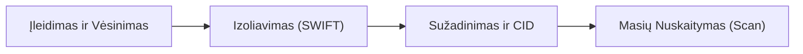
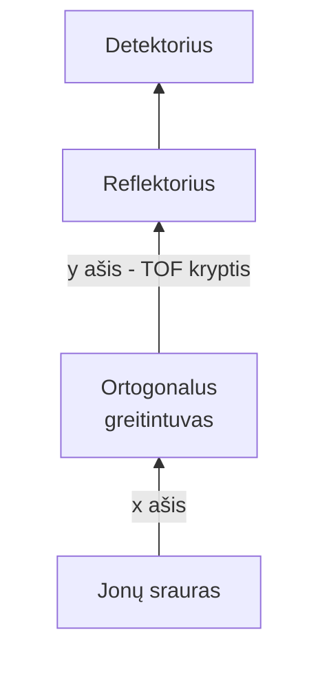

# Įvadas

# Jonizacijos būdai

## Elektronų jonizacija

Elektronų jonizacija (angl. *Electron Ionization*, EI) – istoriškai pirmasis, plačiausiai ištirtas ir iki šiol išliekantis vienas svarbiausių organinių junginių jonizacijos metodų masių spektrometrijoje. EI yra vadinamas „kietuoju“ jonizacijos metodu, nes jo metu tiriamoms molekulėms perduodamas didelis energijos perteklius, sukeliantis intensyvią molekulinių jonų fragmentaciją. Nors intensyvus skilimas kartais apsunkina molekulinės masės nustatymą, gaunami fragmentiniai spektrai suteikia neįkainojamos informacijos apie molekulės struktūrą, funkcines grupes bei konstituciją.

Didžiulis EI privalumas yra nepaprastai geras spektrų atkuriamumas. Kadangi jonizacijos sąlygos visame pasaulyje yra standartizuotos, gauti masių spektrai gali būti tiesiogiai lyginami su komercinėmis spektrų bibliotekomis (pavyzdžiui, NIST ar Wiley duomenų bazėmis) nežinomų medžiagų identifikavimui, o tai pavertė EI neatsiejamu dujų chromatografijos-masių spektrometrijos (DCh-MS) sistemų partneriu.


#### Jonizacijos šaltinio sandara ir fizikiniai principai

Elektronų jonizacijos šaltinis yra kruopščiai suprojektuotas elektrostatinis įrenginys, veikiantis gilaus vakuumo aplinkoje. Šaltinio veikimas remiasi termoelektronine emisija ir tiksliu susidariusių jonų pluošto fokusavimu.


Jonizacijos šaltinį sudaro šie pagrindiniai komponentai:

1.  **Kaitinimo siūlas (filamentas):** Pagamintas iš ugniai atsparaus metalo (dažniausiai volframo arba renio). Per siūlą leidžiama elektros srovė jį įkaitina iki aukštos temperatūros, sukeldama termoelektroninę emisiją – laisvųjų elektronų išlaisvinimą iš metalo paviršiaus.
2.  **Elektronų gaudyklė (anodas, angl. *trap/collector*):** Įrengta priešingoje jonizacijos kameros pusėje nei kaitinimo siūlas. Palaikant teigiamą potencialą, elektronai yra greitinami per kamerą link gaudyklės, suformuojant pastovų ir homogenišką skersinį elektronų pluoštą.
3.  **Stūmiklis (repeleris):** Jonizacijos kameros gale sumontuotas elektrodas, kuriame palaikomas nedidelis teigiamas potencialas (teigiamų jonų registravimo režime). Jo paskirtis – elektriniu lauku stumti naujai susidariusius teigiamus jonus link išėjimo angos.
4.  **Fokusavimo ir greitinimo lęšiai:** Elektrodų sistema, esanti už jonizacijos kameros ribų. Šie lęšiai suformuoja siaurą, gerai sufokusuotą jonų pluoštelį, suteikia jiems reikiamą kinetinę energiją (greitina) ir nukreipia juos į masių analizatorių.


Būtina EI šaltinio veikimo sąlyga – aukštas vakuumas, paprastai palaikomas maždaug $10^{-4}\text{ Pa}$ (apie $10^{-6}\text{ mbar}$) lygmenyje. Tai reikalinga siekiant užtikrinti, kad vidutinis laisvasis dalelių kelio ilgis viršytų jonizacijos šaltinio geometrinius matmenis. Esant tokioms sąlygoms, dujų fazė yra labai praskiesta, o tai praktiškai eliminuoja nepageidaujamus bimolekulinius susidūrimus (jonų ir neutralių molekulių reakcijas) per visą jonų gyvavimo trukmę. Visi jonizacijos ir vėlesni fragmentacijos procesai vyksta griežtai unimolekuliniame režime.


##### Jonizacijos mechanizmas

Pirminis EI procesas prasideda, kai didelės kinetinės energijos elektronas praskrieja arti dujinės neutralios molekulės ($M$). Sąveikos metu įvyksta energijos perdavimas. Jei perduodama energija viršija molekulės jonizacijos energiją (IE), iš neutralios molekulės išmušamas elektronas, sugeneruojant teigiamą radikalą-katijoną, vadinamą **molekuliniu jonu** ($M^{+\bullet}$):

$$M + e^- \rightarrow M^{+\bullet} + 2e^-$$


#### Krūvio lokalizacija susidarant molekuliniam jonui

Susidarant molekuliniam jonui ($(M^{+\bullet}$)), krūvio lokalizacijos klausimas masių spektrometrijoje yra nagrinėjamas dviem lygmenimis: kaip **formali darbinė hipotezė**, padedanti interpretuoti spektrus, ir kaip **reali fizikinė (kvantcheminė) būsena**. 

##### Formali krūvio lokalizacija (reakcijų mechanizmų aiškinimui)
Interpretuojant masių spektrus ir aiškinant fragmentacijos mechanizmus, yra priimta laikyti, kad netekti elektrono ir įgyti teigiamą krūvį (bei tapti radikalu) labiausiai linkusios tam tikros molekulės orbitalės. Ši tikimybė tiesiogiai atsispindi junginių jonizacijos energijos (IE) vertėse ir priklauso nuo elektronų prigimties:

*   **Laisvosios elektronų poros ($n$-elektronai):** Tai yra energetiškai palankiausia vieta pašalinti elektroną. Molekulėse, turinčiose heteroatomų (pavyzdžiui, $(\text{O}$), $(\text{N}$), $(\text{S}$), $(\text{Se}$)), elektronas lengviausiai išmušamas būtent iš neviriųjų orbitalių, nes šie elektronai yra silpniausiai susieti su branduoliu. Dėl šios priežasties junginių, turinčių funkcinių grupių su heteroatomais, IE yra žymiai mažesnė nei atitinkamų alkanų.
*   **$(\pi$)-ryšiai (dvigubieji, trigubieji ryšiai, aromatinės sistemos):** Jei molekulėje nėra heteroatomų, bet yra neprisotintų ryšių, krūvis formaliai lokalizuojamas $(\pi$)-orbitalėje. $(\pi$)-elektronai yra lengviau pasiekiami nei $(\sigma$)-elektronai, todėl, pavyzdžiui, eteno IE yra mažesnė nei etano. Žemiausios jonizacijos energijos pasiekiamos tada, kai molekulėje derinami $(\pi$)-ryšiai ir heteroatomai (pavyzdžiui, konjuguotose sistemose).
*   **$(\sigma$)-ryšiai (paprastieji ryšiai):** Alkanuose, neturinčiuose nei funkcinių grupių, nei dvigubųjų jungčių, elektronas pašalinamas iš paprastojo $(\sigma$)-ryšio. Tai yra energetiškai nepalankiausia būsena, todėl sočiųjų angliavandenilių jonizacijos energija yra didžiausia.

Ši hierarchinė seka ($(\boldsymbol{n > \pi > \sigma}$)) leidžia tyrėjams sudaryti fragmentacijos schemas, darant prielaidą, kad teigiamas krūvis yra sutelktas ant konkretaus heteroatomo arba jungties (tai vadinama **krūvio lokalizacijos koncepcija**). Tai padeda logiškai paaiškinti vėlesnius skilimus, tokius kaip $(\alpha$)-skilimas ar persigrupavimai, kuriuos inicijuoja radikalinis centras.

##### Reali krūvio delokalizacija (fizikinė tikrovė)
Nors formali krūvio lokalizacija yra puikus įrankis spektrams interpretuoti, kvantinės mechanikos skaičiavimai rodo, kad **realiame molekuliniame jone krūvis niekada nebūna visiškai sutelktas vienoje orbitalėje ar ant vieno atomo**. Pašalinus elektroną, krūvis ir nesuporuotas elektronas **delokalizuojasi** per visą jono karkasą, siekiant energetiškai stabilizuoti sistemą (pavyzdžiui, per hiperkonjugaciją arba rezonansą). 

Šią realią delokalizaciją iliustruoja šie literatūroje pateikiami pavyzdžiai:

*   **Pirolo molekulinis jonas:** Nors azotas yra heteroatomas ir formaliai turėtų išlaikyti teigiamą krūvį, skaičiavimai rodo, kad ant azoto atomo realiai koncentruojasi **tik apie 5%** teigiamo krūvio. Tuo tarpu du gretimi anglies atomai turi po maždaug 20% krūvio, o likusi dalis beveik tolygiai (po ~10%) pasiskirsto ant penkių vandenilio atomų. Tai prieštarauja elektroneigiamumo dėsniams, teigiantiems, kad teigiamas krūvis neturėtų koncentruotis ant elektroneigiamiausio atomo.

*   **Tolilo katijonas ($([C_7H_7]^+$)):** Kvantinės chemijos skaičiavimai rodo, už žiedo esančios anglies satomo, koncentruojasi **tik apie 36%** teigiamo krūvio, o likęs krūvis yra delokalizuotas per visą žiedą, kartu pakeisdamas ir jono geometrinę simetriją, palyginti su neutralia molekule.


##### Fragmentacijos priklausomybė nuo elektronų energijos

Elektronų jonizacijos metu perduodamos energijos kiekis tiesiogiai lemia spektrų išvaizdą, fragmentų gausą bei tyrimo jautrumą.

Kad įvyktų jonizacija, pirminių elektronų energija privalo būti lygi arba didesnė už tiriamo junginio **jonizacijos energiją (IE)**. Daugumos organinių molekulių IE reikšmės svyruoja tarp $7\text{ ir }15\text{ eV}$.

*   **Žemos energijos režimas (apie 10–15 eV):** Kai elektronų energija viršija IE tik labai nedaug, sugeneruoti molekuliniai jonai gauna labai mažą perteklinę virpesių energiją, kuri neviršija jokių fragmentacijos reakcijų **atsiradimo energijos (AE)**. Tokiu atveju unimolekulinis skilimas nevyksta arba yra minimalus, o spektre registruojamai  didesnės masės jonai bei  pats molekulinis jonas ($M^{+\bullet}$). Tai gali būti naudinga nustatant nežinomų medžiagų molekulinę masę, tačiau šio režimo trūkumas yra drastiškai sumažėjęs bendras jonizacijos efektyvumas (suprastėjęs jautrumas).
*   **Energijos didinimas:** Didėjant pirminių elektronų energijai, jonizacijos tikimybė auga, o molekuliniams jonams perduodamos energijos pasiskirstymas $P(E)$ pasislenka link didesnių reikšmių. Dėl to sužadinti jonai lengvai įveikia aktyvacijos barjerus ir intensyviai skyla į mažesnės masės fragmentus.

Visame pasaulyje standartu priimta registruoti EI spektrus esant būtent **$70\text{ eV}$ elektronų energijai**. Tokį pasirinkimą lemia fundamentalios fizikinės priežastys, kurias iliustruoja jonizacijos skerspjūvio kreivė:

1.  Maždaug ties $70\text{ eV}$ jonizacijos efektyvaus skerspjūvio kreivė (jonizacijos efektyvumas) pasiekia savo maksimumą. Šioje srityje nedideli prietaiso elektronų energijos svyravimai (pavyzdžiui, tarp $60\text{ ir }80\text{ eV}$) neturi jokios pastebimos įtakos spektrų intensyvumui ar fragmentacijai. Tai garantuoja puikų spektrų atkuriamumą.
2.  **Universali jonizacija:** Esant $70\text{ eV}$ sėkmingai jonizuojasi visos organinės ir neorganinės molekulės, įskaitant nešančiąsias chromatografijos dujas (helį, kurio $\text{IE} = 24.6\text{ eV}$).
3.  **Bibliotekų suderinamumas:** Standartizacija užtikrina, kad skirtingų gamintojų ir skirtingų modelių masių spektrometrais gauti spektrai yra identiški, todėl juos galima patikimai lyginti duomenų bazėse.


##### Pagrindiniai fragmentacijos reakcijų tipai

Po pirminio elektronų smūgio sugeneruotas molekulinis radikalas-katijonas ($M^{+\bullet}$) yra izoliuotas dujų fazėje. Jis negali išsklaidyti virpesių energijos susidūrimų metu, todėl stabilizuojasi skildamas unimolekuliniu būdu. 

Svarbiausias masių spektrometrijos principas teigia, kad **kiekvieno unimolekulinio skilimo žingsnio metu iš vieno pradinio jono visada susidaro viena krūvį turinti dalelė (jonas) ir viena krūvio neturinti (neutrali) dalelė**. Masių spektrometre galima užregistruoti tik krūvį turinčios daleles; neutralūs fragmentai yra pašalinami vakuumo sistemų ir lieka nepastebėti.


Atsižvelgiant į susidariusių dalelių prigimtį, unimolekuliniai skilimai EI sąlygomis skirstomi į tris pagrindines klases:

###### Homolizinis skilimas (tiesioginis ryšio nutraukimas)
Šio skilimo metu nutrūksta viena kovalentinė jungtis. Kadangi pradinis radikalas-katijonas turi nelyginį elektronų skaičių, homolizinio skilimo metu susidaro lyginio elektronų skaičiaus katijonas ($m^+$) ir neutralus radikalas ($n^\bullet$):

$$M^{+\bullet} \rightarrow m^+ + n^\bullet$$

Šioms reakcijoms reikalinga palyginti didelė aktyvacijos energija, tačiau jos pasižymi dideliu greičiu, todėl vyrauja esant didelėms sužadinimo energijoms.

###### Persigrupavimai
Persigrupavimo reakcijų metu vyksta naujų jungčių susidarymas ir atomų (dažniausiai vandenilio) migracija erdvėje prieš unimolekulinį skilimą. Šio proceso metu iš radikalo-katijono susidaro naujas radikalas-katijonas ($m^{+\bullet}$) ir neutrali stabili molekulė ($n$):

$$M^{+\bullet} \rightarrow m^{+\bullet} + n$$

Persigrupavimo reakcijos reikalauja specifinės erdvinės konformacijos („griežtos“ pereinamosios būsenos), todėl jos vyksta lėčiau nei paprastas ryšio nutraukimas, tačiau pasižymi žema aktyvacijos energija. Dėl šios priežasties jos dominuoja esant žemesnėms vidinėms jonų energijoms.

*   **Pavyzdžiai ir iššūkiai:** Klasikiniai persigrupavimo procesai leidžia paaiškinti sistemingą mažų stabilių molekulių, tokių kaip vandens ($H_2O$, neutralus praradimas $18\text{ Da}$) ar amoniako ($NH_3$, neutralus praradimas $17\text{ Da}$), atskilimą iš alkoholių ir aminų radikalų-katijonų. Šie procesai dažnai vyksta taip lengvai, kad molekulinio jono smailė visiškai išnyksta iš spektro, o tai labai apsunkina tiriamo junginio molekulinės masės nustatymą.


###### Antrinė fragmentacija
Pirminiai fragmentiniai jonai, jei jie vis dar turi pakankamai vidinės sužadinimo energijos, gali skiltis toliau. Remiantis **lyginio skaičiaus elektronų taisykle** (angl. *Even-Electron Rule*), lyginio elektronų skaičiaus jonai dažniausiai skyla suformuodami kitus lyginio elektronų skaičiaus jonus ir eliminuodami neutralią stabilią molekulę:

$$m_1^+ \rightarrow m_2^+ + n$$

Skilimas iš lyginio elektronų skaičiaus jono į nelyginio elektronų skaičiaus joną su radikalo eliminacija ($m_1^+ \rightarrow m_2^{+\bullet} + n^\bullet$) yra energetiškai nepalankus ir EI spektruose stebimas itin retai.


### Neigiama elektronų jonizacija

Nors klasikinė EI yra pritaikyta teigiamų jonų registravimui, pakeitus elektrinių laukų poliškumą galima registruoti neigiamus jonus. Tačiau įprastomis $70\text{ eV}$ EI sąlygomis neigiamų jonų susidarymas yra nepaprastai neefektyvus. Taip yra todėl, kad elektronų pagavimas yra rezonansinis procesas, o greiti $70\text{ eV}$ elektronai perneša per daug kinetinės energijos, todėl molekulės nesugeba jų sulaikyti.

Siekant sukurti neigiamus jonus, į jonizacijos šaltinį įleidžiamos buferinės (arba reagentinės) dujos, pavyzdžiui, metanas ($\text{CH}_4$) arba izobutanas ($i\text{-C}_4\text{H}_{10}$). Šios dujos veikia kaip **moderatorius**. Pirminiai greiti elektronai, emituoti iš filamento, patiria daugybinius elastinius ir neelastinius susidūrimus su buferinių dujų molekulėmis ir praranda savo kinetinę energiją. Šio proceso metu elektronai sulėtinami iki vadinamųjų **terminių elektronų**, kurių energija siekia vos $0–2\text{ eV}$. Šis metodas vadinamas **elektronų pagavimo neigiamąja jonizacija** (angl. *Electron Capture Negative Ionization*, **ECNI**).


#### Elektronų pagavimo neigiamosios jonizacijos (ECNI) mechanizmai

ECNI metu termizuoti elektronai yra tiesiogiai prijungiami prie analitės molekulės. Atsižvelgiant į elektronų energiją ir molekulės savybes, išskiriami trys ECNI mechanizmai:

##### Rezonansinis elektronų pagavimas (angl. *Resonance Electron Capture*)
Vyksta esant labai žemoms elektronų energijoms ($0–2\text{ eV}$). Tiriamoji molekulė tiesiogiai sugeria elektroną, suformuodama sužadintą molekulinį radikalą-anijoną ($M^{-\bullet}$):

$$M + e^- \rightarrow M^{-\bullet}$$

Šiam procesui reikalingas teigiamas tiriamo junginio giminingumas elektronui (angl. *electron affinity*, EA).

##### Disociatyvus elektronų pagavimas (angl. *Dissociative Electron Capture*)
Vyksta platesniame elektronų energijų diapazone ($0–15\text{ eV}$). Pagautas elektronas sukelia momentinį ryšio suirimą (heterolizę), tiesiogiai suformuodamas lyginio elektronų skaičiaus anijoną ir neutralų radikalą:

$$M + e^- \rightarrow [M - A]^- + A^\bullet$$

##### Jonų porų susidarymas (angl. *Ion-pair Formation*)
Šis procesas vyksta prie didesnių energijų (paprastai $> 10\text{ eV}$). Elektronas nėra sugaunamas, tačiau jo smūgis sukelia molekulės skilimą į teigiamą ir neigiamą jonus:

$$M + e^- \rightarrow [M - B]^- + B^+ + e^-$$

#### ECNI pritaikymas ir analitinė vertė

ECNI pasižymi **išskirtiniu jautrumu ir selektyvumu** junginiams, turintiems stipriai elektroneigiamų atomų (ypač fluoro, chloro, bromo) arba nitro grupių, kadangi šie elementai drastiškai padidina molekulės giminingumą elektronui. Šis metodas yra plačiai taikomas aplinkosaugos ir maisto saugos tyrimuose halogenintų teršalų (pavyzdžiui, dioksinų, polichlorintų bifenilų - PCB, halogenintų pesticidų) bei sprogstamųjų medžiagų analizei pėdsakiniuose kiekiuose.

## Cheminė jonizacija

Cheminė jonizacija (angl. *Chemical Ionization*, CI) yra vienas iš fundamentalių „švelniosios“ jonizacijos metodų masių spektrometrijoje. Skirtingai nuo elektronų jonizacijos (EI), kurios metu neutralios molekulės patiria tiesioginį energingų pirminių elektronų smūgį, sukeliančių stiprią fragmentaciją, cheminė jonizacija remiasi bimolekulinėmis reakcijomis dujų fazėje. 

Šio metodo esmė – kontroliuojamas krūvio (protono, elektronų ar kitų jonų) pernešimas tarp iš anksto sugeneruotų reagentinių jonų ir neutralių analitės molekulių. Kadangi jonizacijos proceso metu perduodamas gerokai mažesnis energijos perteklius, analitės molekulė yra išsaugoma sveika (dažniausiai gaunami lyginio elektronų skaičiaus jonai $[M+H]^+$ arba adductai). Tai leidžia lengvai ir patikimai nustatyti tiriamo junginio molekulinę masę, o tai yra kritiškai svarbu struktūros nustatymui ir mišinių analizei.


#### Jonizacijos šaltinio sandara ir veikimo fizikiniai principai

Cheminės jonizacijos šaltinio konstrukcija yra glaudžiai susijusi su EI šaltiniu, tačiau pritaikyta palaikyti iš esmės skirtingą darbinį režimą. Pagrindinis CI šaltinio bruožas yra gebėjimas palaikyti didelį reagentinių dujų slėgį pačioje jonizacijos kameroje.


Sėkmingam bimolekulinių reakcijų vyksmui reikalingas didelis jonų ir molekulių susidūrimų dažnis. Tai pasiekiama padidinant dalinį reagentinių dujų slėgį jonizacijos šaltinio viduje iki maždaug $10^2\text{ Pa}$ (apie $1\text{ mbar}$), kas yra $10^3–10^4$ kartų daugiau nei EI sąlygomis. Esant tokiam slėgiui, neutralios analitės molekulė per savo buvimo šaltinyje laiką (kelias mikrosekundes) patiria nuo 30 iki 70 susidūrimų.

Didžiulis reagentinių dujų perteklius atlieka dar vieną svarbią funkciją: jis tarytum „skydas“ apsaugo tiriamojo pavyzdžio molekules nuo tiesioginės elektronų jonizacijos, nes tikimybė, kad pirminis elektronas susidurs su analite, o ne su reagentu, tampa nykstamai maža.

Siekant išlaikyti tokį aukštą slėgį neišvengiant per didelio dujų nuotėkio į masių spektrometro korpusą, naudojami šie konstrukciniai sprendimai:
1.  **Uždara jonizacijos kamera:** Į šaltinio tūrį įmontuojamas papildomas cilindras, turintis labai mažas angas emituojamiems elektronams įskrieti ir suformuotam jonų pluoštui išeiti.
2.  **Galinga vakuumo sistema:** Kadangi dalis dujų nuolat veržiasi pro minėtas mikroangas, prietaiso išorinio korpuso siurbimui naudojami didelio našumo turbomolekuliniai siurbliai (ne mažesnio kaip $200\text{ l/s}$ našumo), leidžiantys išlaikyti stabilų darbinį vakuumą analizatoriuje.
3.  **Pirminių elektronų energijos padidinimas:** Kadangi didelis reagentinių dujų tankis stipriai slopina iš kaitinimo siūlo skriejančių elektronų srautą, pirminių elektronų energija paprastai padidinama iki $200–600\text{ eV}$ (palyginti su $70\text{ eV}$ standartu EI), kad jie galėtų giliau prasiskverbti į kameros vidų ir sugeneruoti pirminius reagento jonus.


#### Reagentinių dujų vaidmuo ir plazmos susidarymas

Jonizacijos procesas CI šaltinyje prasideda nuo pirminių reagentinių dujų molekulių elektronų jonizacijos, po kurios seka greitos grandininės bimolekulinės reakcijos, sukuriančios pastovią jonų, radikalų bei laisvųjų elektronų sistemą – vadinamąją **reagentinių dujų plazmą**. 

Priklausomai nuo pasirinktų dujų prigimties, gaunami skirtingos jonizacijos galios reagentiniai jonai. Labiausiai paplitusios trys reagentinių dujų sistemos.

##### Metanas ($CH_4$)
Veikiant energingiems pirminiams elektronams, metano molekulės iš pradžių jonizuojasi EI būdu, suformuodamos įvairius teigiamus jonus bei radikalus:

$$CH_4 + e^- \rightarrow CH_4^{+\bullet}, CH_3^+, CH_2^{+\bullet}, CH^+, C^{+\bullet}, H_2^{+\bullet}, H^+ + 2e^-$$

Dėl didelio slėgio susidarę nestabilūs jonai akimirksniu reaguoja su neutraliomis metano molekulėmis. Svarbiausia reakcija yra susijusi su protonuoto metano jono $CH_5^+$ ir etilo katijono $C_2H_5^+$ susidarymu:

$$CH_4^{+\bullet} + CH_4 \rightarrow CH_5^+ + CH_3^\bullet$$

$$CH_3^+ + CH_4 \rightarrow [C_2H_7^+] \rightarrow C_2H_5^+ + H_2$$

Taip pat nedideliais kiekiais susidaro alilo katijonas $C_3H_5^+$:

$$C_2H_3^+ + CH_4 \rightarrow C_3H_5^+ + H_2$$

Dėl šių reakcijų, pasiekus slėgio plato sritį virš $100\text{ Pa}$, metano plazmoje dominuoja trys pagrindiniai jonai: $CH_5^+$ ($m/z\ 17$), $C_2H_5^+$ ($m/z\ 29$) ir $C_3H_5^+$ ($m/z\ 41$).

##### Izobutanas ($i-C_4H_{10}$)
Izobutano jonizacijos metu pagrindinis bimolekulinių reakcijų produktas yra labai stabilus tret-butilo katijonas $t-C_4H_9^+$ ($m/z\ 57$):

$$i-C_4H_{10} + e^- \rightarrow i-C_4H_{10}^{+\bullet} + 2e^-$$

$$i-C_4H_{10}^{+\bullet} + i-C_4H_{10} \rightarrow t-C_4H_9^+ + C_4H_9^\bullet + H_2$$

Šis jonas yra puikus ir švelnus protonų donoras daugumai organinių medžiagų.

##### Amoniakas ($NH_3$)
Amoniako plazma pasižymi dideliu poliškumu ir stipriu polinkiu sudaryti klasterinius (asociatyvinius) jonus. Pagrindiniai reagento jonai yra amonio katijonas $NH_4^+$ ($m/z\ 18$) bei jo solvatacijos produktai:

$$NH_3 + e^- \rightarrow NH_3^{+\bullet} + 2e^-$$

$$NH_3^{+\bullet} + NH_3 \rightarrow NH_4^+ + NH_2^\bullet$$

$$NH_4^+ + nNH_3 \rightarrow [(NH_3)_n + H]^+$$

Amoniako plazmoje gausiai registruojami klasteriai $[NH_4]^+$, $[NH_4 + NH_3]^+$ ($m/z\ 35$) bei $[NH_4 + 2NH_3]^+$ ($m/z\ 52$).

### Teigiamų jonų cheminė jonizacija (PICI)

Teigiamų jonų cheminėje jonizacijoje (angl. *Positive-Ion Chemical Ionization*, PICI) neutrali analitės molekulė ($M$) paverčiama teigiamu jonu vykstant vienam iš keturių pagrindinių reakcijos kelių.

##### 1. Protonų pernešimas (Proton Transfer)
Tai yra svarbiausias ir dažniausiai pasitaikantis PICI kelias, kurio metu reagento jonas veikia kaip Brønstedo rūgštis:

$$M + [BH]^+ \rightarrow [M+H]^+ + B$$

Protonavimo reakcija vyksta ekotermiškai tik tada, kai analitės protonų giminingumas (angl. *proton affinity*, $PA$) yra didesnis nei neutralios reagentinių dujų molekulės $B$ protonų giminingumas:

$$PA(M) > PA(B)$$

Išsiskirianti reakcijos šiluma ($\Delta H$) išsisklaido po sugeneruoto $[M+H]^+$ jono vidinius laisvės laipsnius. Šį energijos perteklių galima įvertinti:

$$E_{int}([M+H]^+) \approx PA(M) - PA(B)$$

Priklausomai nuo $\Delta PA$ vertės, galima valdyti jonizacijos „švelnumą“:
*   Naudojant **metaną** ($PA = 552\text{ kJ/mol}$), skirtumas $\Delta PA$ su analitėmis yra palyginti didelis ($1–4\text{ eV}$), todėl protonavimas vyksta gana energingai, sukeldamas nedidelę fragmentaciją (pavyzdžiui, vandens ar funkcinių grupių atskilimą).
*   Naudojant **izobutaną** ($PA = 820\text{ kJ/mol}$) arba **amoniaką** ($PA = 854\text{ kJ/mol}$), jonizacija yra itin švelni, nes perteklinė energija minimali. Spektruose stebimas beveik išskirtinai tik sveikas molekulinis jonas $[M+H]^+$.

##### 2. Elektrofilinis prisijungimas (Electrophilic Addition)
Jei analitės molekulė neturi pakankamo protonų giminingumo, kad įvyktų tiesioginis protono pernešimas, reagento jonas gali tiesiogiai prisijungti prie jos, sudarydamas aduktą:

$$M + X^+ \rightarrow [M+X]^+$$

Šis procesas itin būdingas amoniako reagentinėms dujoms, kur gausiai formuojasi amonio aduktai $[M+NH_4]^+$ ($[M+18]$):

$$M + NH_4^+ \rightarrow [M+NH_4]^+$$

Naudojant metaną, spektruose dažnai stebimos nedidelio intensyvumo etilo $[M+C_2H_5]^+$ ($[M+29]$) bei alilo $[M+C_3H_5]^+$ ($[M+41]$) aduktų smailės, kurios padeda papildomai patvirtinti molekulinę masę.

##### 3. Anijonų (hidrido) atplėšimas (Anion Abstraction)
Kai kuriais atvejais energetiškai palankiau yra ne prijungti krūvį turinčią dalelę, o atplėšti neigiamą joną iš analitės molekulės. Dažniausias pavyzdys yra hidrido ($H^-$) atplėšimas:

$$M + X^+ \rightarrow [M-H]^+ + HX$$

Šis procesas yra itin būdingas alifatiniams alkoholiams, karboksirūgštims bei sotiesiems angliavandeniliams. Pavyzdžiui, pirminiai alifatiniai alkoholiai PICI spektruose dažniau suformuoja ryškų $[M-H]^+$ signalą ($[M-1]$) negu $[M+H]^+$.

##### 4. Krūvio pernešimas (Charge Transfer, CT)
Krūvio (arba elektronų) pernešimo metu neutrali analitė netenka elektrono ir paverčiama radikalu-katijonu $M^{+\bullet}$ (panašiai kaip EI metu, tačiau procesas vyksta bimolekuliniu būdu):

$$M + X^{+\bullet} \rightarrow M^{+\bullet} + X$$

Šis kelias realizuojamas naudojant tokias reagentines dujas, kurios neturi mobilių protonų, pavyzdžiui, benzeną ($C_6H_6$), chlorobenzeną ($C_6H_5Cl$), anglies disulfidą ($CS_2$) arba inertines dujas (ksenoną, argoną). 

Sąlyga šiai reakcijai įvykti – reagento jono rekombinacijos energija ($RE$) turi būti didesnė už analitės jonizacijos energiją ($IE$):

$$RE(X^{+\bullet}) \ge IE(M)$$

Krūvio pernešimo metodas (CTCI) leidžia reguliuoti fragmentacijos laipsnį parenkant reagentą su tinkama $RE$ verte. Kadangi gaunami $M^{+\bullet}$ jonai pasižymi žymiai siauresniu energijos pasiskirstymu nei EI metu, fragmentacija yra gerokai švelnesnė, o jautrumas dažnai viršija žemos energijos EI spektroskopiją. CTCI taip pat sėkmingai naudojama selektyviam tam tikrų klasių junginių (pavyzdžiui, aromatinių angliavandenilių mišiniuose) jonizavimui.


### Neigiamų jonų cheminė jonizacija (NICI)

Jei masių spektrometro ekstrahavimo lęšių potencialai nustatomi neigiamų jonų registravimui, iš šaltinio ištraukiami ir analizuojami neigiamieji jonai. Šis metodas vadinamas neigiamų jonų chemine jonizacija (angl. *Negative-Ion Chemical Ionization*, NICI).

NICI metu net neutralios analitės molekulės paverčiamos anijonais, vykstant specifinėms reakcijoms su plazmoje esančiais neigiamais jonais.

##### NICI reakcijų mechanizmai

Neigiami reagento jonai (pavyzdžiui, $OH^-$, susidarantis drėgnoje metano plazmoje, arba halogenidų anijonai) gali reaguoti su analite trimis pagrindiniais keliais:

###### 1. Deprotonacija (protono atplėšimas)
Stiprios bazės (reagento anijono $B^-$) ir rūgštinių savybių turinčios analitės molekulės sąveika sukelia protono perėjimą link reagento, sugeneruojant deprotonuotą analitės anijoną $[M-H]^-$:

$$M + B^- \rightarrow [M-H]^- + BH$$

Ši reakcija yra labai efektyvi tiriant karboksirūgštis, fenolius, aminus bei kitus junginius su judriais vandenilio atomais.

###### 2. Nukleofilinis (anijono) prisijungimas
Reagento anijonas ($A^-$) gali prisijungti prie analitės molekulės kaip nukleofilas, sudarydamas stabilų aduktą $[M+A]^-$:

$$M + A^- \rightarrow [M+A]^-$$

Geras šio proceso pavyzdys yra halogenidų (pavyzdžiui, $Cl^-$) arba deguonies anijonų prisijungimas prie mažo poliškumo arba elektroneigiamų analičių.

###### 3. Jonų porų susidarymas
Vyksta sąveikoje su vidutinės energijos elektronais, kai molekulė susilaiko ir skyla į teigiamo ir neigiamo krūvio fragmentų porą:

$$M + e^- \rightarrow [M-B]^- + B^+ + e^-$$

Šis procesas yra energetiškai mažiau palankus ir NICI spektruose pasitaiko rečiau.


##### Sąsaja su elektronų pagavimo neigiamąja jonizacija (ECNI)

Nors literatūroje terminai NICI ir ECNI (angl. *Electron Capture Negative Ionization*) dažnai naudojami kartu arba net klaidingai tapatinami, fizikiniu požiūriu tai yra du skirtingi procesai, vykstantys tame pačiame jonizacijos šaltinyje.

###### Reagentinių dujų kaip moderatoriaus vaidmuo

ECNI atveju reagentinės (buferinės) dujos, tokios kaip metanas arba izobutanas, nedalyvauja cheminėse reakcijose ir neperduoda jokio krūvio analitei. Jų vienintelė funkcija yra **elektronų moderavimas (sulėtinimas)**.

Greiti pirminiai elektronai, emituoti iš filamento, patiria nesuskaičiuojamą kiekį tampriųjų ir netampriųjų susidūrimų su dideliu kiekiu neutralių buferinių dujų molekulių. Šio proceso metu pirminiai elektronai praranda savo kinetinę energiją ir tampa **terminiais elektronais**, kurių energija svyruoja tarp $0\text{ ir }2\text{ eV}$. 

Tuo tarpu analitės molekulės, pasižyminčios dideliu giminingumu elektronui (turinčios halogenų atomų, nitro grupių ar konjuguotų $\pi$ sistemų), lengvai „sugauna“ šiuos lėtus elektronus, suformuodamos radikalus-anijonus $M^{-\bullet}$ (rezonansinis pagavimas) arba patirdamos disociatyvų pagavimą:

$$M + e^-_{terminis} \rightarrow M^{-\bullet}$$

$$M + e^-_{terminis} \rightarrow [M-A]^- + A^\bullet$$

###### Praktinė NICI ir ECNI sąveika

Dėl identiškų aparatūros sąlygų (aukštas buferinių dujų slėgis, tas pats šaltinis, neigiamas potencialų režimas), realiame eksperimente NICI (cheminės reakcijos su reagento anijonais) ir ECNI (lėtųjų elektronų pagavimas) vyksta **kartu ir konkuruoja tarpusavyje**. 

Gautų spektrų išvaizda, jautrumas bei selektyvumas stipriai priklauso nuo temperatūros, dujų prigimties, šaltinio švarumo ir pačios analitės savybių. Šių dviejų metodų integracija suteikia masių spektrometrijai neprilygstamą jautrumą (siekiantį net femtogramų ribas) nustatant halogenintus aplinkos teršalus (dioksinus, chlorintus bifenilus) bei vaistinius metabolitus biologinėse terpėse.


## Elektroišpurškimo jonizacija


Elektroišpurškimo jonizacija (angl. *Electrospray Ionization*, ESI) – vienas revoliucingiausių „švelniosios“ jonizacijos metodų, leisdamas pervesti dideles, nelakias ir termolabilias (karščiui jautrias) polines molekules iš skystosios fazės į dujinę fazę jonų pavidalu. Už šio metodo sukūrimą ir pritaikymą makromolekulių analizei Johnas Fennas 2002 m. buvo įvertintas Nobelio chemijos premija. 

Skirtingai nuo kietosios elektronų jonizacijos (EI), ESI metu tiriamoms medžiagoms perduodamas minimalus vidinės energijos kiekis, todėl praktiškai nevyksta kovalentinių ryšių fragmentacija, o masių spektruose dominuoja sveiki, nesuskilę molekuliniai jonai (aduktai). Be to, šis metodas pasižymi unikalia savybe suformuoti daugiavalenčius (daugiaužtaisius) jonus, kas iš esmės pakeitė masių spektrometrijos galimybes tiriant stambias biologines makromolekules.


### ESI šaltinio konstrukciniai principai

Elektroišpurškimo jonizacijos šaltinis yra elektrostatiniu ir hidrodinaminiu principu veikiantis įrenginys, atliekantis skysto pavyzdžio srauto purškimą, desolvataciją (tirpiklio pašalinimą) ir susidariusių jonų nukreipimą į aukšto vakuumo masės analizatoriaus sritį.


1.  **Purškimo kapiliaras:** Siauras metalinis (arba metalizuotas kvarcinis) kapiliaras, į kurį pastoviu srautu (dažniausiai 1–20 $\mu\text{l/min}$ grynos ESI atveju) tiekiamas analitės tirpalas. Kapiliarui suteikiamas aukštas elektrinis potencialas (paprastai 3–5 kV teigiamų jonų režime) priešingoje pusėje esančio priešpriešinio elektrodo (pavyzdžiui, įėjimo angos plokštelės) atžvilgiu.
2.  **Teiloro kūgis (angl. *Taylor cone*) ir srautas:** Dėl itin stipraus elektrinio lauko (siekančio maždaug $10^6\text{ V/m}$) kapiliaro gale vyksta elektrolito krūvių atsiskyrimas. Skysčio meniskas deformuojasi į smailią kūginę formą – Teiloro kūgį. Pasiekus elektrinio lauko stiprio ribą, iš Teiloro kūgio viršūnės iššaunama plona skysčio srovė, kuri netrukus suyra į mikrometrinio dydžio, teigiamai įkrautus lašelius.
3.  **Pneumatinis asistavimas (angl. *pneumatically-assisted ESI* arba *ion spray*):** Kadangi grynas ESI purškimas yra jautrus tirpiklio paviršiaus įtempimui ir tinka tik mažiems srautams, moderniuose šaltiniuose aplink purškimo kapiliarą koncentriškai leidžiamas didelio greičio inertinių dujų (dažniausiai azoto, $N_2$) srautas – vadinamosios **nebulizatoriaus dujos (angl. *sheath gas*)**. Tai leidžia efektyviai purkšti skysčius esant didesniems srautams (10–200 $\mu\text{l/min}$ ir daugiau), o tai yra būtina tiesioginiam skysčių chromatografijos (LC-MS) sistemų prijungimui.
4.  **Tirpiklio garinimas (desolvatacija):** Susidarę lašeliai keliauja per atmosferinio slėgio kamerą link analizatoriaus įėjimo. Tirpiklio garavimą skatina šildomas priešpriešinis dujų srautas (angl. *drying/curtain gas*, azotas) arba šildomas pernešimo kapiliaras (paprastai įkaitintas iki 150–350 °C). Garuojant tirpikliui, lašelių matmenys drastiškai mažėja, o krūvio tankis jų paviršiuje proporcingai auga.

#### Vakuumo sąsaja ir nukreipimo strategijos

Didžiausias iššūkis ESI sistemose yra efektyvus jonų pernešimas iš atmosferinio slėgio srities ($10^5\text{ Pa}$) į gilaus vakuumo analizatoriaus sritį ($10^{-4}$ iki $10^{-7}\text{ Pa}$). Tai atliekama naudojant daugiapakopę diferencinio siurbimo sistemą (3–4 vakuumo pakopos) ir nozzle-skimmer (purkštuko-skimerio) sistemą arba modernius **radijo dažnio jonų piltuvėlius (angl. *ion funnels*)**, kurie radialiniu elektriniu lauku efektyviai sufokusuoja ir suspaudžia jonų debesį, pašalindami neutralias tirpiklio molekules.

Siekant išvengti prietaiso dalių užteršimo nelakiomis priemaišomis (pavyzdžiui, druskomis ar nešvarumais iš biologinių skysčių), šiuolaikiniai šaltiniai projektuojami **ortogonaliai** – purškimo kapiliaras nukreipiamas 90° kampu analizatoriaus įėjimo angos atžvilgiu (pavyzdžiui, *Z-spray* technologija). Stiprus elektrinis laukas į analizatorių įtraukia tik mažus, lengvus ir labai įkrautus lašelius bei jonus, o stambūs neutralūs lašeliai ir priemaišos lekia tiesiai ir yra pašalinami pro drenažą.

#### Nanoelektroišpurškimo jonizacija (nanoESI)

Tai miniaturizuotas ESI variantas, naudojantis borosilikatinio stiklo kapiliarus su itin smailu antgaliu (1–4 $\mu\text{m}$ skersmens). Šis metodas naudoja mikrolitrinius pavyzdžio tūrius esant itin mažam srautui (20–50 $\text{nl/min}$). NanoESI privalumai:


**Nanoelektroišpurškimo jonizacija (nanoESI)** pasižymi esminiais analitiniais ir fizikiniais privalumais, lyginant su įprasta **elektroišpurškimo jonizacija (ESI)**. Nors abu metodai veikia tuo pačiu krūvių atsiskyrimo atmosferos slėgyje principu, miniaturizacija iš esmės keičia lašelių formavimosi fiziką bei analitės perėjimo į dujų fazę efektyvumą.

Pagrindiniai nanoESI privalumai masių spektrometrijoje:

*   **Daug mažesnis pradinis lašelių dydis:**
    Tradicinio ESI metu sukuriami mikrometrinio skersmens (~50–100 µm) lašeliai, o nanoESI sugeneruoja mažesnius nei 200 nm (0,5–10 µm) pradinius lašelius. NanoESI lašelių tūris yra maždaug **100–1000 kartų mažesnis** nei įprasto ESI. Dėl to nanoESI lašeliams reikia kur kas mažiau tirpiklio garavimo ir Reilio skilimo (fisinio) ciklų, kad analitės jonas būtų visiškai desolvatuotas.

*   **Švelnesnės desolvatacijos sąlygos:**
    Kadangi pradiniai lašeliai yra itin maži, tirpikliui pašalinti nereikia naudoti agresyvių jonų šaltinio sąlygų – labai aukštos temperatūros ar stipraus desolvatacijos dujų srauto. Tai leidžia išlaikyti itin trapias nekovalentines sąveikas masių spektrometru, todėl nanoESI yra tapęs ašiniu metodu natyviojoje masių spektrometrijoje tiriant intact baltymų ir ligandų sąveikas bei jų ketvirtinę struktūrą.

*   **Nespecifinių agregatų prevencija tirpiklio garavimo metu:**
    Dideliuose įprasto ESI lašeliuose garavimo proceso metu lokaliai padidėja analitės koncentracija, o tai skatina nespecifinių agregatų (pvz., dirbtinių dimerų ar multimerų) susidarymą. Maži nanoESI lašeliai eliminuoja šį efektą. Pavyzdžiui, tiriant stambų *GroEL* baltymų kompleksą, standartinėmis ESI sąlygomis spektre dėl nespecifinės agregacijos stebimas bimodalus pasiskirstymas ir neaiškios stechiometrijos smailės, tuo tarpu nanoESI spektre registruojama vienintelė tikroji 14-mero struktūra su aukšta masių skiriamąja geba.

*   **Itin mažos mėginio sąnaudos ir didesnis jautrumas:**
    Įprastame ESI naudojamas skysčio srautas siekia kelis ar keliasdešimt mikrolitrų per minutę (µL/min), o nanoESI pakanka **nanolitrinio srauto** (paprastai 20–50 nL/min). Tai leidžia atlikti ilgalaikius masių spektrometrijos tyrimus (įskaitant sudėtingus MS/MS eksperimentus) sunaudojant vos kelis mikrolitrus ar net pikomolius brangaus biologinio pavyzdžio. Kartu su geresniu jonų nukreipimo efektyvumu į analizatorių, tai užtikrina žymiai geresnį analitinį jautrumą.


### Aduktų susidarymas

Kadangi elektroišpurškimo jonizacija aktyviai nekuria naujų cheminių ryšių ar radikalų, ESI veikimas remiasi jau tirpale egzistuojančių arba tirpimo metu susidarančių jonų pernešimu į dujų fazę. Šis krūvio įgijimas vyksta per **aduktų** – analitės molekulės sąveikų su tirpale esančiais katijonais arba anijonais – susidarymą.

#### Teigiamųjų jonų režimas (Positive-ion mode)

Šiame režime registruojami teigiamą krūvį įgiję aduktai. Pagrindiniai susidarymo keliai:

1.  **Protonacija:** Labiausiai paplitęs kelias poliniams junginiams, turintiems bazinių funkcinių grupių (pvz., aminų, peptidų, baltymų). Susidaro protonuotas molekulinis jonas $[M + H]^+$. Procesas vyksta itin lengvai, jei analitės afinitetas protonui yra didesnis nei tirpiklio molekulių. Siekiant skatinti šį procesą, į judriąją fazę dažnai pridedama lakios rūgšties (pvz., skruzdžių arba trifluoroacto rūgšties):
    $$M + H^+ \rightarrow [M + H]^+$$
2.  **Šarminių metalų aduktai:** Jei tirpale yra natrio ar kalio druskų pėdsakų (kurie dažnai išplaunami iš laboratorinių indų stiklo ar patenka su reagentais), analitės, turinčios deguonies atomų (pvz., polieteriai, angliavandeniai, peptidai), lengvai sudaro itin stabilius aduktus:
    $$M + Na^+ \rightarrow [M + Na]^+ \quad (\text{masės pokytis } +22.99\text{ u})$$
    $$M + K^+ \rightarrow [M + K]^+ \quad (\text{masės pokytis } +38.96\text{ u})$$
    Taip pat gali būti tikslingai naudojamos ličio ($Li^+$) druskos specifiniams aduktams $[M + Li]^+$ suformuoti.
3.  **Amonio aduktai:** Naudojant lakius buferius (pvz., amonio acetatą arba amonio formatą), lengvai susidaro amonio aduktai $[M + NH_4]^+$. Tai ypač aktualu neutralioms molekulėms, kurios sunkiai protonuojasi, bet lengvai koordinuoja amonio joną:
    $$M + NH_4^+ \rightarrow [M + NH_4]^+ \quad (\text{masės pokytis } +18.03\text{ u})$$

#### Neigiamųjų jonų režimas (Negative-ion mode)

Šiame režime registruojami neigiamo krūvio aduktai, būdingi rūgštinėms molekulėms (pvz., karboksirūgštims, nukleorūgštims, fenoliams):

1.  **Deprotonacija:** Vandenilio protono netekimas, suformuojant anijoną $[M - H]^-$. Procesą skatina šarminis tirpalo pH (pvz., pridedant amoniako vandens):
    $$M - H^+ \rightarrow [M - H]^-$$
2.  **Anijonų prisijungimas:** Analitė koordinuoja tirpale esantį elektroneigiamą halogenido ar rūgšties liekanos anijoną, suformuodama stabilius aduktus, tokius kaip $[M + Cl]^-$, $[M + FCH_2COO]^-$, $[M + HCO_2]^-$, $[M + I]^-$:
    $$M + X^- \rightarrow [M + X]^-$$


### Jonizacijos mechanizmai dujų fazėje

Kaip tiksliai solvatuotas jonas mažame lašelyje praranda paskutines tirpiklio molekules ir tampa visiškai sausu dujų fazės (gas-pahase) jonu, vis dar išlieka viena labiausiai diskutuojamų temų. Šiuo metu yra eksperimentiškai ir kompiuteriniu modeliavimu (molekuline dinamika) įrodyti trys pagrindiniai nepriklausomi mechanizmai, kurie galioja skirtingo dydžio ir konformacijos molekulėms.

#### Jonų garavimo modelis (Ion Evaporation Model, IEM)

Šis modelis geriausiai aprašo **mažų, preformuotų neorganinių ar organinių jonų** (pavyzdžiui, $Na^+$, $Cl^-$, mažų metabolitų) išlaisvinimą.
*   **Eiga:** Garuojant tirpikliui, lašelis pasiekia itin mažus matmenis (skersmuo $< 10\text{ nm}$). Tokio dydžio lašelio paviršiuje susidaro nepaprastai stiprus lokalus elektrinis laukas (viršijantis $10^9\text{ V/m}$).
*   **Fizikinis principas:** Šis gigantiškas elektrostatinis laukas suteikia pakankamai energijos, kad būtų nugalėtas jono solvatacijos barjeras (vadinamoji solvatacijos energija). Jonas yra tiesiogiai desorbuojamas (išgarinamas) iš lašelio paviršiaus į dujų fazę kartu su nedidele tirpstančia tirpiklio danga, kuri vėliau akimirksniu išgaruoja.

#### Krūvio liekanos modelis (Charged Residue Model, CRM)

Šis modelis galioja stambioms, **kompaktiškoms ir sferinės (globulinės) struktūros makromolekulėms**, tokioms kaip sulankstyti baltymai ar nekovalentiniai baltymų kompleksai (atliekant vadinamąją natyviąją masių spektrometriją).
*   **Eiga:** Garuojant tirpikliui, lašeliai nuolat mažėja, kol pasiekia **Reilio ribą (angl. *Rayleigh limit*)** – būseną, kai paviršiaus įtempimo jėgą (siekiančią išlaikyti lašelį sferiniu) nugalinti Kulono stūmos jėga tarp paviršinių krūvių sukelia lašelio skilimą (fisinį Taylor cone purškimą) į mažesnius dukterinius lašelius.
*   **Fizikinis principas:** Ši seka kartojasi tol, kol paskutiniame nanolašelyje lieka tik viena vienintelė makromolekulė. Lašeliui išgaravus iki pat galo (iki sausumo), visi jame likę tirpalo krūvio nešėjai (protonai ar druskų jonai) nusėda ant makromolekulės paviršiaus, suformuodami sausą joną. Kadangi vyksta pilnas išgaravimas iki sausumo, CRM produktams yra būdingas intensyvus nespecifinis tirpalo priemaišų (pvz., druskų) aduktų kaupimasis ant analitės jono.

#### Grandinės išmetimo modelis (Chain Ejection Model, CEM)

Šis modelis buvo sukurtas paaiškinti **išsilanksčiusių, denatūruotų ar netvarkių polimerų grandinių** (pavyzdžiui, unfolded baltymų rūgštinėje terpėje) elgseną.
*   **Eiga:** Denatūruotas baltymas yra netvarkingos, ištįsusios grandinės formos. Dėl hidrofobinių ir elektrostatinių jėgų sąveikos tokia grandinė linkusi migruoti į nanolašelio skysčio ir garų fazių ribą.
*   **Fizikinis principas:** Vienas iš ištįsusios grandinės galų (N- arba C-terminalas) išstumiamas pro lašelio paviršių į dujų fazę. Baltymo grandinė laipsniškai „išmetama“ iš lašelio, procesą palaikant pastoviam krūvių persiskirstymui (krūvio pusiausvyrai) tarp išmetamos grandinės dalies ir likusio lašelio. Kadangi išmetimas vyksta tiesiogiai iš lašelio paviršiaus, kur krūvio tankis yra didžiausias, šis mechanizmas lemia itin aukštų krūvio būsenų suformavimą.


#### Baltymų konformacijos įtaka masės spektrams

Vienas įspūdingiausių ESI bruožų yra tas, kad gauti masių spektrai (tiksliau – susidariusių krūvių pasiskirstymas, angl. *Charge State Distribution*, CSD) tiesiogiai atspindi trimatę baltymo konformaciją tirpale prieš jonizaciją. Tai leidžia naudoti ESI-MS kaip biofizinį įrankį baltymų susilankstymo ir denatūracijos tyrimams.

##### Natyviųjų baltymų spektrai

Kai baltymai purškiami iš ne-denatūruojančių fiziologinių tirpalų (pavyzdžiui, 100 mM amonio acetato, esant neutraliam pH apie 7), jie išlaiko savo kompaktišką, biologiškai aktyvią trimatę struktūrą.
*   **Spektro savybės:** Spektre stebimas **labai siauras krūvių pasiskirstymas** (angl. *narrow CSD*), apimantis vos kelias smailas krūvio būsenas (pavyzdžiui, CRP pentamerui stebimos tik $[M + 23]^+ \rightarrow [M + 26]^+$ būsenos). Vidutinis jono krūvis yra palyginti žemas, todėl signalai registruojami didelių $m/z$ verčių srityje (dažniausiai $m/z > 3000\text{ ir net iki }8000$).
*   **Priežastys:**
    1.  **Neprieinamumas:** Kompaktiškai susilanksčiusios globulės viduje yra paslėpta didžioji dalis bazinių amino rūgščių liekanų (tokių kaip lizinas, argininas, histidinas). Jos fiziškai negali susitikti su protonais ir būti protonuojamos, todėl teigiamą krūvį gali įgyti tik nedidelė dalis išorėje esančių funkcinių grupių.
    2.  **Kulono stūma:** Kompaktiškoje sferinėje dalelėje protonai yra arti vienas kito. Vystantis dideliam lokaliam krūviui, tarpusavio elektrostatinė stūma tampa tokia stipri, kad energetiškai neleidžia prisijungti papildomiems protonams (jono krūvį riboja De La Mora nustatyta sferinio objekto Reilio krūvio riba $Z_R$).

##### Denatūruotųjų baltymų spektrai

Kai baltymai purškiami iš denatūruojančių tirpiklių (pavyzdžiui, acetonitrilo, metanolio mišinių su vandeniu, pridedant rūgščių, pavyzdžiui, 0.1% skruzdžių rūgšties), suardomos baltymo trečiąją bei ketvirtąją struktūrą laikančios nekovalentinės sąveikos (vandeniliniai ryšiai, hidrofobinės sąveikos, druskų tilteliai), todėl baltymas visiškai išsivynioja.
*   **Spektro savybės:** Spektre stebimas **labai platus krūvių pasiskirstymas** (angl. *broad CSD*) bei **žymiai didesnis vidutinis krūvis (daugiavalentiškumas)**. Signalai pasislenka į mažesnių $m/z$ verčių sritį (paprastai $m/z\ 500–2000$). Multimeriniai kompleksai visiškai subyra į didelio krūvio monomerus.
*   **Priežastys:**
    1.  **Atsivėrimas:** Baltymui išsivyniojus į ištįsusią atvirą grandinę, visos anksčiau viduje paslėptos bazinės grupės tampa visiškai laisvai prieinamos tirpiklio protonams, todėl protonacijos efektyvumas drastiškai išauga.
    2.  **Krūvio išsklaidymas:** Ištįsusioje grandinėje protonai yra išsidėstę didesniais atstumais vienas nuo kito. Sumažėjusi tarpusavio Kulono stūma leidžia molekulei stabiliai išlaikyti kur kas didesnį bendrą krūvį nei kompaktiškos globulės atveju. Jonizacija vyksta pagal grandinės išmetimo mechanizmą (CEM).


### ESI taikomumo sritis

Dėl savo išskirtinio švelnumo ir suderinamumo su skystąja faze, elektroišpurškimo jonizacija tapo ašiniu metodu daugelyje mokslo ir pramonės sričių.

### Analitės cheminės savybės

ESI idealiai tinka junginiams, kurie tirpaluose jau egzistuoja jonizuotoje formoje arba turi funkcinių grupių, linkusių į protonaciją ar deprotonaciją (poliniai junginiai). Metodo taikymas nepoliniams junginiams (pavyzdžiui, gryniesiems angliavandeniliams ar lipidams be polinių galvučių) yra ribotas arba reikalauja specifinės cheminės derivatizacijos bei specialių pereinamųjų metalų druskų priedų aduktams formuoti.

### Masės diapazonas ir daugiavalentiškumas

ESI neturi griežtos viršutinės masių analizavimo ribos. Kadangi stambios makromolekulės įgyja labai didelį krūvį ($z$), jų masės ir krūvio santykis ($m/z$) išlieka nedidelis:
$$m/z = \frac{M + z \cdot 1.0073}{z}$$
Tai leidžia analizuoti netgi MDa dydžio nekovalentinius kompleksus (pvz., virusų kapsides, ribosomas, chromatiną) naudojant standartinius masių analizatorius (pvz., kvadrupolis ar Orbitrap analizatorius), kurių fizinė detekcijos riba paprastai neviršija $m/z\ 4000$.

### Pagrindinės taikymo kryptys

1.  **Proteomika ir peptidomika:** Baltymų identifikavimas, aminorūgščių sekos nustatymas (angl. *de novo sequencing*) naudojant skysčių chromatografiją-masių spektrometriją (LC-ESI-MS/MS), peptidų žemėlapių sudarymas bei potransliacinių modifikacijų (fosforilinimo, glikozilinimo) charakterizavimas.
2.  **Natyvioji masių spektrometrija (Native MS):** Baltymų tretinės ir ketvirtosios struktūros tyrimas dujų fazėje. Ne-denatūruojančiomis sąlygomis galima nustatyti multimerinių baltymų kompleksų stechiometriją, stebėti baltymų ir ligandų (vaistų molekulių), baltymų ir kofaktorių bei baltymų ir nukleorūgščių kofunkcionalius kompleksus.
3.  **Klinikinė chemija ir farmacija:** Vaistų metabolitų profiliavimas organizme, farmakokinetikos tyrimai, dopingo kontrolė bei naujagimių metabolinių ligų (pavyzdžiui, fenilketonurijos) skriningas iš sauso kraujo lašo.
4.  **Metabolomika:** Mažų polinių metabolitų, aminorūgščių, organinių rūgščių bei lipidų kokybinė ir kiekybinė analizė sudėtingose biologinėse matricose.


## Atmosferos slėgio cheminė jonizacija

Atmosferinio slėgio cheminė jonizacija (angl. *Atmospheric Pressure Chemical Ionization*, APCI) – švelniosios jonizacijos metodas, veikiantis atmosferos slėgyje, sukurtas siekiant efektyviai sujungti skysčių chromatografiją su masių spektrometrija (LC-MS). APCI yra vakuuminių cheminės jonizacijos (CI) metodų analogas, perkeltas į atmosferos slėgio aplinką. Šis metodas užpildo spragą tarp elektronų jonizacijos (EI) ir elektroišpurškimo jonizacijos (ESI), nes leidžia efektyviai analizuoti mažesnio poliškumo, vidutinio lakumo ir termiškai stabilius organinius junginius, kurių ESI metodu nepavyksta sėkmingai jonizuoti.


### Jonizacijos šaltinio konstrukciniai principai

APCI šaltinio konstrukcija yra glaudžiai susijusi su elektroišpurškimo jonizacijos (ESI) sąsaja, todėl šiuolaikiniuose masių spektrometruose abu šaltiniai yra lengvai sukeičiami, naudojant tą pačią atmosferos slėgio ir vakuumo perėjimo sąsają (angl. *atmospheric pressure-to-vacuum interface*).


APCI šaltinį sudaro šie pagrindiniai elementai:

1.  **Pneumatinis purkštukas (nebulizatorius):** Per jį analitės tirpalas iš skysčių chromatografo tiekiamas į šaltinį. Aplink skysčio kapiliarą koncentriškai leidžiamas didelio greičio inertinių dujų (dažniausiai azoto, $N_2$) srautas, kuris mechaniškai išpurškia skystį ir suformuoja smulkių lašelių aerosolą.
2.  **Kaitinamasis garintuvas (angl. *heater cartridge* / *vaporizer*):** Tai šildoma kvarcinė arba metalinė vamzdelio formos kamera, kurios temperatūra palaikoma labai aukšta – paprastai tarp 350 °C ir 500 °C. Keliaudamas per šį garintuvą, purškiamas aerosolis akimirksniu išgarinamas, virsdamas dujiniu tirpiklio garų ir neutralių tiriamo pavyzdžio molekulių mišiniu.
3.  **Vainikinio išlydžio adata (angl. *corona needle*):** Tai plona adata su itin smailu antgaliu, įrengta tiesiai priešais masių spektrometro įėjimo angą (už garintuvo išėjimo). Adatoje palaikomas aukštas potencialas (dažniausiai nuo 4 kV iki 6 kV), sukuriantis stabilią elektros išlydžio sritį – vainikinį išlydį (angl. *corona discharge*), kurios tipinė srovė siekia apie 10 µA.
4.  **Masių spektrometro įėjimo anga ir diferencinė siurbimo sistema:** Elektrostatinių lęšių bei kelių vakuumo pakopų sistema (pernešimo kapiliaras, skimeris arba jonų piltuvėliai), kuri ištraukia atmosferos slėgyje susidariusius jonus ir nukreipia juos į masių analizatorių, o neutralios dujos bei tirpiklio garai pašalinami pro drenažo sistemą.


#### Jonizacijos mechanizmas dujų fazėje

Skirtingai nuo ESI, kuris yra tirpalo fazės procesas, APCI yra klasikinė **dujų fazės cheminė jonizacija**. Jonizacijos procesą atmosferos slėgyje sudaro kelios nuoseklios greitos bimolekulinės ir termolekulinės reakcijos, kurios vyksta dėl nepaprastai didelio dalelių susidūrimo dažnio (apie $10^9\text{ s}^{-1}$) padidinto slėgio aplinkoje.

#### Teigiamųjų jonų susidarymas 

1.  **Pirminė azoto jonizacija:** Vainikinis išlydis ties adatos antgaliu pirmiausia jonizuoja gausiausias aplinkos dujas – nešančiąsias azoto dujas ($N_2$), sugeneruodamas pirminius azoto radikalus-katijonus:
    $$N_2 + e^- \rightarrow N_2^{+\bullet} + 2e^-$$
2.  **Azoto klasterizacija:** Susidarę azoto jonai greitai reaguoja su neutraliomis azoto molekulėmis, dalyvaujant neutraliam susidūrimo partneriui (trečiajam kūnui), kuris absorbuoja ir pašalina reakcijos energijos perteklių:
    $$N_2^{+\bullet} + 2N_2 \rightarrow N_4^{+\bullet} + N_2$$
3.  **Tirpiklio reagentinių jonų formavimasis:** Azoto jonų klasteriai reaguoja su gausiai aplinkoje esančiomis tirpiklio (vandens) molekulėmis, suformuodami stabilius vandens radikalus-katijonus, kurie toliau reaguoja su kitomis vandens molekulėmis ir sudaro hidroniumo jonus:

    $$N_4^{+\bullet} + H_2O \rightarrow H_2O^{+\bullet} + 2N_2$$
    
    $$H_2O^{+\bullet} + H_2O \rightarrow H_3O^+ + OH^\bullet$$
    
4.  **Tirpiklio klasterių susidarymas:** Laisvos vandens (arba kito chromatografinio tirpiklio, pavyzdžiui, metanolio ar acetonitrilio) molekulės supa hidroniumo joną, suformuodamos stabilius protonuotus tirpiklio klasterius:
    $$H_3O^+ + n H_2O \rightarrow [(H_2O)_n + H]^+$$
5.  **Analitės protonavimas:** Jei analitės molekulės ($M$) afinitetas protonui yra didesnis nei vandens (arba kito naudojamo tirpiklio), įvyksta protonų pernašos reakcija. Jos metu sugeneruojamas protonuotas analitės jonas $[M + H]^+$, o neutralios tirpiklio molekulės pašalinamos:
    $$[(H_2O)_n + H]^+ + M \rightarrow [M + H]^+ + n H_2O$$

Jei judriojoje fazėje yra papildomų druskų priedų (pavyzdžiui, amonio acetato), analogiškas procesas sukelia amonio aduktų $[M + NH_4]^+$ susidarymą.

#### Neigiamųjų jonų susidarymas

Neigiamųjų jonų APCI režime reagentiniai anijonai (pavyzdžiui, deguonies anijonai-radikalai $O_2^{-\bullet}$ arba tirpiklio anijonai, tokie kaip $OH^-$, $Cl^-$) susidaro elektronų pagavimo bei vėlesnių reakcijų metu. Šie reagentiniai anijonai reaguoja su analitės molekulėmis:

1.  **Deprotonacija (protono atplėšimas):** Būdinga rūgštinių savybių turintiems junginiams, kai bazinis reagentinis jonas (pavyzdžiui, $OH^-$) atplėšia protoną nuo analitės:
    $$M + OH^- \rightarrow [M - H]^- + H_2O$$
2.  **Anijoninė adicija:** Reagentinis anijonas (pavyzdžiui, chloridas $Cl^-$) koordinuojasi prie analitės molekulės, suformuodamas stabilų aduktą $[M + Cl]^-$:
    $$M + Cl^- \rightarrow [M + Cl]^-$$


### Skirtumai tarp APCI ir ESI

Nors abi technologijos veikia atmosferos slėgyje ir yra pritaikytos skysčių chromatografijai, jų veikimo principai bei gauti rezultatai skiriasi iš esmės:

| Charakteristika | Elektroišpurškimo jonizacija (ESI) | Atmosferinio slėgio cheminė jonizacija (APCI) |
| :--- | :--- | :--- |
| **Jonizacijos aplinka** | **Tirpalo fazės procesas.** Jonai susidaro tirpale ir yra mechaniškai perkeliami į dujų fazę desolvatacijos būdu. | **Dujų fazės procesas.** Tirpalas visiškai išgarinamas iki neutralių garų prieš pradedant jonizacijos reakcijas. |
| **Jonizacijos iniciatorius** | Stiprus elektrostatinis laukas (3–5 kV) tarp purškimo kapiliaro ir priešpriešinio elektrodo. | Vainikinis elektros išlydis (corona discharge) iš adatos (4–6 kV) neutralių dujų ir garų sraute. |
| **Analitės poliškumas** | Idealiai tinka labai poliniams, joniniams, termolabiliams bei didelės masės makromolekulėms. | Tinka mažai ir vidutiniškai poliniams, vidutinio lakumo ir termiškai stabiliems junginiams. |
| **Krūvio būsenos** | Dažnai suformuoja daugiavalenčius jonus ($[M+zH]^{z+}$), ypač baltymams ir peptidams. | Generuoja išskirtinai tik vienvalenčius jonus ($[M+H]^+$ arba $[M-H]^-$). |
| **Srauto tolerancija** | Geriausiai veikia esant mažesniems skysčio srautams (ypač nanoESI). | Geriausiai veikia esant dideliems srautams (0.2–2.0 mL/min) |
| **Tolerancija druskoms** | Labai jautri nevolatilioms druskoms (gali sukelti stiprų signalo slopinimą). | Labiau tolerantiška druskoms ir kitiems priedams, nes jonizacija vyksta dujų fazėje. |

---

### Taikymo sritis

Dėl savo unikalių savybių APCI užpildo svarbią nišą ten, kur ESI efektyvumas sumažėja:

1.  **Mažo ir vidutinio poliškumo junginiai:** APCI yra pagrindinis pasirinkimas tiriant junginius be stipriai polinių funkcinių grupių, kurie sunkiai jonizuojasi tirpalo fazėje. Tai apima riebaluose tirpius vitaminus (A, D, E, K), karotinoidus, steroidinius hormonus, sintetinį kurą, pesticidus bei plastifikatorius.
2.  **Lipidomika:** Trigliceridų, digliceridų, cholesterolio esterių ir laisvųjų riebalų rūgščių analizė. Kadangi šios molekulės yra stipriai hidrofobinės, ESI šaltinyje jos jonizuojasi labai prastai, tuo tarpu APCI dujų fazėje jas lengvai protonuoja arba deprotonuoja.
3.  **Suderinamumas su LC-MS:** Kadangi APCI reikalauja pilno tirpiklio išgaravimo, ji puikiai tinka normalių fazių (angl. *normal-phase LC*) chromatografijai, kurioje naudojami nepoliniai tirpikliai (pavyzdžiui, heksanas ar heptanas), visiškai netinkami ESI purškimui.

**Apribojimai:** APCI nėra tinkamas metodas stambioms biologinėms makromolekulėms (baltymams, nukleorūgštims) tirti. Aukšta garintuvo temperatūra sukelia terminį mėginio skilimą (pirolizę), o nesugebėjimas sukurti daugiavalenčių jonų neleistų užregistruoti šių stambių molekulių masių spektrometro masių diapazone.

## Matricos padedama lazerinė desorbsija/jonizacija

Matricos padedama lazerinė desorpsija/jonizacija (angl. *Matrix-Assisted Laser Desorption/Ionization*, MALDI) – tai vienas iš svarbiausių „švelniosios“ jonizacijos metodų šiuolaikinėje masių spektrometrijoje, skirtas nelakių, polinių ir didelės molekulinės masės junginių analizei. Kartu su elektroišpurškimo jonizacija (ESI), šis metodas iš esmės pakeitė biologinių makromolekulių tyrimus. Už ESI ir MALDI metodų išvystymą biologinėms makromolekulėms tirti Johnas Fennas ir Koichi Tanaka 2002 m. buvo įvertinti Nobelio chemijos premija.

Esminis MALDI bruožas yra tas, kad analitė iš anksto sumaišoma su dideliu kiekiu šviesą sugeriančios medžiagos – matricos, kuri kristalizuodamasi suformuoja kietą kovalentinių ryšių matricą. Veikiant trumpam lazerio impulsui, matrica sugeria lazerio energiją, sugeria smūgį ir apsaugo trapias analitės molekules nuo termolizės (terminio skilimo), kartu perkeldama jas į dujų fazę ir jas jonizuodama. 

Skirtingai nuo elektroišpurškimo jonizacijos (ESI), kurioje formuojasi daugiavalenčiai (daugiakrūviai) jonai, tradicinė MALDI jonizacija pasižymi išskirtine savybe kurti **beveik vien tik vienvalenčius (vienkrūvius) jonus** (dažniausiai $[M + H]^+$ teigiamųjų jonų režime). Tai labai supaprastina gautus masių spektrus, ypač analizuojant sudėtingus mišinius, nes kiekvienas komponentas spektre yra atstovaujamas vienintele pagrindine smailė, o ne plačiu krūvių pasiskirstymu.


### Jonizacijos šaltinio konstrukcija ir veikimo principai

MALDI jonizacijos šaltinio techninis išpildymas apima pavyzdžio paruošimo platformą, optinę lazerio nukreipimo sistemą ir masių analizatoriaus sąsają.

#### Pavyzdžio paruošimas ir taikinio plokštelė

Tiriamoji medžiaga analizei ruošiama ant specialių metalinių (paprastai nerūdijančio plieno ar aliuminio) plokštelių – taikinių (angl. *targets*), kuriose gali būti suformuoti dešimtys ar šimtai individualių pavyzdžio taškų (pavyzdžiui, 96 arba 384 vietų matricos). 

Pasiruošimo metu labai praskiestas analitės tirpalas (paprastai 0,01–1,0 mg/ml) sumaišomas su dideliu matricos tirpalo pertekliumi (apie 10 mg/ml). Rekomenduojamas analitės ir matricos molinis santykis svyruoja nuo **1:1000 iki 1:10 000**. Nedidelis šio mišinio tūris (apie 1 µl) užlašinamas ant taikinio plokštelės ir leidžiamas tirpikliui išgaruoti. Garavimo metu analitės molekulės įsiterpia į augančias matricos mikrokristalų gardeles, suformuodamos kietąjį tirpalą (kokristalizuotą mišinį). Nuo susidariusio kristalinio sluoksnio homogeniškumo tiesiogiai priklauso masių spektro skiriamoji geba, masių tikslumas bei signalo reprodukuojamumas.

#### Lazerinės sistemos parametrai

MALDI šaltinio veikimas yra periodinis (pulsinis) procesas, nes jonizaciją inicijuoja trumpalaikiai lazerio impulsai. Naudojami du pagrindiniai lazerių tipai:

1.  **Ultravioletiniai (UV) lazeriai:** Tai labiausiai paplitę ir universaliausi šviesos šaltiniai MALDI sistemose. Tarp jų dominuoja:
    *   *Azoto lazeriai (nitrogen lasers):* skleidžiantys 337 nm bangos ilgio šviesą (fotono energija apie 3,7 eV).
    *   *Trigubos dažnio harmonikos Nd:YAG lazeriai:* skleidžiantys 355 nm bangos ilgio šviesą (fotono energija apie 3,5 eV) arba keturgubos harmonikos Nd:YAG lazeriai (266 nm, fotono energija 4,7 eV).
2.  **Infraraudonieji (IR) lazeriai:** Retesni, naudojami specifinėse srityse (pavyzdžiui, tiesioginiam pavyzdžių išgarinimui iš skystų terpių, elektroforezės gelių ar chromatografinių plokštelių). Čia dažniausiai taikomi *Er:YAG lazeriai* (2,94 µm, kur energiją sugeria O-H ir N-H virpesiai) arba *CO₂ lazeriai* (10,6 µm).

Svarbiausi lazerio parametrai yra šie:
*   **Impulso trukmė:** Labai trumpa, paprastai **3–10 ns** UV lazeriams (IR lazeriams gali siekti 6–200 ns). Toks trumpas laiko tarpas užtikrina momentinį pavyzdžio viršutinio sluoksnio nuplėšimą (abliaciją) nespėjus įvykti tiriamosios medžiagos termolizei.
*   **Šviesos srauto tankis (angl. *fluence*):** Energijos kiekis, tenkantis ploto vienetui. MALDI eksperimentuose šviesos srauto tankis paprastai siekia **10–100 mJ/cm²**.
*   **Apšvitos galia (angl. *irradiance*):** šviesos srauto tankis, padalintas iš impulso trukmės, paprastai siekiantis **\(10^6–10^7	ext{ W/cm}^2\)**. Didžiausias spektrų jautrumas ir minimalus jonų skilimas pasiekiamas, kai lazerio galia nustatoma vos šiek tiek virš jonų susidarymo slenksčio.
*   **Lazerio spindulio fokusavimas:** Spindulys fokusuojamas į nedidelį tašką, kurio skersmuo plokštelėje yra apie **50–200 µm**. Tai leidžia vienu metu apšvitinti daug smulkių mikrokristalų, taip suvidutininant kristalų orientacijos įtaką signalui.

#### Vakuuminiai ir atmosferinio slėgio (AP-MALDI) šaltiniai

Istoriškai ir praktiškai masių spektrometrijoje dažniausiai naudojami vakuuminiai MALDI šaltiniai, įrengti tiesiogiai prie masių analizatoriaus (paprastai skrydžio trukmės, TOF) vakuuminės kameros. Lazerio impulsas sukelia tiesioginį jonų išmetimą į vakuumą, kur jie iškart greitinami elektriniu lauku.

Tačiau buvo sukurta ir kita konfigūracija – **atmosferinio slėgio cheminė-lazerinė desorpsija (AP-MALDI)**, kurioje pavyzdys apšvitinamas azoto dujų aplinkoje esant normaliam slėgiui. Susidarę jonai į masių analizatoriaus vakuumo sistemą įtraukiami per šildomą kapiliarą (analogiškai kaip ESI sistemose). AP-MALDI privalumai:
*   **Kolizinis vėsinimas (collisional cooling):** Atmosferos dujų molekulės greitai susiduria su sužadintais jonais, efektyviai išsklaidydamos jų vidinį energijos perteklių. Tai drastiškai sumažina nepageidaujamą jonų fragmentaciją.
*   **Universalumas:** Šaltinį galima lengvai sumontuoti ant bet kurio prietaiso, turinčio atmosferinio slėgio sąsają (ESI ar APCI), nekeičiant masių spektrometro giluminio vakuumo konstrukcijos.
*   *Trūkumai:* AP-MALDI pasižymi maždaug 5–10 kartų prastesne detekcijos riba (LOD) nei vakuuminė MALDI, nes didelė dalis atmosferoje susidariusių jonų nepakliūva į siaurą kapiliaro įėjimą.

---

### Jonizacijos mechanizmas dujų fazėje

MALDI jonizacijos mechanizmas yra sudėtingas, daugiapakopis fizikinės chemijos procesas, apimantis kietojo kūno fazių virsmus ir intensyvias jonų-molekulių reakcijas sparčiai besiplečiančiame dujų debesyje.

#### Lazerinė abliacija ir virsmo debesis (pliumas)

Lazerio impulsui smogus į kokristalizuotą pavyzdį, matricos molekulės kooperatyviai sugeria šviesos energiją. Įvyksta staigus kietosios fazės virsmas į dujinę – **lazerinė abliacija**. Nuplėštas medžiagos sluoksnis suformuoja tankų, karštą ir virpamiškai sužadintą garų bei jonų debesį, vadinamą **pliumu (angl. *plume*)**. Šis debesis plečiasi viršgarsiniu greičiu (vyksta adiabatinis plėtimasis), kurio metu sistema sparčiai vėsta. Pliumo viduje analitės molekulės yra apsuptos tūkstančių matricos molekulių, o tai užtikrina „švelniąją“ desorpsiją be tiesioginio kovalentinių ryšių suirimo.

#### Pirminė ir antrinė jonizacija

Pliumo viduje jonų formavimasis vyksta dviem nuosekliais etapais:

1.  **Pirminė jonizacija (vyksta abliacijos metu):** Matricos molekulės tiesiogiai sąveikauja su lazerio fotonais. Sugerdamos energiją, jos patiria fotojonizaciją arba daugiafotonę jonizaciją, suformuodamos radikalus-katijonus:
    $$T + h \nu \rightarrow T^{+\bullet} + e^-$$
    Taip pat sužadintos matricos molekulės gali reaguoti tarpusavyje, sukeldamos protono pernešimą ir suformuodamos pirminius matricos jonus:
    $$T^* + T^* \rightarrow [T + H]^+ + [T - H]^-$$
2.  **Antrinė jonizacija (vyksta besiplečiančiame debesyje):** Tai termodinamiškai kontroliuojamos reakcijos, primenančios cheminę jonizaciją (CI) dujų fazėje. Pirminiai įkrauti matricos jonai aktyviai susiduria su neutraliomis analitės molekulėmis ($M$). Jei analitės protonų afinitetas (PA) yra didesnis už matricos, įvyksta efektyvus protono pernešimas:

    $$[T + H]^+ + M \rightarrow [M + H]^+ + T$$
    
    Jei aplinkoje yra šarminių metalų priemaišų, vyksta aduktų susidarymas cationizacijos būdu:
    
    $$[T + Na]^+ + M \rightarrow [M + Na]^+ + T$$

#### Laimingojo išlikusiojo modelis (Lucky Survivor Model)

Vienas didžiausių MALDI masių spektrometrijos klausimų: kodėl, nepaisant didelio krūvio tankio pradiniame debesyje, masių spektruose registruojami beveik išskirtinai tik vienvalenčiai (vienkrūviai) jonai? Šį fenomeną išsamiai paaiškina **M. Karaso pasiūlytas „laimingojo išlikusiojo“ modelis** (angl. *Lucky Survivor Model*).

Modelis remiasi prielaida, kad pradiniame lazerio išmuštame debesyje analitės makromolekulės (ypač stambūs baltymai) iš tiesų išskrieja turėdamos po kelis krūvius (teigiamus ar neigiamus), nes jos jau tirpale egzistavo kaip polijonai. Tačiau pliumo viduje vyksta itin intensyvi priešingų krūvių rekombinacija (neutralizacija) tarp analitės jonų, matricos jonų ir laisvųjų elektronų. 
*   **Elektrostatinė stūma ir trauka:** Rekombinacijos (neutralizacijos) greičio konstanta yra proporcinga jono krūviui – kuo didesnis jono krūvis, tuo stipriau jis pritraukia priešingo krūvio daleles ir greičiau praranda savo krūvį.
*   **Vienvalenčių jonų stabilumas:** Jono krūviui sumažėjus iki vieno teigiamo ar neigiamo krūvio (pavyzdžiui, iki $[M + H]^+$ arba $[M - H]^-$), neutralizacijos tikimybė drastiškai sumažėja, nes Kulono trauka tampa silpna. Tokie jonai sėkmingai išvengia neutralizacijos debesyje ir pasiekia detektorių. Jie yra vaizdžiai vadinami **„laimingaisiais rekombinacijos konflikto išlikusiaisiais“**.
*   **Teigiamųjų jonų dominavimas:** Kadangi lengvi ir greiti laisvieji elektronai pirmieji išsisklaido iš pliumo pakraščių į aplinką, debesyje natūraliai susidaro nedidelis teigiamo krūvio perteklius. Tai paaiškina, kodėl teigiamųjų jonų režimas MALDI spektruose paprastai yra jautresnis ir intensyvesnis nei neigiamųjų jonų.

### Aduktų formavimasis

Priklausomai nuo pavyzdžio savybių, masių spektruose registruojami šie pagrindiniai vienkrūviai jonai:

*   **Teigiamųjų jonų režime:**
    *   *Protonuoti jonai:* $[M + H]^+$. Būdingi peptidams, baltymams, baziniams azoto turintiems junginiams.
    *   *Šarminių metalų aduktai:* $[M + Na]^+$ (masės pokytis +22,99 u) ir $[M + K]^+$ (masės pokytis +38,96 u). Kadangi natrio ir kalio jonai yra visur paplitę laboratorinėje aplinkoje (stikle, reagentuose, dulkėse), šie aduktai yra itin dažni poliarinių deguoninių junginių (pvz., oligosacharidų, sintetinių polieterių) spektruose.
    *   *Pereinamųjų metalų aduktai:* $[M + Ag]^+$ arba $[M + Cu]^+$. Šie aduktai tikslingai naudojami nepolinių angliavandenilių ir sintetinių polimerų (pvz., polistireno) jonizacijai, nes šie junginiai neturi rūgštinių/bazinių grupių protonacijai, bet lengvai koordinuoja \(Ag^+\) jonus per dvigubuosius ryšius ar aromatinį žiedą.
*   **Neigiamųjų jonų režime:**
    *   *Deprotonuoti jonai:* $[M - H]^-$. Būdingi rūgštiniams junginiams: karboksirūgštims, fenoliams, nukleorūgštims bei fosforilintiems peptidams.
    *   *Anijonų aduktai:* $[M + Cl]^-$, $[M + HCO_2]^-$, $[M + CF_3COO]^-$, susidarantys analitei koordinuojant buferinių tirpalų ar rūgščių priedų anijonus.


### Pagrindinės MALDI matricos

Teisingas matricos parinkimas yra kritinis sėkmingos analizės faktorius. Kiekviena matrica privalo atitikti šiuos reikalavimus:
1.  Turėti stipriai konjuguotą aromatinę sistemą, užtikrinančią didelį molinį sugerties koeficientą lazerio skleidžiamo bangos ilgio srityje (pavyzdžiui, ties 337 arba 355 nm).
2.  Būti pakankamai stabili aukštame vakuume (pasižymėti žemu garų slėgiu), kad neišgaruotų iš šaltinio prieš analizę.
3.  Gerai kokristalizuotis su analite, izoliuojant jos molekules vieną nuo kitos.
4.  Pasižymėti reikiamu rūgštingumu (arba baziškumu) efektyviam protonų pernešimui dujų fazėje užtikrinti.

#### Standartinės UV-MALDI matricos

| Pavadinimas ir akronimas | Cheminė formulė / Struktūra | Tipinė taikymo sritis |
| :--- | :--- | :--- |
| **$\alpha$-ciano-4-hidroksicinamono rūgštis (HCCA / CHCA) ** | $C_{10}H_7NO_3$ | Peptidams, mažiems baltymams (iki 6000 u), lipidams. Labai efektyvi matrica, tačiau dėl mažų masių triukšmo netinka analizuoti medžiagoms, kurių \(m/z < 500\). |
| **2,5-dihidroksibenzoinė rūgštis (DHB)** | $C_7H_6O_4$ | Peptidams, vidutinio dydžio baltymams, oligosacharidams (angliavandeniams), glikoproteinams. Pasižymi puikiu toleravimu nedidelėms druskų priemaišoms. |
| **Sinapino rūgštis (SA)** (3,5-dimetoksi-4-hidroksicinamono rūgštis) | $C_{11}H_{12}O_5$ | Stambiems baltymams (> 10 000 u), glikobaltymams ir antikūnams. Dėl mažesnio jautrumo neleidžia intensyviai fragmentuotis dideliems jonams. |
| **3-hidroksipikolino rūgštis (3-HPA / HPA)** | $C_6H_5NO_3$ | Oligonukleotidams, trumpoms DNR ir RNR sekoms. Švelni matrica, apsauganti trapias fosfodiesterines jungtis nuo skilimo. |
| **Ditranolis (Dithranol / 1,8,9-antracenetriolis)** | $C_{14}H_{10}O_3$ | Sintetiniams nepoliniams polimerams (pvz., polistirenui, polimetilmetakrilatui PMMA). Naudojama kartu su šarminių ar pereinamųjų metalų druskomis. |
| **DCTB** (2-[(2E)-3-(4-t-butilfenil)-2-metilprop-2-eniliden]malononitrilas) | $C_{17}H_{16}N_2$ | Sintetiniams polimerams, dendrimerams, nepoliniams organiniams junginiams, koordinaciniams kompleksams. Tai aprotoninė (neprotonuojanti) matrica, skatinanti $M^{+\bullet}$ radikalų formavimąsi. |

---

### Taikymo sritys

Masių spektrometrijoje MALDI metodas yra naudojamas kaip nepakeičiamas įrankis struktūrinėje biologijoje, klinikinėje mikrobiologijoje, polimerų chemijoje bei vaizdinimo technologijose.

#### Baltymų charakterizavimas ir proteomika

1.  **Peptidų masių žemėlapis (Peptide Mass Fingerprinting, PMF):** Tai greitas ir pigus baltymų identifikavimo būdas. Grynasis nežinomas baltymas suskaldomas specifiniu fermentu (dažniausiai tripsinu), o gautas peptidų mišinys analizuojamas MALDI-TOF masių spektrometru. Gautas smailų masių sąrašas (pirštų atspaudas) kompiuterių algoritmais lyginamas su teoriniais baltymų duomenų bazių skilimais, taip identifikuojant nežinomą baltymą.
2.  **Sveikų baltymų ir jų kompleksų analizė:** Kadangi MALDI išlaiko makromolekules sveikas ir kuria vienvalenčius jonus, juo galima tiksliai išmatuoti netgi šimtų kilodaltonų (kDa) dydžio baltymų, glikobaltymų ar multimero kompleksų masę, nenaudojant sudėtingos spektrų dekonvoliucijos.

#### Klinikinis mikroorganizmų identifikavimas (MALDI Biotyping)

Šiuo metu tai yra viena plačiausiai naudojamų ir revoliucingiausių MALDI taikymo sričių medicinoje. Greitas patogeninių bakterijų ar grybelių identifikavimas iš paciento pasėlių atliekamas tiesiogiai taikinio plokštelėje:
*   Nedidelis bakterijų kolonijos kiekis užtepamas tiesiai ant plokštelės, padengiamas matrica (pvz., HCCA) ir analizuojamas.
*   Lazerio impulsas suardo ląsteles ir sugeneruoja labai stabilų ir charakteringą **ribosominių baltymų profilį** (spektrą masių diapazone nuo 2000 iki 20 000 u).
*   Gautas spektrinis „pirštų atspaudas“ per kelias sekundes palyginamas su žinomų etaloninių mikroorganizmų spektrų duomenų baze. Šis metodas leidžia identifikuoti bakterijos rūšį per kelias minutes (vietoj kelių dienų, reikalingų tradiciniams biocheminiams testams), o tai kritiškai pagreitina tinkamo gydymo parinkimą sepsio ar kitų infekcijų atvejais.

#### Sintetinių polimerų ir dendrimerų analizė

MALDI yra pirmenybinis metodas polimerų chemijoje, nes jame nesusidaro daugiavalenčiai jonai, galintys visiškai sujaukti polidispersinių polimerų spektrus. Polimero masių spektre stebima tvarkinga smailų seka, kur atstumas tarp smailų tiksliai atitinka pasikartojančio monomerinio vieneto masę. Metodas leidžia:
*   Išmatuoti vidutinę skaitinę molekulinę masę (\(M_n\)) bei vidutinę svorinę molekulinę masę (\(M_w\)).
*   Apskaičiuoti polimero polidispersiškumo indeksą (\(PD = M_w / M_n\)).
*   Identifikuoti polimero galinių funkcinių grupių (angl. *end-groups*) prigimtį ir masę, analizuojant masių spektro poslinkį.

#### Masių spektrometrinis vaizdinimas (MALDI Mass Spectral Imaging, MALDI-MSI)

Tai unikali technologija, jungianti vizualinę mikroskopiją su kiekybine ir kokybine chemine analize tiesiogiai biologiniuose audiniuose.
*   **Metodika:** Plonas biologinio audinio (pavyzdžiui, pelės smegenų ar organo pjaustinio, augalo lapo) sluoksnis užšaldomas, supjaustomas mikrotomu, perkeliamas ant specialaus stiklelio ir tolygiai, plonu, homogenišku sluoksniu padengiamas matrica (pvz., naudojant pneumatinius purkštuvus).
*   **Skenavimas:** Lazeris nukreipiamas į audinį ir skenuoja jo paviršių taškas po taško (pavyzdžiui, suformuojant \(256 	imes 256\) taškų tinklelį), kiekviename taške (pikselyje) užregistruojant pilną masių spektrą.
*   **Vaizdo rekonstravimas:** Kompiuterine įranga pasirenkamas konkretus dominančios medžiagos (pvz., vaisto metabolito, specifinio lipido ar biomarkerinio baltymo) \(m/z\) signalas, o jo intensyvumas pavaizduojamas spalvomis visose koordinatėse. Tai leidžia vizualiai pamatyti tikslų pasirinktos medžiagos pasiskirstymą ir skvarbą audinyje (pavyzdžiui, vaisto pasiskirstymą naviko srityje), kas yra itin vertinga ikiklinikiniuose farmaciniuose tyrimuose, vėžio diagnostikoje bei teismo ekspertizėje (pavyzdžiui, latentinių pirštų atspaudų cheminiam profiliavimui, nustatant pėdsakinius narkotinių medžiagų ar sprogmenų kiekius).

# Analizatoriai

## Analizatorių charakteristkos

### Skiriamoji geba ir atskyrimas

*   **Skiriamoji geba (Resolving Power, $R$):** Tai yra **prietaiso (analizatoriaus) charakteristika**, nusakanti teorinį gebėjimą atskirti labai artimas mases. Ji parodo, kokio siaurumo smailes gali sugeneruoti analizatorius esant tam tikram masės krūvio santykiui.
*   **Atskyrimas (Resolution, $\Delta m$):** Tai yra **faktiškai gautas rezultatas spektre** – realus masės skirtumas tarp dviejų gretimų smailių, kuriuos prietaisas dar sugeba vizualiai išskirti kaip atskirus signalus.

Matematiškai skiriamoji geba išreiškiama santykiu:

$$R = \frac{m}{\Delta m}$$

Čia $m$ yra jono masė ($m/z$), o $\Delta m$ – mažiausias masės skirtumas, reikalingas tam, kad du pikai būtų atskirti. Šiam parametrui ($\Delta m$) apskaičiuoti spektre naudojami du pagrindiniai matematiniai algoritmai.


##### FWHM (Full Width at Half Maximum) algoritmas
Tai yra šiuolaikinėje masių spektrometrijoje dažniausiai taikomas metodas, ypač aukštos skiriamosios gebos prietaisams (TOF, Orbitrap). 

*   **Principas:** Vertinama **viena individuali smailė** masių spektre. Išmatuojamas šios smailės plotis ($\Delta m$) pusėje jo maksimalaus intensyvumo (aukščio) – t. y. ties 50% intensyvumo riba.
*   **Formulė:**
    $$R_{\text{FWHM}} = \frac{m}{\Delta m_{\text{FWHM}}}$$

*Pavyzdžiui:* Jeigu matuojame joną $m/z = 500.000$, o jo smailės plotis ties puse aukščio ($\Delta m$) yra $0.010\text{ Da}$, tai skiriamoji geba bus:
$$R_{\text{FWHM}} = \frac{500.000}{0.010} = 50\,000$$

##### 10% Valley (10% įdubos/slėnio) algoritmas
Šis metodas istoriškai buvo naudojamas magnetinio sektoriaus prietaisams, tačiau išlieka svarbus suprantant ribines pikų persidengimo sąlygas.

*   **Principas:** Vertinamos **dvi vienodo intensyvumo gretimos smailės** (pavyzdžiui, esant masių vertėms $m_1$ ir $m_2$). Jie laikomi patikimai atskirtais, kai persidengiančių smailių slėnis (įduba tarp jų) nusileidžia iki tiksliai 10% jų maksimalaus intensyvumo (aukščio).
*   **Formulė:**
    $$R_{10\%} = \frac{m}{\Delta m_{10\%}}$$
    
    Čia:
    *   $\Delta m_{10\%} = |m_2 - m_1|$ yra fizinis atstumas (masių skirtumas) tarp dviejų smailių viršūnių.
    *   $m$ yra vidutinė šių dviejų jonų masė: $m = \frac{m_1 + m_2}{2}$ (arba tiesiog $m_1$).

##### FWHM ir 10% Valley palyginimas
Svarbu suprasti, kad **10% Valley reikalavimas yra kur kas griežtesnis** nei FWHM. Neretai, teisės aktai numatantys reikalavimus analizės metodams panaudojant masių spektrometriją nurodo būtent šiuo algoritmu pademonstruotą atskyrimą/skiriamąją gebą. Matematiškai dažnai siejame:

$R_{10\%} \approx 1.8 \times R_{\text{FWHM}}$

### Masių matavimo tikslumas (Mass Accuracy)

**Masių matavimo tikslumas** nusako, kaip stipriai prietaisu **išmatuota jono masė ($m_{\text{išmatuota}}$) nukrypsta nuo teorinės (tikrosios) masės ($m_{\text{teorinė}}$)**

Kadangi masių skirtumai yra labai maži, masių spektrometrijoje matavimo tikslumas (arba paklaida) išreiškiamas **milijoninėmis dalimis (angl. ppm – *parts per million*)**:

$$\text{Paklaida (ppm)} = \left( \frac{m_{\text{išmatuota}} - m_{\text{teorinė}}}{m_{\text{teorinė}}} \right) \times 10^6$$

Kuo geresnė masių spektrometro skiriamoji geba, tuo geresnį jis gali pasiekti masių matavimo tikslumą. 


### Analizatoriaus jautris ir Analizės (Metodo) jautris

*   **Analizatoriaus jautris (angl. *Analyzer Sensitivity / Ion Transmission*):**
    Tai yra **fizinė prietaiso savybė**, nusakanti, kokia dalis jonų, sugeneruotų šaltinyje, sugeba sėkmingai perskrieti analizatorių, pasiekti detektorių ir sukurti signalą.
    *   *Pavyzdys:* **Jonų gaudyklė** pasižymi ypatingai aukštu analizatoriaus jautriu, nes ji sugeba sukaupti ir sulaikyti (užrakinti) beveik visus jonus mažame tūryje. Tuo tarpu skenuojantis **Kvadrupolis** didžiąją dalį jonų atmeta (filtruoja), todėl jo analizatoriaus jautris bendrame skenavimo (SCAN) režime yra žemas.
*   **Analizės (metodo) jautris (angl. *Analytical/Method Sensitivity*):**
    Tai yra bendras **eksperimentinis jautris**, nusakantis mažiausią analitės koncentraciją realioje matavimo matricoje, kurią dar galima patikimai atskirti nuo triukšmo (aptikimo riba).
    *   *Pavyzdys:* Nors **Kvadrupolis** praranda jonus skenuodamas, jį užrakinus pasirinktų jonų stebėjimo (**SIM**) režimu, prietaisas matuoja tik vieną tikslinį joną ir visiškai eliminuoja fono triukšmą. Tai užtikrina išskirtinį metodo jautrį, todėl jis yra kiekybinės analizės standartas.


### Analizatoriaus dinaminis diapazonas (Dynamic Range)

**Dinaminis diapazonas** – tai santykis tarp **didžiausios analitės koncentracijos**, kurią prietaisas dar sugeba išmatuoti išlaikant sąlygą, kad analitės signalas yra tiosiog proporcingas koncentracijai, ir **mažiausios patikimai aptinkamos koncentracijos** 

$$\text{Dinaminis diapazonas} = \frac{C_{\text{maksimali koncentracija}}}{C_{\text{aptikimo riba}}}$$

Kai išlaikoma sąlyga:

$$I \propto c_{\text{(analitės)}}$$


* **Pavyzdys** SCIEX 7500 spektrometras, kaip teigia gamintojas, gali matuoti chloramfenikolį koncentracijų diapazone 0.04 - 40000 ng /ml diapazone 
    * $\implies$ $\text{Dinaminis diapazonas} = 40000/0.04 = 1 \times 10^7 $ $\implies$ 7 koncentracijos eilės.


Jei analitės koncentracija viršija viršutinę dinaminio diapazono ribą, analizatorius arba detektorius **persisotina** (smailės tampa plokščios , prarandama kiekybinė priklausomybė). Jei koncentracija per žema – signalas paskęsta triukšme. Kiekybiniams tyrimams idealiai tinka kuo platesnis dinaminis diapazonas ($10^5 - 10^8$).

## Žemos skiriamosios gebos analizatoriai

### Kvadrupolis
Kvadrupolinis masių analizatorius (angl. *Quadrupole Mass Filter*, QMF), kurį 1953 m. pirmieji pasiūlė Wolfgang Paul ir Helmut Steinwedel, yra vienas plačiausiai naudojamų masių analizatorių šiuolaikinėje masių spektrometrijoje. Jo populiarumą lemia mechaninis patikimumas, kompaktiškumas, greitis bei geras suderinamumas su skysčių (ESCh) bei dujų (DCh) chromatografijos metodais.

##### Mechaninė ir Fizikinė Konstrukcija

###### Geometrija ir Strypų Konfigūracija
Kvadrupolį sudaro **keturi simetriškai lygiagretūs elektrodai (strypai)**, išdėstyti aplink centrinę išilginę judėjimo ašį ($z$ ašis). 
* **Ideali geometrija:** Elektrodo skerspjūvis turėtų būti hiperbolinis, kad būtų sukurtas idealus dvidisciplininis kvadrupolinis elektrinis laukas.
* **Praktinė geometrija:** Komerciniuose prietaisuose gamybos paprastumui užtikrinti dažniausiai naudojami labai tiksliai apdirbti **cilindriniai strypai**. Norint, kad cilindrinis laukas geriausiai aproksimuotų idealų hiperbolinį lauką, nustatomas specifinis strypo spindulio $r$ ir lauko spindulio (pusės atstumo tarp priešingų strypų) $r_0$ santykis:
  $$r \approx 1.1468 \times r_0$$
Bet kokie mechaninio surinkimo nukrypimai ar tolerancijos viršijimai (pvz., netikslus strypų išlygiavimas daugiau nei $\pm 10\ \mu\text{m}$) sukelia stiprų lauko iškraipymą, kas lemia dramatišką transmisijos ir skiriamosios gebos praradimą.


###### Laplaso Potencialo Sąlygos
Išilginė ašis ($z$) yra field-free kryptis (be lauko), o skersinėje plokštumoje ($x, y$) sukuriamas dinaminis elektrostatinis laukas, kurio potencialas $\Phi(x,y,z)$ tenkina Laplaso lygtį nesant laisvųjų krūvių:
$$\nabla^2 \Phi(x,y,z) = 0$$

Bendroji kvadratinė potencialo išraiška yra:
$$\Phi(x,y,z) = A(\lambda x^2 + \sigma y^2 + \gamma z^2) + C$$

Įstačius šią potencialo išraišką į Laplaso lygtį, gaunama geometrinių koeficientų sąlyga:
$$\lambda + \sigma + \gamma = 0$$

Linijiniame kvadrupolyje pasirenkamas sprendinys $\lambda = 1$, $\sigma = -1$ ir $\gamma = 0$. Tai sukuria grynai dvimatį potencialo profilį skersinėje plokštumoje, o judėjimo ašyje $z$ potencialas išlieka nepakitęs ($C=0$):
$$\Phi(x,y) = A(x^2 - y^2)$$


##### Elektros Srovės Pajungimas ir Mathieu Lygtys

###### Įtampų taikymas
Kad kvadrupolis veiktų kaip masių filtras, prie jo strypų prijungiama nuolatinė (DC) įtampa $U$ ir kintamoji radijo dažnio (RF) įtampa $V \cos \Omega t$:
* **$x$-elektrodų pora:** prie jos taikomas potencialas $+(U + V \cos \Omega t)$.
* **$y$-elektrodų pora:** prie jos taikomas potencialas $-(U + V \cos \Omega t)$.

Šis įtampų išdėstymas sukelia laiko ir erdvės atžvilgiu kintantį potencialo lauką analizatoriaus viduje:
$$\Phi(x,y,t) = \frac{(U + V \cos \Omega t)(x^2 - y^2)}{r_0^2}$$

###### Mathieu judėjimo lygtys
Teigiamo krūvio jono ($e$) judėjimo diferencialinės lygtys skersinėse ašyse yra gaunamos iš Niutono dėsnio [4]:
$$m\frac{d^2x}{dt^2} = -\frac{2e(U + V\cos\Omega t)x}{r_0^2}$$
$$m\frac{d^2y}{dt^2} = \frac{2e(U + V\cos\Omega t)y}{r_0^2}$$

Šios lygtys gali būti tiesiškai transformuotos į standartinę Mathieu (Matjė) diferencialinę lygtį su periodiniais koeficientais:
$$\frac{d^2u}{d\xi^2} + (a_u - 2q_u \cos 2\xi)u = 0$$
čia $u$ žymi koordinatę ($x$ arba $y$), o $\xi = \frac{\Omega t}{2}$ yra bematis laiko parametras [4]. Bemažiai Mathieu stabilumo parametrai $a$ ir $q$ išreiškiami taip [4, 158]:
$$a_x = -a_y = \frac{8eU}{m r_0^2 \Omega^2}$$
$$q_x = -q_y = \frac{4eV}{m r_0^2 \Omega^2}$$

---

##### Trajektorijų Stabilumas ir Stabilumo Diagrama

Mathieu lygties sprendiniai skirstomi į dvi klases: **apribotus (stabilius)** ir **neapribotus (nestabilius)** .
1. **Stabilus judėjimas:** Jono svyravimų amplitudė $x$ ir $y$ ašyse išlieka mažesnė už fizinį kvadrupolio spindulį ($x(t), y(t) < r_0$) per visą skriejimo trukmę [5]. Tokie jonai sėkmingai praeina masių filtrą ir pasiekia detektorių.
2. **Nestabilus judėjimas:** Jonų svyravimų amplitudė eksponentiškai auga, kol jie atsitrenkia į metalinius strypus, neutralizuojasi ir pasišalina iš vakuumo sistemos.

Sankirta tarp stabilių sprendinių $x$ ir $y$ kryptims Mathieu parametruose $(a, q)$ suformuoja **stabilumo diagramą** [5]. Komerciniai masių spektrometrai standartiniu režimu dirba prie pirmosios stabilumo zonos viršūnės (angl. *apex*), kur:
$$q \approx 0.908, \quad a \approx 0.237$$

##### Duomenų Surinkimo Režimai

Kvadrupolį galima valdyti dviem pagrindiniais duomenų surinkimo režimais, kurie iš esmės skiriasi savo įtampų valdymu ir paskirtimi:

```text
        SCAN (Skenavimas)                   SIM (Stebėjimas)
     a (U) ^                             a (U) ^
           |       / Skenavimo                 |     * Fiksuotas taškas
           |      /  tiesė                     |       (vienas m/z)
           |     /                             |
           +------------------> q (V)          +------------------> q (V)
```

###### SCAN (Viso spektro nuskaitymas)
SCAN režime prietaisas nuosekliai nuskaito nustatytą masių intervalą (pvz., nuo $m/z\ 50$ iki $500$), kad sugeneruotų pilną analizuojamo mėginio masių spektrą [153].

* **Valdymo principas:** Nuolatinė įtampa $U$ ir kintamoji įtampa $V$ yra **rampuojamos (tolygiai didinamos) kartu**, išlaikant griežtai pastovų jų santykį $U/V$ [6, 162]. Tai Mathieu diagramoje apibrėžia skenavimo tiesę (darbo liniją) [162, 165]:
  $$\frac{a}{q} = \frac{2U}{V} = \text{const}$$
  Ši tiesė kerta stabilumo zonos viršūnę [162]. Didėjant įtampoms, vis sunkesni jonai paeiliui atsiduria stabiliame taške, praeina pro strypus ir yra detektuojami [152].
* **Jautrumo charakteristika (Dwell Time nuostoliai):** 
  SCAN režimo jautrumas yra palyginti žemas [153]. Kiekvienam masių žingsniui skiriamas trumpas užlaikymo laikas (*dwell time*) – laikas, per kurį kaupiamas konkrečios masės signalas [154]. Kadangi likusį nuskaitymo laiką kitų masių jonai yra atmetami ir neutralizuojami ant strypų, didžioji dalis jonų srauto prarandama (esant rezoliucijai $R=1000$, detektorių pasiekia tik apie $0.1\%$ visų sugeneruotų jonų) [199].
* **Taikymas:** Naudojamas kokybinei analizei, nepažįstamų cheminių junginių struktūros identifikavimui bei mišinių profiliavimui (gaunamas unikalus spektro „pirštų atspaudas“).

###### SIM (Pasirinktų jonų stebėjimas)
SIM režime prietaisas nustato įtampas taip, kad pro masių filtrą būtų praleidžiami tik vienos ar kelių pasirinktų masių jonai, o visos kitos masės yra visiškai blokuojamos [153].

* **Valdymo principas:** Įtampos $U$ ir $V$ nėra skenuojamos – jos **išlaikomos fiksuotos** ties konkrečiomis vertėmis, kurios tiksliai atitinka pasirinkto jono stabilumo tašką arti Mathieu zonos viršūnės [6].
* **Jautrumo charakteristika:**
  SIM režimas pasižymi **maksimaliu jautrumu** [153]. Kadangi prietaisas neatlieka viso spektro skenavimo, visas eksperimento laikas (*dwell time*) skiriamas pasirinktos masės jonų registravimui [6, 154]. Tai leidžia detektoriui sukaupti kur kas daugiau naudingų jonų, dramatiškai pagerinti signalo ir triukšmo santykį ($S/N$) ir sumažinti aptikimo ribą iki femtomolinių koncentracijų.
* **Taikymas:** Labai jautriai tikslinių, iš anksto žinomų junginių kiekybinei analizei sudėtinguose biologiniuose ir aplinkos mėginiuose, kur svarbu eliminuoti foninį triukšmą bei pašalines priemaišas.

---

##### Apibendrinimas

Kvadrupolinis masių analizatorius veikia kaip dinaminis masių filtras, kurio selektyvumas priklauso nuo jono judėjimo stabilumo Mathieu lauko erdvėje. Nors abu duomenų surinkimo režimai turi tą patį fizikinį pagrindą, **SCAN** suteikia išsamią kokybinę informaciją apie visą mėginio sudėtį, o **SIM** užtikrina neprilygstamą jautrumą tiksliniam kiekybiniam medžiagų pėdsakų nustatymui.


### Jonų gaudyklė


##### Trimatės (3D) Jonų Gaudyklės Konstrukcija

Trimatė jonų gaudyklė (dažnai vadinama **Paulio gaudykle**, jos išradėjo Wolfgang Paul garbei) pasižymi elegantiška simetrija. Ją sudaro trys pagrindiniai metaliniai elektrodai su preciziškai apdirbtais hiperboliniais vidiniais paviršiais:

1.  **Žiedinis elektrodas** (angl. *ring electrode*): Išdėstytas centre aplink $xy$ plokštumą. Prie jo prijungiama pagrindinė aukštos įtampos radijo dažnio (RF) kintamoji srovė ($V \cos \omega t$). Šis laukas sukuria pagrindinį tridatį kvadrupolinį elektrinį lauką, sulaikantį jonus.
2.  **Du galiniai elektrodai-dangteliai** (angl. *endcap electrodes*): Išdėstyti abipus žiedinio elektrodo išilgai $z$ ašies. Paprastai jie yra elektriškai įžeminti ($0\text{ V}$) arba prie jų prijungiamos papildomos nedidelės kintamosios įtampos (angl. *auxiliary AC*), naudojamos jonų sužadinimui ar ežekcijai.
3.  **Įėjimo ir išėjimo apertūros**: Dangtelių centruose išgręžiamos mažos skylutės. Pro pirmojo dangtelio apertūrą jonai iš išorinio jonų šaltinio įleidžiami į gaudyklės tūrį, o pro antrojo dangtelio apertūrą stabilumą praradę jonai yra išmetami link detektoriaus.

######  Helio buferinių dujų vaidmuo (*Collisional Cooling*)
Gaudyklės vidus nėra visiškas vakuumas; į ją nuolat tiekiama labai lengvų **helio dujų** (palaikant maždaug $10^{-3}\text{ Torr}$ slėgį). Įskrieję didelės kinetinės energijos jonai nuolat susiduria su helio atomais. Šių elastinių susidūrimų metu jonai praranda kinetinę energiją, jų orbitos susiaurėja, ir jie **„atvėsta“ bei susikoncentruoja į tankų, mažą debesėlį** pačiame gaudyklės centre. Tai yra kritiškai svarbu, kad vėlesnis jonų išmetimas būtų sinchroniškas, o spektras turėtų siaurus, ryškius pikus (gerą skiriamąją gebą).


##### Dvimatės (2D) Tiesinės Jonų Gaudyklės (Linear Ion Trap, LIT) Konstrukcija

Nors 3D gaudyklė yra labai kompaktiška, ji turi esminį trūkumą – mažą fizinį tūrį, kuriame galima laikyti jonus. Kai jonų tankis centre tampa per didelis, teigiami jonai pradeda stumti vienas kitą (tai vadinama **erdvinio krūvio reiškiniu**, angl. *space charge effect*), o tai stipriai iškraipo masių spektrus.

Šią problemą išsprendė **dvimatė tiesinė jonų gaudyklė (LIT)**:

*   **Struktūra**: Ji labai panaši į standartinį keturių strypų kvadrupolį, tačiau strypai yra padalinti į **tris ašinius segmentus** (priekinį, centrinį ir galinį), arba jų galuose įrengtos metalinės užtvarinės plokštelės.
*   **Radialinis apribojimas ($xy$ plokštuma)**: Vykdomas taikant RF įtampą prie strypų porų, visiškai analogiškai kaip ir kvadrupolyje. Tai neleidžia jonams išsprūsti į šonus.
*   **Ašinis apribojimas ($z$ ašis)**: Ant galinių strypų segmentų (arba užtvarinių plokštelių) paduodama nuolatinė teigiama DC įtampa (teigiamiems jonams), o centriniame segmente išlaikomas žemesnis potencialas. Taip sukuriamas **elektrostatinis barjeras** (potencialo duobė), neleidžiantis jonams išlėkti išilgai strypų.
*   **Pranašumas prieš 3D**: Jonai LIT viduje susitelkia ne į tašką, o į **ilgą linijinį debesį** išilgai centrinės ašies. Kadangi jonų tūris yra daug didesnis, erdvinio krūvio neigiamas poveikis pasireiškia tik esant **10–100 kartų didesniam jonų skaičiui**. Tai užtikrina platesnį dinaminį diapazoną ir geresnį signalo tikslumą.


##### Veikimo principas ir Mathieu Stabilumo Teorija

Jonų judėjimas gaudyklės viduje yra aprašomas antros eilės diferencialine **Mathieu (Matjė) lygtimi**. Svarbiausia yra jonų judėjimo trajektorija ašine ($z$) kryptimi, kurią aprašo du bemažiai parametrai:

$$a_z = -\frac{16eU}{m(r_0^2 + 2z_0^2)\omega^2}$$

$$q_z = \frac{8eV}{m(r_0^2 + 2z_0^2)\omega^2}$$

*Čia $e$ – jono krūvis, $m$ – jono masė, $U$ – nuolatinė DC įtampa žiediniame elektrode, $V$ – kintamosios įtampos RF amplitudė, $r_0$ – gaudyklės spindulis, $z_0$ – pusė atstumo tarp dangtelių, o $\omega$ – kintamosios srovės dažnis.*

###### Darbas be DC lauko ($a_z = 0$)
Praktikoje jonų gaudyklės beveik visada valdomos netaikant nuolatinės įtampos žiediniam elektrodui ($U = 0\text{ V}$). Tai reiškia, kad parametras **$a_z = 0$**, o visi gaudyklėje esantys jonai išsidėsto tiesiai ant horizontalios **$q_z$ ašies** Mathieu stabilumo diagramoje:

*   **Sunkūs jonai** (didelė $m/z$ vertė) turi mažą $q_z$ vertę ir yra arčiau diagramos centro.
*   **Lengvi jonai** (maža $m/z$ vertė) turi didesnę $q_z$ vertę ir yra labiau nutolę į dešinę.
*   Teorinė stabilumo riba šioje tiesėje yra ties **$q_z \approx 0.908$**. Jei jono masė ir įtampa nulemia, kad jo $q_z$ viršija $0.908$, jono judėjimas tampa nestabilus, jo svyravimų amplitudė eksponentiškai išauga ir jis atsitrenkia į elektrodus arba išsviedžiamas iš gaudyklės.


##### Skenavimo (Scan) ir Izoliavimo Režimai

###### Skenavimo režimai (Masių nuskaitymas)

Sukaupus jonus gaudyklėje, juos reikia nuosekliai išmesti link detektoriaus, kad sugeneruotume masių spektrą. Tam naudojami du pagrindiniai metodai:

1.  **Masių-selektyvus nestabilumo nuskaitymas (angl. *Mass-Selective Instability Scan*)**:
    *   Visi jonai yra stabiliai sukaupti gaudyklėje ties žemomis $q_z$ vertėmis.
    *   Pagrindinio RF lauko įtampos amplitudė $V$ pradedama **tolygiai didinti**.
    *   Didėjant $V$, visų jonų $q_z$ vertės slenka į dešinę link stabilumo ribos.
    *   Pirmasis stabilumo ribą ($q_z = 0.908$) kerta pats lengviausias jonas. Jis akimirksniu tampa nestabilus ir yra išmetamas pro dangtelį į detektorių.
    *   Toliau didinant įtampą, nuosekliai išmetami vis sunkesni jonai. Taip užregistruojamas pilnas masių spektrą.

2.  **Rezonansinis išmetimo nuskaitymas (angl. *Resonance Ejection Scan*)**:
    *   Kadangi itin sunkiems jonams išmesti pagal teorinę $q_z = 0.908$ ribą reikėtų neproporcingai didelių RF įtampų (kurios sukeltų elektrinį pramušimą), naudojamas rezonansas.
    *   Kiekviena $m/z$ vertė gaudyklėje svyruoja savo unikaliu **sekuliariniu dažniu** (angl. *secular frequency*).
    *   Prie galinių elektrodų-dangtelių prijungiama papildoma labai silpna kintamoji įtampa (angl. *auxiliary AC* / *tickle voltage*).
    *   Didėjant pagrindinei RF įtampai, jonų svyravimo dažnis pamažu kinta. Kai konkretaus jono sekuliarinis dažnis sutampa su papildomo AC lauko dažniu, jonas patiria rezonansą.
    *   Jo svyravimo amplitudė staiga išauga, ir jonas yra išmetamas gerokai anksčiau nei pasiekia teorinę stabilumo ribą (pvz., prie $q_z \approx 0.83$ ar mažiau). Tai leidžia išplėsti matuojamų masių rėžius ir pasiekti kur kas didesnę skiriamąją gebą.

###### B. Izoliavimo režimas (angl. *Ion Isolation*)

Norint atlikti MS/MS tyrimą, pirmiausia gaudyklėje reikia palikti tik vieną dominančią prekursoriaus masę ($m/z$), o visus kitus jonus (tiek lengvesnius, tiek sunkesnius) pašalinti.

*   **SWIFT (angl. *Stored Waveform Inverse Fourier Transform*) metodas**:
    *   Prie galinių dangtelių prijungiamas specialiai suformuotas plataus dažnių spektro signalas.
    *   Šiame signale yra paliktas siauras **„iškirpimas“ (angl. *notch*)**, atitinkantis tikslinio jono sekuliarinį dažnį.
    *   Visi kiti jonai, kurių dažniai patenka į sužadinimo rėžius, pradeda rezonuoti, tampa nestabilūs ir išsviedžiami iš gaudyklės.
    *   Mūsų tikslinis prekursoriaus jonas visiškai nepatiria sužadinimo ir lieka gaudyklės centre.

---

##### 6. Kaip Atliekamas MS/MS (ir $MS^n$) laike

Vienas didžiausių jonų gaudyklės privalumų yra gebėjimas atlikti daugiaetapę masių analizę laike. Procesas vykdomas nuosekliomis laiko fazėmis tame pačiame fiziniame analizatoriuje:



1.  **Fazė 1: Įleidimas ir vėsinimas ($MS^1$)**: Visi jonai iš šaltinio sugaunami ir stabilizuojami helio dujomis gaudyklės centre.
2.  **Fazė 2: Izoliavimas**: Taikant SWIFT arba RF/DC tolydų didinimą, visi nepageidaujami jonai išmetami. Gaudyklėje lieka tik izoliuotas prekursoriaus jonas ($M_1^+$).
3.  **Fazė 3: Sužadinimas ir fragmentacija (CID)**:
    *   Prie dangtelių paduodama labai švelni kintamoji įtampa, atitinkanti tik izoliuoto jono rezonansinį dažnį.
    *   Jonas pradeda šiek tiek aktyviau svyruoti, tačiau energija yra **nepakankama, kad jis būtų išmestas**.
    *   Svyruodamas jonas energingai susiduria su helio dujų atomais. Šių susidūrimų metu jo vidinė kinetinė energija virsta vibracine energija, jonas „įkaista“ ir suskyla (vyksta CID – susidūrimų sukelta disociacija).
    *   Susidarę fragmentų jonai (produktai) neturi rezonanso su taikomu sužadinimo dažniu, todėl iškart vėl yra atvėsinami helio dujų ir lieka gaudyklėje.
4.  **Daugiaetapis procesas ($MS^n$)**: Jei norime gauti $MS^3$, mes galime vėl izoliuoti tik vieną iš gautų fragmentų (atsikratydami visų kitų fragmentų), jį vėl sužadinti, fragmentuoti ir gauti antros kartos fragmentus. Šį procesą teoriškai galima kartoti daug kartų ($MS^4, MS^5$...).
5.  **Fazė 5: Galutinis nuskaitymas**: Atliekamas rezonansinis išmetimo nuskaitymas, visi gaudyklėje esantys fragmentai nuosekliai siunčiami į detektorių, ir užregistruojamas fragmentacijos spektro pikas.

---

##### 7. Jonų Gaudyklės ir Kvadrupolio Palyginimas

Šie analizatoriai reprezentuoja dvi visiškai skirtingas koncepcijas: kvadrupolis valdo jonų srautą **erdvėje**, o gaudyklė – **laike**.

###### Jonų Gaudyklės Privalumai (lyginant su Kvadrupoliu):
*   **Ypatingai aukštas jautrumas SCAN režime**: Kadangi gaudyklė kaupia visus jonus, o ne filtruoja juos atmesdama, viso spektro nuskaitymas yra keliomis eilėmis jautresnis nei kvadrupolio.
*   **Daugiaetapė fragmentacija ($MS^n$)**: Gaudyklė gali atlikti praktiškai neribotą fragmentacijos etapų skaičių viename analizatoriuje. Kvadrupolis to daryti negali – norint atlikti bent paprastą MS/MS, fiziškai reikalingi trys nuoseklūs kvadrupoliai (trigubo kvadrupolio sistema).
*   **Kompaktiškumas ir kaina**: 3D gaudyklė yra labai maža, reikalauja paprastesnės vakuumo sistemos ir yra pigesnė nei trigubo kvadrupolio sistemos.

###### Jonų Gaudyklės Trūkumai (lyginant su Kvadrupoliu):
*   **Siauras dinaminis diapazonas**: Kadangi jonai yra uždaromi lokaliame tūryje, dėl **erdvinio krūvio reiškinio** (teigiamų jonų tarpusavio stūmos) per didelis jonų skaičius greitai iškreipia elektrinį lauką, sukelia masių skalės poslinkius bei pikų išplatėjimą. Kvadrupolyje jonai laisvai prateka, todėl jis neturi tokio ribojimo.
*   **Prastesnės kiekybinės analizės charakteristikos**: Kvadrupolis yra kiekybinės analizės etalonas. Dėl stabilaus, nepertraukiamo jonų pralaidumo ir plataus dinaminio diapazono jis užtikrina geresnį matavimų atkuriamumą nei pulsinis jonų gaudyklės veikimas.
*   **„Trečdalio taisyklės“ apribojimas (angl. *One-Third Rule*)**: Atliekant fragmentaciją (CID) 3D gaudyklėje, visi fragmentai, kurių masė yra mažesnė nei maždaug $1/3$ prekursoriaus masės, tampa nestabilūs ir yra prarandami (negalima užregistruoti mažų fragmentų). Kvadrupolinės sistemos šio ribojimo neturi.

###### Lyginamoji Parametrų Lentelė

| Charakteristika | Kvadrupolis | Jonų gaudyklė (3D / 2D LIT) |
| :--- | :--- | :--- |
| **Veikimo tipas** | Nepertraukiamas srauto filtras | Pulsinis jonų kaupiklis |
| **Jautrumas (SCAN)** | Žemas (prarandama >99 % jonų) | Labai aukštas (sulaikoma ~100 % jonų) |
| **Dinaminis diapazonas** | Labai platus ($10^5 - 10^6$) | Siauras ($10^3 - 10^4$) |
| **Fragmentacijos tipas** | MS/MS erdvėje (reikia kelių prietaisų) | $MS^n$ laike (tame pačiame prietaise) |
| **Mažiausių masių registravimas** | Nėra ribojimų | Riboja „trečdalio taisyklė“ |
| **Pagrindinė taikymo sritis** | Tikslinis kiekybinis medžiagų nustatymas | Struktūrinė analizė ir kokybinis tyrimas |


## Aukštosios skiriamosios gebos analizatoriai
### Skrydžio trukmės analizatorius (Time-of-Flight)
#### Įvadas ir Fizikinis Veikimo Principas

**Skrydžio trukmės masių analizatorius** (angl. *Time-of-Flight*, TOF) – tai ne skenuojantis, o pulsinis masių analizatorius, kuris masių atskyrimą vykdo pagal jonų judėjimo greičio skirtumus laisvojo skriejimo erdvėje. Šis metodas pasižymi teoriškai neribotu registruojamų masių diapazonu, didele transmisija (jautrumu) bei ypatingai dideliu spektro registravimo greičiu.

##### Fundamentali TOF lygtis

Kai jonas, kurio masė yra $m$ ir krūvis $q = ez$ (čia $e$ – elementarusis krūvis, $z$ – jono krūvio skaičius), iš ramybės būsenos pagreitinamas elektriniu lauku, turinčiu potencialų skirtumą $V_a$ (pagreitinimo įtampa), jo įgyta elektrostatinė potencialinė energija yra visiškai paverčiama kinetine energija:

$$E_k = q V_a = \frac{1}{2} m v^2$$

Iš čia išreiškiamas jono greitis $v$, kurį jis įgyja išskriedamas iš pagreitinimo srities:

$$v = \sqrt{\frac{2 q V_a}{m}}$$

Sėkmingai pagreitintas jonas patenka į aukšto vakuumo sritį, kurioje nėra elektrinių laukų – **laisvojo skriejimo (dreifo) sritį** (angl. *field-free drift region*), kurios ilgis yra $D$. Laikas $t$, per kurį jonas įveikia šį atstumą ir pasiekia detektorių, yra lygus:

$$t = \frac{D}{v} = D \sqrt{\frac{m}{2 q V_a}}$$

Kadangi visi to paties krūvio jonai yra pagreitinami ta pačia įtampa $V_a$, jų skrydžio trukmė yra **tiesiogiai proporcinga masės ir krūvio santykio ($m/z$) kvadratinei šakniai**:

$$t = C \sqrt{\frac{m}{z}} \quad \text{kur} \quad C = \frac{D}{\sqrt{2 e V_a}}$$

Iš šios lygties matyti, kad lengvesni jonai judės didesniu greičiu ir detektorių pasieks anksčiau nei sunkesni jonai. Šis laiko skirtumas detektoriuje vėliau yra kalibruojamas ir paverčiamas masių spektru.

---

#### Skiriamąją Gebą Ribojantys Veiksniai Linijinėse Sistemose

Paprastoje **linijinėje TOF** (angl. *linear TOF*) sistemoje jonai iš jonizacijos šaltinio juda tiesia trajektorija tiesiai į detektorių. Nors ši konstrukcija yra mechaniškai paprasčiausia ir pasižymi puikiu jautrumu didelės masės molekulėms (pavyzdžiui, nepažeistiems baltymams MALDI-TOF analizėje), jos skiriamoji geba ($R$) yra stipriai apribota (dažniausiai $R < 500$). 

Deterioraciją (smailės išplitimą) lemia trys pradiniai jonų debesies pasiskirstymai jonų šaltinyje prieš pagreitinimą:

1.  **Erdvinis pasiskirstymas ($\Delta s_0$):** Jonai nesusidaro idealiai vienoje plokštumoje. Jonai, esantys arčiau pagreitinimo tinklelio, patiria mažesnį įtampos skirtumą ir įgyja mažesnę kinetinę energiją, tačiau jų kelias iki detektoriaus yra trumpesnis. Jonai, esantys giliau šaltinyje, yra labiau pagreitinami, tačiau turi įveikti ilgesnį kelią. Šių dviejų faktorių nesutapimas lemia, kad tos pačios masės jonai detektorių pasiekia skirtingu laiku.
2.  **Kinetinės energijos pasiskirstymas ($\Delta U_0$):** Jonizacijos metu (ypač esant terminiam judėjimui ar lazerinei desorbcijai) jonai jau turi pradinį greitį ir kinetinės energijos sklaidą. Jonai, turintys didesnę pradinę energiją skrydžio kryptimi, pasieks detektorių anksčiau nei vidutinės energijos jonai.
3.  **Laiko pasiskirstymas ($\Delta t_0$):** Net ir pulsinėse sistemose (pvz., MALDI lazerio blyksnis trunka kelias nanosekundes) jonai nesusidaro idealiai tuo pačiu momentu. Šis pradinis laiko neapibrėžtumas tiesiogiai persineša į detektorių.


#### Didelės Skiriamosios Gebos Gavimo Metodai

Norint kompensuoti minėtus pasiskirstymus ir pasiekti didelę skiriamąją gebą (iki dešimčių ar šimtų tūkstančių), šiuolaikinėje TOF spektrometrijoje naudojami trys pagrindiniai metodai: **vėlintoji ekstrakcija**, **reflektoriai** ir **ortogonalus jonų įvedimas**.

###### Vėlintoji ekstrakcija (angl. *Delayed Extraction*, DE)

Vėlintosios ekstrakcijos metodas (tradiciškai taikomas ašinėse MALDI-TOF sistemose) išsprendžia erdvinio ir greičio pasiskirstymo problemą šaltinyje:
*   Užuot iškart pagreitinus jonus vos tik jiems susidarius, leidus lazerio impulsui įvykti, jonams leidžiama trumpą laiką (nuo 100 ns iki kelių mikrosekundžių) laisvai dreifuoti **be lauko esančioje srityje** (angl. *field-free environment*).
*   Per šį laiką greitesni jonai nueina toliau nuo bandinio plokštelės link ekstrakcijos tinklelio, o lėtesni jonai lieka arčiau plokštelės.
*   Po nustatyto laiko tarpo įjungiamas staigus pagreitinimo įtampos impulsas. Kadangi lėtesni (arba judėję atgal) jonai dabar yra giliau šaltinyje (arčiau teigiamo elektrodo), jie patiria didesnį potencialų skirtumą ir įgyja **didesnį greitį**.
*   Šis papildomas greitis leidžia jiems pavyti anksčiau išskridusius, bet lėtesnius jonus tiksliai detektoriaus plokštumoje. Tai sukuria erdvinį-greičio fokusavimą laiko ašyje ir padidina skiriamąją gebą 3–4 kartus.


###### Elektrostatinias Reflektorius (Jonų Veidrodis)

**Reflektorius** (angl. *reflectron*), kurį XX a. 8-ajame dešimtmetyje išvystė B. Mamyrinas, yra elektrostatinių lęšių sistema skrydžio vamzdžio gale, sukurianti tolygiai didėjantį stabdymo lauką. Šis įtaisas veikia kaip jonų veidrodis, kuris atspindi jonus ir nukreipia juos link detektoriaus, kartu atlikdamas **kinetinės energijos fokusavimą**.

####### Veikimo principas:

Tarkime, turime du tos pačios masės jonus, tačiau jonas **A** turi didesnę kinetinę energiją (yra greitesnis), o jonas **B** – mažesnę kinetinę energiją (lėtesnis):
*   Laisvojo skriejimo srityje jonas **A** juda greičiau ir aplenkia joną **B**.
*   Patekęs į reflektorių, energetiškai „karštesnis“ jonas **A** dėl didesnio greičio prasiskverbia **giliau į stabdantį elektrinį lauką** ir jame praleidžia daugiau laiko, kol yra sustabdomas ir apsukamas atgal.
*   Lėtesnis jonas **B** prasiskverbia tik seklią dalį, greičiau apsisuka ir išskrieja iš reflektoriaus.
*   Tinkamai parinkus prietaiso geometriją, jonas **A** reflektoriuje praranda tiksliai tiek laiko, kiek jonas **B** prarado skriedamas lėčiau per laisvojo skriejimo sritį. Abu jonai pasiekia detektorių **tuo pačiu laiko momentu** (pasiekiamas skrydžio trukmės fokusas).
*   Papildomas reflektoriaus privalumas – jis efektyviai dvigubai pailgina skrydžio kelią tame pačiame prietaiso korpuse.

####### Reflektorių tipai:

1.  **Vieno etapo reflektorius (angl. *Single-stage reflectron*):** Naudoja vieną tiesiškai didėjančio lauko sritį. Užtikrina pirmojo laipsnio kinetinės energijos fokusavimą ($\frac{\partial t}{\partial E} = 0$). Fokusavimo sąlygą aprašo geometrinė taisyklė:
    $$L_1 + L_2 = 4d$$
    *Čia $L_1$ ir $L_2$ – dreifo sričių ilgiai prieš ir po reflektoriaus, o $d$ – maksimalus jono įsiskverbimo gylis.*
2.  **Dviejų etapų reflektorius (angl. *Dual-stage reflectron*):** Susideda iš dviejų sričių – trumpos, staigaus stabdymo srities (kurioje jonas praranda apie 2/3 energijos) ir ilgesnės, švelnaus stabdymo srities. Tai užtikrina **antrojo laipsnio fokusavimą** ($\frac{\partial t}{\partial E} = 0$ ir $\frac{\partial^2 t}{\partial E^2} = 0$), leidžiantį sukompensuoti kur kas platesnį pradinį energijos pasiskirstymą ir pasiekti rezoliuciją virš $30\,000$.
3.  **Išlengto lauko reflektorius (angl. *Curved-field reflectron*, CFR):** Naudoja netiesinį potencialo gradientą (paprastai sekantį apskritimo lanko lygtį). Tai leidžia vienu metu fokusuoti ne tik sveikus pirminius jonus, bet ir fragmentus (produktų jonus), susidariusius po išėjimo iš šaltinio (metastabilaus skilimo metu).


#### Ortogonalus Jonų Krypčiai Dizainas (oa-TOF)

Didžiausias technologinis proveržis TOF masių spektrometrijoje įvyko sukūrus **ortogonaliojo pagreitinimo TOF** (angl. *Orthogonal Acceleration TOF*, oa-TOF) konstrukciją. Šioje sistemoje pirminis jonų srautas juda viena ašimi (pvz., horizontaliai $x$ ašimi), o pagreitinimo impulsas juos išstumia **statmena kryptimi** (vertikaliai $y$ ašimi) į skrydžio vamzdį.



##### Ortogonalus dizainas skiriamosios gebos ir energijos sklaidos problemą?

Ortogonalus dizainas iš esmės panaikina pirminio jonų srauto kinetinės energijos sklaidos įtaką masių rezoliucijai:
*   Jonai, atkeliaujantys iš šaltinio (pvz., ESI), juda išilgai $x$ ašies. Jų pradinės energijos sklaida yra nukreipta išimtinai $x$ kryptimi.
*   Stūmimo impulsas veikia $y$ kryptimi. Kadangi $x$ ir $y$ ašys yra visiškai nepriklausomos, pradinė jonų greičio sklaida $x$ ašyje **neturi jokios įtakos jų skrydžio trukmei $y$ ašimi**. Skrydžio trukmė priklauso tik nuo jono masės ir energijos, suteiktos vertikalaus stūmimo metu.
*   Nedidelis jonų poslinkis $x$ ašimi skrydžio metu (dėl pradinio judėjimo greičio) yra lengvai suvaldomas naudojant nežymiai pakreiptą detektoriaus plokštumą arba pakreipiant patį reflektorių (kampas $\theta = \tan^{-1}\sqrt{V_{\text{beam}}/V_{\text{tof}}}$).


#### Chromatografinis Suderinamumas ir Duomenų Surinkimas

Tradicinis TOF masių spektrometras yra iš esmės **diskretaus (pulsinio)** veikimo prietaisas (jam reikia aiškaus laiko pradžios taško $t_0$, nuo kurio pradedamas skaičiuoti laikas). Tuo tarpu skysčių (ESCh) ar dujų (DCh) chromatografijos metodai bei jų jonizacijos šaltiniai (pavyzdžiui, elektropurškimas – ESI) tiekia **nuolatinį (tolygų) jonų srautą** (angl. *continuous ion beam*).

Šį nesuderinamumą idealiai išsprendžia būtent **oa-TOF** suderinamumas su **koliziniu jonų vėsinimu** (angl. *collisional cooling*):

1.  **Nuolatinis srautas paverčiamas pulsiniu laike:** Nuolat generuojami jonai nukreipiami į RF-only kvadrupolio ar heksapolio jonų gidus, užpildytus nedideliu kiekiu buferinių dujų. Čia vyksta kolizinis vėsinimas (angl. *collisional cooling*): susidurdami su dujų molekulėmis, jonai praranda kinetinį energijos perteklių, suartėja su centrine ašimi ir suformuoja labai ploną, lygiagretų ir vienalytį jonų srautą.
2.  **Ortogonalus „atskėlimas“:** Šis tolygus, šaltas jonų debesėlis nuolat teka į ortogonaliojo pagreitinimo sritį (*pulser*). Kas 100–150 $\mu\text{s}$ (per tiek laiko sunkiausi jonai spėja pasiekti detektorių), pulseris staigiu aukštos įtampos impulsu „atkerpa“ ploną šio srauto atkarpą ir išstumia ją į skrydžio vamzdį.
3.  **Užpildymo koeficientas (angl. *Duty Cycle*):** Kol viena jonų porcija skrieja link detektoriaus, naujai ateinantys jonai iš šaltinio tiesiog pildo atsilaisvinusią pagreitinimo kamerą. Tai užtikrina labai aukštą jonų išnaudojimo efektyvumą (duty cycle siekia 5–30 %, o papildomai taikant jonų kaupimą kolizinėje kameroje – gali artėti prie 80–100 %).
4.  **Neprilygstamas greitis chromatografijai:** Kadangi vienas skrydis trunka mažiau nei 100 mikrosekundžių, oa-TOF gali sugeneruoti **10 000–20 000 pilnų masių spektrų per sekundę**. Šie spektrai yra kaupiami (sumuojami) realiu laiku, pateikiant galutinį spektrą kas keliasdešimt milisekundžių. Toks didelis greitis yra būtinas norint tiksliai charakterizuoti ypač siaurus chromatografinius pikus, gaunamus greitojoje skysčių chromatografijoje (UPLC) ar dvimatėje dujų chromatografijoje (GC$\times$GC).


#### Kvadrupolio, Jonų Gaudyklės ir TOF Palyginimas

Siekdami suprasti TOF vietą masių analizatorių hierarchijoje, palyginkime jį su anksčiau nagrinėtais prietaisais:

| Charakteristika | **Kvadrupolis (QMF)** | **Jonų Gaudyklė (IT)** | **Skrydžio Trukmės (oa-TOF)** |
| :--- | :--- | :--- | :--- |
| **Veikimo tipas** | Nuolatinis masių filtras | Lokalus jonų kaupimas laike | Pulsinis masių atskyrimas |
| **Masių diapazonas** | Ribotas (dažniausiai iki $4\,000$ $m/z$) | Ribotas (dažniausiai iki $6\,000$ $m/z$) | Teoriškai **neribotas** (naudojant MALDI iki $>300\,000$ $m/z$) |
| **Skiriamoji geba ($R$)** | Žema (vienetinė, $\approx 1\,000 - 3\,000$) | Žema / Vidutinė ($\approx 1\,000 - 10\,000$) | **Aukšta** ($\approx 10\,000 - 80\,000+$) |
| **Masių tikslumas** | Mažas ($\approx 100$ ppm) | Mažas ($\approx 50 - 200$ ppm) | **Ypatingai didelis** ($\approx 1 - 5$ ppm) |
| **Suderinamumas su LC/GC** | Puikus (SIM/MRM režimuose) | Geras (tačiau riboja erdvinis krūvis) | **Puikus** (dėl didelio nuskaitymo greičio ir HRAM) |
| **Tandeminė analizė** | Tik erdvėje (reikia kelių analizatorių, pvz., QqQ) | Tik laike (iki $MS^n$ tame pačiame prietaise) | Erdvėje (pvz., TOF-TOF) arba hibriduose (pvz., Q-TOF) |

---

### Orbitrap masių analizatorius

**Orbitrap** yra naujausias ir vienas iš pažangiausių didelės skiriamosios gebos masių analizatorių šiuolaikinėje masių spektrometrijoje, kurį tūkstantmečių sandūroje sukūrė Aleksandras Makarovas. Priešingai nei kiti didelės skiriamosios gebos prietaisai, pavyzdžiui, Furje transformacijos jonų ciklotroninio rezonanso (FT-ICR) masių spektrometrai, kuriems reikalingi brangūs, didžiuliai ir sudėtingi superlaidūs magnetai, **Orbitrap veikia nenaudodamas magnetinio ar radijo dažnių (RF) lauko masių atskyrimo metu**. Jonai jame yra sulaikomi ir analizuojami naudojant tik statinį elektrostatinį lauką, o tai leido sukurti kompaktiškus, stalinius (angl. *benchtop*) prietaisus, pasižyminčius išskirtiniu masių matavimo tikslumu (sub-ppm rėžiu) bei milžiniška skiriamąja geba.

#### Mechaninė ir Fizikinė Konstrukcija

Orbitrap analizatoriaus mechaninė konstrukcija yra elegantiška ir stebėtinai paprasta, susidedanti iš trijų pagrindinių, itin tiksliai apdirbtų elektrodų:

1. **Centrinis verpstės formos elektrodas (katodas):** Tai ašinis vidinis elektrodas, įkraunamas didele neigiama nuolatine įtampa (paprastai nuo $-3,5\,\text{kV}$ iki $-5\,\text{kV}$ teigiamų jonų analizės režime).
2. **Du išorinėje dalyje esantys simetriški elektrodai (anodai):** Tai statinės cilindro ar puodelio formos puselės, kurios apgaubia centrinį elektrodą ir yra išlaikomos ties nuliniu potencialu (virtuali žemė). Jos yra elektriškai izoliuotos viena nuo kitos plonu (plauko storio) dielektriniu žiedu.

Šių elektrodų vidiniai paviršiai yra suformuoti taip, kad sukurtų labai specifinį **kvadro-logaritminį elektrostatinį potencialą** $\Phi(r,z)$, aprašomą lygtimi:

$$\Phi(r,z) = \frac{k}{2}\left(z^2 - \frac{r^2}{2}\right) + \frac{k}{2} (R_m)^2 \ln\left(\frac{r}{R_m}\right) + C$$

*Čia $r$ ir $z$ yra cilindrinės koordinatės ($z = 0$ žymi simetrijos plokštumą), $k$ – lauko kreivumas (jėgos konstanta), $R_m$ – charakteringasis gaudyklės spindulys, o $C$ – konstanta.*

Šio potencialo savybė yra ta, kad **išilgai $z$ ašies sukuriamas grynai harmoningas laukas**, o radialine kryptimi (ašies $r$ atžvilgiu) jonai yra stipriai traukiami prie centrinio elektrodo.


#### Veikimo Principas: Orbitinis Traukimas ir Harmoniniai Svyravimai
Jonų judėjimą Orbitrap sistemoje nulemia jėgų pusiausvyra ir erdvinė geometrija:

##### A. Radialinis judėjimas (orbitinis sulaikymas)
Kadangi vidinis elektrodas yra neigiamas, teigiami jonai yra traukiami link jo. Tačiau jonai įleidžiami tangentiškai (liestiniu kampu) su tam tikru pradiniu greičiu, kuris sukuria **išcentrinę jėgą**, nukreiptą priešinga kryptimi nei elektrostatinis traukimas. Kai šios dvi jėgos tiksliai subalansuojamos, jonai pradeda suktis aplink centrinę verpstę elipsinėmis orbitomis, panašiai kaip planetos Saulės sistemoje ar palydovai orbitoje.


##### B. Ašinis judėjimas (harmoninė osciliacija)
Dėl verpstės formos elektrodų geometrijos, potencialas siaurėja link analizatoriaus kraštų. Tai sukuria ašinę stūmimo jėgą, kuri stumia jonus link analizatoriaus centro ($z = 0$ plokštumos). Jonai, judėdami išilgai verpstės, pradeda švytuoti pirmyn ir atgal (osciliuoti) išilgine $z$ ašimi.

Dėl kvadro-logaritminio lauko savybių šis ašinis svyravimas yra **griežtai harmoningas**, o jo kampinis dažnis $\omega_z$ priklauso tik nuo masių analizatoriaus konstantos $k$ ir jono masės bei krūvio santykio ($m/z$):

$$\omega_z = \sqrt{k \cdot \frac{q}{m}} = \sqrt{\frac{k}{m/z}}$$

*Čia $q$ yra jono krūvis, o $m$ – jo masė.*

**Kritinė savybė:** Svyravimų dažnis $\omega_z$ yra **visiškai nepriklausomas** nuo pradinio jonų greičio, įleidimo kampo bei pradinės erdvės sklaidos. Visi tos pačios masių vertės jonai švytuoja griežtai vienodu dažniu, nepriklausomai nuo to, ar jie judėjo greičiau, ar lėčiau. Tai yra esminis fizikinis pagrindas, leidžiantis pasiekti neįtikėtiną masių matavimo tikslumą.


##### Nuo Srovės Svyravimų iki $m/z$: Signalo Registravimas ir Transformacija

Skirtingi nei tradiciniai analizatoriai (kvadrupolis, TOF), kuriuose matuojamas į detektorių fiziškai atsitrenkusių jonų skaičius, Orbitrap veikia **nedestruktyvios detekcijos** principu. Šiame skyriuje nuosekliai nagrinėjama fizikinė-matematinė grandinė: kaip harmoniniai jonų švytavimai virsta laiko domeno srovės svyravimais, kaip jie dešifruojami Furje transformacija ir kaip signalo kaupimo laikas fundamentaliai nulemia skiriamąją gebą.

---

###### Indukuotosios srovės (Image Current) kilmė ir Transientas
Kai koherentiški (sinchroniškai judantys) vienodo $m/z$ santykio jonų debesėliai švytuoja išilgai centrinės verpstės ($z$ ašimi), jie pakaitomis priartėja prie vienos ir kitos išorinio elektrodo (split anodo) puselės. 

1. **Fizikinis mechanizmas:** Teigiamas jonų debesėlis, artėdamas prie kairiosios išorinio elektrodo pusės, pritraukia neigiamus krūvius (elektronus) iš išorinės grandinės į tą pusę. Jonų debesėliui nuskriejus į dešiniąją pusę, elektronai per išorinį kontūrą teka priešinga kryptimi.
2. **Srovės sugeneravimas:** Šis nuolatinis elektronų judėjimas išoriniame kontūre generuoja silpną kintamąją **indukuotąją srovę** (angl. *image current*) $I(t)$, kurios intensyvumas svyruoja tokiu pačiu dažniu, kokiu švytuoja jonų debesėlis.
3. **Transientas (Time-domain signal):** Jeigu analizatoriuje vienu metu sukasi kelios skirtingos masių klasės, bendras registruojamas signalas yra visų šių jonų sukuriamų slopstančių sinusinių bangų suma laiko domene:

   $$I(t) = \sum_{i} A_i \sin(\omega_{z,i} t + \phi_i) e^{-\frac{t}{\tau_i}}$$

   *Čia $A_i$ – jono $i$ signalo amplitudė (tiesiogiai proporcinga jonų skaičiui), $\omega_{z,i}$ – ašinis švytavimo dažnis, $\phi_i$ – fazė, o $\tau_i$ – signalo slopinimo (išblukimo) laiko konstanta, kurią nulemia jonų susidūrimai su vakuumo likutinėmis dujomis.*

---

###### Furje Transformacija (FT) ir Perėjimas į Dažnių Spektrą
Šis suminis signalas $I(t)$ yra fiksuojamas kaip diskretus laiko sekos transientas, o greitasis analoginis-skaitmeninis keitiklis jį skaitmenizuoja (paprastai $5\,\text{MHz}$ dažniu). Kad iš šio painaus, persidengiančio signalo būtų išskirti individualūs dažniai, taikoma **Greitąją Furje Transformaciją (FFT)**:

$$S(\omega) = \int_{0}^{T} I(t) e^{-i \omega t} dt$$

Furje transformacija laiko signalą $I(t)$ paverčia dažnių spektru $S(\omega)$, kuriame kiekviena unikali jonų grupė sukuria aiškų, smailų piką ties savo unikaliu ašiniu dažniu $\omega_{z,i}$.

Kadangi ašinis harmoninis dažnis $\omega_z$ yra fundamentaliai susijęs su $m/z$ per anksčiau nustatytą lygtį:

$$\omega_z = \sqrt{\frac{k}{m/z}}$$

Išmatavus tikslų dažnį $\omega_z$, galima tiesiogiai apskaičiuoti tikslų jono masės ir krūvio santykį:

$$m/z = \frac{k}{\omega_z^2}$$

*Ši tiesioginė sąsaja ($m/z \propto 1/\omega_z^2$) leidžia atlikti nepaprastai stabilią masių kalibraciją, kadangi dažnis yra fizikinė konstanta, kurios minimalūs elektriniai trikdžiai beveik neiškreipia.*


###### Svyravimų Kaupimo Laiko ($T_{\text{acquisition}}$) Įtaka Skiriamajai Gebai
Vienas svarbiausių Furje transformacijos dėsningumų yra tas, kad **skenavimo laikas (transiento registravimo trukmė $T_{\text{acquisition}}$) tiesiogiai ir fundamentaliai apriboja spektrinį tikslumą**.

####### Spektrinis neapibrėžtumas (Time-Frequency Uncertainty)

Pagal Furje analizės dėsnius, mažiausias dažnių skirtumas $\Delta f$ (arba $\Delta \omega_z$), kurį galima atskirti dažnių spektre, yra atvirkščiai proporcingas laiko tarpui $T_{\text{acquisition}}$, kurį buvo registruojamas signalas laiko domene:

$$\Delta f \approx \frac{1}{T_{\text{acquisition}}} \implies \Delta \omega_z \approx \frac{2\pi}{T_{\text{acquisition}}}$$

Tai reiškia: **kuo ilgiau stebime srovės svyravimus, tuo geriau galime atskirti du labai artimus dažnius**. Jei matavimą nutrauksime per anksti, smailės dažnių spektre bus plačios ir susilieję.

####### Skiriamosios gebos lygties išvedimas

Norėdami rasti, kaip tai įtakoja masių skiriamąją gebą ($R = \frac{m}{\Delta m}$), pritaikome diferencialinį ryšį masių-dažnių lygčiai $m/z = \frac{k}{\omega_z^2}$:

$$\frac{d(m/z)}{d\omega_z} = -\frac{2k}{\omega_z^3} = -\frac{2(m/z)}{\omega_z}$$

Sąvokas perrašius baigtiniais skirtumais, gauname masių neapibrėžtumo $\Delta(m/z)$ priklausomybę nuo dažnio neapibrėžtumo $\Delta \omega_z$:

$$\Delta(m/z) \approx \frac{2(m/z)}{\omega_z} \cdot \Delta \omega_z$$

Dabar įstatome šią išraišką į klasikinę skiriamosios gebos formulę:

$$R = \frac{m/z}{\Delta(m/z)} \approx \frac{m/z}{\frac{2(m/z)}{\omega_z} \cdot \Delta \omega_z} = \frac{\omega_z}{2 \Delta \omega_z}$$

Galiausiai, įstatome spektrinio neapibrėžtumo sąlygą $\Delta \omega_z \approx \frac{2\pi}{T_{\text{acquisition}}}$ ir dažnio priklausomybę nuo masės $\omega_z = \sqrt{\frac{k}{m/z}}$:

$$R \approx \frac{\omega_z \cdot T_{\text{acquisition}}}{4\pi} = \frac{T_{\text{acquisition}}}{4\pi} \cdot \sqrt{\frac{k}{m/z}}$$

Arba apibendrintai:

$$R \propto T_{\text{acquisition}} \cdot \sqrt{\frac{k}{m/z}}$$

####### Svarbios išvados

Iš šios fundamentalios lygties išplaukia du kritiniai dėsningumai:

1. **Tiesioginė proporcija stebėjimo laikui ($R \propto T_{\text{acquisition}}$):** Norint padvigubinti masių skiriamąją gebą, srovės svyravimus Orbitrap kameroje privalome stebėti lygiai dvigubai ilgiau. 
   * *Pavyzdžiui:* Jei prie $m/z = 200$ registruojant transientą $0.38$ sekundės pasiekiama $R = 120\,000$, tai prailginus stebėjimo laiką iki $0.76$ sekundės, skiriamoji geba išauga iki $240\,000$.
2. **Atvirkštinė proporcija masės kvadratinei šakniai ($R \propto (m/z)^{-1/2}$):** Sunkesni jonai prie tos pačios elektrostatinio lauko jėgos švytuoja **lėčiau** (jų dažnis $\omega_z$ yra mažesnis). Kadangi sunkesnis jonas per tą patį laiko tarpą $T_{\text{acquisition}}$ atlieka mažiau pilnų švytavimo ciklų, jo dažnio informacija yra mažiau tiksli. Todėl Orbitrap skiriamoji geba natūraliai krenta didėjant jono masei.
   * *Pavyzdžiui:* Jei Orbitrap užtikrina $R = 100\,000$ prie $m/z = 400$, tai prie keturis kartus didesnės masės ($m/z = 1600$) skiriamoji geba sumažės perpus ir bus lygi $R = 50\,000$.

*Pastaba:* Šiuolaikiniuose Orbitrap instrumentuose naudojamas **eFT (angl. *Enhanced Fourier Transform*)** algoritmas. Jis naudoja papildomą informaciją apie pradinę jonų injekcijos fazę, todėl leidžia išgauti tokią pačią skiriamąją gebą sunaudojant perpus trumpesnį transiento registravimo laiką $T_{\text{acquisition}}$.

#### Šalutinis aukštos skiriamosios gebos efektas

Masių spektrometrijoje dažnai susiduriama su kompromisu tarp skiriamosios gebos ir jautrumo (pvz., kvadrupolyje didinant skiriamąją gebą, jautrumas krenta, nes atmetama daugiau jonų). Tačiau Orbitrap analizatoriuje **didelė skiriamoji geba veikia sinergiškai ir teigiamai veikia jautrumą** dėl šių fizikinių bei metodinių priežasčių:

1. **Cheminio fono triukšmo eliminavimas:** Realiuose biologiniuose mėginiuose gausu tirpiklių molekulių, druskų ir silpnai susijungusių agregatų, kurie sukelia nuolatinį „cheminį triukšmą“ visose masių skalės dalyse. TOF analizatoriuose šie jonai rėžiasi į detektorių ir sukuria platų, neišskirtą foną. Tačiau, kad jonas būtų detektuotas Orbitrap, jis turi išlikti stabilios ir **koherentinės būsenos** (svyruoti fazėje su kitais jonais) visą matavimo laiką (milisekundes). Nestabilūs fono jonai greitai išsklaido savo energiją susidūrimuose arba išsifazuoja, todėl jų signalas išnyksta ir kompiuterinė sistema jų neregistruoja. Tai sukuria išskirtinai švarų spektrą su aukštu signalo ir triukšmo ($S/N$) santykiu.

2. **Smailių suspaudimas (S/N padidėjimas):** Kai skiriamoji geba yra labai aukšta, smailės masių spektre tampa itin siauros. Kadangi bendras jono signalo intensyvumas (plotas po kreive) lieka tas pats, smailės plotį suspaudus laiko/masės ašyje, jo **viršūnės aukštis (amplitudė) stipriai išauga**. Tai leidžia mažiausius pėdsakus lengviau identifikuoti virš bazinio linijos triukšmo.

3. **Izobarinių jonų atskyrimas:** Labai dažnai žemo intensyvumo (mažo kiekio) analitės smailė yra visiškai užmaskuojama šalia esančio didžiulės fono smailės, turinčios beveik identišką nominalią masę (izobariniai trukdžiai). Tik pasiekus ultra-aukštą rezoliuciją, šios smailės yra fiziškai atskiriamos, atveriant galimybę pamatyti ir identifikuoti itin mažos koncentracijos medžiagas.


#### C-Trap (Lenktosios Jonų Gaudyklės) Vaidmuo Sistemoje

Orbitrap analizatorius reikalauja, kad jonai į jį patektų labai specifinėmis porcijomis. Kadangi elektrostatiniame lauke nėra jokio aušinimo mechanizmo, **C-Trap** yra ta „jungiamoji grandis“, kuri paverčia nuolatinį jonų srautą į suderintus paketus.

##### C-Trap sandara ir funkcijos
**C-Trap** yra specialiai išlenkta, radijo dažnio (RF) valdoma keturių strypų (kvadrupolinė) jonų gaudyklė (jos forma primena raidę „C“, iš kurios kilęs ir pavadinimas). 

Jos vaidmuo susideda iš keturių nuoseklių etapų:

1. **Jonų kaupimas ir vėsinimas (Collisional Cooling):** Nuolatinis jonų srautas iš šaltinio (pvz., ESI) patenka į C-Trap gaudyklę, kurioje palaikomas nedidelis azoto buferinių dujų slėgis ($\sim 1\,\text{mTorr}$). Jonai nuolat susiduria su azoto molekulėmis, praranda savo kinetinę energiją (atvėsta) ir susikoncentruoja į itin ploną, tankų debesėlį pačiame išlenktosios gaudyklės centre (išilgai jos vidurinės ašies).
2. **Impulsinis išmetimas:** Norint suleisti jonus į Orbitrap, gaudyklės radialinis RF laukas yra žaibiškai išjungiamas (per $100\text{--}200\,\text{ns}$). Tuo pačiu momentu skersai elektrodų pritaikomas stiprus DC įtampos impulsas (iki $5\,\text{kV}$), kuris išstumia teigiamus jonus pro plyšį, esantį vidinėje strypų dalyje. Šis staigus impulsas suspaudžia jonus į itin trumpus, vos kelių šimtų nanosekundžių trukmės paketus.
3. **Tangentinė injekcija:** Šie trumpi jonų paketai išskrieja pro plyšį ir yra nukreipiami tiesiai į Orbitrap analizatoriaus įėjimo kanalą, nukreiptą liestine kryptimi. Kadangi paketai yra labai trumpi, visos vienodos masės dalelės patenka į analizatorių beveik identišku laiko momentu.
4. **Elektrodynamic Squeezing (Elektrodinaminis suspaudimas):** Jonams įskriejus off-center (nutolus nuo centro plokštumos), Orbitrap centrinio elektrodo įtampa yra sparčiai rampuojama (didinama neigiama vertė). Tai stiprina radialinį elektrinį lauką, pritraukdama jonų orbitas arčiau centro ir neleisdama jiems atsitrenkti į išorinius elektrodus, kol galiausiai įtampa stabilizuojama ir pradedamas indukuotos srovės matavimas.

Dėl to, kad visi jonai įleidžiami itin trumpu impulsu tam tikru atstumu nuo pusiausvyros taško, jie iškart pradeda sinchroniškai (koherentiškai) osciliuoti išilgai verpstės. Tai **pašalina bet kokio papildomo jonų sužadinimo poreikį** ir garantuoja puikų signalo intensyvumą.

#### Masių Analizatorių Palyginimas

| Savybė | **Orbitrap** | **Kvadrupolis** | **Jonų Gaudyklė (LIT)** | **Skrydžio Trukmės (TOF)** |
|:--- |:--- |:--- |:--- |:--- |
| **Masių rezoliucija** | Ultra-aukšta ($100k\text{--}1\,000k+$) | Žema (~$1\,000$) | Žema ($1k\text{--}10k$) | Aukšta ($30k\text{--}100k+$) |
| **Masių tikslumas** | Išskirtinis ($<1\text{--}3\,\text{ppm}$) | Žemas (~$100\,\text{ppm}$ / $0,1\,\text{Da}$) | Labai žemas ($50\text{--}200\,\text{ppm}$) | Puikus ($1\text{--}5\,\text{ppm}$) |
| **Matavimo principas** | Indukuotoji srovė ir FT | Dinaminis masių filtras | Erdvinis sulaikymas ir išmetimas | Jonų skriejimo greitis |
| **MS/MS galimybė** | Reikia hibridinių sistemų | Reikia kelių analizatorių erdvėje | Atliekama laike ($MS^n$) | Reikia hibridinių sistemų |
| **Fono triukšmas** | Praktiškai nėra (FT atranka) | Vidutinis | Vidutinis | Aukštas (viskas detektuojama) |
| **Pagrindinis taikymas** | Proteomika, metabolomika, struktūrinė analizė | Tikslinė kiekybinė analizė | Struktūrinė analizė ($MS^n$) | Greita chromatografinė analizė |


