## Įvadas

**Metabolomika** – tai funkcinės genomikos šaka, tirianti mažos molekulinės masės (paprastai < 1500 Da) junginius, vadinamus **metabolitais**. Masių spektrometrija (MS), sujungta su skysčių (LC-MS) arba dujų (GC-MS) chromatografija, yra pagrindinis šios srities analitinis įrankis dėl savo jautrumo, plataus dinaminio diapazono ir gebėjimo vienu metu registruoti tūkstančius cheminių junginių.

#### Metabolitų ir metabolomikos samprata

Metabolitai atspindi galutinius ląstelių biocheminių procesų, fermentinių reakcijų bei aplinkos veiksnių (mitybos, vaistų, mikrobiotos) sąveikos produktus. Skirtingai nuo genomo ar proteomo, kurie apibrėžia potencinius organizmo gebėjimus, **metabolomas suteikia momentinę esamos biologinės būsenos (fenotipo) „nuotrauką“**.

Kadangi metabolitai pasižymi išskirtine chemine įvairove – nuo stipriai polinių vandenyje tirpių aminorūgščių ir angliavandenių iki visiškai hidrofobinių lipidų, neegzistuoja vienas universalus analitinis metodas, galintis vienu metu išmatuoti visą metabolomą.

#### Pagrindinės metabolomikos šakos ir jų biologiniai tikslai

Atsižvelgiant į tiriamų molekulių klases ir sprendžiamus biologinius klausimus, metabolomika skirstoma į kelias specializuotas šakas:

##### 💡 Lipidomika
* **Tyrimo objektas**: Visapusiškas hidrofobinių molekulių – lipidų (triacilglicerolių, fosfolipidų, sfingolipidų, steroidų ir kt.) – profiliavimas.
* **Biologinis klausimas**: Kaip kinta ląstelių membranų struktūrinis vientisumas, signalų perdavimo takai bei energinis metabolizmas sergant širdies ir kraujagyslių ligomis, neurodegeneraciniais sutrikimais ar metaboliniu sindromu?

#####  🔄 Fluksomika (*Fluxomics*)
* **Tyrimo objektas**: Metabolitų srautų ir fermentinių reakcijų greičių (dinamikos) matavimas metaboliniuose takuose, naudojant stabiliųjų izotopų (pvz., $^{13}\text{C}$, $^{15}\text{N}$) žymiklius ir matematinį modeliavimą ($^{13}\text{C}$-MFA).
* **Biologinis klausimas**: Koks yra tikrasis metabolitų judėjimo greitis ir kryptis tirtame take (pvz., glikolizėje ar Krebso cikle) atsakant į genetinę mutaciją ar vaisto poveikį, nepriklausomai nuo statinės metabolitų koncentracijos?

##### 💨 Volatomika (*Volatilomics*)
* **Tyrimo objektas**: Lakiųjų organinių junginių (VOC) tyrimas, taikant mėginio viršerdvės (headspace) ekstrahavimą (HS-SPME, DHS) ir GC-MS analizę.
* **Biologinis klausimas**: Kokius specifinius lakiuosius biomarkerius išskiria biologinės terpės (iškvepiamas oras, seilės, šlapimas), leidžiančius neinvaziškai diagnozuoti plaučių ligas, gastrointestinalinius sutrikimus ar žarnyno mikrobiotos būklę?

#####  🥗 Nutrimetabolomika
* **Tyrimo objektas**: Maisto kilmės egzogeninių metabolitų (mitybos biomarkerių) ir endogeninio metabolinio atsako į mitybą vertinimas.
* **Biologinis klausimas**: Kaip tam tikri mitybos modeliai (pvz., Viduržemio jūros dieta) ar specifiniai maisto produktai veikia žmogaus metabolinį profilį, mitybos laikymąsi bei individualią ligų riziką?

#### Analitinės strategijos: Netikslinė vs. Tikslinė analizė

Masių spektrometrija metabolomikoje įgyvendinama taikant dvi pagrindines metodologines prieigas bei jų hibridinius variantus:

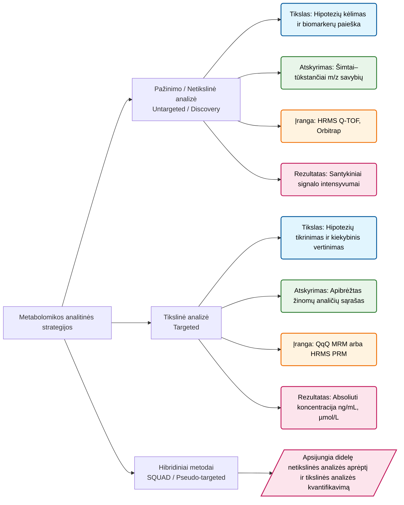

1. **Pažinimo / Netikslinė analizė (*Untargeted / Discovery*)**:
   * **Tikslas**: Išmatuoti kuo platesnį visų aptinkamų metabolitų spektrą be išankstinio šališkumo, siekiant iškelti naujas biologines hipotezes ir atrasti biomarkerius.
   * **Įranga**: Naudojami aukštos skiriamosios gebos ir masių tikslumo spektrometrai (HRMS: Q-TOF, Orbitrap) su DDA arba DIA fragmentavimo režimais.
2. **Tikslinė analizė (*Targeted*)**:
   * **Tikslas**: Tiksliai ir jautriai išmatuoti iš anksto apibrėžtą žinomų metabolitų rinkinį (pvz., konkretaus metabolinio tako junginius).
   * **Įranga**: Naudojami trigubi kvadrupeliai (QqQ) su daugialypės reakcijų stebėsenos (MRM/SRM) režimu arba HRMS su PRM režimu, taikant izotopais žymėtus vidinius standartus.
3. **Hibridiniai metodai (*SQUAD / Pseudo-targeted*)**:
   * Vieno įšvirkštimo metu sujungia netikslinės analizės plačią aprėptį su tiksliu žinomų taikinių kiekybiniu matavimu.

##### Matuojamojo dydžio (*Measurand*) sąvoka

Pagal Tarptautinį metrologijos žodyną (**VIM3**, 2.9 punktas), **matuojamasis dydis (*measurand*)** yra apibrėžiamas kaip *kiekis, kurį ketinama išmatuoti*. VIM3 aiškiai pabrėžia (Note 4), kad pati analitė (cheminės medžiagos pavadinimas) nėra matuojamasis dydis. Norint teisingai apibrėžti matuojamąjį dydį, būtina nurodyti matuojamo kiekio pobūdį, biologinę matricą (terpę) bei matavimo sąlygas:

* **Netikslinėje analizėje (*Untargeted*)**:
  * **Matuojamasis dydis** – tai *atsitiktinės chromatografinės-masių savybės (unique m/z, RT poros feature) jono signalo intensyvumas arba smailės plotas (santykinis kiekis)*, išmatuotas tam tikromis LC-HRMS sąlygomis tyrimo grupės mėginiuose, išreikštas santykiu su kontrole arba apjungtu kokybės kontrolės (Pooled QC) mėginiu. Tai yra **santykinis matavimas**, nesuteikiantis absoliučios molinės koncentracijos.
* **Tikslinėje analizėje (*Targeted*)**: 
  * **Matuojamasis dydis** – tai *konkrečios chemiškai identifikuotos medžiagos (pvz., L-triptofano) masės arba molinė koncentracija* (pvz., $\mu\text{mol/L}$ arba $\text{ng/mL}$) apibrėžtoje biologinėje matricoje (pvz., žmogaus kraujo plazmoje prie $-80^\circ\text{C}$ laikymo sąlygų), nustatyta naudojant atitinkamus grynumo kalibratorius bei izotopais žymėtus vidinius standartus.

## Netikslinė analizė

**Netikslinė metabolomika** – tai visapusiška ir neatrankinė maža molekulinė masė (< 1500 Da) pasižyminčių biologinių mėginių junginių (metabolitų ir lipidų) analizės strategija. Šio metodo tikslas – užregistruoti kuo platesnį visų biologinėje matricoje esančių cheminių savybių spektrą, palyginti jų santykines koncentracijas tarp skirtingų eksperimentinių grupių, iškelti naujas biologines hipotezes bei atrasti ligų ar būsenų biomarkerius.

Skysčių chromatografija, sujungta su aukštos skiriamosios gebos masių spektrometrija (LC-HRMS), yra pagrindinis šios srities analitinis įrankis. Masių spektrometrijos duomenų surinkimas ir tolesnis bioinformacinis duomenų apdorojimas (savybių išgavimas ir spektrinė dekonvolucija) sudaro esminį stuburą, lemiantį gautų rezultatų patikimumą, biologinę aprėptį ir spektro interpretaciją.

### DDA (Data-Dependent Acquisition) Duomenų Surinkimo Principas

**DDA (nuo duomenų priklausomas fragmentavimas)** – tai tradicinis ir plačiausiai taikomas tandeminės masių spektrometrijos (MS/MS) režimas. Šiuo režimu prietaiso valdymo sistema realiu laiku reaguoja į pirmojo lygio (MS1) spektre registruojamus signalus ir automatiškai priima sprendimus, kuriuos jonus atrinkti fragmentacijai.

DDA skenavimo ciklas sudarytas iš nuoseklių etapų, kurie cikliškai kartojami per visą chromatografinės analizės laiką:

1. **Pilnas MS1 skenas (MS1 Survey Scan):** Masių analizatorius (pavyzdžiui, „Orbitrap“ arba Q-TOF) permatuoja visą pasirinktą masės ir krūvio santykio ($m/z$) diapazoną (pavyzdžiui, 70–1000 $m/z$) ir sugeneruoja pirminį MS1 spektrą.
2. **Spektro analizė ir dinaminio atmetimo patikra:** Kiekviena spektre užregistruota smailė patikrinama ar yra dinaminio atmetimo sąraše (DEW, angl dinamic exclusion wondow). Jei smailė jau yra DEW, ji atmentama.
3. **Top-N atranka ir MS2 fragmentacija:** Iš likusių neatmestų smailių atrenkamas nustatytas skaičius $N$ intensyviausių jonų (pavyzdžiui, Top-5, Top-10 arba Top-20). Kavadrupolis (ar kitas tinkamas analizatorius) nuosekliai izoliuoja kiekvieną pasirinktą joną siaurame $m/z$ lange (paprastai 0.4–1.8 Da pločio), nukreipia jį į fragmentacijos kamerą (HCD arba CID), o sugeneruoti fragmentai užregistruojami MS2 skene.
4. **DEW sąrašo papildymas:** Sufragmentuoti Top-N jonai įtraukiami į dinaminio atmetimo sąrašą, kad kitų skenų metu prietaisas perjungtų dėmesį į mažesnio intensyvumo jonus.

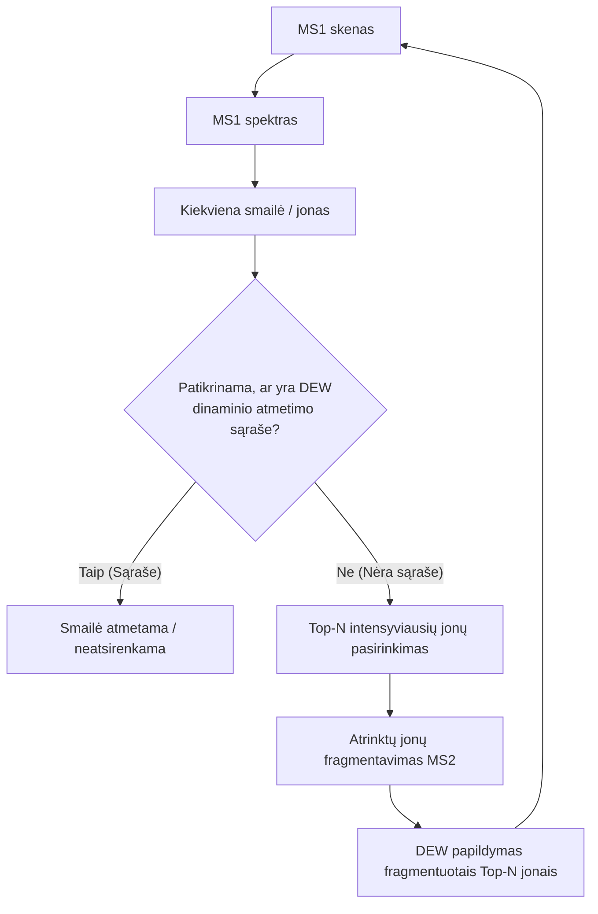

Kadangi chromatografinė smailė trunka kelias sekundes, be papildomų apribojimų prietaisas nuolat fragmentuotų tik pačius intensyviausius jonus. Siekiant padidinti mažesnės koncentracijos metabolitų fragmentavimo tikimybę, taikomas **dinaminis atmetimas**: atlikus jono MS2 fragmentaciją, jo $m/z$ vertė tam tikram laikui (pavyzdžiui, 3–10 sekundžių, priklausomai nuo smailės pločio) įtraukiama į atmetimo sąrašą, priverčiant sistemą perjungti dėmesį į mažesnio intensyvumo jonus.

#### 1.3 DDA Privalumai ir Trūkumai

* **Privalumai:**
  * **Aukšta spektrų švara:** Siaura prekursoriaus izoliacija užtikrina, bei chromatografinis atskyrimas, kad MS2 spektre esantys fragmentai priklauso vienai konkrečiai molekulei.
  * **Tiesioginis spektrinių duomenų bazių palyginimas:** Švarūs MS2 spektrai gali būti iškart lyginami su standartinėmis spektrinėmis duomenų bazėmis (GNPS, METLIN, HMDB, NIST, mzCloud) netaikant sudėtingos dekonvolucijos.
* **Trūkumai:**
  * **Stochastinis pobūdis ir prastas atkuriamumas:** Dėl stochastinio (atsitiktinio) jonų atrankos proceso dviejose pakartotinėse to paties mėginio analizėse gali būti sufragmentuoti skirtingi mažesnio intensyvumo jonai.
  * **Ribota aprėptis:** DDA režimu sufragmentuojama mažiau nei 30–50 % visų aptiktų MS1 jonų (ypač kenčia mažos koncentracijos metabolitai).

### DIA (Data-Independent Acquisition) Duomenų Surinkimo Principas

**DIA (nuo duomenų nepriklausomas fragmentavimas)** – tai deterministinė duomenų surinkimo strategija, kurioje fragmentacija vykdoma pagal iš anksto griežtai nustatytą laiko ir $m/z$ langų tvarkaraštį, visiškai neatsižvelgiant į tai, kokie jonai tuo metu eliuuojasi iš chromatografins sistemos.

#### Veikimo mechanizmas: SWATH ir AIF

DIA pašalina prekursorių atrankos apribojimus fragmentuodama **visus** $m/z$ diapazone esančius jonus. Egzistuoja du pagrindiniai DIA įgyvendinimo būdai:

1. **AIF (All-Ion Fragmentation / $MS^E$):** Kvadrupolis (ar kitas tinkamas masių analizatorius) nefiltruoja jonų. Pakaitomis atliekamas MS1 skenas (nefragmentuoti jonai) ir MS2 skenas, kai į fragmentavimo kamerą yra pasiunčiami visi tuo metu besieliuuojantys jonai.
2. **SWATH-MS (Sequential Window Acquisition of All Theoretical Mass Spectra):** Visas $m/z$ diapazonas (pavyzdžiui, 100–900 $m/z$) padalinamas į nuoseklius izoliacijos langus (paprastai 5–25 $m/z$ pločio). Masių spektrometras cikliškai perbėga per visus langus, fragmentuodamas visus į konkretų langą patenkančius jonus. Po arba prieš kiekvieną ciklą padaromas papildomas MS1 skenas

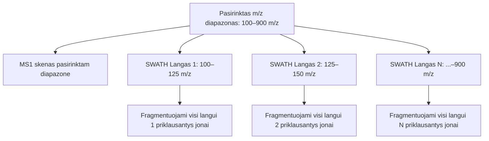

Kadangi viename DIA izoliacijos lange vienu metu fragmentuojasi keli kartu eliuuojantys metabolitai, gaunami **chimeriniai (mišrūs) MS2 spektrai**. Norint susieti pradinį prekursoriaus joną su jo fragmentais, atliekama spektrinė dekonvolucija – ji remiasi chromatografinių smailių formos ir sulaikymo laiko sutapimo analize. Tipiškai gaunamų spektrų kompleksija auga, didinant izoliavimo langą.

#### DIA Privalumai ir Trūkumai

* **Privalumai:**
  * **100 % teorinė MS2 aprėptis:** Fragmentuojami absoliučiai visi jonai, patenkantys į matavimo langą.
  * **Aukštas atkuriamumas:** Ciklo tvarkaraštis yra fiksuotas, todėl tarp skirtingų mėginių ar partijų nelieka stochastinių paklaidų.
  * **Retrospektyvus duomenų gavimas:** Sugeneruojamas skaitmeninis mėginio žemėlapis, kurį galima peranalizuoti ateityje.
* **Trūkumai:**
  * **Sudėtingas duomenų apdorojimas:** Reikalingi skaičiuojamuoju požiūriu imlūs dekonvolucijos algoritmai.
  * **Triukšmas sudėtingose matricose:** Jei kartu eliuuojančių metabolitų skaičius lange yra itin didelis, dekonvolucijos kokybė krenta.

### DDA ir DIA Palyginamoji Analizė

| Parametras | DDA (Data-Dependent Acquisition) | DIA (Data-Independent Acquisition) |
| :--- | :--- | :--- |
| **MS2 fragmentacijos principas** | Izoliuojamas vienas Top-N intensyviausias jonas | Fragmentuojami visi jonai izoliacijos lange (5–25 Da) |
| **MS2 spektro švara** | Aukšta (grynasis individualaus jono spektras) | Chimerinis spektras (reikalinga dekonvolucija) |
| **MS2 fragmentacijos aprėptis** | Maža–vidutinė (riboja ciklo laikas ir intensyvumas) | 100 % teorinė aprėptis visame $m/z$ diapazone |
| **Atkuriamumas tarp mėginių** | Nuosaikus / Stochastinis (kinta atrenkami jonai) | Absoliutus / Deterministinis |
| **Duomenų apdorojimas** | Tiesioginis lygiavimas su spektrinėmis bibliotekomis | Imlus skaičiavimams (chromatografinė dekonvolucija) |
| **Kiekybinis įvertinimas** | Remiamasi MS1 pilno skenavimo smailėmis | Galima vertinti ir MS1, ir MS2 fragmentų smailėmis |

### Savybių (feature) ekstrakcija, Dekonvolucija ir Metabolitų Identifikavimas

Pirminiai masių spektrometrijos duomenys (pirminis failas) atvaizduoja tridimencinę erdvę: **masės ir krūvio santykį ($m/z$), sulaikymo laiką ($RT$) ir signalo intensyvumą**. Šio skyriaus tikslas – paaiškinti, kaip iš šios tridimencinės duomenų visumos išgaunamos savybės, kaip jos sugrupuojamos ir kaip **skirtingo lygio savybės (MS1 ir MS2)** padeda nuosekliai atpažinti bei identifikuoti biologinius metabolitus.

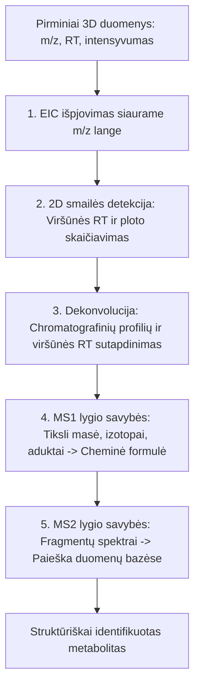

#### Kas yra „Savybė“?

**Savybė (Feature)** – tai konkretaus jono (turinčio unikalų $m/z$) užregistruota chromatografinė smailė ties konkrečiu sulaikymo laiku ($RT$), apibrėžiama trimis pagrindinėmis reikšmėmis:
1. Vidutiniu $m/z$ santykiu (pavyzdžiui, $181.071 \text{ Da}$).
2. Sulaikymo laiku viršūnėje ($RT_{	\text{viršūnė}}$, pavyzdžiui, $2.45	\text{ min}$).
3. Integruotu smailės plotu, atspindinčiu santykinį kiekį mėginyje.

Svarbu pabrėžti, kad **savybė nėra pats metabolitas**. Kadangi viena molekulė jonizacijos metu sugeneruoja kelis skirtingus jonų signalus (izotopus, aduktus, šaltinio fragmentus), iš vieno metabolito susidaro kelios atskiros savybės.

Norint rasti savybę, taikomas **ekstrahuotos jonų chromatogramos (EIC)** principas: iš viso tridimencinio duomenų masyvo išpjaunamas labai siauras $m/z$ ruožas (pavyzdžiui, $\pm 5	\text{ ppm}$ arba $\pm 0.005 \text{ Da}$). Taip tridimenciniai duomenys paverčiami į paprastą dvidimencinę chromatogramą (Intensyvumas vs. Laikas).

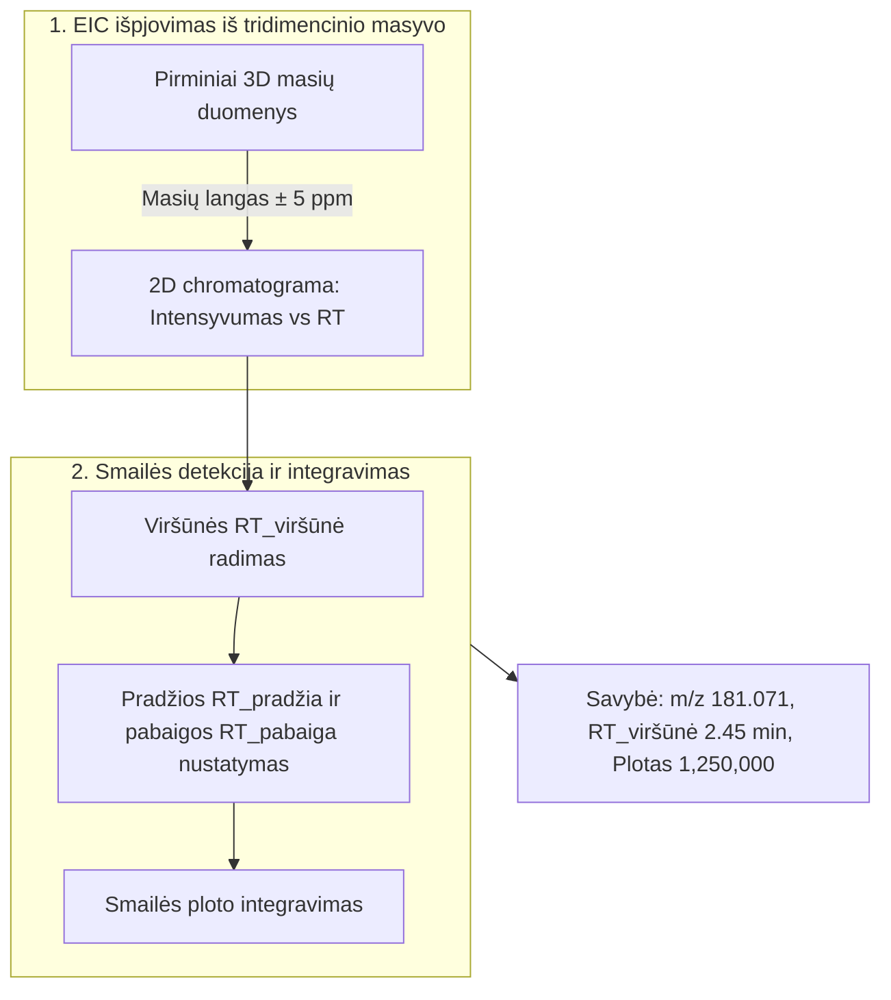

#### Dekonvolucijos Principas: Chromatografinio Profilio Sutapatinimas

**Problema:** Analizuojant sudėtingus biologinius mėginius (kraujo plazma, augalų ekstraktai), sutrasti chromatografines sąlygas, kai visi mėginio komponentai pilnai atsiskiria, yra neįmanoma. Dėl to kelios medžiagos patenka į masių spektrometrą vienu arba beveik vienu metu. Jei tokie junginiai patenka į tą patį fragmentavimo langą jų fragmentacijos spektrai susimaišo į vieną **chimerinį spektrą**. Kaip nustatoma, kurie fragmentai priklauso konkrečiam junginiui?

**Sprendimas (Dekonvolucijos principas):** 
Jei prekursoriaus jonas ir keli fragmentų jonai priklauso **tai pačiai fizinei molekulei**, jie iš chromatografinės kolonėlės eliuavosi kartu. Todėl jų ekstrahuotos jonų chromatogramos (EIC smailės) privalo tenkinti dvi sąlygas:
1. **Identiškas sulaikymo laikas viršūnėje ($RT_{\text{viršūnė}}$):** Prekursoriaus ir jo fragmentų smailių maksimumas būna tiksliai tą pačią sekundę.
2. **Identiška smailės forma (chromatografinio profilio koreliacija):** Didėjant ir mažėjant molekulės koncentracijai detektoriuje, prekursoriaus ir visų jo fragmentų signalai kyla ir krenta absoliučiai sinchroniškai (koreliacijos koeficientas $r > 0.90$).

Sulyginus EIC smailių formas, visi fragmentai, kurių smailės forma ar $RT_{\text{viršūnė}}$ nesutampa, atmetami kaip svetimas triukšmas. Taip iš chimerinio spektro išgryninamas **tikrasis molekulės MS2 spektras**.

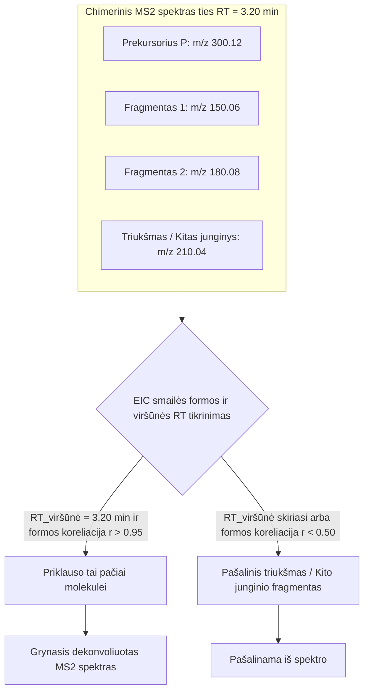

### Metabolitų Atpažinimas pagal MS1 ir MS2 Lygio Savybes

Savybių išgavimo ir apdorojimo eigoje sugeneruota informacija yra padalinama į **dviejų lygmenų savybes (MS1 ir MS2)**. Šių skirtingų lygmenų duomenys atlieka skiriamąjį vaidmenį atpažįstant ir identifikuojant metabolitus.

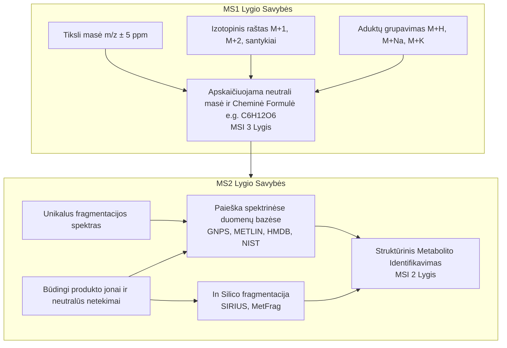

#### MS1 Lygio Savybės: Neutralios Masės ir Cheminės Formulės Nustatymas

MS1 lygio savybės suteikia pradinę informaciją apie molekulės fizines ir chemines savybes tiriamoje biologinėje matricoje:

1. **Tiksli masė ($m/z$):** Aukštos skiriamosios gebos masių spektrometrija (HRMS) užtikrina masių tikslumą iki $\le 3–5	ext{ ppm}$. Tai leidžia siaurame masės lange ieškoti galimų cheminių junginių.
2. **Izotopinis raštas ($M+1$, $M+2$):** Natūralus $13\text{C}$, $15\text{N}$, $34\text{S}$ ar $37\text{Cl}$ izotopų paplitimas sugeneruoja unikalų izotopinių smailių aukščių santykį. Šio santykio palyginimas su teoriniu pasiskirstymu (pavyzdžiui, taikant Septynias Auksines Taisyklės – *Seven Golden Rules*) atmeta 90–95 % netinkamų elementų kombinacijų.
3. **Aduktų grupavimas:** Savybių sujungimas pagal atstumus ($\Delta m/z = +21.9820	\text{ Da}$ for $[M+Na]^+$, $+37.9558 \text{ Da}$ for $[M+K]^+$) leidžia tiksliai nustatyti **neutralios molekulės masę ($M$)**.

**Rezultatas (MSI 3 lygis):** MS1 lygio savybės leidžia patikimai nustatyti **bruto cheminę formulę** (pavyzdžiui, $\text{C}_6 \text{H}_{12} \text{O}_6$), tačiau negali vienareikšmiškai atskirti struktūrinių izomerų (pavyzdžiui, gliuokozės nuo fruktozės ar galaktozės). Tai atitinka Metabolomikos standartų iniciatyvos (**MSI – Metabolomics Standards Initiative**) **3 lygį (Level 3 – Putative compound class / Molecular formula)**.

#### MS2 Lygio Savybės: Spektrinė Paieška ir Struktūrinis Identifikavimas

Norint atskirti izomerus ir nustatyti tikslią cheminę struktūrą, būtina panaudoti MS2 lygio savybes:

1. **Paieška spektrinėse duomenų bazėse (Spectral Library Search):** Deconvolution būdu išvalytas arba DDA režimu užregistruotas grynasis MS2 spektras palyginamas su atvirųjų bei komercinių spektrinių duomenų bazių (**GNPS**, **METLIN**, **HMDB**, **MassBank**, **NIST**, **mzCloud**) įrašais. Palyginimui skaičiuojamas spektrinio panašumo įvertis (pavyzdžiui, kosinuso (cosine similarity) arba skaliarinės sandaugos (dot product) balai (tipiškai nuo 0 iki 1)).
2. **Būdingi fragmentai ir neutralūs netekimai:** Specifiniai produkto jonai (pavyzdžiui, $m/z\ 184.0733$ cholino fragmentui fosfolipiduose) arba neutralūs netekimai (pavyzdžiui, $-176.0321 \text{ Da}$ glukouronido konjugatams) patvirtina konkrečią metabolitų klasę.
3. ***In Silico* Fragmentacija:** Jei eksperimentinis MS2 spektras neturi tiesioginio atitikmens duomenų bazėse, naudojami bioinformaciniai įrankiai (**SIRIUS / CSI:FingerID**, **MetFrag**, **CFM-ID**). Šie algoritmai paima MS1 lygio sugeneruotą cheminę formulę, ištraukia visas galimas chemines struktūras iš cheminių duomenų bazių („PubChem“, „ChemSpider“) ir *in silico* būdu modeliuoja jų fragmentaciją, sulygindami su eksperimentiniu MS2 spektru.

**Rezultatas (MSI 2 lygis):** Kai eksperimentinis MS2 spektras sutampa su spektrinės duomenų bazės įrašu (kosinuso balas $> 0.80$), metabolitui suteikiamas **MSI 2 lygis (Level 2 – Putatively annotated compound)**.

*(Pastaba: Norint pasiekti aukščiausią **MSI 1 lygį – Confirmed compound**, būtina eksperimentiškai išmatuoti gryną autentišką standartą toje pačioje laboratorijoje, patvirtinant atitiktį pagal du nepriklausomus parametrus: $RT$ ir MS2 spektrą).*

## Tikslinė (Targeted metabolomika)

**Tikslinė metabolomika (Targeted Metabolomics)** – tai bioanalitinės chemijos šaka, skirta apibrėžto, biologinėje sistemoje žinomo metabolitų rinkinio atsekamam kiekybiniam įvertinimui. Metodologija grindžiama fiziniu-cheminiu analičių atskyrimu ir masių spektrometriniu registravimu, siekiant maksimalaus jautrumo, selektyvumo, tiesiškumo ir metrologinio atsekamumo.

### Instrumentinė Dalis ir Duomenų Surinkimo Fizika

####  Duomenų deterministiškumas kaip kiekybinės analizės sąlyga

Kiekybinės masių spektrometrijos analitinis signalas – analitės adukto (MS1 lygmenyje) arba būdingo fragmento jono (MS2 lygmenyje) **ekstrahuotos jonų chromatogramos (EIC / XIC)** plotas $A$, gautas integruojant signalo intensyvumą $I(t)$ chromatografinės zonos plotyje $[t_1, t_2]$:

$$A = \int_{t_1}^{t_2} I(t) \, dt \approx \sum_{k=1}^{M} I(t_k) \cdot \Delta t_k$$

Kad skaitmeninio integralo suma $\hat{A}$ atitiktų tikrąjį integralą $A$ be sisteminių ir atsitiktinių paklaidų, pirminiai masių spektrometrijos duomenys privalo tenkinti griežtą **duomenų surinkimo deterministiškumo** sąlygą:

1. **Pastovus matavimo laiko žingsnis (Deterministic Time Sampling):** Imčių ėmimo intervalas $\Delta t_k = t_k - t_{k-1}$ privalo būti fiksuotas arba tolygiai kintantis žinomoje laiko funkcijoje. Stochastiniai duomenų surinkimo režimai (pavyzdžiui, DDA), kuriuose MS1 ar MS2 nuskaitymai aktyvuojami atsitiktinai priklausomai nuo matricos intensyvumo, pažeidžia $\Delta t$ pastovumą, sukelia neapibrėžtą integravimo paklaidą ir yra netinkami kiekybinei analizei.
2. **Nekintanti m/z koordinatė ir izoliacijos langas:** Kiekvienas duomenų taškas $I(t_k)$ privalo būti užregistruotas tiksliai tame pačiame prekursoriaus bei produkto jono masės ir krūvio santykio ($m/z$) filtre.

Pagal Nyquist-Shannon atrankos teoremą ir chromatografinių smailių integravimo praktiką, patikimam smailės ploto ir viršūnės ($RT_{\text{viršūnė}}$) apskaičiavimui būtina užtikrinti **ne mažiau kaip 10–12 duomenų taškų ($M \ge 10\text{–}12$)** per chromatografinę smailę (matuojant smailės plotyje $W_{\text{peak}}$ ties $3.5\%$ smailės aukščio, t. y. $6\sigma$). Jei $M < 8$, smailės ploto integracijos variacijos koeficientas ($RSD$) negrįžtamai išauga.

#### Deterministiniai skenavimo režimai

Nurodytus kiekybinius reikalavimus užtikrina tik tie masių spektrometro darbo režimai, kuriuose perėjimų ir skenų seka vykdoma pagal deterministinį tvarkaraštį.

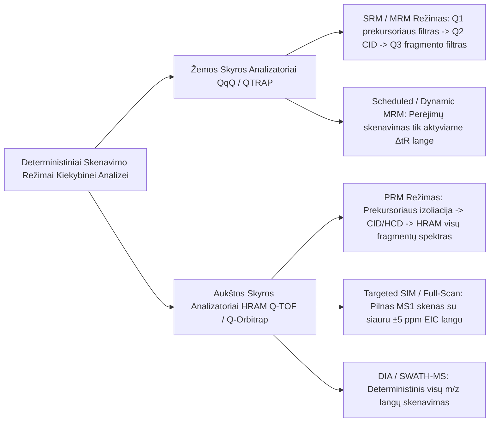

##### A. Žemos skiriamosios gebos analizatoriai (Trigubi Kvadrupeliai – QqQ, QTRAP)
* **Atsirinktų / Daugialypių Reakcijų Stebėsena (SRM):**
  * **Q1 (pirmasis kvadrupolis):** Veikia kaip siauras masių filtras (paprastai $\Delta m/z \approx 0.7\text{ Da}$, vienetinė skyra), praleidžiantis tik analitės prekursoriaus joną ($m/z_{\text{prec}}$).
  * **Q2 (susidūrimų kamera):** Pagreitinti prekursoriaus jonai sudraskomi susidūrimuose su inertinių dujų molekulėmis (CID – *Collision-Induced Dissociation*).
  * **Q3 (trečiasis kvadrupolis):** Filtruoja ir praleidžia tik vieną būdingą produkto (fragmento) joną ($m/z_{\text{prod}}$).
  * *Rezultatas:* Dviguba masių atranka ($m/z_{\text{prec}} \to m/z_{\text{prod}}$) eliminuoja cheminį foną ir užtikrina platų tiesinį dinaminį diapazoną ($10^4\text{–}10^5$).
* **Dinaminis / Tvarkaraštinis MRM (Dynamic SRM / Scheduled SRM – dSRM / sSRM):**
  * Kiekviena SRM reakcija skenuojama ne visą analizės laiką, o tik apibrėžtame laiko lange ($\Delta t_R$, pavyzdžiui, $1.0\text{ min}$) aplink žinomą metabolito sulaikymo trukmę. Tai užtikrina aukštą buvimo laiką (*dwell time*) net analizuojant šimtus analičių vienu matavimu.

##### B. Aukštos skiriamosios gebos analizatoriai (HRAM – Q-TOF, Q-Orbitrap)
* **Lygiagrečioji Reakcijų Stebėsena (PRM – Parallel Reaction Monitoring):**
  * Kvadrupolis (ar kitas tinkamas masių analizatorius) izoliuoja prekursorių, HCD/CID kameroje sugeneruojami fragmentai, o aukštos skyros masių analizatorius užregistruoja **visą produkto jonų spektrą** vienu metu su didele skiriamąja geba ($R \ge 17\,500\text{–}70\,000$) ir tikslios masės paklaida ($< 5\text{ ppm}$).
* **Targeted HRAM SIM / Full-Scan:**
  * Užregistruojami pilni MS1 spektrai. Kiekybinė EIC chromatograma iškerpama taikant itin siaurą masės tolerancijos langą (pavyzdžiui, $\pm 5\text{ ppm}$). Aukšta masių skyra atskiria analitės signalą nuo izobarinių matricos trukdžių be MS2 fragmentacijos.

#### Ciklo laikas (Duty Cycle / Cycle Time) ir Poisson triukšmo matematika

Kiekybinio matavimo ciklo laikas ($T_{\text{cycle}}$) – tai laiko tarpas, per kurį spektrometras atlieka vieną pilną aktyvių perėjimų seką:

$$T_{\text{cycle}} = \sum_{i=1}^{N} \left( t_{\text{dwell}, i} + t_{\text{interscan}} \right)$$

kur $N$ – tuo pačiu laiko momentu stebimų reakcijų skaičius, $t_{\text{dwell}}$ – jono signalo integravimo laikas detektoriuje (*dwell time*), o $t_{\text{interscan}}$ – vidinis masių analizatorių įtampos ir elektronikos persijungimo laikas ($1\text{–}5\text{ ms}$).

#### Optimalaus buvimo laiko ($t_{\text{dwell}}$) fizikinė kompromiso lygtis
Jono detekcija masių spektrometre paklūsta **Poisson skirsiniui**. Užregistruoto signalo $I$ (užregistruotų jonų skaičiaus, *counts*) santykinis standartinis nuokrypis (triukšmo lygis) yra atvirkščiai proporcingas užregistruotų jonų skaičiaus kvadratinei šakniai:

$$\frac{\sigma_I}{I} = \frac{1}{\sqrt{I_{\text{jonų}}}} = \frac{1}{\sqrt{J_{\text{jonų}} \cdot t_{\text{dwell}}}}$$

kur $J_{\text{jonų}}$ – jonų srauto intensyvumas ($\text{jonai/s}$).

1. **Jei $t_{\text{dwell}}$ per trumpas ($< 2\text{–}5\text{ ms}$):** Registruojamas jonų skaičius $I_{\text{jonų}}$ yra mažas, todėl Poisson triukšmas $\frac{\sigma_I}{I}$ drastiškai padidėja, o signalo ir triukšmo santykis krenta ($\frac{S}{N} \propto \sqrt{t_{\text{dwell}}}$).
2. **Jei $t_{\text{dwell}}$ per ilgas:** Ciklo laikas $T_{\text{cycle}}$ viršija leistiną ribą, todėl taškų skaičius per smailę $M = \frac{W_{\text{peak}}}{T_{\text{cycle}}}$ nukrenta žemiau 10 taškų, deformuodamas smailės integravimo kontūrą.

*Išvada:* Ciklo laikas kontroliuojamas taikant dinaminį langų skirstymą (dMRM) ir adaptyvųjį buvimo laiką (*adaptive dwell time*), išlaikant $M \ge 12$ bei $t_{\text{dwell}} \ge 10\text{ ms}$.

### Diagnostinių Jonų Chemija ir Spektrinis Identifikavimas

#### Diagnostinio jono sąvoka ir informacinė vertė

**Diagnostinis jonas** – tai specifinis MS1 (prekursorius, aduktas, izotopologas) arba MS2 (produkto fragmentas, neutralus netekimas) jonas, pasižymintis aukštu masių spektriniu selektyvumu ir tiesiogine struktūrine priklausomybe nuo analitės cheminės formulės bei fragmentacijos mechanizmo.

Diagnostinio jono atranka remiasi dviem kriterijais:
1. **Struktūrinis specifiškumas:** Fragmentas atspindi būdingą cheminį karkasą (pavyzdžiui, aminorūgštims būdingą karboksi grupės netekimą ar fosfolipidų cholino fragmentą $m/z \ 184.074$).
2. **Spektrinis selektyvumas ($S/N$):** Jonas neturi sutapti su matricos fono fragmentais.

#### Diagnostiniai jonai daugiamatėje erdvėje ir Kosinuso Panašumo Rodiklis

Kai atliekama analizė PRM arba Full-Scan HRMS režimais, analitės spektrinė tapatybė vertinama lyginant eksperimentinį fragmentacijos spektrą su etaloninės duomenų bazės spektru, arba laboratorijoje gautu etaloninės medžiagos spektru.

Eksperimentinis ir etaloninis spektrai išreiškiami kaip $N$-mačiai intensyvumų vektoriai diagnostinių jonų $m/z$ erdvėje:

$$\mathbf{I}_{\text{exp}} = \begin{pmatrix} i_{1, \text{exp}} \\ i_{2, \text{exp}} \\ \vdots \\ i_{N, \text{exp}} \end{pmatrix}, \quad \mathbf{I}_{\text{ref}} = \begin{pmatrix} i_{1, \text{ref}} \\ i_{2, \text{ref}} \\ \vdots \\ i_{N, \text{ref}} \end{pmatrix}$$

**Kosinuso panašumo rodiklis ($S_{\text{cosine}}$)** apskaičiuojamas kaip kampo $\theta$ kosinusas tarp šių dviejų vektorių:

$$S_{\text{cosine}} = \cos(\theta) = \frac{\mathbf{I}_{\text{exp}} \cdot \mathbf{I}_{\text{ref}}}{\|\mathbf{I}_{\text{exp}}\| \|\mathbf{I}_{\text{ref}}\|} = \frac{\sum_{k=1}^{N} i_{k, \text{exp}} \cdot i_{k, \text{ref}}}{\sqrt{\sum_{k=1}^{N} i_{k, \text{exp}}^2} \cdot \sqrt{\sum_{k=1}^{N} i_{k, \text{ref}}^2}}$$

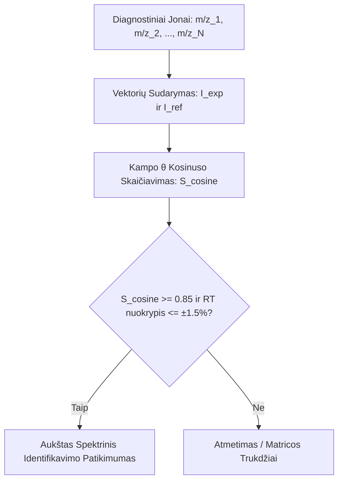

1. **$N = 1$ jonas (1D erdvė):**
   * Vektoriai yra vienamatėje erdvėje. Kampas $\theta$ neegzistuoja ($S_{\text{cosine}} \equiv 1$). Spektrinis kosinuso panašumas **negali būti taikomas**. Vieno jono matavimas nesuteikia jokio spektrinio patvirtinimo, nes bet koks izobarinis matricos triukšmas tuo pačiu $m/z$ duos $100\%$ atitiktį.
2. **$N = 2$ jonai (2D erdvė: Kiekybinis *Quantifier* + 1 Kokybinis *Qualifier*):**
   * Vektoriai apibrėžiami plokštumoje. Kosinuso panašumo balas tapatus dviejų jonų intensyvumų santykiui $R = \frac{i_2}{i_1}$:
     $$S_{\text{cosine}} = \frac{1 + R_{\text{exp}} \cdot R_{\text{ref}}}{\sqrt{1 + R_{\text{exp}}^2} \cdot \sqrt{1 + R_{\text{ref}}^2}}$$
   * Šis matavimas atitinka klasikinį **jonų santykio (Ion Ratio)** tikrinimą.
3. **$N \ge 3$ jonai ($N$-matė erdvė: *Quantifier* + 2+ *Qualifiers*):**
   * Vektoriai egzistuoja daugiamatėje erdvėje. Kosinuso rodiklis atspindi unikalų spektrinį „piršto atspaudą“. Net jei vienas izobarinis fragmentas matricoje padidėja dėl fono, kiti fragmentai išlaiko savo proporcijas, todėl $S_{\text{cosine}}$ matematiniu būdu įvertina bendrą spektrinį nuokrypį.

#### Diagnostinių jonų transformacija į Identifikavimo Taškus (IP)

Metrologiniam ir teisiniam bioanalitinių matavimų patikimumui užtikrinti (remiantis ES reglamentu **(EU) 2021/808** ir SANTE/11312/2021 gairėmis), diagnostinių jonų skaičius transformuojamas į **Identifikavimo Taškus (IP – Identification Points)**. Toks sprendimas priimtas siekiant išvengti sudėtingos matematikos ir padaryti gaires pasiekiamas visose laboratorijose.

#### Identifikavimo taškų skaičiavimo taisyklės:
* **Žemos skiriamosios gebos MS (QqQ / QTRAP):**
  * Prekursoriaus jonas (MS1): **1.0 IP** (tiesiogiai nestebimas)
  * Kiekvienas produkto jonas (MS2 fragmentas): **1.5 IP**
* **Aukštos skiriamosios gebos HRMS (Q-TOF / Orbitrap, $\Delta m/z < 5\text{ ppm}$):**
  * Tikslios masės prekursoriaus jonas (HR-MS1): **2.0 IP** (reikalingas atskiras skenas)
  * Kiekvienas tikslios masės produkto jonas (HR-MS2 fragmentas): **2.5 IP**

#### Identifikavimo patikimumo augimo hierarchija:

| Diagnostinių Jonų Konfigūracija | Instrumentinis Režimas | IP Suma | Tautologinis Patikimumas ir Dydžio Vertinimas |
| :--- | :--- | :---: | :--- |
| **1 Jonas** ($m/z_{\text{prec}}$) | MS1 SIM / Full-Scan | **1.0 IP** | **Nepakankamas.** Didelė klaidingai teigiamų rezultatų rizika dėl matricoje esančių izobarinių junginių. |
| **2 Jonai** ($m/z_{\text{prec}} \to m/z_{\text{prod1}}$) | QqQ SRM (1 perėjimas) | **2.5 IP** | **Nepakankamas.** Nepasiekiamas teisinis $\ge 4.0\text{ IP}$ slenkstis. |
| **3 Jonai** ($1 \ m/z_{\text{prec}} \to 2 \ m/z_{\text{prod}}$) | QqQ SRM (2 perėjimai: *Quant + Qual*) | **4.0 IP** | **Minimalus Pilnas Identifikavimas (MSI 1 Lygis).** Būtina patikrinti $\text{Ion Ratio} \le \pm 20\%$. |
| **3 Jonai (HRMS)** ($1 \ m/z_{\text{prec}} \to 2 \ m/z_{\text{prod}}$) | HRMS PRM su tikslia mase | **6.0-7.0 IP** | **Aukštas Patikimumas.** Viršija IP slenkstį + skaičiuojamas $S_{\text{cosine}} \ge 0.85$. |

### Analitės koncentracijos vertinimas

#### Jonizacijos slopinimas ir jo įtaka kiekio nustatymui

Elektropurškiamoje jonizacijoje (ESI) analitės jonizacijos efektyvumas priklauso nuo skysčio lašelio paviršinio krūvio ir išgaravimo greičio (Kebarle ir Tang lašelio modelis).

Kai kartu su analite eliuuojasi didelės koncentracijos matricos komponentai (pavyzdžiui, šlapimo rūgštis, druskos arba kraujo plazmos fosfolipidai, pvz., glicerofosfocholinai) galimi sekantys efektai:
1. **Paviršiaus konkurencija:** Matricos junginiai užima vietą ESI lašelio paviršiuje, nustumdami analitę į lašelio vidų ir apribodami jos desorbciją į dujų fazę.
2. **Protonų konkurencija:** Jei matricos komponentai turi didesnį giminingumą protonui (*proton affinity*), jie prisijungia $H^+$, palikdami analitę neutralioje formoje.

Matricos efektas yra pamatuojamas dydis ir gali būti išreiškiamas ($ME, \%$) išreiškiamas:

$$ME (\%) = \frac{A_{\text{matrica}}}{A_{\text{tirpiklis}}} \times 100\%$$

kai $ME < 80\%$, stebimas **jonų slopinimas (ion suppression)**.

Eksperimentiškai įrodyta, kad vienintelis metodas, galintis $100\%$ kompensuoti tiek mėginio paruošimo nuostolius, tiek kintantį matricos slopinimo koeficientą $f_{ME}(t)$, yra **stabiliais izotopais žymėti vidiniai standartai (SIL-IS, stable izotope labeled internal standards)** ($^{13}\text{C}$, $^{15}\text{N}$). Tai sintetinės medžiagos, kurios negali būti natūraliai sutinkamos mėginyje. Analizės eigoje, žinomas (pastovus) šių medžiagų kiekis pridedamas į mėginį pasirinktoje fazėje (mėginio paruošimo pradžia, ekstraktas, ar injekcijos tirpalas) ir toliau analiz4 vykdoma stebint natyvias bei izotopais žymėtas medžiagas.

Analitės signalo koreciją SIL-IS matematiškai galime aprašyti ir įrodyti:

Tegul analitės $A$ ir vidinio standarto $IS$ matuojami EIC smailės plotai yra $Y_A$ ir $Y_{IS}$. Bendra bioanalitinė lygtis aprašoma taip:

$$Y_A = \eta_A \cdot f_{ME}(t) \cdot R_{\text{rec}} \cdot C_A$$

$$Y_{IS} = \eta_{IS} \cdot f_{ME}(t) \cdot R_{\text{rec}} \cdot C_{IS}$$

kur:
* $\eta_A, \eta_{IS}$ – prietaiso detekcijos ir jonizacijos atsako faktoriai tirpiklyje,
* $f_{ME}(t)$ – laike kintanti matricos jonizacijos slopinimo funkcija ($0 < f_{ME}(t) \le 1$),
* $R_{\text{rec}}$ – mėginio ekstrahavimo išeiga ($0 < R_{\text{rec}} \le 1$),
* $C_A, C_{IS}$ – analitės ir SIL-IS molekulinės koncentracijos mėginyje.

Apskaičiavus matuojamą Atsako Santykį (*Response Ratio – RR*):

$$RR = \frac{Y_A}{Y_{IS}} = \frac{\eta_A \cdot f_{ME}(t) \cdot R_{\text{rec}} \cdot C_A}{\eta_{IS} \cdot f_{ME}(t) \cdot R_{\text{rec}} \cdot C_{IS}} = \left( \frac{\eta_A}{\eta_{IS} \cdot C_{IS}} \right) \cdot C_A = K \cdot C_A$$

Kadangi SIL-IS pasižymi **identiška chemine struktūra ir identišku sulaikymo laiku ($RT_A \equiv RT_{IS}$)**, funkcijos $f_{ME}(t)$ ir $R_{\text{rec}}$ skaitiklyje ir vardiklyje yra **absoliučiai vienodos ir sutrumpėja**. Gautas atsako santykis $RR$ yra griežtai tiesiogiai proporcingas koncentracijai $C_A$ ir visiškai nepriklauso nuo matricos slopinimo ar mėginio paruošimo nuostolių.

Deuteruoti standartai ($^{2}\text{H} / \text{D}$) pasižymi mažesniu lipofiiliškumu nei natūralūs junginiai. Dėl to deuteruotas standartas iš chromatografinės kolonėlės (RP sąlygomis) išsieliuoja šiek tiek ankščiau ($\Delta RT = 0.02\text{–}0.05\text{ min}$). Jei matricos slopinimo funkcija $f_{ME}(t)$ chromatofrafinėje zonoje kinta, $f_{ME}(t_A) \neq f_{ME}(t_{IS})$, todėl kompensavimas tampa nevisiškas. Todėl $^{13}\text{C}$ ir $^{15}\text{N}$ žymėti standartai yra metrologiškai pranašesni.

### Metrologiniai Kalibravimo Modeliai

Metrologiniam koncentracijos matavimo siečiai užtikrinti taikomi trys pagrindiniai kalibravimo modeliai:

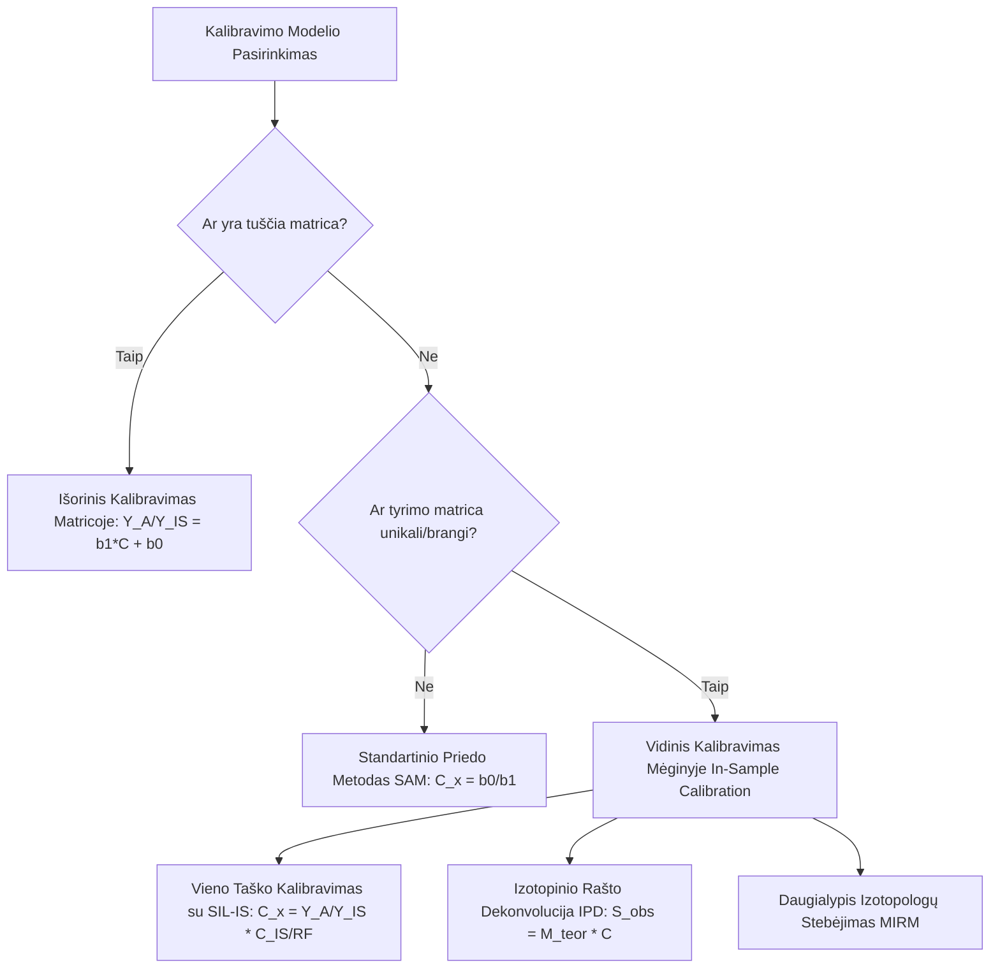

#### Išorinis kalibravimas matricoje (Matrix-Matched External Calibration)
* **Taikymas:** Kai prieinama biologinė matrica be analitės (pavyzdžiui, kraujo plazma, išvalyta aktyvuota anglimi).
* **Matematinis modelis:** Sudaroma tiesinės regresijos lygtis pagal matricos standartus:
  $$\frac{Y_A}{Y_{IS}} = b_1 \cdot C_A + b_0$$
  Nežinoma koncentracija $C_x$ apskaičiuojama:
  $$C_x = \frac{\left( \frac{Y_{A, x}}{Y_{IS, x}} \right) - b_0}{b_1}$$

#### Standartinio priedo metodas (Standard Addition Method – SAM)
* **Taikymas:** Kai neįmanoma gauti tuščios matricos, o matricos efektai stipriai kinta tarp skirtingų mėginių.
* **Matematinis modelis:** Mėginio alikvotas papildomos žinomais standartų kiekiais ($0, C_1, C_2, C_3$). Apskaičiuojama tiesės susikirtimo su X ašimi vertė ties $Y = 0$:
  $$C_x = \frac{b_0}{b_1}$$

#### Vidinis kalibravimas mėginyje (In-Sample Calibration – IsC)

##### Vieno taško vidinis kalibravimas
Į mėginį pridedama tiksli žinoma SIL-IS koncentracija $C_{IS}$. Iš anksto nustačius prietaiso atsako faktorių $RF = \frac{\eta_A}{\eta_{IS}}$, analitės koncentracija $C_x$ randama tiesiogiai iš vieno įšvirkštimo:

$$C_x = \frac{Y_A}{Y_{IS}} \cdot \frac{C_{IS}}{RF}$$

Dažniaisiai prietaiso atsako fakttorius nustatomas analizuojant analitės bei SIL-IS mišinį be matricos kai $C_A = C_IS$

##### Izotopinio rašto dekonvolucija (Isotopic Pattern Deconvolution – IPD)
Kai analitė ir SIL-IS turi dalinį izotopinį persidengimą, matuojama izotopinių smailių ($M+0, M+1, M+2$) (pvz. estradiolis, ir estradiolis-D2)  pasiskirstymo sumaišymo matrica $\mathbf{S}_{\text{obs}}$.
Taikant tiesinę matricų algebrą:

$$\mathbf{S}_{\text{obs}} = \mathbf{M}_{\text{teor}} \cdot \mathbf{C}$$

išsprendžiama tiesinių lygčių sistema ir išskiriamos natūralios analitės bei SIL-IS molinės dalys, užtikrinant absoliutų matavimo tikslumą. Raeikalinga specifinė programinė įranga.

#####  Daugialypis izotopologų reakcijų stebėjimas (MIRM)
Į mėginį įterpiama viena SIL-IS koncentracija, tačiau stebimos kelios SIL-IS izotopologų reakcijos ($^{13}\text{C}_1, ^{13}\text{C}_2, ^{13}\text{C}_3$), kurių teoriniai gausumai žinomi. Taip iš vieno įšvirkštimo gaunama 5–8 taškų kalibravimo kreivė pačiame biologiniame mėginyje.

## Pratimai ir užduotys

::::exercise
### 1. Užduotis: Ciklo laiko ir taškų skaičiaus per smailę skaičiavimas

**Sąlyga:**
Tikslinėje metabolitų analizėje SRM režimu vienu metu stebima $N = 40$ reakcijų. Jono buvimo laikas (*dwell time*) nustatytas $t_{\text{dwell}} = 15  \text{ ms}$, o persijungimo laikas tarp skenų $t_{\text{interscan}} = 5\text{ ms}$. Chromatografinės smailės plotis prie pagrindo yra $W_{\text{peak}} = 12\text{ s}$.

1. Apskaičiuokite vieno skenavimo ciklo laiką $T_{\text{cycle}}$ (sekundėmis).
2. Apskaičiuokite surenkamų duomenų taškų skaičių $M$ per vieną chromatografinę smailę.
3. Įvertinkite, ar gauti duomenys tinkami kiekybinei smailės ploto integracijai ($M \ge 10\text{–}12$). Jei perėjimų skaičius išaugtų iki $N = 120$, paaiškinkite, kaip situaciją ištaisytų dinaminis MRM (dMRM).

:::solution
#### Sprendimas

1. **Ciklo laiko skaičiavimas:**
   $$T_{\text{cycle}} = N \cdot (t_{\text{dwell}} + t_{\text{interscan}}) = 40 \cdot (15\text{ ms} + 5\text{ ms}) = 40 \cdot 20\text{ ms} = 800\text{ ms} = 0.8\text{ s}$$

2. **Taškų skaičiaus per smailę skaičiavimas:**
   $$M = \frac{W_{\text{peak}}}{T_{\text{cycle}}} = \frac{12\text{ s}}{0.8\text{ s}} = 15\text{ taškų}$$

3. **Duomenų tinkamumo vertinimas ir dMRM optimizavimas:**
   * Kadangi $M = 15 \ge 12$, sugeneruoti duomenys yra pilnai tinkami tiksliai smailės ploto integracijai.
   * Jei perėjimų skaičius padidėtų iki $N = 120$, nepakitus parametrams ciklo laikas išaugtų iki $T_{\text{cycle}} = 120 \cdot 20\text{ ms} = 2.4\text{ s}$, todėl per smailę būtų užregistruoti tik $M = \frac{12}{2.4} = 5\text{ taškai}$ (nepakankama kiekybinei analizei).
   * **dMRM taikymas:** Įdiegus dinaminį MRM (dMRM), perėjimai skenuojami tik aktyviame sulaikymo laiko lange ($\Delta t_R$, pvz., $1.0\text{ min}$). Todėl bet kuriuo laiko momentu stebimų perėjimų skaičius sumažėja nuo 120 iki $\le 30$, išlaikant $T_{\text{cycle}} \le 0.6\text{ s}$ ir $M \ge 20$ taškų.
:::
::::

::::exercise
### 2. Užduotis: Identifikavimo Taškų (IP) skaičiavimas

**Sąlyga:**
Siekiant pilnai patvirtinti metabolito tapatybę kraujo plazmoje (MSI 1 lygis), lyginamos dvi masių spektrometrijos konfigūracijos:
* **Metodas A:** Trigubas kvadrupelis (QqQ) SRM režimu, matuojant 1 prekursoriaus joną ir 2 produkto (fragmento) jonus ($1\text{ prec} 	o 2\text{ prod}$).
* **Metodas B:** Aukštos skiriamosios gebos masių spektrometrijas (HRMS, Q-TOF) PRM režimu su tikslios masės matavimu ($\Delta m/z < 5\text{ ppm}$), matuojant 1 prekursoriaus joną ir 2 produkto jonus.

1. Apskaičiuokite surinktų Identifikavimo Taškų (IP) sumą Metodui A ir Metodui B.
2. Kuris metodas viršija teisinį $IP \ge 4.0$ slenkstį, būtiną pilnam tapatybės patvirtinimui?

:::solution
#### Sprendimas

1. **IP sumos skaičiavimas:**
   * **Metodas A (Žema skiriamoji geba, QqQ):**
     * Prekursoriaus jonas (MS1): $1.0\text{ IP}$
     * 2 produkto jonai (MS2): $2 	imes 1.5\text{ IP} = 3.0\text{ IP}$
     * **Suma A = $1.0 + 3.0 = 4.0\text{ IP}$**
   * **Metodas B (Aukšta skyra, HRMS PRM):**
     * Prekursoriaus jonas (HR-MS1): $1.0\text{ IP}$. **Sudarant PRM metodą prekursorius tiesiogiai nematuojamas, jis izoliuojamas žemos skiriamosios gebos masių analizatoriumi)**.
     * 2 tikslios masės produkto jonai (HR-MS2): $2 \times 2.5\text{ IP} = 5.0\text{ IP}$
     * **Suma B = $1.0 + 5.0 = 7.0\text{ IP}$**

2. **Vertinimas:**
   * **Abu metodai** pasiekia ir viršija teisinį $IP \ge 4.0$ slenkstį. Metodas A garantuoja minimalią reikalaujamą $4.0\text{ IP}$ ribą, o Metodas B sugeneruoja $7.0\text{ IP}$, užtikrindamas itin aukštą spektrinį patikimumą.
:::
::::

::::exercise
### 3. Užduotis: Jonų santykio (Ion Ratio) patikra ir leistino nuokrypio vertinimas

**Sąlyga:**
Tikslinėje LC-MS/MS analizėje stebimi du metabolito perėjimai: kiekybinis jonas ($m/z_{\text{quant}}$) ir kokybinis jonas ($m/z_{\text{qual}}$). 
* Gryno etaloninio standarto smailės plotas: $I_{\text{quant, ref}} = 200\,000$, $I_{\text{qual, ref}} = 60\,000$.
* Biologiniame mėginyje užregistruotas plotas: $I_{\text{quant, exp}} = 120\,000$, $I_{\text{qual, exp}} = 45\,600$.

1. Apskaičiuokite jonų santykį ($R = I_{\text{qual}} / I_{\text{quant}}$) etaloniniam standartui ($R_{\text{ref}}$) ir biologiniam mėginiui ($R_{\text{exp}}$).
2. Apskaičiuokite mėginio jonų santykio nuokrypį nuo standarto procentais ($\Delta R, \%$).
3. Įvertinkite, ar mėginys atitinka ES reglamente nustatytą $\le \pm 20\%$ leistiną nuokrypio ribą.

:::solution
#### Sprendimas

1. **Jonų santykių skaičiavimas:**
   $$R_{\text{ref}} = \frac{I_{\text{qual, ref}}}{I_{\text{quant, ref}}} = \frac{60\,000}{200\,000} = 0.300 \quad (30.0\%)$$
   $$R_{\text{exp}} = \frac{I_{\text{qual, exp}}}{I_{\text{quant, exp}}} = \frac{45\,600}{120\,000} = 0.380 \quad (38.0\%)$$

2. **Santykinio nuokrypio skaičiavimas:**
   $$\Delta R (\%) = \frac{|R_{\text{exp}} - R_{\text{ref}}|}{R_{\text{ref}}} \times 100\% = \frac{|0.380 - 0.300|}{0.300} \times 100\% = \frac{0.080}{0.300} 	\times 100\% = 26.67\%$$

3. **Vertinimas:**
   * Kadangi gautas nuokrypis $\Delta R = 26.67\%$ viršija leistiną $\pm 20.0\%$ ribą, mėginio tapatumo patvirtinimas yra **atmetamas**. Padidėjęs kokybinio jono signalas rodos, kad po smailės apvalkalu eliuuojasi pašalinis matricos izobarinis trukdis.
:::
::::

::::exercise
### 4. Užduotis: Kosinuso panašumo rodiklio ($S_{\text{cosine}}$) skaičiavimas 3D fragmentų erdvėje

**Sąlyga:**
PRM režimu sugeneruoti trys diagnostiniai fragmentų jonai $m/z_1, m/z_2, m/z_3$. 
* Etaloninis spektras (vektorius $\mathbf{I}_{\text{ref}}$): $(100, 50, 20)$.
* Mėginio spektras (vektorius $\mathbf{I}_{\text{exp}}$): $(80, 45, 10)$.

Apskaičiuokite kosinuso panašumo rodiklį $S_{\text{cosine}}$ ir įvertinkite, ar spektrinė atitiktis tenkina $S_{\text{cosine}} \ge 0.85$ kriterijų.

:::solution
#### Sprendimas

1. **Skalarinė vektorių sandauga:**
   $$\mathbf{I}_{\text{exp}} \cdot \mathbf{I}_{\text{ref}} = (80 \cdot 100) + (45 \cdot 50) + (10 \cdot 20) = 8000 + 2250 + 200 = 10\,450$$

2. **Vektorių normų (ilgių) skaičiavimas:**
   $$\|\mathbf{I}_{\text{ref}}\| = \sqrt{100^2 + 50^2 + 20^2} = \sqrt{10000 + 2500 + 400} = \sqrt{12900} \approx 113.578$$
   $$\|\mathbf{I}_{\text{exp}}\| = \sqrt{80^2 + 45^2 + 10^2} = \sqrt{6400 + 2025 + 100} = \sqrt{8525} \approx 92.331$$

3. **Kosinuso rodiklio skaičiavimas:**
   $$S_{\text{cosine}} = \frac{\mathbf{I}_{\text{exp}} \cdot \mathbf{I}_{\text{ref}}}{\|\mathbf{I}_{\text{exp}}\| \|\mathbf{I}_{\text{ref}}\|} = \frac{10\,450}{113.578 \cdot 92.331} = \frac{10\,450}{10\,486.76} \approx 0.9965$$

4. **Vertinimas:**
   * Kadangi $S_{\text{cosine}} = 0.9965 \ge 0.85$, spektrinė atitiktis yra itin aukšta ($99.65\%$), patvirtinanti tikslią metabolito tapatybę.
:::
::::

::::exercise
### 5. Užduotis: EIC masės tolerancijos lango skaičiavimas ppm ir m/z rėžiai

**Sąlyga:**
Netikslinėje HRMS analizėje tiriamas metabolitas L-triptofanas, kurio teorinis pronizuotas jonas $[M+H]^+$ yra $m/z = 205.0972\text{ Da}$. Duomenų apdorojimo sistemoje nustatytas EIC ekstrahavimo langas $\pm 5\text{ ppm}$.

1. Apskaičiuokite masės toleranciją $\Delta m/z$ daltonais (Da).
2. Nustatykite minimalią ($m/z_{\text{min}}$) ir maksimalią ($m/z_{\text{max}}$) EIC ekstrahavimo ribas.

:::solution
#### Sprendimas

1. **Masės tolerancijos skaičiavimas:**
   $$\Delta m/z = m/z  \times \frac{\text{ppm}}{10^6} = 205.0972  \times \frac{5}{10^6} = 0.0010255\text{ Da} \approx 0.00103\text{ Da}$$

2. **EIC ribų skaičiavimas:**
   $$m/z_{\text{min}} = 205.0972 - 0.0010255 = 205.09617\text{ Da}$$
   $$m/z_{\text{max}} = 205.0972 + 0.0010255 = 205.09823\text{ Da}$$
   * EIC chromatograma bus iškerpama tiksliai $[205.09617\text{–}205.09823]\text{ m/z}$ diapazone.
:::
::::

::::exercise
### 6. Užduotis: Savybių anotacija pagal masių atstumus ($\Delta m/z$)

**Sąlyga:**
LC-HRMS duomenyse ties tuo pačiu sulaikymo laiku $RT = 3.20\text{ min}$ užregistruotos trys chromatografinės smailės:
* Smailė A: $m/z = 181.0707$ (intensyviausia smailė)
* Smailė B: $m/z = 182.0740$
* Smailė C: $m/z = 203.0527$

Žinoma, kad $^{13}\text{C}-^{12}\text{C}$ masės skirtumas $\Delta m = 1.0033\text{ Da}$, $\text{Na}^+ - \text{H}^+$ masės skirtumas $\Delta m = 21.9820\text{ Da}$, o protono masė $m_{\text{H}^+} = 1.0073\text{ Da}$.

1. Identifikuokite Smailės B ir C jono tipus pagal masių skirtumus nuo Smailės A.
2. Nustatykite neutralią motininės molekulės masę $M$ (Da).

:::solution
#### Sprendimas

1. **Masių skirtumų skaičiavimas ir jono tipas:**
   * Smailė B vs A: $\Delta m/z = 182.0740 - 181.0707 = 1.0033\text{ Da}$. Tai atitinka **$[M+1+H]^+$ izotopinį joną** ($^{13}\text{C}_{1}$ izopologas).
   * Smailė C vs A: $\Delta m/z = 203.0527 - 181.0707 = 21.9820\text{ Da}$. Tai atitinka **$[M+Na]^+$ natrio aduktą**.

2. **Neutralios masės $M$ skaičiavimas:**
   * Kadangi Smailė A yra monoisotopinis jonas $[M+H]^+ = 181.0707\text{ Da}$:
     $$M = 181.0707 - 1.0073 = 180.0634\text{ Da}$$
   * (Pastaba: Ši masė atitinka hexose angliavandenį $\text{C}_6\text{H}_{12}\text{O}_6$, pvz., gliukozę. Visos 3 savybės priskiriamos vienai molekulei).
:::
::::

::::exercise
### 7. Užduotis: Matricos efekto ($ME, \%$) skaičiavimas ir ESI reiškinio vertinimas

**Sąlyga:**
Tiriant metabolito jonizaciją kraujo plazmoje, analitės smailės plotas grynajame tirpiklyje yra $A_{\text{tirpiklis}} = 500\,000$, o plazmos ekstrakte – $A_{\text{matrica}} = 350\,000$.

1. Apskaičiuokite matricos efektą $ME(\%)$.
2. Nustatykite, ar stebimas jonų slopinimas, ar sustiprinimas, ir paaiškinkite fizikinę to priežastį ESI šaltinyje.

:::solution
#### Sprendimas

1. **Matricos efekto skaičiavimas:**
   $$ME (\%) = \frac{A_{\text{matrica}}}{A_{\text{tirpiklis}}} \times 100\% = \frac{350\,000}{500\,000} \times 100\% = 70.0\%$$

2. **Reiškinio vertinimas ir fizikinė priežastis:**
   * Kadangi $ME = 70.0\% < 80.0\%$, stebimas **jonų slopinimas (Ion Suppression)** – analitės signalas sumažėjo $30.0\%$.
   * **Fizikinė priežastis:** ESI lašelio paviršiuje kartu eliuuojantys matricos komponentai (pvz., fosfolipidai, druskos) konkuruoja su analite dėl protonų ($H^+$) bei išgaravimo ploto, nustumdami analitę į lašelio vidų ir neleisdami jai pereiti į dujų fazę.
:::
::::

::::exercise
### 8. Užduotis: Vieno taško vidinis kalibravimas pagal SIL-IS

**Sąlyga:**
Tiriamas fenilalaninas kraujo serume. Į mėginį įterpiama $[^{13}\text{C}_9]$-fenilalanino (SIL-IS) koncentracija $C_{\text{IS}} = 50.0\ \mu\text{mol/L}$. Matavimo metu gauti smailės plotai: analitės $Y_A = 240\,000$, vidinio standarto $Y_{\text{IS}} = 300\,000$. Prietaiso atsako faktorius $RF = 1.00$.

1. Apskaičiuokite Atsako Santykį ($RR = Y_A / Y_{\text{IS}}$).
2. Apskaičiuokite absoliučią fenilalanino koncentraciją mėginyje $C_x$ ($\mu\text{mol/L}$).

:::solution
### Sprendimas

1. **Atsako Santykio skaičiavimas:**
   $$RR = \frac{Y_A}{Y_{\text{IS}}} = \frac{240\,000}{300\,000} = 0.800$$

2. **Koncentracijos skaičiavimas:**
   $$C_x = RR \cdot \frac{C_{\text{IS}}}{RF} = 0.800 \cdot \frac{50.0\ \mu\text{mol/L}}{1.00} = 40.0\ \mu\text{mol/L}$$
:::
::::

### 10. (Atvejo Analizė I): Kokybės Kontrolės Programos Parengimas Plataus Spekto (Netikslinei) Lipidų Analizei Plazmoje

**Sąlyga:**
Netikslinėje lipidomikoje (Untargeted Lipidomics), taikant LC-HRMS (DDA/DIA režimu), matuojama tūkstančiai nežinomų savybių ($m/z \text{–}RT$ porų). Tradiciniai tikslinės analizės kalibratoriai čia netinka. Parengkite sisteminę kokybės kontrolės ir duomenų valymo (*Data Curation*) programą, leidžiančią užtikrinti aukštą biologinį patikimumą ir signalo dreifo korekciją.

Sudaromas dokumentas turi apimti šiuos 4 privalomus skyrius:
1. **Jungtinio kokybės kontrolės mėginio (Pooled QC) paruošimas ir įterpimo dažnis.**
2. **Duomenų valymo protokolas (Data Curation Pipeline): tuščio mėginio korekcija, %RSD filtravimas ir signalo dreifo korekcija (QC-RLSC).**
3. **LSI (Lipidomics Standards Initiative) standartų ir anotacijos lygmenų taikymas.**
4. **Mėginių sekos sudarymas ir priimtinumo kriterijai.**

:::solution
#### Sprendimas: Kokybės Kontrolės Programa Netikslinei Lipidų Analizei

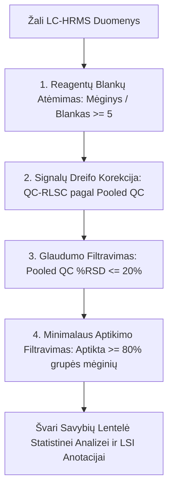

##### 1. Jungtinio Kokybės Kontrolės Mėginio (Pooled QC) Paruošimas
* **Gamyba:** Paimama tiksliai vienodas kiekis ($10\ \mu \text{L}$) iš **kiekvieno** tyrime dalyvaujančio biologinio plazmos mėginio. Visi mėginiai sumaišomi į vieną reprezentatyvų **Pooled QC** indą ir išskirstomi į vienkartines alikvotas.
* **Informacinė vertė:** Pooled QC atspindi vidutinę visų tyrime esančių lipidų matricos sudėtį ir vidutines koncentracijas.
* **Įterpimo dažnis:**
  * **Kondicionavimas:** Sekos pradžioje įleidžiama **5–10 Pooled QC mėginių**, kad stabilizuotųsi chromatografinės kolonėlės pasyvavimas ir ESI šaltinio pusiausvyra.
  * **Sekos metu:** Pooled QC įterpiamas **kas 5–8 biologinius mėginius** per visą analizės laiką.

##### 2. Duomenų Valymo Protokolas (Data Curation Pipeline)
Sugeneravus pirminę savybių lentelę (EIC pjaustymas ir smailių integracija), taikomas 4 etapų filtravimo algoritmas:

1. **Reagentų blankų atėmimas (Blank Subtraction):**
   * Apskaičiuojamas smailės ploto vidurkis biologiniuose mėginiuose ($A_{\text{bio}}$) ir reagentų blankuose ($A_{\text{blank}}$).
   * **Taisyklė:** Pašalinamos visos savybės, kurioms $\frac{A_{\text{bio}}}{A_{\text{blank}}} < 5.0$. Tai eliminuoja plastikų minkštiklius, tirpiklių šiukšles ir sistemos triukšmą.

2. **Signalo dreifo korekcija (QC-RLSC – Quality Control-Robust LOESS Signal Correction):**
   * Dėl LC-MS detektoriaus jautrumo kritimo per ilgą seką smailės plotai gali sistemingai mažėti.
   * Naudojant Pooled QC taškus laiko ašyje, kiekvienai savybei suskaičiuojama LOESS glotninimo kreivė ir biologinių mėginių plotai sunormalizuojami,  laik dreyfą.

3. **Glaudumo filtravimas (%RSD filter Pooled QC mėginiuose):**
   * Po dreifo korekcijos apskaičiuojamas kiekvienos savybės ploto variacijos koeficientas ($RSD, \%$) **tik Pooled QC mėginiuose**:
     $$RSD (\%) = \frac{\sigma_{ \text{QC}}}{\mu_{\text{QC}}} 	\times 100\%$$
   * **Taisyklė:** Pašalinamos visos savybės, kurių $RSD > 20\%$ (arba $> 30\%$ mažo intensyvumo lipidams). Jei savybė labai varijuoja pačiame identiškame QC mėginyje, ji yra techninis triukšmas.

4. **80% Taisyklė (Minimalus aptikimo dažnis):**
   * Savybė išlaikoma tik tada, jei ji be N/A verčių aptinkama bent $\ge 80\%$ mėginių mažiausiai vienoje eksperimentinėje grupėje (pvz., kontrolinėje arba ligos grupėje).

##### 3. LSI (Lipidomics Standards Initiative) Standartai ir Anotacija
Gautoms savybėms priskiriami tarptautiniai LSI kokybės lygmenys:
* **Mėginio praturtinimas su vidiniais standartais:** Į visus mėginius prieš ekstrahavimą įterpiamas egzogeninių lipidų mišinys (pvz., *SPLASH Lipidomix*, turintis po vieną neendogeninį / deuteruotą lipidą kiekvienai pagrindinei klasei: PC, PE, TAG, DAG, SM, Cer).
* **LSI Anotacijos Lygmenys:**
  * **LSI Level 1 (Absoliuti struktūra):** Nustatyta riebalų rūgščių sudėtis, dvigubųjų jungčių padėtis ir $sn$-pozicija (taikant MS/MS fragmentaciją ir izotopų anotaciją).
  * **LSI Level 2 (Lipido klasė ir anglių/jungčių skaičius):** Identifikuota lipidų klasė bei bendras anglių ir dvigubųjų jungčių skaičius (pvz., $\text{PC 34:1}$).
  * **LSI Level 3 (Tiksli masė MS1):** Žinoma tik tiksli masė $m/z$ be MS2 fragmentacijos.

##### 4. Mėginių Sekos Sudarymas ir Priėmimo Kriterijai
* **Sekos struktūra:** Reagentų blankai (3x) $ \to$ Pooled QC kondicionavimas (6x) $ \to$ Kalibravimo / LSI standartai $\to$ [Atsitiktine tvarka išdėsstyti biologiniai mėginiai (5x) $\to$ Pooled QC (1x)] $\to$ Pooled QC (2x) $\to$ Reagentų blankas.
* **Priėmimo kriterijus:**
  * Po duomenų valymo išlaikytų savybių skaičius Pooled QC mėginiuose turi sudaryti $\ge 70\%$ visų pirminių savybių.
  * Vidinio standarto (SPLASH) sulaikymo laiko nuokrypis visoje sekoje neturi viršyti $\Delta RT \le \pm 0.1\text{ min}$.
:::
::::

::::exercise
### 10. (Atvejo Analizė II): Kokybės Kontrolės (QC) Programos Parengimas Tikslinei Aminorūgščių Analizei Kraujo Plazmoje

**Sąlyga:**
Jums pavesta parengti pilną, praktiškai įgyvendinamą kokybės kontrolės (QC) programą klinikinei tikslinei 20 aminorūgščių analizei kraujo plazmoje, taikant LC-MS/MS (SRM režimu) su stabiliais izotopais žymėtais vidiniais standartais (SIL-IS). Programa turi atitikti tarptautines bioanalitines gaires (FDA/EMA/SANTE).

Sudaromas dokumentas turi apimti šiuos 5 privalomus skyrius:
1. **Mėginių sekos (Analytical Run Sequence) struktūra.**
2. **Sisteminio tinkamumo patikra (System Suitability Test – SST).**
3. **Kalibrantų ir QC pavyzdžių priėmimo / atmetimo kriterijai.**
4. **Sulaikymo trukmės (RT) ir Jonų santykio ($ \text{Quantifier}/	\text{Qualifier}$) stebėsena.**
5. **Reagavimo veiksmai ir trikčių šalinimo protokolas (Troubleshooting).**

:::solution
#### Sprendimas: Kokybės Kontrolės (QC) Programa Tikslinei Aminorūgščių Analizei

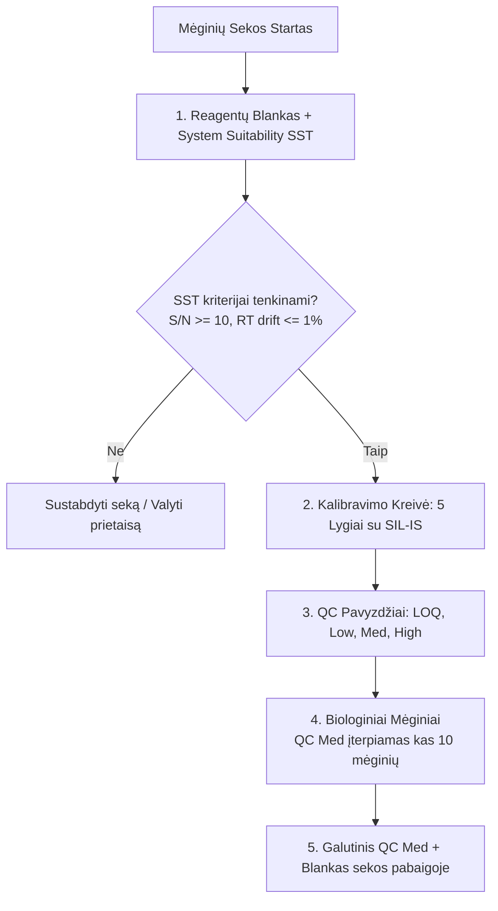

##### 1. Mėginių Sekos (Analytical Run Sequence) Struktūra
Seka privalo būti sudaryta griežtai tokia tvarka:
1. **Reagentų blankas (Double Blank):** Tirpiklis be analičių ir be SIL-IS (sistemos švarumui ir kryžminei taršai tikrinti).
2. **Nulinis mėginys (Zero Blank):** Tirpiklis su įterptu SIL-IS (SIL-IS izotopinimui ir grynumui patikrinti).
3. **Sisteminio tinkamumo mėginys (SST):** Vidurinės koncentracijos standartas (3 pakartotiniai įšvirkštimai).
4. **Kalibravimo standartai (Matrix-Matched Calibration):** 5 koncentracijos lygiai (padengiantys $0.5	ext{–}500\ \mu \text{mol/L}$), įterpiant pastovų SIL-IS kiekį.
5. **QC pavyzdžiai (Quality Control Samples):**
   * **QC LOQ:** Žemiausia kiekybinio įvertinimo riba.
   * **QC Low (QCL):** $\sim 3 \times LOQ$.
   * **QC Medium (QCM):** Diapazono viduryje.
   * **QC High (QCH):** $\sim 75\%$ viršutinės kalibravimo ribos
6. **Tiriamieji biologiniai mėginiai:** Išdėstyti atsitiktine tvarka mėginiai. Kas 10–12 biologinių mėginių **privalomai įterpiamas QCM pavyzdys** (prijungtas prie Westgard taisyklių).
7. **Sekos pabaiga:** QCM pavyzdys + Reagentų blankas.

##### 2. Sisteminio Tinkamumo Patikra (System Suitability Test – SST)
Prieš pradedant analizuoti biologinius mėginius, SST privalo patvirtinti instrumentinės įrangos parengtį:
* **Jautrumas:** LOQ standarto signalo ir triukšmo santykis $S/N \ge 10$.
* **Sulaikymo laiko atkuriamumas:** 3 SST įšvirkštimų $RT$ variacijos koeficientas $RSD \le 1.0\%$ (arba $\Delta RT \le \pm 0.05 \text{ min}$).
* **Smailės asimetrija:** Asimetrijos faktorius $A_s$ (ties $10\%$ smailės aukščio) turi būti $0.8 \le A_s \le 1.5$.
* **Slėgio stabilumas:** HPLC slėgio svyravimai chromatografinio važiavimo metu $< 2\%$.

##### 3. Kalibrantų ir QC Mėginių Priimtinumo Kriterijai (FDA/EMA)
* **Kalibravimo kreivė:**
  * Koreliacijos koeficiento kvadratas $R^2 \ge 0.990$ (taikant pasvertąją tiesinę regresiją $1/x$ arba $1/x^2$).
  * Kiekvieno kalibravimo taško apskaičiuotos koncentracijos tikslumas (*Accuracy / Bias*) turi būti $\pm 15\%$ nuo nominalios vertės (išskyrus LOQ, kur leidžiama $\pm 20\%$).
  * Bent $75\%$ kalibravimo taškų (mažiausiai 2 iš 5) privalo tenkinti šiuos kriterijus.
* **QC pavyzdžiai:**
  * Kiekvieno QC lygio (QCL, QCM, QCH) vidutinis tikslumas turi būti $\pm 15\%$ nuo nominalios vertės.
  * Glaudumas (Pakartojamumas) (*Precision (Repeatability)*)  %RSD tarp QC pakartojimų turi būti $\le 15\%$ (LOQ lygmenyje $\le 20\%$).
  * Mažiausiai $67\%$ (2/3) visų QC pavyzdžių ir bent $50\%$ kiekvieno konkretaus QC lygio pavyzdžių privalo tenkinti tikslumo reikalavimus.

##### 4. Sulaikymo trukmės (RT) ir Jonų Santykio Stebėsena
Kiekvienam biologiniam mėginiui automatiškai tikrinami du patikimumo parametrai:
* **$\Delta RT$ stebėsena:** Analitės sulaikymo laikas mėginyje neturi skirtis nuo tą dieną išmatuoto kalibranto vidurkio daugiau kaip $\Delta RT = \pm 1.0\%$ (arba $\pm 0.05\text{ min}$).
* **Jonų santykio ($\text{Quantifier}/\text{Qualifier}$) stebėsena:**
  * Apskaičiuojamas santykis $R = I_{\text{qual}} / I_{\text{quant}}$.
  * Mėginio $R_{\text{exp}}$ nuokrypis nuo kalibranto vidurkio $R_{\text{ref}}$ neturi viršyti leistinos $\pm 20\%$ ribos. Jei $R_{\text{exp}}$ iškrenta iš šių ribų, mėginio rezultatas anuliuojamas dėl matricos izobarinio trukdžio.

##### 5. Reagavimo Veiksmai ir Trikčių Šalinimas (Troubleshooting)
Jei sekos metu priimami QC pavyzdžiai nepatenkina kriterijų (taikant Westgard $1_{3s}$ arba $2_{2s}$ taisykles):
1. **Atmetimo identifikavimas:** Jei vienas QCM pavyzdys viršija $\pm 15\%$ ribą, visi po paskutinio „gero“ QCM išanalizuoti biologiniai mėginiai laikomi nepatikimais.
2. **Priežasčių analizė:**
   * Jei pasislinko visų analičių $RT \implies$ Tikrinamas HPLC eliuento pratekėjimo greitis, kolonėlės termostatas arba mobilioji fazė.
   * Jei nukrito visų analičių signalas $S/N \implies$ Valomas ESI jonų šaltinio įvado kapiliaras (skimmer / ion transfer tube).
   * Jei pakito tik vienos aminorūgšties $RR \implies$ Tikrinamas SIL-IS įterpimo tikslumas arba vidinio standarto degradacija.
3. **Korekciniai veiksmai:** Išvalius sistemą ir atlikus naują SST patikrą, nepatikimi biologiniai mėginiai perleidžiami iš naujo kartu su nauja kalibravimo kreive ir QC pavyzdžiais.
:::
::::
