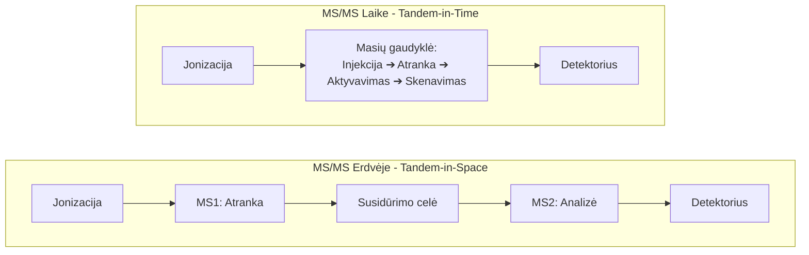
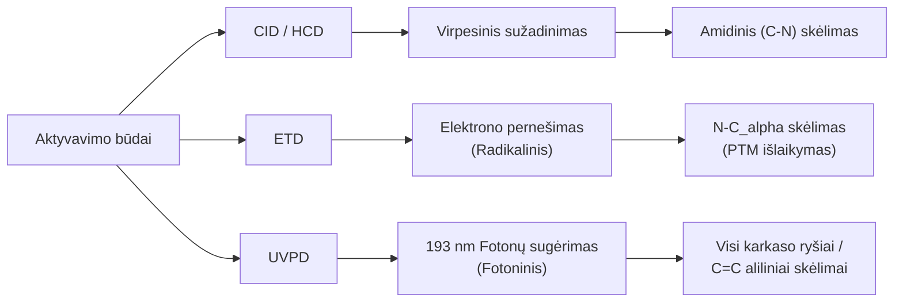
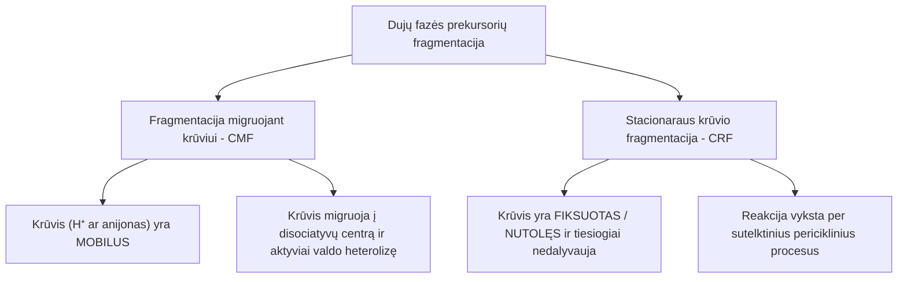
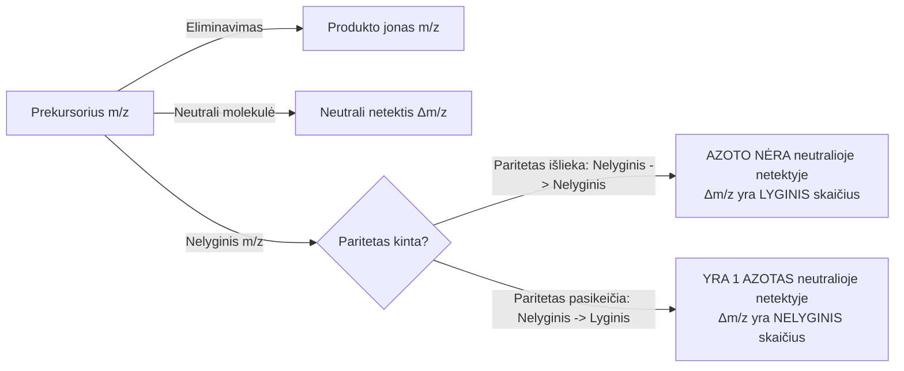
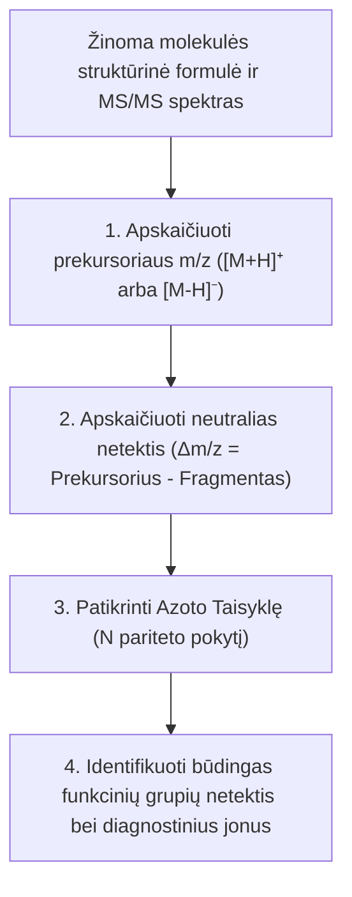
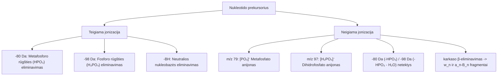
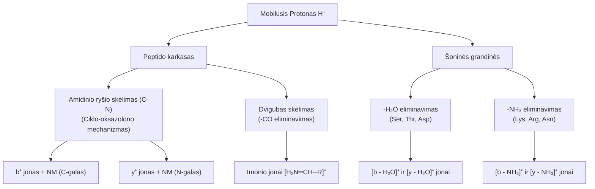

# Tandeminė masių spektrometrija

## Įvadas

Masių spektrometrijoje taikomi švelnios jonizacijos metodai – tokie kaip **elektropurškimo jonizacija (ESI)**, **atmosferos slėgio cheminė jonizacija (APCI)** bei **MALDI** – pasižymi tuo, kad jonizacijos proceso metu molekulėms perduodama labai maža vidinė energija. Dėl šios priežasties sugeneruojami stabilūs, intakti pseudomolekuliniai jonai (pavyzdžiui, teigiamoje veiksenoje protonuoti $[M+H]^+$ ar su sodijumi $[M+Na]^+$, o neigiamoje veiksenoje deprotonuoti $[M-H]^-$ aduktai) su minimalia karkaso fragmentacija.

Nors pirmojo lygio masių spektras (**MS1**) leidžia itin tiksliai nustatyti junginio monoisotopinę masę bei iš izotopinio pasiskirstymo išvesti elementinę molekulės formulę (pvz., naudojant didelės raiškos Orbitrap ar Q-TOF masių analizatorius), **MS1 spektro nepakanka pilnai molekulės struktūrai nustatyti arba patvirtinti**.

### Pagrindinės MS1 spektro ribotumų priežastys:
* **Izomerų neatskyrimas:** Izomerai pasižymi identiška elementine sudėtimi ir identiška molekuline mase (pvz., struktūriniai izomerai, turintys skirtingas funkcines grupes ar pakaitų padėtis, bei stereoisomerai). MS1 spektre jie duoda visiškai vienodą $m/z$ signalą.
* **Izobarinių junginių problema:** Junginiai, turintys skirtingas elementines formules, tačiau labai artimas ar identiškas nominaliąsias mases, negali būti patikimai atskirti be papildomos struktūrinės informacijos.
* **Cheminių ryšių išsidėstymo trūkumas:** MS1 spektras nesuteikia informacijos apie tai, kaip atomai sujungti tarpusavyje – kurioje vietoje yra funkcinės grupės, šoninės grandinės ar dvigubieji ryšiai.

Norint atskleisti molekulės vidinę kovalentinę sandarą, intaktą pirmtaką joną būtina sužadinti ir sukelti jo kontroliuojamą fragmentaciją dujų fazėje. Tam naudojama **tandeminė masių spektrometrija (MS/MS)**.


## 2. MS/MS spektrų gavimo principai ir instrumentinės konfigūracijos

Tandeminė masių spektrometrija paremta trijų nuoseklių etapų seka:
1. **Pirmtako jono (angl. *precursor ion*) atranka** pagal jo $m/z$ santykį iš MS1 spektro.
2. **Atrinkto jono aktyvavimas (fragmentacija)** suteikiant jam papildomos vidinės energijos.
3. **Susidariusių produkto jonų (angl. *product ions*) masės analizė** (MS2 spektro užregistravimas).

Šis procesas instrumentiškai įgyvendinamas dviejų tipų konfigūracijomis: **MS/MS erdvėje** ir **MS/MS laike**.



#### MS/MS erdvėje (angl. *Tandem-in-Space*) ir hibridiniai analizatoriai
MS/MS erdvėje atveju atranka, fragmentacija ir produkto jonų analizė vyksta skirtinguose, nuosekliai išdėstytuose fiziniuose masių analizatoriuose:

* **Trigubas kvadrupolis (QqQ):** Pirmajame kvadrupolyje ($Q_1$) atrenkamas pirmtakas jonas. Antrajame kvadrupolyje ($q_2$), kuris veikia kaip RF susidūrimo kamera su inertinėmis dujomis (Ar, N₂), vyksta aktyvacija. Trečiajame kvadrupolyje ($Q_3$) skenuojami sugeneruoti fragmentai.
* **Kvadrupolis-Lėkio trukmės analizatorius (Q-TOF):** $Q_1$ užtikrina didelį pirmtako jono atrankos selektyvumą, susidūrimo ląstelė vykdo fragmentaciją, o TOF analizatorius užregistruoja MS2 spektrą su didelė raiška bei tikslumu.
* **Kvadrupolis-Orbitrap (Q-Exactive / Orbitrap Tribrid):** Atranka atliekama kvadrupoliu, aktyvacija vykdoma aukšto slėgio susidūrimo celėje (HCD), o aukščiausios raiškos fragmentų spektrai užregistruojami Orbitrap detektoriuje.

#### MS/MS laike (angl. *Tandem-in-Time*) ir $\text{MS}^n$
MS/MS laike atveju visi trys etapai vyksta toje pačioje fizinėje erdvėje – **masių gaudyklėje** (pvz., 3D jono gaudyklėje, linijinėje jono gaudyklėje LIT ar FT-ICR), tačiau yra atskirti laiko intervalais:

1. **Injekcija ir kaupimas:** Visi jonai įleidžiami į gaudyklę.
2. **Atranka (izoliavimas):** Taikant specifinius RF dažnius, iš gaudyklės pašalinami visi jonai, išskyrus pasirinktą pirmtaką joną.
3. **Aktyvavimas:** Pirmtakas jonas sužadinamas rezonansiniu dažniu, sukeliant susidūrimus su neutraliomis dujomis.
4. **MS2 skenavimas:** Susidarę fragmentai išstumiami į detektorių.

**Daugiaetapės $\text{MS}^n$ fragmentacijos galimybė:** Masių gaudyklėse šį ciklą galima kartoti daug kartų ($MS^1 \rightarrow MS^2 \rightarrow MS^3 \rightarrow \dots \rightarrow MS^n$). Pavyzdžiui, iš MS2 spektro galima izoliuoti konkretų fragmentą ir jį fragmentuoti iš naujo ($MS^3$). Tai itin naudinga išaiškinant sudėtingus kaskadinius skilimo mechanizmus bei glikozilinimo grandinių struktūras.


## Bendrieji fragmentacijos principai ir krūvio tvarumas

### Lyginių elektronų taisyklė (angl. *Even-Electron Rule*)

Vienkrūvėms organinėms rūšims, gautoms ESI metu, galioja lyginių elektronų taisyklė. Protonuoti aduktai $[M+H]^+$ yra **lyginių elektronų ($\text{EE}^+$) jonai**. 
Aktyvavimo metu $\text{EE}^+$ jonas skyla išskirdamas **stabilią neutralią lyginių elektronų molekulę** ($H_2O, NH_3, CO, CO_2$), o susidaręs produkto jonas taip pat išlieka $\text{EE}^+$ rūšimi:

$$\text{EE}^+ \longrightarrow \text{EE}^+ + \text{NM (EE)}$$

Radikalų (nelyginių elektronų $\text{OE}^{+\bullet}$) susidarymas iš $\text{EE}^+$ jonų pasitaiko retai ir yra būdingas tik specifinėms funkcinėms grupėms (pvz., nitroaljunginiams ar aromatinėms metoksigrupėms).

### Jonų stabilumas įtaka spektrui
Susidarančio produkto jono santykinį intensyvumą spektre valdo **termodinaminis jono stabilumas** bei **kinetinis aktyvacijos barjeras**:

1. **Alifatinių karbokatijonų stabilumo eilė:**
   $$\text{Tretinis (3°)} > \text{Antrinis (2°)} > \text{Pirminis (1°)} > \text{Metilo katijonas}$$
   Tretiniai karbokatijonai yra žymiai stabilesni dėl hiperkonjugacijos ir alkilo grupių indukcinio efekto, todėl reakcijos keliai, vedantys į tretinių katijonų susidarymą, pasižymi mažesniu aktyvacijos barjeru.

2. **Rezonansinis stabilizavimas:**
   Kai teigiamas krūvis gali delokalizuotis per $\pi$-ryšių sistemą arba heteroatomų laisvąsias elektronų poras, susidarančio jono energija drastiškai nukrenta:
   * **Aliliniai ir benziliniai katijonai:** Krūvio delokalizacija per dvigubą ryšį arba aromatinį žiedą (pvz., tropilijaus jonas $m/z\ 91$).
   * **Acilio jonai ($R-C\equiv O^+$):** Deguonies elektronų pora rezonansiškai stabilizuoja teigiamą krūvį ant anglies atomo ($R-\stackrel{+}{\text{C}}=\text{O} \leftrightarrow R-\text{C}\equiv\stackrel{+}{\text{O}}$).
   * **Imonio jonai ($R_2C=\stackrel{+}{N}R_2$):** Azoto atomas labai efektyviai stabilizuoja kaimyninį krūvį.


Masių spektre matomas **santykinis smailės intensyvumas** atspindi atitinkamo fragmentacijos kelio reakcijos greičio konstantą. 

Jei reakcijos kelias sugeneruoja **stabilų produkto joną** bei **stabilią pasišalinančią neutralią molekulę** (pvz., $H_2O$ ar $CO_2$), aktyvacijos energijos barjeras $E_a$ yra žemas. Dėl to reakcija vyksta spartaatšaka, ir atitinkamas produkto jonas MS/MS spektre dominuoja kaip pagrindinė smailė (angl. *base peak*).


Atsižvelgiant į jonų aktyvavimui naudojamą energijos rūšį (šiluminė/virpesinė, elektrono pernešimas ar šviesos fotonai), fragmentacijos reakcijos vyksta pagal fundamentaliai skirtingus cheminius mechanizmus.



#### CID ir HCD (Collision-Induced Dissociation / Higher-energy Collisional Dissociation)
* **Aktyvavimo mechanizmas (Ergodinis procesas):** 
  Pirmtakas jonas susidūrimo celėje daug kartų susiduria su neutraliomis inertinėmis dujomis (He, N₂, Ar). Kinetinė jono judėjimo energija per kelis susidūrimus paverčiama vidine virpesine energija (angl. *slow heating* / *thermalization*). Vidinė energija tolygiai pasiskirsto po visus molekulės virpesių laisvės laipsnius ir sukelia silpniausių kovalentinių ryšių trūkimą.
* **Cheminis procesas peptiduose:**
  Procesas vyksta pagal **mobiliojo protono modelį**. Sužadintas protonas migruoja per heteroatomus ir lokalizuojasi prie amido azoto arba deguonies atomo. Karbonilo deguonis atlieka intramolekulinę nukleofilinę ataką, skeldamas peptidinį **amidinį ryšį ($C-N$)**.
* **Susidarantys fragmentai ir krūvio tvarumas:**
  Sugeneruojamos **$b$ arba $y$ jonų serijos**:
  $$[M+H]^+ \longrightarrow b_n^+ + \text{NM}_{\text{C-galas}} \quad \text{arba} \quad [M+H]^+ \longrightarrow y_n^+ + \text{NM}_{\text{N-galas}}$$
* **HCD ypatybės:** HCD suteikia didesnę kinetinę energiją vienu susidūrimu ir neturi žemų masių ribojimo (angl. *low-mass cut-off*), todėl spektre papildomai registruojami $a$-jonai (netekus $CO$) bei diagnostiniai **imonio jonai** ($[H_2N=CH-R]^+$).
* **Taikymo sritys:** Proteomika, peptidinio karkaso de novo sekvenavimas, mažų organinių molekulių ir metabolitų struktūros nustatymas.

#### ETD (Electron-Transfer Dissociation)
* **Aktyvavimo mechanizmas (Neergodinis radikalinis procesas):**
  Daugiavalentis teigiamas jonas (pvz., $[M+nH]^{nH+}$) dujų fazėje reaguoja su mažo afiniteto elektronui anijoniniu reagentu (pvz., fluoranteno ar azuleno anijonu). Vyksta elektrono pernešimas į peptidą:
  $$[M+nH]^{nH+} + A^{\bullet-} \longrightarrow [M+nH]^{(nH-1)+\bullet} + A$$
  Perimtas elektronas suformuoja hipervalentį radikalų tarpinį būvį, kuris patiria greitą, lokalizuotą **$N-C_\alpha$ ryšio heterolizinį/homolitinį skėlimą** be išankstinio energijos pasiskirstymo po visus virpesių laisvės laipsnius (neergodinis procesas).
* **Susidarantys fragmentai:**
  Sugeneruojamos **$c$ ir $z^\bullet$ (radikalų)** jonų serijos.
* **Taikymo sritys:**
  * **Potransliacinių modifikacijų (PTM) lokalizacija:** Kadangi karkasas perkerpamas neergodiškai, labilios modifikacijos (fosforilinimas, O-glikozilinimas, sulfatavimas) nenukrenta kaip neutralios netektys, o išlieka prijungtos prie $c$ ar $z^\bullet$ fragmentų.
  * **Top-Down proteomika:** Intaktų baltymų ir didelių peptidų su daugybiniais krūviais karkaso fragmentavimas.

#### UVPD (Ultraviolet Photodissociation)
* **Aktyvavimo mechanizmas (Fotoninis sužadinimas):**
  Atrinkti jonai apšvitinami aukštos energijos ultraviolentinės šviesos impulsais (dažniausiai 193 nm ArF eksimeriniu lazeriu, suteikiančiu ~6.4 eV fotono energiją, arba 213 nm Nd:YAG lazeriu). Fotonų sugėrimas perveda molekulę iš pagrindinės virpesinės būsenos į **elektroninius sužadintus būvius**, po kurių seka itin sparti disociacija per radikalinius ir fotocheminius kelius.

* **UVPD taikymas peptiduose ir baltymuose:**
  * **Skeliamos jungtys:** Peptidinio karkaso amidinės jungtys ir aromatinės aminorūgštys veikia kaip universalūs chromoforai. Dėl to sukeliamas **visų trijų karkaso ryšių** ($N-C_\alpha$, $C_\alpha-C$, $C-N$) skėlimas.
  * **Susidarantys fragmentai:** Pilna jonų serijų įvairovė (**$a, b, c, x, y, z$**).
  * **Ile/Leu izomerų atskyrimas:** UVPD papildomai skelia šonines alifatinių aminorūgščių grandines (sugeneruojant $d$ ir $w$ jonus), kas leidžia tiesiogiai atskirti izobarines aminorūgštis **leuciną (Leu)** ir **izoleuciną (Ile)**.

* **UVPD taikymo plėtra: Lipidomika ir kitos bioorganinės sritys:**
  * **Dvigubųjų ryšių ($C=C$) padėties nustatymas lipiduose:** 
    Nesočiosiose riebalų rūgštyse ir fosfolipiduose $C=C$ dvigubieji ryšiai bei esteriniai karbonilai veikia kaip lokalizuoti chromoforai. 193 nm fotonų sužadinimas sukelia selektyvų vienkarčių anglies-anglies ryšių skėlimą **alilinėse padėtyse (abipus $C=C$ jungties)**. Šis procesas sugeneruoja būdingą **diagnostinį 24 Da masių skirtumo fragmentų dubletą** (atitinkantį pasišalinusį $-CH=CH-$ vienetą), leidžiantį tiksliai nustatyti $C=C$ ryšio poziciją grandinėje.
  * **Paternò-Büchi (PB) derivatizacija su UVPD:** 
    Lipidomikoje taikoma Paternò-Büchi fotocheminė reakcija, kurios metu prie $C=C$ jungties prijungiamas chromoforas (pvz., benzofenonas), suformuojant oksetano žiedą. Vėlesnis UVPD apšvitinimas itin selektyviai perkerpa oksetano žiedą, sugeneruodamas aukšto intensyvumo diagnostinius $C=C$ padėties fragmentus.
  * **Ciklopropano žiedų ir $sn$-pozicijų nustatymas:**
    Naudojant 213 nm UVPD, galima selektyviai skelti ciklopropano žiedus (suformuojant 14 Da skirtumo fragmentų poras), o taikant $MS^3$ schemas – perkirpti glicerolio karkasą ir nustatyti $sn-1$ bei $sn-2$ acilo grandinių išsidėstymą.
  * **Oligosacharidų ir glikanų charakterizavimas:**
    Glikanų analizėje UVPD skelia ne tik glikozidinius ryšius tarp cukraus žiedų, bet ir patį monosacharidų žiedo karkasą (angl. *cross-ring cleavages*), pateikdama informaciją apie glycosidinių ryšių sujungimo padėtis (1->3, 1->4, 1->6) bei regioizomerus.


### Aktyvacijos būdų palyginimas

| Aktyvavimo metodas | Energijos perdavimas | Skeliamos jungtys (Peptiduose) | Kitos taikymo sritys ir privalumai |
| :--- | :--- | :--- | :--- |
| **CID / HCD** | Virpesinis | Amidinis ryšys ($C-N$) | Proteomika, de novo sekvenavimas, mažų molekulių metabolitų ID |
| **ETD** | Radikalinis | $N-C_\alpha$ ryšys | Top-Down proteomika, labilių PTM (fosforilinimo, glikozilinimo) išlaikymas |
| **UVPD** | Fotoninis (193 nm / 213 nm) | Visi karkaso ryšiai ($N-C_\alpha, C_\alpha-C, C-N$) | Ile/Leu atskyrimas, $C=C$ dvigubų ryšių lokalizacija lipiduose (24 Da dubletai), PB derivatizacija, glikanų žiedų skėlimai |


# MS/MS spektro interpretavimas

## Pagrindiniai fragmentacijos mechanizmai: CMF vs. CRF

Dujų fazėje aktyvuotų lyginių elektronų prekursorių ($[M+H]^+$ arba $[M-H]^-$) fragmentacija pagal jono krūvio vaidmenį skirstoma į dvi dideles klases: **fragmentaciją migruojant krūviui (CMF)** (angl. charge migration fragmentation) ir **stacionaraus krūvio fragmentaciją (CRF)** (angl. charge retention fragmentation).




### Fragmentacija migruojant krūviui (CMF)

CMF (angl. *Charge-Migration Fragmentation*) arba CDF (angl. *Charge-Directed Fragmentation*) vyksta tuomet, kai prekursorius turi mobilųjį krūvį (protoną $H^+$ teigiamoje jonizacijoje arba anijoninį centrą neigiamoje jonizacijoje), kuris sužadinimo metu migruoja į disociatyvų karkaso centrą ir tiesiogiai inicijuoja ryšio skilimą.

##### A. Teigiama jonizacija ($[M+H]^+$ prekursoriai):
1. **Paprastas indukcinis skėlimas:**
   Protonuotas atomas ar grupė patiria eliminavimą kaip neutrali molekulė, o teigiamas krūvis lieka ant kito fragmento:
   
   $$[\stackrel{+}{A-B}-C-D] \longrightarrow AB + [C-D]^+$$
   
   *Pavyzdys:* Alifatinių alkoholių vandens eliminavimas $[M+H]^+ \rightarrow [M+H-H_2O]^+$, susidarant karbokatijonui.

2. **Kaimyninio heteroatomo asistuojamas skėlimas:**
   Greta krūvio esantis heteroatomas (O, N, S) paaukoja laisvąją elektronų porą, suformuodamas dvigubą ryšį ir išstumdamas neutralią dalį:
   
   $$[A:-B-C^{+}-D] \longrightarrow [A=B]^+ + CD$$
   
   *Pavyzdys:* Iminijaus ir acilijaus ($R-C\equiv O^+$) jonų susidarymas.

3. **Intramolekulinė nukleofilinė ataka (ciklizacija / persitvarkymas):**
   Molekulės heteroatomas atlieka nukleofilinę ataką prieš elektrofilinį centrą, išstumdamas neutralią dalį ir suformuodamas ciklinį produkto joną:
   
   $$[A:-B-C-D^{+}] \longrightarrow [A-B-C]^+ \text{(ciklas)} + D$$

##### B. Neigiama jonizacija ($[M-H]^-$ prekursoriai):
1. **$\alpha$-eliminavimas ir krūvio pernešimas:**
   Neigiamai įkrauto atomo elektronų pora sudaro $\pi$-ryšį, o kaimyninis ryšys nutrūksta, pernešant neigiamą krūvį ant kito fragmento:
   
   $$\bar{A}-B-C \longrightarrow A=B + \bar{C}$$
   
   *Pavyzdys:* Karboksirūgščių dekarboksilinimas neigiamoje jonizacijoje: $R-COO^- \rightarrow [R]^- + CO_2$.

2. **Anijoninė nukleofilinė ataka (išstūmimas):**
   Neigiamą krūvį nešanti grupė (pvz., deprotonuotas fosfatas) nukleofiliškai atakuoja kaimyninę grandinę, atskeldama neutralią molekulę arba kitą anijoną:
   
   $$ \bar{A} \dots B-C-D \longrightarrow [A-B-C] + \bar{D}$$
   
   *Pavyzdys:* Riebalų rūgščių anijonų ($R-COO^-$) pasišalinimas iš deprotonuotų glicerofosfolipidų.


### Stacionaraus krūvio fragmentacija (CRF)

CRF (angl. *Charge-Retention / Charge-Remote Fragmentation*) metu prekursoriaus krūvis pasižymi didele lokalizacija ir tiesiogiai ryšių nutraukime nedalyvauja. Fragmentacija vyksta per sutelktinius (koncertinius) procesus nutolusiose molekulės dalyse.

##### Pagrindinės CRF reakcijų schemos (galiojančios tiek teigiamoje, tiek neigiamoje jonizacijoje):
1. **Nuotoliniai vandenilio persitvarkymai ($\beta$-eliminavimas):**
   Vandenilis iš kaimyninės padėties pernešamas į paliekančiąją grupę per ciklinį tarpinį būvį, išskiriant neutralią molekulę:
   $$X-CH_2-CH_2-Y^\pm \longrightarrow X-CH=CH_2 + HY^\pm$$

2. **Retro-Diels-Alder (RDA) cikloreversija:**
   Šešianaris ciklometileno žiedas su dvigubu ryšiu suskyla į dieną ir dienofilą:
   $$\text{Cikloheksenas}^\pm \longrightarrow \text{Dienas}^\pm + \text{Dienofilas (neutralus)}$$

3. **Retro-eno ir retro-heteroeno eliminavimas:**
   $\gamma$-vandenilio pernešimas į nesočiąją jungtį per šešianarį tarpinį būvį (pvz., prenilo grandinių netektis, laisvųjų riebalų rūgščių eliminavimas iš fosfolipidų).


### Azoto taisyklė ir jos taikymas MS/MS spektruose

Kadangi Azoto taisyklė yra vienas pamatinių masių spektrometrijos dėsnių, žemiau pateikiamas išsamus jos paaiškinimas nuo teorinių pagrindų iki taikymo MS/MS fragmentacijos spektruose.


Azoto taisyklė kyla iš organinių elementų (C, H, O, S, P, halogenų ir N) **atominės masės ir valentingumo santykio**:
* Beveik visų paplitusių organinių elementų tiksliosizotopinės masės nominalios reikšmės ir jų valentingumas pasižymi **vienodu lyginumu** (pvz., Anglis $C$: masė 12, valentingumas 4 – abu lyginiai; Deguonis $O$: masė 16, valentingumas 2 – abu lyginiai; Vandenilis $H$: masė 1, valentingumas 1 – abu nelyginiai).
* **Azotas ($N$) yra išimtis:** jo nominali masė yra **14 (lyginis skaičius)**, tačiau jo įprastas valentingumas organiniuose junginiuose yra **3 (nelyginis skaičius)**.

Dėl šios azoto ypatybės galioja pagrindiniai dėsniai:

1. **Neutrali molekulė ($M$):**
   * Jei neutrali molekulė turi **0 arba lyginį azoto atomų skaičių** (0, 2, 4...), jos monoisotopinė masė visada yra **LYGINIS skaičius**.
   * Jei neutrali molekulė turi **nelyginį azoto atomų skaičių** (1, 3, 5...), jos monoisotopinė masė visada yra **NELYGINIS skaičius**.

2. **Lyginių elektronų prekursoriai ($[M+H]^+$ arba $[M-H]^-$):**
   ESI metu prijungus arba atėmus vieną protoną ($H^+$), prekursoriaus masė pasislenka per 1 masės vienetą. Dėl to paritetas (lyginumas/nelyginumas) **apsiverčia**:
   * Prekursorius su **0 arba lyginiu azoto skaičiumi** pasižymi **NELYGINIU $m/z$**.
   * Prekursorius su **nelyginiu azoto skaičiumi (1, 3, 5...)** pasižymi **LYGINIU $m/z$**.


#### Pariteto pokyčio taisyklė MS/MS fragmentacijai

MS/MS spektre stebint prekursoriaus ir produkto jonų $m/z$ pariteto pokytį, galima nustatyti, ar atskilusioje neutralioje molekulėje yra azoto.




| Prekursorius ($m/z$) | Produkto jonas ($m/z$) | Neutralios netekties masė ($\Delta m/z$) | Išvada apie atskilusią neutralią molekulę |
| :--- | :--- | :--- | :--- |
| **Nelyginis** (0 ar 2 N) | **Nelyginis** (0 ar 2 N) | **LYGINIS skaičius** (pvz., 18, 28, 46) | Atskilo neutrali molekulė **BE AZOTO** ($H_2O, CO, HCOOH$). |
| **Nelyginis** (0 ar 2 N) | **Lyginis** (1 ar 3 N) | **NELYGINIS skaičius** (pvz., 17, 27, 31) | Atskilo neutrali molekulė **SU 1 AZOTO ATOMU** ($NH_3, HCN$). |
| **Lyginis** (1 ar 3 N) | **Lyginis** (1 ar 3 N) | **LYGINIS skaičius** (pvz., 18, 28, 46) | Atskilo neutrali molekulė **BE AZOTO**, azotas liko produkto jone. |
| **Lyginis** (1 ar 3 N) | **Nelyginis** (0 ar 2 N) | **NELYGINIS skaičius** (pvz., 17, 27) | Atskilo neutrali molekulė **SU AZOTO ATOMU** (azotas pasišalino). |


## Pragmatiška CID/HCD spektro interpretavimo procedūra

Tarkime, žinoma molekulės struktūrinė formulė ir turimas jos CID/HCD MS/MS spektras, taikoma ši nuosekli interpretavimo schema.




#### Dažniausiai sutinkamos neutralių fragmentų masės

##### A. Teigiama jonizacija ($[M+H]^+$ prekursoriai):

| Funkcinė grupė / Substruktūra | Neutrali netektis (NM) | Netekties masė ($\Delta m/z$) | Registruojamas produkto jonas |
| :--- | :--- | :--- | :--- |
| **Alifatiniai alkoholiai, Ser/Thr** | Vanduo ($H_2O$) | **18 Da** | $[M+H-H_2O]^+$ |
| **Aminai, Lys/Arg/Asn/Gln** | Amoniakas ($NH_3$) | **17 Da** | $[M+H-NH_3]^+$ |
| **Ketonai, Aldehidai, Acilio jonai** | Anglies monoksidas ($CO$) | **28 Da** | $[M+H-CO]^+$ |
| **Karboksirūgštys** | **Skruzdžių rūgštis ($HCOOH$) arba kaskada ($H_2O + CO$)** | **46 Da** *(NE -44 Da!)* | $[M+H-HCOOH]^+$ arba $[M+H-H_2O-CO]^+$ |
| **Aromatinės metoksigrupės** | Formaldehidas ($CH_2O$) | **30 Da** | $[M+H-CH_2O]^+$ |
| **N- / O-Acetilinimas** | Ketenas ($C_2H_2O$) | **42 Da** | $[M+H-C_2H_2O]^+$ |
| **Nukleozidai / Nukleotidai** | Neutrali nukleobazė ($BH$) | Adeninas: **135 Da**<br>Guaninas: **151 Da**<br>Citozinas: **111 Da**<br>Uracilas: **112 Da** | $[M+H-BH]^+$ (Abazinio cukraus jonas) |

##### B. Neigiama jonizacija ($[M-H]^-$ prekursoriai):

| Funkcinė grupė / Substruktūra | Neutrali netektis / Fragmentas | Masė ($\Delta m/z$ arba $m/z$) | Mechanizmas |
| :--- | :--- | :--- | :--- |
| **Karboksirūgštys ($R-COO^-$)** | Anglies dioksidas ($CO_2$) | **44 Da** ($\Delta m/z$) | CMF $alpha$-eliminavimas: $[R-COO]^- \rightarrow [R]^- + CO_2$ |
| **Karboksirūgštys / Formiatai** | Skruzdžių rūgštis ($HCOOH$) | **46 Da** ($\Delta m/z$) | $[M-H-HCOOH]^-$ eliminavimas |
| **Nukleobazės (Nukleotidai)** | Deprotonuota nukleobazė | Adeninas: **134 Da**<br>Guaninas: **150 Da** | I pakopoje atskyla neutrali bazė $BH$, po to seka karkaso $\beta$-eliminavimas |


#### Nukleotidų fosfato grupės fragmentacijos reakcijos

Nukleotidams (AMP, ADP, ATP, dNTP, RNR/DNR fragmentams) būdingos labai specifinės fosfato grupės fragmentacijos reakcijos tiek teigiamoje, tiek neigiamoje jonizacijoje.




1. **Neigiamoje jonizacijoje ($[M-H]^-$):**
   * **$m/z\ 79$ jonas ($[PO_3]^-$):** Metafosfato anijonas, dominuojantis nukleotidų neigiamos jonizacijos MS/MS spektruose.
   * **$m/z\ 97$ jonas ($[H_2PO_4]^-$):** Dihidrofosfato anijonas, tiesioginis diagnostinis monofosfatinių grupių įrodymas.
   * **$-80	ext{ Da}$ netektis ($-HPO_3$):** Neutralios metafosfato grupės eliminavimas iš prekursoriaus.
   * **$-98	ext{ Da}$ netektis ($-HPO_3 - H_2O$):** Nuoseklus metafosfato ir vandens eliminavimas iš cukraus-fosfato karkaso.
   * **Oligonukleotidų karkaso skėlimas:** Įvykus nukleobazės eliminavimui (I pakopa), deprotonuotas fosfatas inicijuoja $\beta$-eliminavimą (II pakopa), suformuodamas diagnostines **$[a_n - B_n]^-$** ir **$[w_n]^-$** jonų serijas.

2. **Teigiamoje jonizacijoje ($[M+H]^+$):**
   * **$-98	ext{ Da}$ netektis ($-H_3PO_4$):**Ortofosforo rūgšties atskilimas iš protonuoto nukleotido.
   * **$-80	ext{ Da}$ netektis ($-HPO_3$):** Metafosforo rūgšties atskilimas.
   * **Protonuoti ribozės-fosfato fragmentai:** Generuojami būdingi žemų masių ciklinių fosfatų jonai.


### Peptidų fragmentacijos ir šoninių grandinių skilimo mechanizmai

Šiame skyriuje susisteminama, kaip pagal krūvio tvarumą ir mobiliojo protono modelį susidaro karkaso ($b, y$) bei diagnostiniai (imonio) jonai, ir kaip iš šoninių grandinių atskyla neutralios molekulės.



#### Karkaso $b$ ir $y$ jonų susidarymo mechanizmas

Teigiamoje jonizacijoje protonuotas peptidas $[M+H]^+$ fragmentuoja pagal krūvio migracijos fragmentacijos (CMF) mechanizmą:

1. **Protono mobilizacija:** CID sužadinimo metu mobilusis protonas persikelia ant peptidinio ryšio amido azoto arba karbonilo deguonies.
2. **Nukleofilinė ciklizacija:** N-terminalinės pusės aminorūgšties karbonilo deguonis atlieka intramolekulinę ataką prieš protonuotą amido anglį.
3. **Ryšio nutrūkimas ir krūvio pasidalijimas (Krūvio tvarumas):**
   * Susidaro penkianaris ciklinis **oksazolono fragmentas**.
   * Jei krūvis lieka N-terminalinėje ciklinėje dalyje, susidaro **$b_n^+$ jonas** (su neutralia C-terminaline pasišalinančia molekule):
     $$[M+H]^+ \longrightarrow b_n^+ + \text{NM}_{\text{C-galas}}$$
   * Jei vandenilis pernešamas ir krūvis lieka C-terminaliniame amine, susidaro **$y_n^+$ jonas** (su neutralia N-terminaline pasišalinančia molekule):
     $$[M+H]^+ \longrightarrow y_n^+ + \text{NM}_{\text{N-galas}}$$


#### Imonio jonų ([H₂N=CH-R]⁺) susidarymas

Imonio jonai yra diagnostiniai žemų masių ($m/z < 180$) fragmentai, būdingi konkrečioms aminorūgštims:

* **Mechanizmas:** Imonio jonai susidaro per **dvigubą karkaso ryšių skėlimą**:
  1. Amidinio ryšio skėlimas C-galinėje pusėje suformuoja $b$ joną.
  2. Anglies monoksido eliminavimas ($b \rightarrow a$ netektis, $-28\text{ Da}$) suformuoja $a$ joną.
  3. Antrasis skėlimas N-galinėje pusėje atskelia laisvą aminorūgšties liekaną kaip rezonansiškai stabilų imino katijoną:
     $$[H_2N = CH - R]^+$$
* **Diagnostinės m/z reikšmės:** Phe ($m/z\ 120$), Tyr ($m/z\ 136$), Trp ($m/z\ 159$), Leu/Ile ($m/z\ 86$), His ($m/z\ 110$).


#### Šoninių grandinių neutralių netekčių mechanizmai ($H_2O$ ir $NH_3$)

Prie pagrindinių $b$ ir $y$ jonų MS/MS spektruose dažnai stebimi satelitiniai fragmentai $[b-18]^+$, $[y-18]^+$, $[b-17]^+$, $[y-17]^+$.

#### A. Vandens eliminavimas ($-18\text{ Da}$, $-H_2O$):
* **Būdinga liekanoms:** Serinas (Ser), Treoninas (Thr), Asparato rūgštis (Asp), Glutamo rūgštis (Glu).
* **Mechanizmas:** Mobilusis protonas protonuoja šoninės grandinės $-OH$ arba $-COOH$ grupę, paversdamas ją puikia paliekančiąja grupe ($H_2O$). Greta esantis $\beta$-vandenilis patiria eliminavimą, suformuojant dvigubą ryšį arba naują ciklą fragmente.

#### B. Amoniako eliminavimas ($-17\text{ Da}$, $-NH_3$):
* **Būdinga liekanoms:** Lizinas (Lys), Argininas (Arg), Asparaginas (Asn), Glutaminas (Gln) bei laisvam N-galui.
* **Mechanizmas:** Mobilusis protonas lokalizuojasi prie šoninės amino/amido grupės, paversdamas ją $-NH_3^+$. Intramolekulinio nukleofilinio persitvarkymo metu pasišalina neutrali $NH_3$ molekulė, o produkto jono $m/z$ paritetas pasikeičia iš lyginio į nelyginį arba atvirkščiai pagal Azoto taisyklę.

    


## Pratimai ir užduotys

Šioje skiltyje pateikiamos teorinės užduotys, kurias turite išspręsti, kad pasitikrintumėte žinias.

::::exercise

### 1 Užduotis: Aminorūgštis – Metioninas (Met)
Sieros turinčios aminorūgšties **metionino** formulė yra $\text{C}_5\text{H}_{11}\text{NO}_2\text{S}$ (tikslioji monoizotopinė masė $M = 149{,}0510\text{ Da}$).
Teigiamoje jonizacijoje gauto prekursoriaus $[M+\text{H}]^+$ smailė stebima ties $m/z = 150{,}0583$ (lyginis $m/z$).


1. Paaiškinti $m/z = 104{,}0528$ ir $m/z = 102{,}0550$ fragmentų susidarymo mechanizmus: kokios neutralios molekulės atskyla?
2. Taikant Azoto taisyklę paaiškinti, kodėl visi produkto jonai ($m/z = 104, 102, 56$) išlaiko lyginį $m/z$ paritetą.
3. Įvertinti sieros atomo buvimo įtaką fragmentacijai.

:::solution
#### Sprendimas:
1. **Neutralių molekulių eliminavimas:**
   * **$m/z = 104{,}0528$ ($\Delta m/z = 46{,}0055\text{ Da}$):** Karkaso skruzdžių rūgšties ($\text{HCOOH}$) eliminavimas (arba $\text{H}_2\text{O} + \text{CO}$ kaskada), suformuojant metionino **imonio joną** ($[\text{H}_2\text{N}=\text{CH}-\text{CH}_2-\text{CH}_2-\text{S}-\text{CH}_3]^+$).
   * **$m/z = 102{,}0550$ ($\Delta m/z = 48{,}0033\text{ Da}$):** Šoninės grandinės **metantiolio ($\text{CH}_3\text{SH}$)** eliminavimas, suformuojant nesočiąją karkaso struktūrą.
   * **$m/z = 56{,}0500$ ($\Delta m/z = 94{,}0088\text{ Da}$):** Nuoseklus abiejų grupių praradimas ($\text{HCOOH} + \text{CH}_3\text{SH}$).

2. **Azoto taisyklė ir paritetas:**
   * Prekursorius $m/z = 150$ yra lyginis skaičius (turi 1 N atomą).
   * Atskilusios molekulės ($\text{HCOOH} = 46\text{ Da}$ ir $\text{CH}_3\text{SH} = 48\text{ Da}$) yra lyginės masės ir neturi azoto atomų.
   * Todėl visi susidarantys produkto jonai ($m/z = 104, 102, 56$) išlaiko tą patį **lyginį $m/z$ paritetą**, patvirtinantį, kad azoto atomas išlieka visuose fragmentuose.

3. **Sieros įtaka:**
   * Sieros atomas $\text{C}-\text{S}$ ryšyje suformuoja rezonansiškai aktyvų centrą, kuris palengvina šoninės grandinės pasišalinimą $\text{CH}_3\text{SH}$ pavidalu ($48\text{ Da}$ netektis).
:::
::::

::::exercise

### 2 Užduotis: Nukleozidas – Uridinas (Urd)
Nukleozido **uridino** formulė yra $\text{C}_9\text{H}_{12}\text{N}_2\text{O}_6$ (tikslioji monoizotopinė masė $M = 244{,}0695\text{ Da}$).
Teigiamoje jonizacijoje gauto prekursoriaus $[M+\text{H}]^+$ smailė stebima ties $m/z = 245{,}0768$.


1. Identifikuoti neutralią netektį $\Delta m/z = 132\text{ Da}$ bei gautą pagrindinį fragmentą $m/z = 113{,}0346$.
2. Pritaikyti Azoto taisyklę: kodėl prekursorius $m/z = 245$ ir pagrindinis fragmentas $m/z = 113$ abu yra nelyginio $m/z$, o fragmentas $m/z = 70$ pasidaro lyginio $m/z$?

:::solution
#### Sprendimas:
1. **Glikozidinio ryšio skėlimas:**
   * Masės pokytis $\Delta m/z = 132{,}0422\text{ Da}$ atitinka neutralios **dehidratuotos ribozės liekanos** ($\text{C}_5\text{H}_8\text{O}_4$) pasišalinimą.
   * Įkrautas produkto jonas $m/z = 113{,}0346$ yra **protonuota uracilo nukleobazė** ($[\text{BH}_2]^+$, $[\text{C}_4\text{H}_5\text{N}_2\text{O}_2]^+$).

2. **Azoto taisyklės analizė:**
   * Prekursorius ($m/z = 245$, nelyginis) turi 2 N atomus (lyginį skaičių). Atskilus ribozei (0 N, lyginė masė $132\text{ Da}$), protonuota nukleobazė $m/z = 113$ išlaiko abu N atomus, todėl jo $m/z$ išlieka **nelyginis**.
   * Fragmentas $m/z = 70{,}0287$ susidaro iš uracilo žiedo atskilus neutraliai izociano rūgščiai ($\text{HNCO}$, $43\text{ Da}$, turi 1 N atomą). Kadangi atskilo nelyginis azoto skaičius, produkto jono paritetas apsivertė iš nelyginio į **lyginį $m/z = 70$** (jame liko 1 N atomas).
:::
::::

::::exercise

### 3 Užduotis: Aminorūgštis – Histidinas (His)
Aminorūgšties **histidino** formulė yra $\text{C}_6\text{H}_9\text{N}_3\text{O}_2$ (tikslioji monoizotopinė masė $M = 155{,}0695\text{ Da}$).
Teigiamoje jonizacijoje stebimas protonuotas jonas $[M+\text{H}]^+$ ties $m/z = 156{,}0768$ (lyginis $m/z$).


1. Identifikuoti pagrindinį fragmentą $m/z = 110{,}0713$ (imonio jonas). Kiek azoto atomų jame yra?
2. Paaiškinti pariteto pokytį tarp imonio jono ($m/z = 110$, lyginis) ir fragmentų $m/z = 93$ bei $m/z = 83$ (nelyginiai).

:::solution
#### Sprendimas:
1. **Histidino imonio jonas:**
   * Fragmentas $m/z = 110{,}0713$ susidaro eliminavus skruzdžių rūgštį $\text{HCOOH}$ ($46\text{ Da}$). Tai histidino **imonio jonas** ($[\text{H}_2\text{N}=\text{CH}-\text{CH}_2-\text{Im}]^+$).
   * Jame išlaikyti visi **3 azoto atomai** (imidazolo žiedas + $\alpha$-aminogrupė), todėl jo $m/z$ išlieka **lyginis** ($110$).

2. **Pariteto pasikeitimas per $\text{NH}_3$ ir $\text{HCN}$ eliminavimą:**
   * **$m/z = 110 \rightarrow m/z = 93$ ($\Delta m/z = 17\text{ Da}$, $\text{NH}_3$):** Atskėlus amoniaką (1 N atomas, nelyginė masė $17\text{ Da}$), fragmente lieka **2 azoto atomai** (lyginis N skaičius). Dėl to jono paritetas pasikeičia iš lyginio į **nelyginį $m/z = 93$**.
   * **$m/z = 110 \rightarrow m/z = 83$ ($\Delta m/z = 27\text{ Da}$, $\text{HCN}$):** Atskėlus ciano vandenilį iš imidazolo žiedo (1 N atomas, nelyginė masė $27\text{ Da}$), fragmente vėl lieka **2 azoto atomai**, o paritetas tampa **nelyginiu $m/z = 83$**.
:::
::::

```
